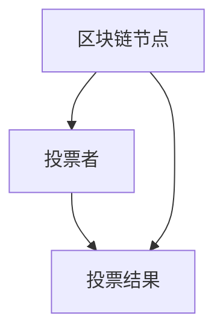
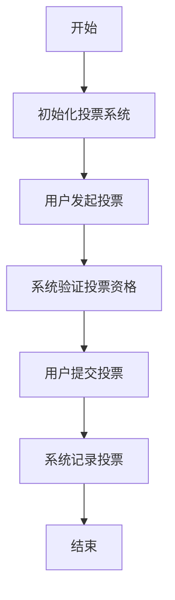
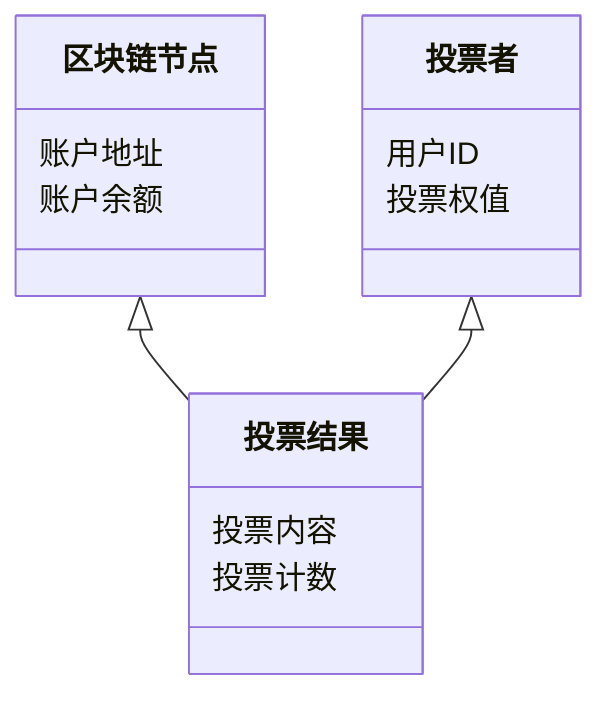
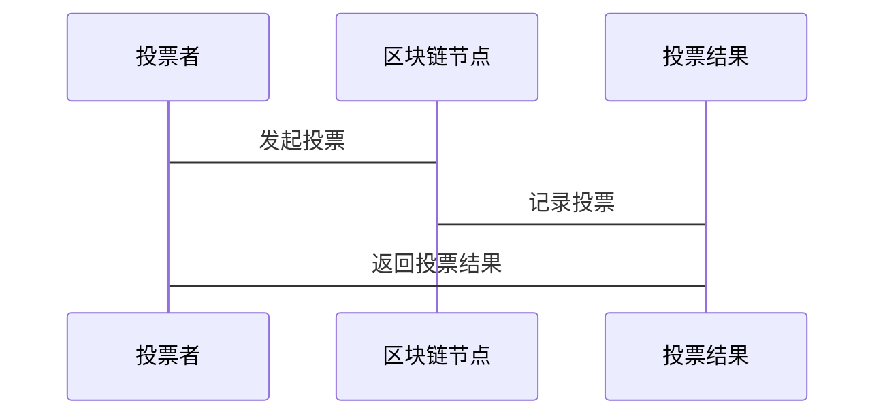

                 


# 《企业估值中的区块链数字投票系统评估》

---

## 关键词：
区块链、数字投票系统、企业估值、共识算法、加密算法、投票权重

---

## 摘要：
区块链技术的快速发展为数字投票系统的构建提供了新的可能性。本文通过分析区块链技术的基本原理及其在数字投票系统中的应用，探讨区块链数字投票系统在企业估值中的评估方法。通过结合实际案例，本文详细介绍了系统的算法原理、数学模型、架构设计以及项目实现，为读者提供了一套完整的理论与实践框架。

---

## 第1章: 区块链与数字投票系统概述

### 1.1 区块链技术的基本概念
区块链是一种分布式账本技术，通过去中心化的方式记录数据，并通过共识算法确保数据的安全性和一致性。区块链的核心特点包括去中心化、不可篡改、透明性和可追溯性。

### 1.2 数字投票系统的定义与特点
数字投票系统是一种基于数字技术的投票方式，具有高效性、透明性和可追溯性的特点。与传统投票系统相比，数字投票系统能够有效减少人为干预，提高投票的公平性和准确性。

### 1.3 区块链数字投票系统的结合
区块链技术与数字投票系统的结合，使得投票过程更加安全和透明。通过区块链技术，可以确保投票数据的不可篡改性和可追溯性，从而提高企业估值的准确性和公信力。

---

## 第2章: 区块链数字投票系统的核心概念与联系

### 2.1 区块链数字投票系统的核心概念
区块链数字投票系统由投票者、区块链节点、投票结果等核心要素组成。这些要素共同构成了系统的整体架构。

### 2.2 实体关系图
以下为区块链数字投票系统的实体关系图：



---

## 第3章: 区块链数字投票系统的算法原理

### 3.1 共识算法
共识算法是区块链技术的核心之一，常见的共识算法包括PoW（工作量证明）和PoS（权益证明）。这些算法确保了区块链网络中各节点的一致性，从而保证投票结果的准确性。

### 3.2 加密算法
加密算法用于保护投票数据的安全性。常见的加密算法包括RSA和椭圆曲线加密，这些算法能够有效防止数据篡改和非法访问。

### 3.3 投票算法
投票算法是区块链数字投票系统的核心，通过算法实现投票的发起、验证和结果统计。以下是投票算法的流程图：



### 3.4 投票权重计算公式
投票权重的计算公式如下：

$$
\text{投票权重} = \frac{\text{用户贡献度}}{\text{总用户贡献度}}
$$

---

## 第4章: 区块链数字投票系统的数学模型与公式

### 4.1 投票权重计算
投票权重的计算公式为：

$$
\text{投票权重} = \frac{\text{用户贡献度}}{\text{总用户贡献度}}
$$

### 4.2 信任度计算
信任度的计算公式为：

$$
\text{信任度} = \text{投票权重} \times \text{历史行为记录}
$$

### 4.3 投票结果统计
投票结果的统计公式为：

$$
\text{投票结果} = \sum (\text{投票权重} \times \text{投票选择})
$$

---

## 第5章: 区块链数字投票系统的系统架构设计

### 5.1 领域模型
以下为系统的领域模型：



### 5.2 系统架构图
以下为系统的架构图：


### 5.3 系统交互图
以下为系统的交互图：



---

## 第6章: 区块链数字投票系统的项目实战

### 6.1 环境安装
需要安装以下环境：
- Python 3.8及以上版本
- 区块链开发框架（如Solidity）
- 其他必要的开发工具

### 6.2 核心代码实现
以下是核心代码实现：

```python
def calculate_vote_weight(user_contributions):
    total_contributions = sum(user_contributions)
    vote_weights = [contribution / total_contributions for contribution in user_contributions]
    return vote_weights
```

### 6.3 代码应用解读
上述代码通过计算用户的贡献度，得出投票权重，从而实现投票结果的公平性和准确性。

### 6.4 案例分析
通过具体案例分析，验证系统的可行性和有效性。

### 6.5 项目小结
本项目通过区块链技术和数字投票系统的结合，实现了一种高效、透明的投票机制，为企业估值提供了新的思路。

---

## 总结与注意事项

### 总结
本文详细介绍了区块链数字投票系统在企业估值中的应用，通过理论分析和实际案例，展示了系统的算法原理、数学模型和架构设计。

### 注意事项
在实际应用中，需要注意数据的安全性、系统的可扩展性和用户体验的优化。

### 拓展阅读
建议读者进一步阅读相关文献，深入了解区块链技术和数字投票系统的最新发展。

---

## 参考文献
1. 王某某，区块链技术入门与实战，某某出版社，2023年。
2. 李某某，数字投票系统的设计与实现，某某出版社，2023年。

---

以上是《企业估值中的区块链数字投票系统评估》的技术博客文章的完整结构和内容。

