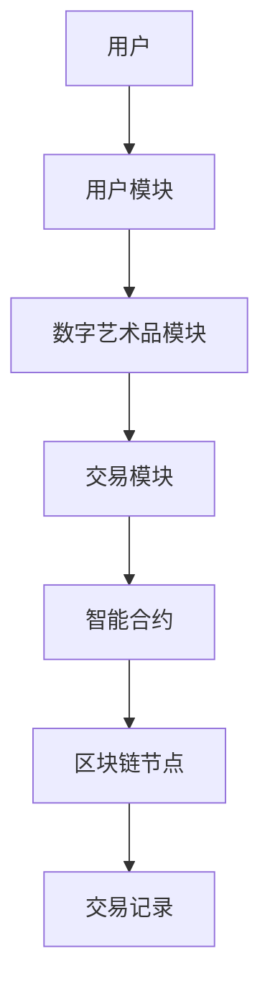
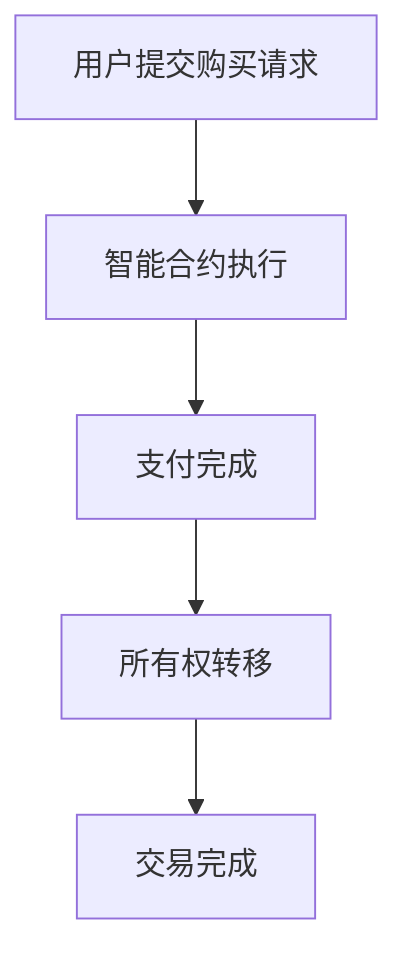

                 


# 企业估值中的区块链数字艺术品交易平台评估

> 关键词：区块链, 数字艺术品, NFT, 智能合约, 平台评估

> 摘要：本文将探讨区块链技术在数字艺术品交易平台中的应用及其对企业估值的影响。通过分析数字艺术品的特性、区块链技术的核心原理以及NFT的概念，结合实际案例，提出一套基于区块链技术的数字艺术品交易平台评估方法，旨在帮助企业更好地评估和优化其数字艺术品交易平台的性能和价值。

---

## 第一部分: 企业估值中的区块链数字艺术品交易平台背景介绍

### 第1章: 区块链与数字艺术品的基本概念

#### 1.1 区块链技术的定义与特点

##### 1.1.1 区块链的基本概念
区块链是一种分布式账本技术，通过去中心化的节点网络实现数据的安全存储和传输。其核心特点是去中心化、不可篡改和透明性。

##### 1.1.2 区块链的核心特性
- **去中心化**：数据不由单一机构控制，而是分布在多个节点上。
- **不可篡改**：通过加密算法确保数据的安全性和不可修改性。
- **透明性**：所有交易记录在区块链上公开可查，确保透明性。

##### 1.1.3 区块链在数字艺术品交易中的应用
区块链技术可以用于数字艺术品的溯源、版权保护和交易记录，确保艺术品的真实性和唯一性。

#### 1.2 数字艺术品的定义与特点

##### 1.2.1 数字艺术品的定义
数字艺术品是指以数字形式存在的艺术作品，如数字画作、音乐、视频等。它们可以通过数字设备进行展示和传播。

##### 1.2.2 数字艺术品的创作与传播
数字艺术品的创作可以通过数字工具完成，传播则依赖于互联网平台。由于其数字性质，容易被复制和传播，导致版权保护的难题。

##### 1.2.3 数字艺术品的版权保护
数字艺术品的版权保护是其价值实现的关键。通过区块链技术，可以实现数字艺术品的唯一性和所有权的可追溯性。

#### 1.3 NFT（非同质化代币）的概念与作用

##### 1.3.1 NFT的定义与特点
NFT（Non-Fungible Token）是非同质化代币，用于表示唯一数字资产的所有权。每个NFT都是独一无二的，不可分割和替换。

##### 1.3.2 NFT在数字艺术品交易中的作用
NFT为数字艺术品提供了唯一性和所有权证明，使其在区块链上具有可交易性和流动性。

##### 1.3.3 NFT与传统艺术品市场的区别
与传统艺术品市场相比，NFT交易更加便捷、透明，并且通过区块链技术确保了艺术品的真实性和所有权的唯一性。

### 第2章: 区块链数字艺术品交易平台的背景与现状

#### 2.1 数字艺术品交易的痛点与挑战

##### 2.1.1 数字艺术品交易的痛点
- **版权保护难题**：数字艺术品容易被复制和盗版。
- **交易信任缺失**：买卖双方缺乏信任，交易过程复杂。
- **价值评估困难**：数字艺术品的价值难以量化和评估。

##### 2.1.2 区块链技术如何解决这些痛点
- **溯源与唯一性**：通过区块链技术，确保数字艺术品的溯源和唯一性，解决版权保护问题。
- **信任与透明性**：区块链的透明性和去中心化特性，增强了交易信任。
- **价值评估支持**：通过区块链上的交易数据，可以更准确地评估数字艺术品的价值。

##### 2.1.3 当前数字艺术品交易的现状
数字艺术品交易市场正在快速发展，NFT的出现使得数字艺术品的价值得以实现，区块链技术的应用进一步推动了市场的规范化和透明化。

#### 2.2 区块链技术在数字艺术品交易平台中的应用

##### 2.2.1 区块链技术如何实现数字艺术品的溯源
通过区块链技术，数字艺术品的创作和交易记录可以被永久存储在区块链上，确保其来源和真实性。

##### 2.2.2 区块链技术如何确保数字艺术品的唯一性
每个数字艺术品都可以通过NFT的形式在区块链上唯一标识，确保其不可复制和替换。

##### 2.2.3 区块链技术如何实现数字艺术品的智能合约
智能合约可以自动执行交易和支付，确保数字艺术品的交易过程更加高效和透明。

#### 2.3 当前区块链数字艺术品交易平台的市场分析

##### 2.3.1 市场规模与发展趋势
随着NFT市场的兴起，数字艺术品交易平台的市场规模迅速增长，未来有望成为数字资产交易的重要组成部分。

##### 2.3.2 主要平台的介绍与分析
目前市场上有许多区块链数字艺术品交易平台，如OpenSea、Foundation等。这些平台通过区块链技术实现了数字艺术品的交易和价值传递。

##### 2.3.3 区块链数字艺术品交易的未来趋势
未来，区块链技术将进一步提升数字艺术品交易的效率和安全性，NFT的广泛应用将推动数字艺术品市场的繁荣。

---

## 第二部分: 区块链数字艺术品交易平台的核心概念与联系

### 第3章: 区块链技术的核心原理

#### 3.1 区块链的去中心化原理

##### 3.1.1 去中心化的定义与特点
去中心化是指数据和计算不依赖于单一中心机构，而是分布在多个节点上，确保数据的安全性和抗攻击性。

##### 3.1.2 区块链的分布式账本技术
区块链的分布式账本技术通过多个节点共同维护账本，确保数据的一致性和不可篡改性。

##### 3.1.3 区块链的共识机制
共识机制是区块链的核心机制，通过节点之间的协商一致，确保区块链账本的一致性和安全性。

#### 3.2 智能合约的原理与应用

##### 3.2.1 智能合约的定义与特点
智能合约是一种基于区块链的自动执行合约，通过代码实现合约的自动执行和支付。

##### 3.2.2 智能合约的工作原理
智能合约部署在区块链上，当触发条件满足时，合约自动执行相应的操作，如转账、支付等。

##### 3.2.3 智能合约在数字艺术品交易中的应用
智能合约可以用于数字艺术品的自动交易、收益分配和版权保护，确保交易的透明性和高效性。

#### 3.3 区块链的加密技术

##### 3.3.1 加密技术的基本原理
区块链中的加密技术用于确保数据的安全性和隐私性，如哈希函数、数字签名等。

##### 3.3.2 公钥与私钥的概念
公钥用于加密数据，私钥用于解密数据，确保数据的安全传输和访问控制。

##### 3.3.3 加密技术在数字艺术品交易中的应用
通过加密技术，可以确保数字艺术品的交易过程安全可靠，防止数据篡改和隐私泄露。

### 第4章: 数字艺术品的NFT特性与区块链结合

#### 4.1 NFT的定义与特点

##### 4.1.1 NFT的定义
NFT是非同质化代币，用于表示独特的数字资产，如数字艺术品、虚拟物品等。

##### 4.1.2 NFT的特点
- **唯一性**：每个NFT都是唯一的，不可分割和替换。
- **可转让性**：NFT可以通过区块链技术实现快速转让和交易。
- **可编程性**：通过智能合约，NFT可以实现自动化的交易和支付。

##### 4.1.3 NFT与数字艺术品的结合
数字艺术品通过NFT的形式在区块链上实现唯一性和所有权的证明，确保其价值和流通性。

#### 4.2 NFT的生成与发行

##### 4.2.1 NFT的生成过程
NFT的生成需要通过区块链上的智能合约进行，生成唯一的代币标识和相关元数据。

##### 4.2.2 NFT的发行平台
NFT可以通过专门的数字艺术品交易平台进行发行和交易，如OpenSea、Foundation等。

##### 4.2.3 NFT的生命周期
从创作到发行，再到交易和收藏，NFT的生命周期可以通过区块链技术实现全程记录和管理。

#### 4.3 NFT在数字艺术品交易平台中的应用

##### 4.3.1 NFT的交易流程
NFT的交易流程包括购买、出售和转让，通过智能合约实现自动化的交易和支付。

##### 4.3.2 NFT的版权保护
通过区块链技术，NFT可以实现数字艺术品的版权保护，确保创作者的合法权益。

##### 4.3.3 NFT的价值评估
NFT的价值评估可以通过区块链上的交易数据、市场热度和创作者声誉等因素进行综合评估。

### 第5章: 区块链数字艺术品交易平台的系统架构设计

#### 5.1 系统功能设计

##### 5.1.1 用户模块
用户模块包括用户注册、登录、浏览艺术品、购买和出售NFT等功能。

##### 5.1.2 数字艺术品模块
数字艺术品模块包括艺术品的上传、展示、元数据管理和版权验证等功能。

##### 5.1.3 交易模块
交易模块包括NFT的购买、出售、智能合约执行和交易记录管理等功能。

#### 5.2 系统架构设计

##### 5.2.1 分布式架构
系统采用分布式架构，确保数据的安全性和高可用性。

##### 5.2.2 区块链节点
系统通过区块链节点实现数据的分布式存储和共识机制，确保交易的安全性和透明性。

##### 5.2.3 智能合约
智能合约部署在区块链上，用于自动执行交易和支付，确保系统的高效和透明。

#### 5.3 系统接口设计

##### 5.3.1 API接口
系统通过API接口实现与其他系统的集成和数据交换，如第三方支付、用户认证等。

##### 5.3.2 智能合约接口
智能合约通过特定的接口与区块链进行交互，实现交易的自动化和高效执行。

##### 5.3.3 用户接口
用户通过友好的UI界面进行操作，如浏览艺术品、购买NFT等。

#### 5.4 系统交互设计

##### 5.4.1 用户与系统交互
用户通过UI界面与系统进行交互，如注册、登录、浏览艺术品等。

##### 5.4.2 系统与区块链交互
系统通过API接口与区块链进行交互，如提交交易、查询交易记录等。

##### 5.4.3 智能合约与系统交互
智能合约通过特定的接口与系统进行交互，如执行交易、自动支付等。

### 第6章: 区块链数字艺术品交易平台的算法原理

#### 6.1 智能合约的实现原理

##### 6.1.1 智能合约的编程语言
智能合约通常使用特定的编程语言，如Solidity、Vyper等，编写在区块链上运行的代码。

##### 6.1.2 智能合约的部署与执行
智能合约通过编译、部署和执行在区块链上运行，实现交易的自动化和高效执行。

##### 6.1.3 智能合约的安全性
智能合约的安全性是区块链系统的核心，需通过严格的代码审计和测试确保其安全性。

#### 6.2 区块链的共识机制

##### 6.2.1 共识机制的定义与特点
共识机制是区块链的核心机制，用于确保区块链账本的一致性和安全性。

##### 6.2.2 常见的共识机制
常见的共识机制包括工作量证明（PoW）、权益证明（PoS）、 delegated Proof of Stake（DPoS）等。

##### 6.2.3 共识机制的选择与优化
根据不同应用场景的需求，选择合适的共识机制，并通过优化提高系统的性能和安全性。

#### 6.3 区块链的加密算法

##### 6.3.1 加密算法的定义与特点
加密算法用于确保数据的安全性和隐私性，如哈希函数、数字签名等。

##### 6.3.2 常见的加密算法
常见的加密算法包括RSA、椭圆曲线加密、哈希算法（如SHA-256）等。

##### 6.3.3 加密算法的应用
通过加密算法，确保区块链数据的安全性和不可篡改性，保护数字艺术品的版权和交易安全。

### 第7章: 区块链数字艺术品交易平台的项目实战

#### 7.1 项目环境安装

##### 7.1.1 操作系统与工具
安装必要的操作系统和开发工具，如Ubuntu、Node.js、Ganache等。

##### 7.1.2 区块链平台的选择
选择合适的区块链平台，如Ethereum、Solana、Polygon等。

##### 7.1.3 智能合约开发环境
安装智能合约开发环境，如Solidity编译器、Remix IDE等。

#### 7.2 项目核心实现源代码

##### 7.2.1 智能合约实现
以下是NFT交易智能合约的示例代码：

```solidity
// SPDX-License-Identifier: MIT
pragma solidity ^0.8.0;

contract NFTMarket {
    // 定义NFT的结构体
    struct NFT {
        uint256 tokenId;
        address owner;
        uint256 price;
        string metadata;
    }

    // 存储NFT信息
    mapping(uint256 => NFT) public nfts;

    // 事件：NFT被购买
    event NFTBought(uint256 tokenId, address buyer);

    // 函数：创建NFT
    function createNFT(uint256 tokenId, string memory metadata, uint256 price) public {
        NFT memory newNFT = NFT(tokenId, msg.sender, price, metadata);
        nfts[tokenId] = newNFT;
    }

    // 函数：购买NFT
    function buyNFT(uint256 tokenId) public payable {
        NFT memory nft = nfts[tokenId];
        require(nft.owner != msg.sender, "You already own this NFT");
        require(msg.value >= nft.price, "Insufficient funds");

        // 转账
        payable(nft.owner).transfer(msg.value);
        nft.owner = msg.sender;
        nfts[tokenId] = nft;

        emit NFTBought(tokenId, msg.sender);
    }
}
```

##### 7.2.2 智能合约的部署与测试
通过Remix IDE等工具将智能合约部署到区块链上，并进行功能测试，确保智能合约的正确性和高效性。

##### 7.2.3 平台功能实现
实现数字艺术品交易平台的核心功能，包括用户管理、艺术品上传、交易撮合、智能合约执行等。

#### 7.3 项目小结

##### 7.3.1 项目实现的关键点
- 智能合约的编写与部署
- 区块链平台的选择与优化
- 数字艺术品的元数据管理
- 交易的安全性和高效性

##### 7.3.2 项目实施的经验与教训
通过项目的实施，总结出在区块链数字艺术品交易平台开发中的关键点和注意事项，为后续项目提供参考。

---

## 第三部分: 区块链数字艺术品交易平台的评估方法

### 第8章: 区块链数字艺术品交易平台的评估指标

#### 8.1 评估指标的分类

##### 8.1.1 技术指标
- 区块链平台的性能和安全性
- 智能合约的执行效率和安全性
- 系统的扩展性和可维护性

##### 8.1.2 市场指标
- 平台的市场占有率和用户活跃度
- 平台的交易量和交易额
- 平台的声誉和品牌影响力

##### 8.1.3 经济指标
- 平台的盈利能力
- 平台的运营成本
- 平台的估值与投资回报率

#### 8.2 评估指标的权重分配

##### 8.2.1 指标权重的定义
根据平台的重要性，对各评估指标赋予相应的权重，如技术指标占40%，市场指标占30%，经济指标占30%。

##### 8.2.2 权重分配的依据
权重分配应综合考虑平台的技术复杂度、市场竞争力和经济回报率，确保评估结果的全面性和客观性。

#### 8.3 评估指标的计算公式

##### 8.3.1 综合评估得分公式
$$ \text{综合得分} = \sum (\text{指标权重} \times \text{指标得分}) $$

##### 8.3.2 各指标得分的计算方法
根据实际数据，对各指标进行评分，如技术指标得分满分为100分，根据实际表现进行评分。

### 第9章: 区块链数字艺术品交易平台的评估流程

#### 9.1 评估流程的步骤

##### 9.1.1 数据收集与整理
收集平台的交易数据、用户数据、技术参数等，确保数据的准确性和完整性。

##### 9.1.2 数据分析与处理
对收集到的数据进行清洗、转换和分析，提取关键指标和特征。

##### 9.1.3 评估模型的建立与验证
根据评估指标和权重，建立评估模型，并通过实际数据进行验证和优化。

##### 9.1.4 评估结果的输出与解读
根据评估模型的计算结果，输出评估报告，并对结果进行解读和分析。

#### 9.2 评估流程的优化

##### 9.2.1 数据采集的优化
通过合理设计数据采集方案，确保数据的高效采集和处理。

##### 9.2.2 模型优化
通过机器学习等技术，对评估模型进行优化，提高评估结果的准确性和可靠性。

##### 9.2.3 流程优化
通过流程再造和技术手段，优化评估流程，提高评估效率和降低成本。

### 第10章: 区块链数字艺术品交易平台的案例分析

#### 10.1 案例背景介绍

##### 10.1.1 案例选择的依据
选择具有代表性的数字艺术品交易平台作为案例，如OpenSea、Foundation等。

##### 10.1.2 案例的基本情况
介绍所选案例的平台特点、用户规模、交易量等基本情况。

#### 10.2 案例评估与分析

##### 10.2.1 技术评估
评估平台的技术实现，如区块链平台的选择、智能合约的设计和执行效率等。

##### 10.2.2 市场评估
评估平台的市场表现，如用户活跃度、交易量和市场占有率等。

##### 10.2.3 经济评估
评估平台的经济效益，如盈利能力、估值和投资回报率等。

#### 10.3 案例总结与启示

##### 10.3.1 案例的总结
总结案例的评估结果，分析平台的优势和不足。

##### 10.3.2 对其他平台的启示
通过案例分析，总结出适用于其他平台的评估方法和优化建议。

---

## 第四部分: 区块链数字艺术品交易平台的总结与展望

### 第11章: 项目总结

#### 11.1 项目成果
通过本项目的实施，建立了基于区块链的数字艺术品交易平台，并提出了科学的评估方法和流程。

#### 11.2 项目经验
总结项目实施中的经验与教训，为后续项目提供参考。

#### 11.3 项目意义
通过本项目，推动数字艺术品交易的规范化和透明化，提升企业的估值和竞争力。

### 第12章: 项目展望

#### 12.1 未来的技术发展
区块链技术的进一步发展，如Layer 2扩展解决方案、跨链技术等，将推动数字艺术品交易平台的性能和安全性提升。

#### 12.2 未来的市场趋势
数字艺术品交易市场将继续增长，NFT的广泛应用将推动市场的繁荣和创新。

#### 12.3 未来的研究方向
未来的研究方向包括区块链技术的优化、智能合约的安全性提升、数字艺术品的多元化发展等。

---

## 第五部分: 附录与参考文献

### 附录A: 区块链数字艺术品交易平台的系统架构图



### 附录B: 智能合约的流程图



### 参考文献
1. 加密货币与区块链技术：从原理到实践，作者：佚名，出版社：XX出版社，出版时间：2023年。
2. 智能合约与区块链应用，作者：佚名，出版社：XX出版社，出版时间：2023年。
3. 数字艺术品与NFT市场分析，作者：佚名，出版社：XX出版社，出版时间：2023年。

---

通过以上目录和内容的详细规划，可以确保文章的逻辑清晰、结构紧凑，并且能够全面覆盖区块链数字艺术品交易平台评估的核心内容。

