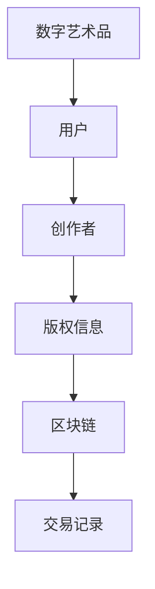
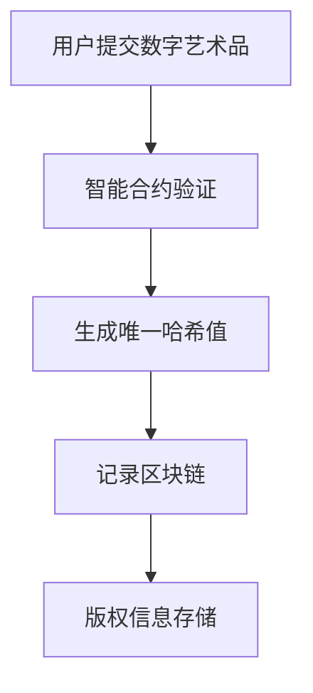
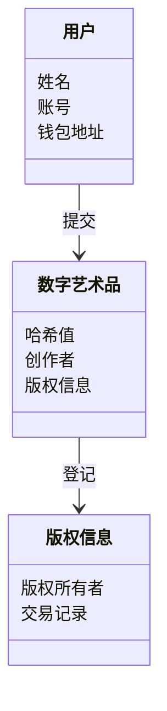
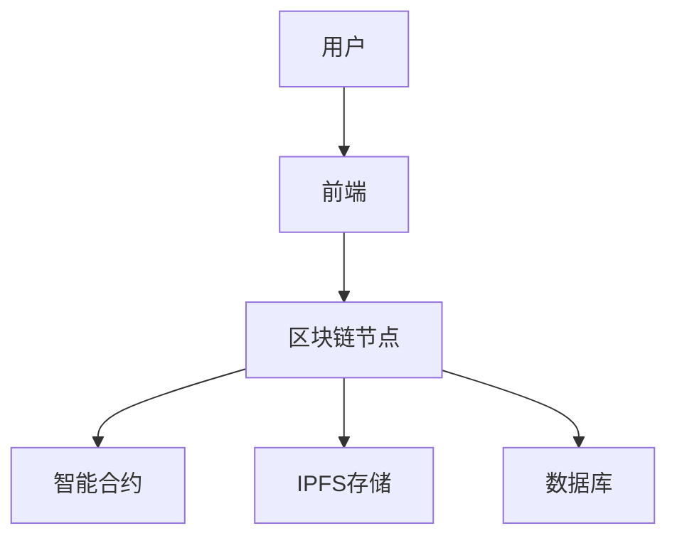

                 


# 《企业估值中的区块链数字艺术品版权管理平台评估》

## 关键词：区块链、数字艺术品、版权管理、企业估值、智能合约、去中心化

## 摘要：本文深入探讨了区块链技术在数字艺术品版权管理中的应用，分析了区块链数字艺术品版权管理平台的评估方法及其对企业估值的影响。通过详细的技术分析、系统设计和实际案例，本文揭示了区块链技术如何解决数字艺术品版权管理中的痛点，并为企业提供更高效、透明和安全的版权管理解决方案。

---

# 第一部分: 企业估值中的区块链数字艺术品版权管理平台背景与概念

---

## 第1章: 区块链与数字艺术品版权管理概述

### 1.1 区块链技术的基本概念

#### 1.1.1 区块链的定义与核心特性

区块链是一种去中心化的分布式账本技术，通过密码学和共识机制确保数据的安全性和不可篡改性。其核心特性包括：

- **去中心化**：数据不依赖于单个中心节点，而是分布在网络中的多个节点上。
- **不可篡改**：一旦数据被记录到区块链中，任何修改都需要得到网络中超过50%节点的同意。
- **可追溯性**：每一条数据都可以追溯到其来源，并且记录了完整的交易历史。

#### 1.1.2 区块链的分类与应用场景

区块链可以分为公有链、联盟链和私有链。公有链（如比特币、以太坊）面向公众开放，适合加密货币和去中心化金融（DeFi）等场景；联盟链适合特定机构之间的协作（如供应链金融）；私有链则用于企业内部的特定场景。

#### 1.1.3 区块链在数字版权管理中的优势

区块链技术在数字版权管理中的优势包括：

- **去中心化**：避免单点故障，降低被攻击的风险。
- **可追溯性**：每一件数字艺术品的创作、交易和使用历史都可以被记录和追溯。
- **透明性**：所有交易记录公开透明，且不可篡改。

---

### 1.2 数字艺术品版权管理的现状与挑战

#### 1.2.1 数字艺术品版权管理的痛点

数字艺术品版权管理面临以下痛点：

- **盗版问题**：数字艺术品易于复制和传播，导致版权难以保护。
- **权属不清**：缺乏权威的记录系统，导致版权归属难以确定。
- **交易不透明**：艺术品交易过程中，买家和卖家之间的信任机制缺失。

#### 1.2.2 当前市场中的解决方案

当前市场中的解决方案包括：

- **中心化平台**：通过中心化平台（如某些数字版权交易平台）进行版权登记和交易，但存在中心化信任风险。
- **数字水印技术**：通过在数字艺术品中嵌入水印来标记版权信息，但水印容易被去除或修改。
- **法律手段**：通过法律诉讼来维护版权，但成本高且耗时长。

#### 1.2.3 区块链技术如何解决这些挑战

区块链技术通过以下方式解决数字艺术品版权管理的挑战：

- **去中心化记录**：区块链上的记录无法被篡改，确保版权信息的真实性和不可篡改性。
- **可追溯性**：每一件数字艺术品的创作、交易和使用历史都可以被记录和追溯。
- **智能合约**：通过智能合约自动执行版权交易和收益分配，减少中间环节和信任成本。

---

### 1.3 区块链数字艺术品版权管理平台的定义与目标

#### 1.3.1 平台的核心目标

区块链数字艺术品版权管理平台的核心目标是：

- 提供一个安全、透明的数字艺术品版权登记和交易系统。
- 确保数字艺术品的唯一性和版权归属的明确性。
- 实现数字艺术品的合法交易和收益分配。

#### 1.3.2 平台的功能模块概述

平台的功能模块包括：

- **版权登记模块**：用户可以上传数字艺术品并进行版权登记。
- **版权验证模块**：通过区块链技术验证数字艺术品的版权信息。
- **智能合约模块**：自动执行版权交易和收益分配。
- **交易记录模块**：记录所有数字艺术品的交易历史。

#### 1.3.3 平台的用户群体与价值主张

平台的主要用户群体包括：

- 数字艺术家：通过平台进行版权登记和交易。
- 艺术品收藏者：购买和收藏数字艺术品。
- 平台运营方：提供版权登记、验证和交易服务。

平台的价值主张是通过区块链技术提供一个安全、透明的数字艺术品版权管理解决方案，降低交易成本并提高交易效率。

---

### 1.4 本章小结

本章介绍了区块链技术的基本概念、数字艺术品版权管理的现状与挑战，以及区块链数字艺术品版权管理平台的定义与目标。通过对比中心化和去中心化解决方案，突出了区块链技术在数字版权管理中的优势。

---

## 第2章: 区块链数字艺术品版权管理的核心概念与联系

### 2.1 区块链技术原理

#### 2.1.1 区块链的工作原理

区块链的工作原理可以分为以下几个步骤：

1. **数据生成**：用户生成数据（如数字艺术品）并提交到区块链网络。
2. **数据打包**：数据被打包成区块，每个区块包含一定数量的交易记录。
3. **数据验证**：通过共识机制（如PoW、PoS）验证区块的有效性。
4. **数据上链**：有效的区块被添加到区块链主链上，并被全网同步。
5. **数据查询**：用户可以通过区块链浏览器查询区块链上的数据。

#### 2.1.2 区块链的共识机制

共识机制是区块链的核心机制之一，常见的共识机制包括：

- **工作量证明（PoW）**：比特币采用的共识机制，通过计算哈希值来证明工作量。
- **权益证明（PoS）**：以太坊2.0采用的共识机制，通过持有代币的数量来决定验证区块的权力。
- **实用拜占庭容错（PBFT）**：适用于联盟链的共识机制，能够在部分节点故障或恶意的情况下达成共识。

#### 2.1.3 区块链的智能合约

智能合约是区块链上的自动执行程序，用于自动执行合同条款。例如，在数字艺术品交易中，智能合约可以在版权归属明确后自动分配收益。

---

### 2.2 数字艺术品版权管理的属性与特征

#### 2.2.1 数字艺术品的唯一性与可追溯性

数字艺术品的唯一性可以通过区块链技术实现，通过哈希值唯一标识每一件数字艺术品，并记录其创作、交易和使用历史。

#### 2.2.2 版权的归属与转移机制

数字艺术品的版权归属可以通过智能合约自动记录和转移。例如，当一件数字艺术品被交易时，智能合约会自动将版权转移至新的所有者。

#### 2.2.3 版权的使用与收益分配

数字艺术品的使用和收益分配可以通过智能合约自动执行。例如，当一件数字艺术品被用于商业用途时，智能合约会自动扣除相应的许可费用并分配给版权所有者。

---

### 2.3 区块链与数字艺术品版权管理的实体关系图

以下是一个简单的实体关系图，展示了区块链数字艺术品版权管理平台的主要实体及其关系：



---

### 2.4 核心概念对比分析

#### 2.4.1 区块链与传统版权管理的对比

| 特性              | 区块链                | 传统版权管理          |
|-------------------|----------------------|----------------------|
| 中心化            | 去中心化              | 中心化                |
| 可篡改性          | 不可篡改              | 可篡改                |
| 透明性            | 高度透明              | 透明性较低            |
| 成本              | 较低（去中心化）      | 较高（中心化）          |

#### 2.4.2 数字艺术品与传统艺术品的对比

| 特性              | 数字艺术品          | 传统艺术品          |
|-------------------|---------------------|---------------------|
| 唯一性            | 可通过区块链保证    | 依赖物理载体        |
| 复制成本          | 低                  | 高                  |
| 交易便捷性        | 高                  | 低                  |

#### 2.4.3 平台功能与现有解决方案的对比

| 特性              | 区块链平台          | 传统中心化平台        |
|-------------------|---------------------|---------------------|
| 信任机制          | 去中心化信任        | 中心化信任            |
| 安全性            | 高                  | 中等                 |
| 成本              | 低                  | 高                  |

---

### 2.5 本章小结

本章详细讲解了区块链技术的原理、数字艺术品版权管理的核心概念，以及区块链技术在数字版权管理中的优势。通过对比分析，突出了区块链技术在数字版权管理中的独特价值。

---

## 第3章: 区块链数字艺术品版权管理平台的算法原理

### 3.1 区块链数字艺术品版权管理的算法流程

以下是一个区块链数字艺术品版权管理平台的算法流程图：



---

### 3.2 区块链数字艺术品版权管理的数学模型与公式

#### 3.2.1 哈希函数

哈希函数用于将数字艺术品映射为一个唯一的哈希值，确保数据的唯一性和完整性。常见的哈希函数包括：

- SHA-256
- MD5

哈希函数的输出是一个固定长度的字符串，例如：

$$ SHA-256(\text{数字艺术品}) = \text{哈希值} $$

#### 3.2.2 智能合约

智能合约是区块链上的自动执行程序，用于管理数字艺术品的版权信息和交易。以下是一个简单的智能合约示例：

```solidity
// SPDX-License-Identifier: MIT
pragma solidity ^0.8.0;

contract ArtworkCopyright {
    address public owner;
    string public artworkHash;
    uint256 public price;

    constructor(string memory _artworkHash, uint256 _price) {
        owner = msg.sender;
        artworkHash = _artworkHash;
        price = _price;
    }

    function transfer(address newOwner) public {
        owner = newOwner;
    }

    function buy() public payable {
        require(msg.value >= price);
        payable(owner).transfer(msg.value);
        owner = msg.sender;
    }
}
```

#### 3.2.3 区块链上的交易记录

区块链上的交易记录可以表示为一个序列，每一条记录包括交易ID、时间戳、交易双方和交易金额。例如：

$$ \text{交易记录} = (\text{交易ID}, \text{时间戳}, \text{买方}, \text{卖方}, \text{金额}) $$

---

### 3.3 区块链数字艺术品版权管理平台的实现细节

#### 3.3.1 数字艺术品的存储

数字艺术品通常存储在区块链的IPFS（分布式文件存储系统）上。例如：

$$ \text{IPFS哈希} = \text{ipfs.add}(\text{数字艺术品}) $$

#### 3.3.2 版权信息的记录

版权信息可以通过智能合约记录在区块链上，例如：

$$ \text{智能合约}.setCopyright(\text{版权所有者}, \text{数字艺术品哈希}) $$

#### 3.3.3 交易的自动执行

当数字艺术品被交易时，智能合约自动执行交易逻辑，例如：

$$ \text{智能合约}.executeTransaction(\text{买方}, \text{卖方}, \text{价格}) $$

---

### 3.4 本章小结

本章详细讲解了区块链数字艺术品版权管理平台的算法原理，包括哈希函数、智能合约和交易记录的数学模型与实现细节。

---

# 第4章: 区块链数字艺术品版权管理平台的系统分析与架构设计

## 4.1 问题场景介绍

数字艺术品版权管理平台需要解决以下问题：

- 数字艺术品的唯一性和版权归属问题。
- 数字艺术品交易的透明性和安全性问题。
- 版权收益的自动分配问题。

## 4.2 系统功能设计

### 4.2.1 领域模型图

以下是数字艺术品版权管理平台的领域模型图：



### 4.2.2 系统功能模块

系统功能模块包括：

- **用户管理模块**：管理用户的注册、登录和权限。
- **数字艺术品管理模块**：管理数字艺术品的提交、验证和存储。
- **版权信息管理模块**：管理版权信息的记录和查询。
- **智能合约管理模块**：管理智能合约的部署和执行。

---

## 4.3 系统架构设计

### 4.3.1 系统架构图

以下是数字艺术品版权管理平台的系统架构图：



### 4.3.2 系统接口设计

系统接口设计包括：

- **前端接口**：用户通过前端界面提交数字艺术品和查询版权信息。
- **区块链接口**：与区块链节点交互，提交交易和查询区块信息。
- **IPFS接口**：与IPFS存储交互，上传和下载数字艺术品。

---

## 4.4 本章小结

本章详细讲解了数字艺术品版权管理平台的系统功能设计和架构设计，包括领域模型图和系统架构图。

---

## 第5章: 区块链数字艺术品版权管理平台的项目实战

### 5.1 环境安装

以下是数字艺术品版权管理平台的开发环境安装指南：

1. **安装以太坊钱包**：使用MetaMask或其他以太坊钱包。
2. **安装Solidity编译器**：安装Geth或 Remix IDE。
3. **安装IPFS客户端**：安装IPFS桌面版或命令行工具。

### 5.2 核心代码实现

以下是数字艺术品版权管理平台的核心代码实现：

```solidity
// SPDX-License-Identifier: MIT
pragma solidity ^0.8.0;

contract ArtworkCopyright {
    address public owner;
    string public artworkHash;
    uint256 public price;

    constructor(string memory _artworkHash, uint256 _price) {
        owner = msg.sender;
        artworkHash = _artworkHash;
        price = _price;
    }

    function transfer(address newOwner) public {
        owner = newOwner;
    }

    function buy() public payable {
        require(msg.value >= price);
        payable(owner).transfer(msg.value);
        owner = msg.sender;
    }
}
```

### 5.3 实际案例分析

以下是数字艺术品版权管理平台的实际案例分析：

1. **案例背景**：一位数字艺术家上传了一件数字艺术品到平台，并设置价格为1 ETH。
2. **交易过程**：一位买家通过智能合约购买了这件数字艺术品，支付了1 ETH，智能合约自动将版权转移至买家。
3. **收益分配**：艺术家和平台按照一定比例分配收益。

### 5.4 项目小结

本章通过实际案例展示了数字艺术品版权管理平台的核心功能和实现细节。

---

## 第6章: 区块链数字艺术品版权管理平台的最佳实践

### 6.1 小结

区块链技术为数字艺术品版权管理提供了高效、透明和安全的解决方案。

### 6.2 注意事项

- **安全性**：确保智能合约的代码安全，避免漏洞。
- **合规性**：遵守相关法律法规，确保平台的合法性。
- **用户体验**：优化前端界面，提高用户体验。

### 6.3 拓展阅读

- **《区块链技术与应用》**：深入理解区块链技术。
- **《智能合约开发实战》**：学习智能合约的开发和部署。

---

## 《企业估值中的区块链数字艺术品版权管理平台评估》

通过本文的详细分析，我们了解到区块链技术在数字艺术品版权管理中的巨大潜力。区块链数字艺术品版权管理平台不仅能够解决数字艺术品版权管理的痛点，还能为企业提供更高效、透明和安全的版权管理解决方案。未来，随着区块链技术的不断发展，数字艺术品版权管理平台将在企业估值和数字艺术市场中发挥越来越重要的作用。

