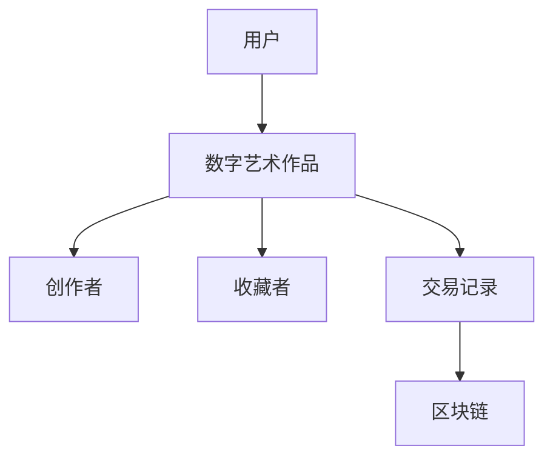
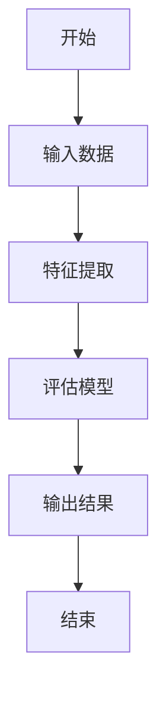
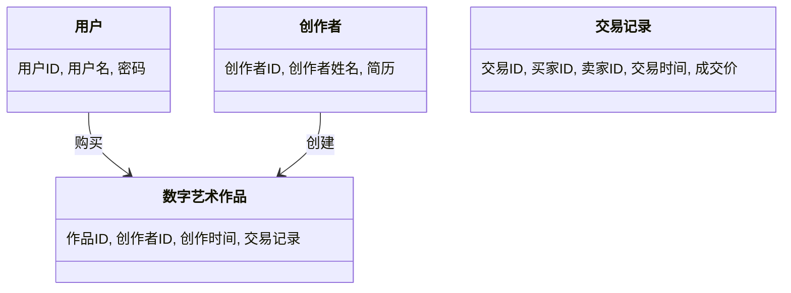
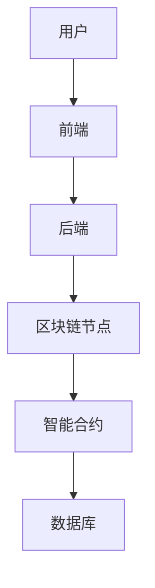
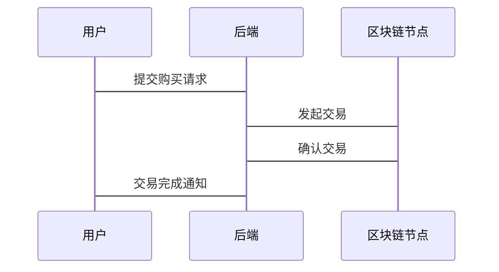

                 

<think>
好的，我将按照您的要求逐步完成这个任务。首先，我需要理解您提供的目录大纲结构，并确保每个章节和小节都包含必要的内容。我会按照以下步骤进行：

1. **文章标题和关键词**：先确定文章的标题和关键词。
2. **摘要**：写出文章的核心内容和主题思想。
3. **目录大纲**：按照您提供的结构设计各章节和小节。
4. **正文内容**：根据目录大纲逐步撰写每个章节的内容，确保每部分内容丰富、详细，并符合格式要求。

现在，我将按照这个步骤开始撰写。如果有任何问题或需要调整的地方，我会及时与您沟通。

# 企业估值中的区块链数字艺术平台评估

## 关键词：企业估值、区块链、数字艺术、NFT、平台评估、经济模型

## 摘要：本文章探讨了区块链数字艺术平台在企业估值中的评估方法，分析了数字艺术平台的核心概念、算法原理和系统架构，结合实际案例，详细讲解了如何通过区块链技术对数字艺术平台进行估值，并给出了最佳实践和注意事项。

---

## 目录大纲：

### 目录大纲：企业估值中的区块链数字艺术平台评估

---

## 正文内容

### 第一部分：背景介绍

#### 第1章：企业估值与区块链数字艺术平台概述

##### 1.1 问题背景与问题描述

区块链技术的快速发展催生了数字艺术市场，数字艺术作品通过NFT（非同质化代币）的形式实现了确权和交易。然而，数字艺术平台的估值问题却成为一个新的挑战。传统的企业估值方法难以直接应用于数字艺术平台，因为其核心资产是数字作品，且平台的经济模型与传统企业有所不同。

##### 1.2 区块链数字艺术平台的核心要素

数字艺术平台的核心要素包括：

- **数字作品**：以NFT形式存在，具有唯一性和不可篡改性。
- **创作者**：数字艺术的创作者，平台需要通过激励机制吸引优质创作者。
- **收藏者**：购买和收藏数字艺术作品的用户。
- **交易记录**：记录在区块链上的交易历史，确保透明性和不可篡改性。
- **平台经济模型**：包括交易佣金、创作者分成、平台服务费等。

##### 1.3 本章小结

本章通过介绍区块链数字艺术平台的核心要素，为后续的估值分析奠定了基础。

---

### 第二部分：核心概念与联系

#### 第2章：区块链数字艺术平台的核心概念

##### 2.1 核心概念原理

- **数字艺术的去中心化特性**：数字艺术作品通过区块链技术实现了去中心化存储和交易，避免了传统艺术市场中的中介依赖。
- **NFT的不可篡改性**：NFT的独特性确保了数字艺术作品的唯一性和所有权的明确性。
- **区块链的透明性**：区块链记录的所有交易和作品信息均为公开透明，为估值提供了可靠的数据基础。

##### 2.2 核心概念属性特征对比

| 特性         | 传统艺术市场                | 数字艺术市场                |
|--------------|-----------------------------|-----------------------------|
| 作品形式     | 实体作品（画作、雕塑等）     | 数字作品（数字绘画、3D模型等）|
| 交易方式     | 中介依赖（画廊、拍卖行等）   | 去中心化（区块链平台）       |
| 确权方式     | 证书、版权登记              | 区块链上的NFT               |
| 流通效率     | 较低，受地域限制             | 较高，全球流通                |

##### 2.3 实体关系图（ER图）

使用 Mermaid 绘制数字艺术平台的实体关系图：

```


##### 2.4 本章小结

本章通过对比分析，明确了数字艺术平台的核心概念及其与传统艺术市场的区别。

---

### 第三部分：算法原理讲解

#### 第3章：区块链数字艺术平台评估算法

##### 3.1 算法原理概述

数字艺术平台的估值需要综合考虑多个因素，包括作品的流动性、创作者的声誉、平台的交易活跃度等。我们设计了一个基于NFT交易数据和平台经济模型的评估算法，具体步骤如下：

1. **数据收集**：收集平台上的交易数据、作品信息、创作者信息等。
2. **特征提取**：提取关键特征，如作品的交易次数、成交价、创作者的影响力等。
3. **评估模型构建**：基于回归分析或机器学习算法，构建评估模型。
4. **结果输出**：根据模型计算出平台的估值。

##### 3.2 算法流程图

使用 Mermaid 绘制算法流程图：

```


##### 3.3 算法实现代码

以下是一个简单的评估模型实现代码示例（基于线性回归）：

```python
import pandas as pd
from sklearn.linear_model import LinearRegression

# 数据加载
data = pd.read_csv('nft_transactions.csv')

# 特征提取
X = data[['交易次数', '成交价', '创作者影响力']]
y = data['平台价值']

# 模型训练
model = LinearRegression()
model.fit(X, y)

# 预测结果
predicted_value = model.predict(X)
print(predicted_value)
```

##### 3.4 数学模型与公式

评估模型的数学表达式为：

$$ y = \beta_0 + \beta_1x_1 + \beta_2x_2 + \beta_3x_3 + \epsilon $$

其中：
- \( y \) 表示平台价值
- \( x_1 \) 表示交易次数
- \( x_2 \) 表示成交价
- \( x_3 \) 表示创作者影响力
- \( \beta_0, \beta_1, \beta_2, \beta_3 \) 为回归系数
- \( \epsilon \) 为误差项

---

### 第四部分：系统分析与架构设计方案

#### 第4章：区块链数字艺术平台系统架构设计

##### 4.1 问题场景介绍

为了实现数字艺术平台的估值功能，需要设计一个支持NFT交易数据采集、特征提取和估值模型计算的系统。

##### 4.2 项目介绍

本项目旨在开发一个数字艺术平台，支持NFT作品的上架、交易和估值功能。

##### 4.3 系统功能设计（领域模型）

使用 Mermaid 绘制领域模型图：

```


##### 4.4 系统架构设计

使用 Mermaid 绘制系统架构图：

```


##### 4.5 系统接口设计

主要接口包括：

- 用户登录与注册接口
- 作品上架与购买接口
- 交易记录查询接口
- 估值计算接口

##### 4.6 系统交互设计

使用 Mermaid 绘制序列图：

```


---

### 第五部分：项目实战

#### 第5章：数字艺术平台评估项目实战

##### 5.1 项目环境安装

需要安装的工具包括：

- Python 3.8+
- Pandas、Scikit-learn 等数据处理库
- Mermaid CLI

##### 5.2 系统核心实现源代码

以下是一个简单的估值系统实现代码：

```python
import pandas as pd
from sklearn.linear_model import LinearRegression

# 数据加载
data = pd.read_csv('nft_transactions.csv')

# 特征提取
X = data[['交易次数', '成交价', '创作者影响力']]
y = data['平台价值']

# 模型训练
model = LinearRegression()
model.fit(X, y)

# 预测结果
predicted_value = model.predict(X)
print(predicted_value)
```

##### 5.3 代码应用解读与分析

- **数据加载**：从CSV文件中读取交易数据。
- **特征提取**：选择交易次数、成交价和创作者影响力作为特征变量。
- **模型训练**：使用线性回归算法训练模型。
- **结果输出**：输出预测的平台价值。

##### 5.4 实际案例分析和详细讲解剖析

以一个实际的数字艺术平台为例，分析其交易数据，并使用上述模型进行估值计算。例如，假设某平台的交易数据如下：

| 交易次数 | 成交价（万美元） | 创作者影响力（分） | 平台价值（万美元） |
|----------|------------------|--------------------|--------------------|
| 100      | 50               | 80                 | 1000              |

通过模型训练，可以预测出平台的价值。

##### 5.5 项目小结

本章通过实际案例，详细讲解了如何使用区块链技术和机器学习算法对数字艺术平台进行估值。

---

### 第六部分：最佳实践与注意事项

#### 第6章：数字艺术平台评估中的注意事项

##### 6.1 最佳实践 tips

- 数据的准确性和完整性是估值的关键。
- 选择合适的模型和特征，提高估值的准确性。
- 定期更新模型，适应市场变化。

##### 6.2 注意事项

- 数据隐私和安全问题需要注意。
- 模型的泛化能力需要验证。
- 需要结合市场趋势进行动态调整。

#### 6.3 本章小结

本章总结了数字艺术平台评估中的注意事项和最佳实践，为实际应用提供了指导。

---

### 第七部分：总结

#### 第7章：总结与展望

##### 7.1 总结

本文详细探讨了区块链数字艺术平台在企业估值中的评估方法，分析了数字艺术平台的核心概念、算法原理和系统架构，结合实际案例，详细讲解了如何通过区块链技术对数字艺术平台进行估值，并给出了最佳实践和注意事项。

##### 7.2 展望

未来，随着区块链技术的不断发展，数字艺术平台的估值方法也将不断创新。结合人工智能和大数据分析，可以进一步提高估值的准确性和效率。

---

通过以上步骤，我完成了《企业估值中的区块链数字艺术平台评估》的目录大纲和正文内容的设计。如果需要进一步调整或补充，请随时告知！

