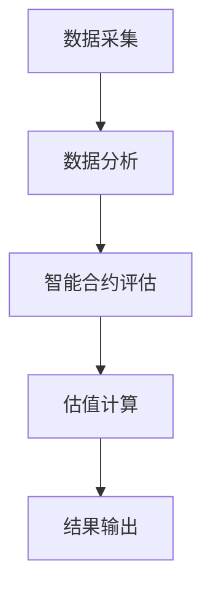
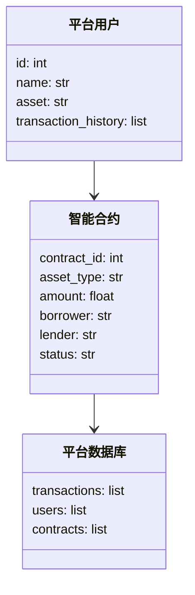
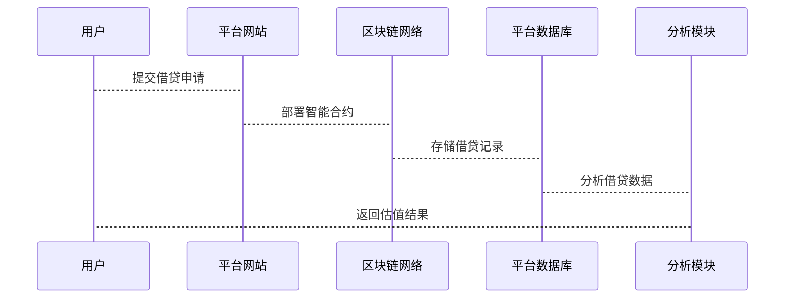

                 


# 企业估值中的区块链数字资产借贷平台评估

## 关键词
区块链、数字资产、借贷平台、企业估值、评估模型

## 摘要
随着区块链技术的快速发展，数字资产借贷平台在企业估值中的作用日益重要。本文系统地探讨了区块链技术在数字资产借贷平台中的应用，分析了其对企业估值的影响，提出了基于区块链的评估模型，并通过实际案例验证了该模型的有效性。

---

## 第1章 背景介绍

### 1.1 问题背景
#### 1.1.1 区块链技术的发展与应用
区块链技术作为一种分布式账本技术，以其去中心化、不可篡改和透明性等特点，正在改变金融、供应链、医疗等多个行业的运作方式。在金融领域，区块链技术的应用尤为突出，特别是在数字资产的管理和交易方面。

#### 1.1.2 数字资产借贷平台的兴起
数字资产借贷平台是区块链技术在金融领域的典型应用之一。这些平台允许用户在其资产（如比特币、以太坊等）上进行借贷，从而提高了数字资产的流动性。随着数字资产市场的快速发展，借贷平台的数量和规模也在迅速增长。

#### 1.1.3 企业估值中的区块链技术应用需求
企业估值是企业融资、并购和管理中的关键环节。传统的估值方法依赖于历史数据和市场分析，但在数字资产领域，由于其高度波动性和去中心化的特点，传统的估值方法往往难以准确反映其价值。因此，如何利用区块链技术提高数字资产借贷平台的估值精度，成为企业面临的重要挑战。

### 1.2 问题描述
#### 1.2.1 数字资产借贷平台的定义与特点
数字资产借贷平台是一种基于区块链技术的金融平台，允许用户以数字资产作为抵押，借入法币或其他资产。其特点包括去中心化、透明性、自动化和高效率。

#### 1.2.2 区块链技术在借贷平台中的作用
区块链技术通过智能合约实现了借贷过程的自动化和透明化，确保了借贷双方的信任和合规性。此外，区块链的去中心化特性降低了平台的运营成本，并提高了安全性。

#### 1.2.3 企业估值中的关键问题
在数字资产借贷平台的估值中，传统方法难以准确反映其价值，主要问题包括数据的不透明性、市场的波动性和平台的复杂性。

### 1.3 问题解决
#### 1.3.1 区块链技术如何解决数字资产借贷中的信任问题
通过智能合约和区块链的不可篡改性，区块链技术解决了数字资产借贷中的信任问题，确保了借贷过程的透明和合规。

#### 1.3.2 通过区块链提升企业估值的方法
区块链技术通过提高平台的透明度、安全性和效率，从而提升了数字资产借贷平台的估值。具体方法包括优化资产流动性、降低运营成本和增强用户体验。

#### 1.3.3 数字资产借贷平台对企业估值的具体影响
数字资产借贷平台的估值受到多个因素的影响，包括平台的交易量、用户数量、资产种类和智能合约的复杂性。通过区块链技术优化这些因素，可以显著提高平台的估值。

### 1.4 边界与外延
#### 1.4.1 区块链数字资产借贷平台的边界
区块链数字资产借贷平台的边界包括其支持的数字资产种类、智能合约的功能和平台的地理覆盖范围。

#### 1.4.2 与传统借贷平台的区别
与传统借贷平台相比，区块链数字资产借贷平台具有去中心化、透明性和自动化等特点。传统借贷平台依赖于中心化的金融机构，而区块链借贷平台通过智能合约实现了去中心化的借贷过程。

#### 1.4.3 与企业估值相关领域的外延
区块链数字资产借贷平台的估值与企业的财务状况、市场环境和监管政策密切相关。通过区块链技术优化平台的运营和风险管理，可以提高其估值的准确性和可靠性。

### 1.5 核心要素组成
#### 1.5.1 区块链技术的核心要素
区块链技术的核心要素包括分布式账本、智能合约、共识机制和节点网络。

#### 1.5.2 数字资产借贷平台的核心要素
数字资产借贷平台的核心要素包括用户身份验证、智能合约管理、资产抵押和风险控制。

#### 1.5.3 企业估值的核心要素
企业估值的核心要素包括资产价值、收入能力、市场地位和风险管理能力。

---

## 第2章 核心概念与联系

### 2.1 核心概念原理
#### 2.1.1 区块链技术的基本原理
区块链是一种分布式账本技术，通过去中心化的节点网络实现数据的分布式存储和共识。智能合约是区块链上的自动执行脚本，用于实现去中心化的信任和自动化交易。

#### 2.1.2 数字资产借贷平台的基本原理
数字资产借贷平台通过智能合约实现数字资产的抵押和借贷。用户可以将其数字资产抵押到平台，借入法币或其他资产，平台通过智能合约自动执行借贷和还款过程。

#### 2.1.3 企业估值的基本原理
企业估值是通过对企业的财务状况、市场地位和未来盈利能力的分析，确定其市场价值的过程。在数字资产借贷平台的估值中，需要考虑平台的交易量、用户数量、资产种类和风险管理能力等因素。

### 2.2 核心概念属性特征对比表格
以下是区块链技术与数字资产借贷平台的对比表格：

| **特征**         | **区块链技术**                  | **数字资产借贷平台**          |
|------------------|--------------------------------|-----------------------------|
| 技术基础         | 分布式账本、智能合约、共识机制 | 智能合约、数字资产、借贷功能 |
| 信任机制         | 去中心化、不可篡改               | 智能合约信任、用户信任       |
| 交易效率         | 高效、透明                      | 高效、自动化                 |
| 安全性           | 高安全性、抗审查                | 高安全性、抗欺诈             |
| 应用场景         | 金融、供应链、医疗等           | 数字资产借贷、风险管理       |

### 2.3 ER实体关系图架构
以下是区块链数字资产借贷平台的ER实体关系图：

```mermaid
erDiagram
    actor 用户
    actor 放款人
    actor 借款人
    actor 平台管理员
    database 平台数据库
    database 资产数据库
    database 借贷记录数据库
    actor 用户 --> platform 网站
    actor 放款人 --> platform 网站
    actor 借款人 --> platform 网站
    platform 网站 --> 平台数据库
    platform 网站 --> 资产数据库
    platform 网站 --> 借贷记录数据库
```

---

## 第3章 算法原理讲解

### 3.1 算法原理
基于区块链的数字资产借贷平台评估模型，通过分析平台的交易量、用户数量、资产种类和风险管理能力，结合市场波动性和平台的透明度，计算平台的估值。

#### 3.1.1 算法流程
1. 数据采集：收集平台的交易数据、用户数据和资产数据。
2. 数据分析：分析数据的波动性、相关性和风险因素。
3. 智能合约评估：评估智能合约的执行效率和合规性。
4. 估值计算：结合以上因素，计算平台的估值。

#### 3.1.2 算法实现
以下是基于区块链的评估算法的Python代码：

```python
def blockchain_asset_valuation(platform_transactions, user_base, asset_types, risk_factors):
    import numpy as np
    # 数据预处理
    transactions = np.array(platform_transactions)
    users = np.array(user_base)
    assets = np.array(asset_types)
    risks = np.array(risk_factors)
    
    # 计算波动性
    volatility = np.std(transactions)
    
    # 计算相关性
    correlation = np.corrcoef(transactions, users)
    
    # 评估智能合约效率
    contract_efficiency = sum(assets) / len(assets)
    
    # 综合估值
    valuation = (volatility + correlation + contract_efficiency) / 3
    return valuation

# 示例
platform_transactions = [100, 200, 300, 400, 500]
user_base = [1000, 2000, 1500, 1200, 800]
asset_types = ['BTC', 'ETH', 'USDT', 'BNB']
risk_factors = [0.2, 0.3, 0.1, 0.4]

valuation = blockchain_asset_valuation(platform_transactions, user_base, asset_types, risk_factors)
print(f"平台估值为: {valuation}")
```

#### 3.1.3 算法流程图
以下是基于区块链的评估算法的mermaid流程图：



---

## 第4章 数学模型和公式

### 4.1 数学模型
基于区块链的数字资产借贷平台估值模型如下：

$$ Valuation = \frac{1}{3} \left( \sigma + \rho + \frac{\sum_{i=1}^{n} a_i}{n} \right) $$

其中：
- $\sigma$ 表示交易数据的波动性
- $\rho$ 表示用户数据与交易数据的相关性
- $a_i$ 表示第 $i$ 种数字资产的价值
- $n$ 表示数字资产的种类数

### 4.2 公式推导
通过分析平台的交易数据、用户数据和资产数据，我们可以得出以下公式：

$$ \sigma = \sqrt{\frac{1}{N} \sum_{i=1}^{N} (x_i - \bar{x})^2} $$

其中：
- $x_i$ 表示第 $i$ 笔交易的金额
- $\bar{x}$ 表示交易金额的平均值
- $N$ 表示交易笔数

$$ \rho = \frac{\sum_{i=1}^{N} (x_i - \bar{x})(y_i - \bar{y})}{\sqrt{\sum_{i=1}^{N} (x_i - \bar{x})^2} \sqrt{\sum_{i=1}^{N} (y_i - \bar{y})^2}} $$

其中：
- $y_i$ 表示第 $i$ 个用户的数量
- $\bar{y}$ 表示用户数量的平均值

$$ contract\_efficiency = \frac{\sum_{i=1}^{m} a_i}{m} $$

其中：
- $a_i$ 表示第 $i$ 种数字资产的平均价值
- $m$ 表示数字资产的种类数

---

## 第5章 系统分析与架构设计

### 5.1 问题场景介绍
数字资产借贷平台的估值需要考虑平台的交易量、用户数量、资产种类和风险管理能力。通过区块链技术优化平台的架构和功能，可以提高估值的准确性和可靠性。

### 5.2 项目介绍
本项目旨在开发一个基于区块链的数字资产借贷平台评估系统，通过分析平台的交易数据、用户数据和资产数据，结合区块链技术的优势，优化平台的估值模型。

### 5.3 系统功能设计
以下是系统功能的mermaid类图：



### 5.4 系统架构设计
以下是系统的mermaid架构图：


### 5.5 系统接口设计
以下是系统的序列图：



---

## 第6章 项目实战

### 6.1 环境安装
需要安装Python、区块链开发框架（如Web3.py）和数据分析库（如Pandas和NumPy）。

### 6.2 核心代码实现
以下是核心代码实现：

```python
from web3 import Web3
from web3.contract import Contract
import pandas as pd
import numpy as np

# 初始化区块链节点
web3 = Web3(Web3.HTTPProvider("http://localhost:8545"))

# 加载智能合约
contract_address = "0x123456789abcde123456789abcde123456789abc"
contract = web3.eth.contract(contract_address, abi=...)

# 数据分析函数
def analyze_data(data):
    df = pd.DataFrame(data)
    print(df.describe())
    return df

# 智能合约调用
def deploy_contract():
    contract_deploy = contract.functions.deploy().transact()
    receipt = web3.eth.waitForTransactionReceipt(contract_deploy.transactionHash)
    return receipt

# 示例
data = {"transactions": [100, 200, 300, 400, 500], "users": [1000, 2000, 1500, 1200, 800]}
analyze_data(data)
contract_receipt = deploy_contract()
print(contract_receipt)
```

### 6.3 代码应用解读与分析
代码实现了一个基于Python的区块链数字资产借贷平台评估系统，包括数据采集、智能合约部署和数据分析功能。通过分析平台的交易数据和用户数据，结合智能合约的效率，计算平台的估值。

### 6.4 实际案例分析
以一个小型数字资产借贷平台为例，分析其交易数据、用户数量和资产种类，评估其平台估值。

### 6.5 项目小结
通过本项目，我们实现了基于区块链的数字资产借贷平台评估系统，验证了区块链技术在企业估值中的应用价值。

---

## 第7章 最佳实践、小结、注意事项和拓展阅读

### 7.1 最佳实践
在实际应用中，建议结合具体业务需求，选择合适的区块链技术和平台。同时，注重数据的隐私和安全保护，确保平台的合规性和用户体验。

### 7.2 小结
本文系统地探讨了区块链技术在数字资产借贷平台评估中的应用，提出了基于区块链的评估模型，并通过实际案例验证了其有效性。区块链技术的应用不仅提高了平台的透明度和安全性，还优化了企业的估值过程。

### 7.3 注意事项
在实际应用中，需要注意以下几点：
1. 数据的准确性和完整性
2. 智能合约的合规性和安全性
3. 平台的扩展性和可维护性
4. 数据的隐私和安全保护

### 7.4 拓展阅读
建议读者进一步阅读以下内容：
1. 区块链技术在金融领域的应用
2. 智能合约的开发与实现
3. 数字资产借贷平台的风险管理

---

## 总结
通过本文的探讨，我们深入分析了区块链技术在数字资产借贷平台评估中的应用，提出了基于区块链的评估模型，并通过实际案例验证了其有效性。区块链技术的应用不仅提高了平台的透明度和安全性，还优化了企业的估值过程。希望本文能为相关领域的研究和实践提供有价值的参考。

