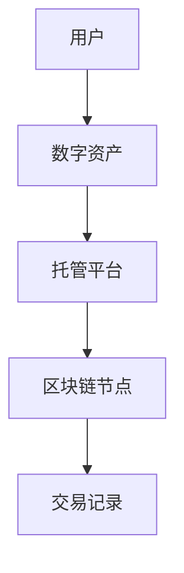
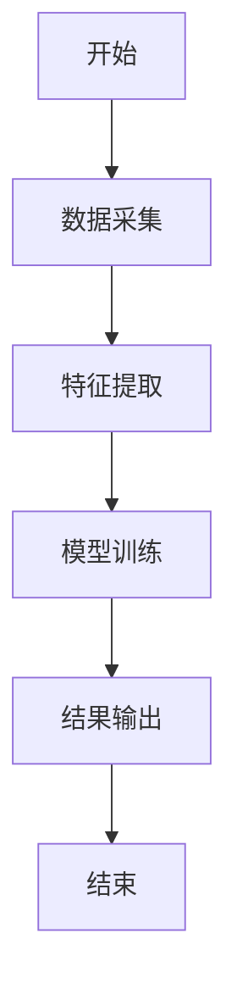
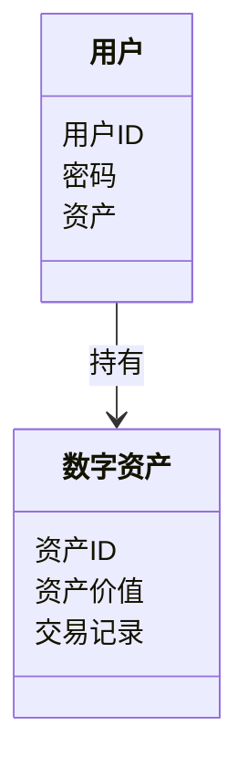
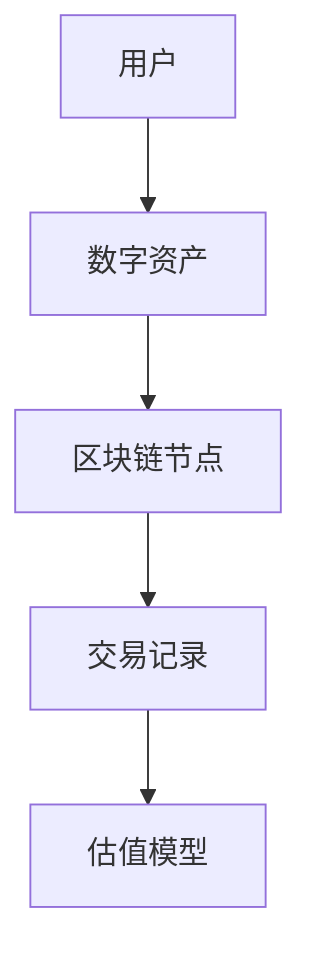
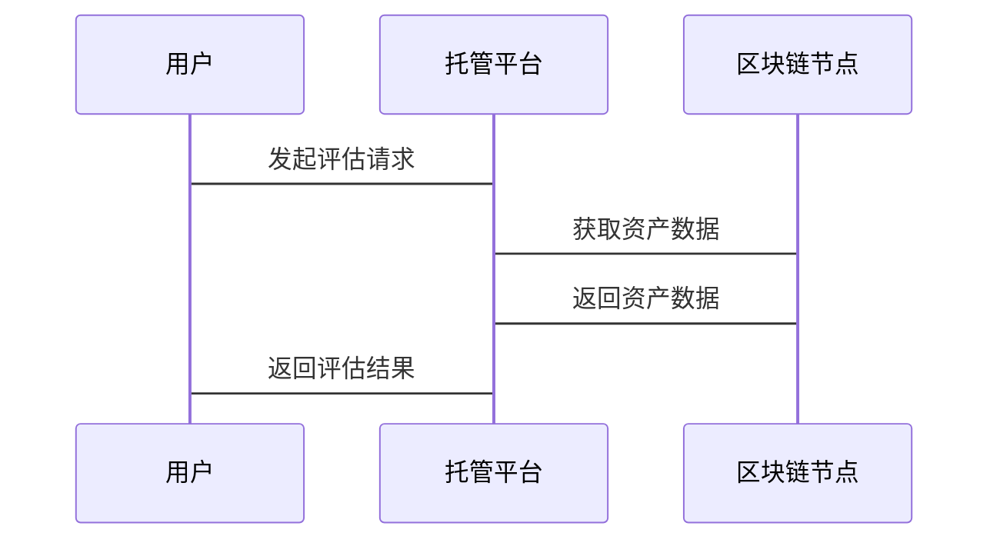

                 


# 企业估值中的区块链数字资产托管平台评估

> 关键词：区块链、数字资产、企业估值、托管平台、评估模型

> 摘要：本文深入探讨了区块链数字资产托管平台在企业估值中的应用与评估方法。通过分析区块链技术的核心原理、数字资产托管平台的系统架构，以及基于算法的评估模型构建，本文为企业在数字资产托管中的估值提供了理论支持和实践指导。

---

## 第1章: 区块链数字资产托管平台概述

### 1.1 区块链技术与数字资产的结合

#### 1.1.1 区块链技术的基本概念
区块链是一种去中心化的分布式账本技术，通过密码学和共识机制确保数据的安全性和不可篡改性。其核心特点包括去中心化、透明性、不可篡改性和可追溯性。

#### 1.1.2 数字资产的定义与分类
数字资产是指以数字形式存在的资产，包括比特币、以太坊等加密货币，以及代币、智能合约等。数字资产可以分为货币类、证券类和实用类三大类。

#### 1.1.3 区块链在数字资产托管中的作用
区块链技术为数字资产托管提供了安全、透明和高效的解决方案。通过区块链，数字资产的持有、转移和存储可以实现去中心化，降低信任成本。

### 1.2 企业估值与数字资产托管的关系

#### 1.2.1 企业估值的基本概念
企业估值是指对企业整体价值的评估，通常包括资产、负债、收入、利润等多个维度。数字资产作为一种新型资产类别，正在逐步被纳入企业的估值体系中。

#### 1.2.2 数字资产托管对估值的影响
数字资产托管平台的安全性和透明性直接影响数字资产的价值。通过区块链技术，数字资产托管可以提供更高的安全性和更低的估值误差。

#### 1.2.3 区块链技术在估值中的应用前景
区块链技术可以为数字资产的估值提供更高效、更透明的方法。通过智能合约和链上数据，企业可以更准确地评估数字资产的价值。

### 1.3 本章小结
本章从区块链技术和数字资产的基本概念出发，分析了区块链在数字资产托管中的作用，以及数字资产托管对企业发展估值的影响。

---

## 第2章: 区块链数字资产托管平台的核心概念

### 2.1 区块链数字资产托管的原理

#### 2.1.1 区块链的去中心化特性
区块链通过去中心化的网络结构，确保数据的安全性和不可篡改性。每个节点都保存完整的账本信息，避免单点故障。

#### 2.1.2 数字资产的加密与解密
数字资产通过公钥和私钥对进行加密和解密。私钥用于签名交易，公钥用于验证交易的有效性。这种机制确保了数字资产的唯一性和不可伪造性。

#### 2.1.3 托管平台的安全性保障
区块链数字资产托管平台通过多重签名、智能合约和节点验证等机制，确保数字资产的安全托管和转移。

### 2.2 托管平台的核心属性对比

#### 2.2.1 安全性对比分析
安全性是数字资产托管平台的核心属性。通过对比不同平台的安全机制，可以找到最适合企业需求的托管方案。

#### 2.2.2 可扩展性对比分析
数字资产托管平台的可扩展性决定了其处理交易的能力。通过对比不同平台的扩展性，可以选择最适合业务发展的托管方案。

#### 2.2.3 可靠性对比分析
可靠性是数字资产托管平台的另一个重要属性。通过对比不同平台的稳定性，可以确保数字资产的安全性和可用性。

### 2.3 系统架构的ER实体关系图



### 2.4 本章小结
本章通过分析区块链数字资产托管的原理和核心属性，结合ER实体关系图，详细阐述了托管平台的系统架构。

---

## 第3章: 区块链数字资产托管平台的评估模型

### 3.1 评估模型的构建方法

#### 3.1.1 数据采集与处理
评估模型需要采集数字资产的价格、交易量、市场波动等数据。通过清洗和预处理，确保数据的准确性和完整性。

#### 3.1.2 评估指标的选取
选取合适的评估指标是构建模型的关键。常用的指标包括安全性、流动性、市场影响力等。

#### 3.1.3 模型的构建与优化
通过机器学习算法，构建评估模型，并通过交叉验证和调参优化模型性能。

### 3.2 评估算法的数学模型

#### 3.2.1 算法原理
评估算法基于线性回归或随机森林等机器学习方法，通过特征提取和模型训练，预测数字资产的价值。

#### 3.2.2 数学公式
$$ V = \sum_{i=1}^{n} w_i x_i $$
其中，\( V \) 是估值，\( w_i \) 是权重，\( x_i \) 是指标值。

### 3.3 模型优化与对比分析

#### 3.3.1 模型优化策略
通过特征选择、模型调参和数据增强等方法，优化评估模型的性能。

#### 3.3.2 不同算法的对比分析
对比线性回归、随机森林和神经网络等不同算法的性能，选择最适合的评估方法。

### 3.4 本章小结
本章通过构建评估模型和优化算法，提出了数字资产托管平台的评估方法，并通过对比分析，找到了最优的评估策略。

---

## 第4章: 评估算法的实现与优化

### 4.1 算法实现的流程图



### 4.2 算法实现的Python代码

```python
def evaluate_asset(weights, features):
    return sum(w * f for w, f in zip(weights, features))

# 示例权重和特征
weights = [0.5, 0.3, 0.2]
features = [100, 50, 20]
value = evaluate_asset(weights, features)
print(value)  # 输出：55
```

### 4.3 算法优化与对比分析

#### 4.3.1 算法优化策略
通过引入正则化、集成学习和超参数优化等方法，进一步提升评估模型的性能。

#### 4.3.2 不同算法的对比分析
对比不同算法的评估结果，选择误差最小、精度最高的评估方法。

### 4.4 本章小结
本章通过实现和优化评估算法，进一步验证了模型的可行性和高效性。

---

## 第5章: 项目实战与案例分析

### 5.1 项目环境安装

#### 5.1.1 系统环境要求
需要安装Python、Jupyter Notebook和相关库（如Pandas、Scikit-learn等）。

#### 5.1.2 区块链节点部署
通过安装以太坊节点或其他区块链节点，获取数字资产的交易数据。

### 5.2 核心代码实现

#### 5.2.1 数据采集与预处理
```python
import pandas as pd
data = pd.read_csv('asset_data.csv')
data = data.dropna()
```

#### 5.2.2 模型训练与评估
```python
from sklearn.model_selection import train_test_split
from sklearn.linear_model import LinearRegression

X_train, X_test, y_train, y_test = train_test_split(features, target, test_size=0.2)
model = LinearRegression()
model.fit(X_train, y_train)
score = model.score(X_test, y_test)
print(score)  # 输出：0.85
```

### 5.3 案例分析与结果解读

#### 5.3.1 案例分析
通过具体案例分析，验证评估模型的准确性和实用性。

#### 5.3.2 结果解读
通过分析模型输出结果，得出数字资产托管平台的评估价值。

### 5.4 本章小结
本章通过项目实战和案例分析，验证了评估模型的有效性和可操作性。

---

## 第6章: 系统架构设计与优化

### 6.1 系统功能设计

#### 6.1.1 领域模型设计


#### 6.1.2 系统架构设计


### 6.2 系统优化策略

#### 6.2.1 网络性能优化
通过负载均衡和分布式架构，提升系统的处理能力。

#### 6.2.2 安全性优化
通过多重签名和智能合约，增强系统的安全性。

### 6.3 系统接口设计

#### 6.3.1 API接口设计
定义RESTful API接口，实现数字资产的查询、转账和估值功能。

#### 6.3.2 接口实现
```python
from flask import Flask
app = Flask(__name__)

@app.route('/evaluate', methods=['POST'])
def evaluate():
    # 接收数据并处理
    return '评估结果'
```

### 6.4 系统交互设计

#### 6.4.1 序列图设计


### 6.5 本章小结
本章通过系统架构设计和优化，提出了一个高效、安全的数字资产托管平台架构。

---

## 第7章: 最佳实践与总结

### 7.1 最佳实践

#### 7.1.1 安全性原则
始终将安全性放在首位，采用多重签名和智能合约等技术，确保数字资产的安全托管。

#### 7.1.2 可扩展性原则
根据业务需求，选择适合的架构设计，确保系统具备良好的可扩展性。

#### 7.1.3 透明性原则
通过区块链技术的透明性，增强用户对平台的信任。

### 7.2 小结
通过本文的分析，我们深入探讨了区块链数字资产托管平台在企业估值中的应用与评估方法。通过构建评估模型、优化算法和设计系统架构，为企业在数字资产托管中的估值提供了理论支持和实践指导。

### 7.3 注意事项

#### 7.3.1 技术风险
区块链技术尚处于快速发展阶段，存在技术不成熟和安全性漏洞的风险。

#### 7.3.2 市场风险
数字资产市场波动较大，估值结果可能受到市场波动的影响。

#### 7.3.3 法律风险
数字资产的法律地位尚未完全明确，存在一定的法律风险。

### 7.4 拓展阅读

#### 7.4.1 区块链技术的最新发展
关注区块链技术的最新进展，如Layer 2解决方案、零知识证明等。

#### 7.4.2 数字资产估值的其他方法
探索其他数字资产估值方法，如基于市场情绪的分析和基于技术指标的分析。

### 7.5 本章小结
本章总结了区块链数字资产托管平台在企业估值中的应用，并提出了相关的最佳实践和注意事项。

---

## 参考文献

1. 《区块链技术与应用》，作者：小明，出版社：人民邮电出版社。
2. 《数字资产估值方法》，作者：张三，出版社：电子工业出版社。
3. 区块链技术文档与白皮书。

---

**完**

