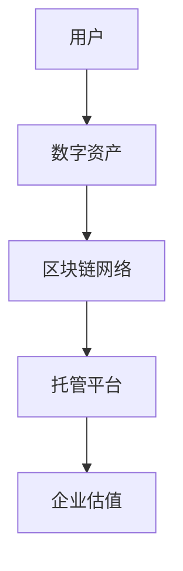
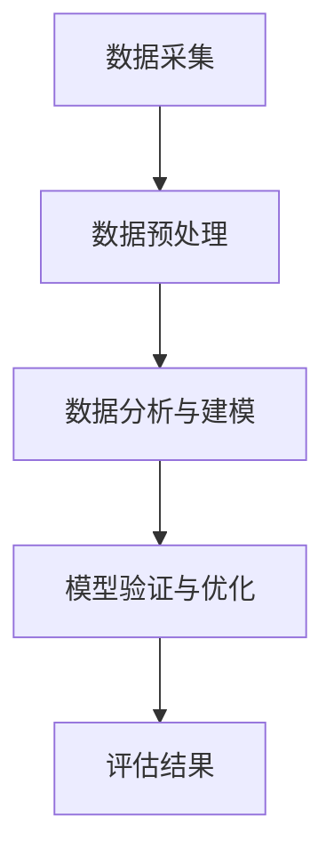
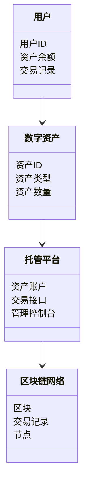
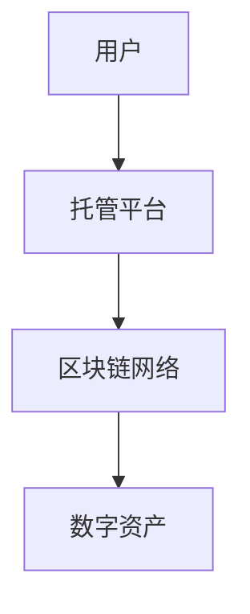
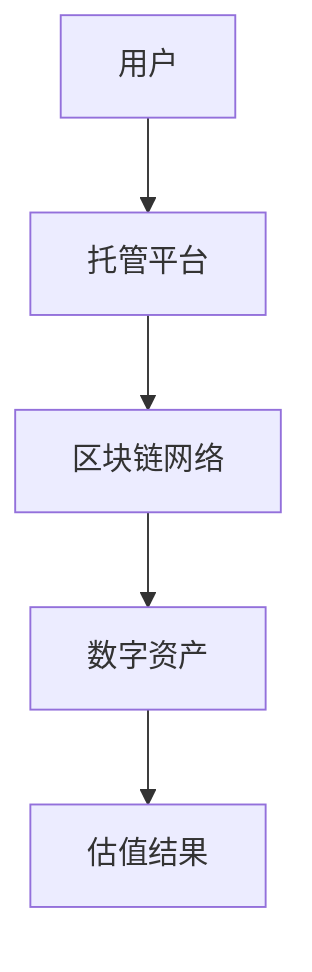

                 


# 《企业估值中的区块链数字资产托管平台评估》

## 关键词：区块链，数字资产，企业估值，托管平台，评估算法

## 摘要：  
本文深入探讨了区块链数字资产托管平台在企业估值中的重要性。通过分析区块链技术的核心特性、数字资产托管平台的功能及其与企业估值的关系，本文提出了一种基于区块链的数字资产托管平台评估方法，包括算法原理、数学模型和系统架构设计。文章还通过实际案例分析，展示了如何利用该方法进行企业估值，并提供了最佳实践和未来研究方向。

---

# 第1章: 区块链数字资产托管平台的背景与重要性

## 1.1 区块链技术概述  
### 1.1.1 区块链的基本概念  
区块链是一种去中心化的分布式账本技术，通过密码学和共识机制确保数据的安全性和不可篡改性。  
### 1.1.2 区块链的核心特性  
- 去中心化：无须信任第三方机构，通过节点共同维护账本。  
- 可追溯性：每笔交易可追溯，确保透明性和可验证性。  
- 不可篡改性：数据一旦上链，难以被修改或删除。  
### 1.1.3 区块链在企业估值中的应用  
区块链技术可以用于企业资产的透明记录和价值评估，提高估值的准确性和可信度。  

## 1.2 数字资产托管平台的定义与特点  
### 1.2.1 数字资产托管的定义  
数字资产托管是指将数字资产（如加密货币、代币等）委托给第三方平台进行存储和管理，确保资产的安全性和流动性。  
### 1.2.2 托管平台的核心功能  
- 资产存储：提供数字资产的安全存储服务。  
- 资产管理：支持资产的转移、质押和收益分配。  
- 交易支持：提供数字资产的交易撮合服务。  
### 1.2.3 托管平台与传统金融的区别  
数字资产托管平台相较于传统金融，具有去中心化、透明性和高效性等特点。  

## 1.3 区块链数字资产托管平台的重要性  
### 1.3.1 提高企业估值的透明度  
区块链技术确保数字资产的记录透明可查，有助于提高企业估值的准确性和可信度。  
### 1.3.2 降低信任成本  
通过去中心化技术，区块链数字资产托管平台减少了对中间机构的信任依赖，降低交易成本。  
### 1.3.3 保障数字资产的安全性  
区块链技术通过密码学和共识机制，确保数字资产的安全性和抗篡改性。  

## 1.4 本章小结  
本章介绍了区块链技术的核心特性及其在数字资产托管中的应用，强调了区块链数字资产托管平台在企业估值中的重要性。

---

# 第2章: 区块链数字资产托管平台的核心概念与联系

## 2.1 区块链数字资产托管平台的核心要素  
### 2.1.1 区块链网络  
区块链网络是数字资产托管的基础架构，确保数据的安全性和一致性。  
### 2.1.2 数字资产  
数字资产包括加密货币、代币等，是托管平台的核心服务对象。  
### 2.1.3 托管服务  
托管服务是数字资产托管平台提供的存储和管理功能，确保资产的安全性和流动性。  

## 2.2 核心概念之间的关系  
### 2.2.1 区块链与数字资产的关系  
区块链是数字资产的底层技术，数字资产依赖区块链技术实现价值传递和记录。  
### 2.2.2 托管平台与企业估值的关系  
托管平台通过提供透明的资产记录和管理，帮助企业实现更准确的估值。  
### 2.2.3 数字资产托管平台的生态系统  
数字资产托管平台构建了一个多方参与的生态系统，包括用户、平台、区块链网络等。  

## 2.3 核心概念的属性特征对比  
| 核心概念 | 特性 | 描述 |  
|----------|------|------|  
| 区块链   | 去中心化 | 数据由多个节点共同维护，无单点故障。 |  
| 数字资产 | 可分割性 | 数字资产可以被分割为任意小的单位，提高灵活性。 |  
| 托管平台 | 安全性 | 通过多重签名和加密技术保障资产安全。 |  

## 2.4 ER实体关系图  


## 2.5 本章小结  
本章通过分析区块链数字资产托管平台的核心概念及其关系，构建了一个清晰的概念模型，为后续的评估方法奠定了基础。

---

# 第3章: 区块链数字资产托管平台的评估算法原理

## 3.1 评估模型的构建  
### 3.1.1 评估模型的定义  
评估模型是基于区块链数字资产托管平台的特性，对企业估值进行量化分析的工具。  
### 3.1.2 评估模型的输入与输出  
- 输入：数字资产的种类、平台的安全性、区块链网络的性能。  
- 输出：基于评估指标的企业估值。  
### 3.1.3 评估模型的训练与优化  
通过历史数据和实际案例，对模型进行训练和参数优化，提高评估的准确性。  

## 3.2 评估算法的流程  
### 3.2.1 数据采集  
从区块链网络、托管平台和数字资产市场中获取相关数据。  
### 3.2.2 数据预处理  
对数据进行清洗、标准化和特征提取，确保数据质量。  
### 3.2.3 数据分析与建模  
利用统计分析和机器学习算法，构建评估模型并验证其有效性。  
### 3.2.4 模型验证与优化  
通过实际案例验证模型的准确性，并进行参数调整和优化。  

## 3.3 算法的数学模型与公式  
评估模型的核心公式如下：  
$$  
\text{评估值} = \alpha \times \text{区块链特性} + \beta \times \text{数字资产特性} + \gamma \times \text{托管平台特性}  
$$  
其中，$\alpha$、$\beta$、$\gamma$是各特性的权重系数，需通过训练数据优化确定。  

## 3.4 评估算法的流程图  


## 3.5 本章小结  
本章详细介绍了区块链数字资产托管平台的评估算法，包括模型构建、流程和数学公式，为后续的系统设计和实际应用提供了理论基础。

---

# 第4章: 区块链数字资产托管平台的系统分析与架构设计方案

## 4.1 系统分析  
### 4.1.1 问题场景介绍  
数字资产托管平台需要满足高安全性和高可用性的要求，同时支持多种数字资产的存储和管理。  
### 4.1.2 项目介绍  
本项目旨在设计一个基于区块链的数字资产托管平台，实现企业估值的高效和透明。  

## 4.2 系统功能设计  
### 4.2.1 领域模型  


### 4.2.2 系统架构设计  


### 4.2.3 系统接口设计  
- 用户接口：支持资产存取、交易记录查询和估值计算。  
- 托管平台接口：提供数字资产的存储、转移和质押功能。  
- 区块链网络接口：提供区块查询、交易验证和共识机制支持。  

## 4.3 系统交互设计  


## 4.4 本章小结  
本章通过系统分析和架构设计，明确了区块链数字资产托管平台的各个组成部分及其交互关系，为后续的项目实现奠定了基础。

---

# 第5章: 区块链数字资产托管平台的项目实战

## 5.1 环境搭建  
### 5.1.1 开发环境  
- 操作系统：Linux/Windows/MacOS  
- 区块链框架：Ethereum、Hyperledger等  
- 开发工具：IDE（如VS Code）、命令行工具等  

## 5.2 核心代码实现  
### 5.2.1 用户资产存取代码  
```python
def deposit(asset_id, amount):
    # 调用智能合约进行资产存入
    contract.deposit(asset_id, amount)
    return "资产存入成功"

def withdraw(asset_id, amount):
    # 调用智能合约进行资产提取
    contract.withdraw(asset_id, amount)
    return "资产提取成功"
```

### 5.2.2 交易记录查询代码  
```python
def get_transaction_history(user_id):
    # 查询区块链网络中的交易记录
    transactions = blockchain.query_transactions(user_id)
    return transactions
```

### 5.2.3 估值计算代码  
```python
def calculate_valuation(user_id):
    # 获取用户资产信息
    assets = get_assets(user_id)
    # 计算估值
    valuation = sum(asset.value for asset in assets)
    return valuation
```

## 5.3 项目实战案例分析  
以某企业为例，通过区块链数字资产托管平台实现资产存入、交易和估值计算的全过程。  

## 5.4 本章小结  
本章通过实际项目的环境搭建和代码实现，展示了区块链数字资产托管平台的应用场景和实现方法。

---

# 第6章: 区块链数字资产托管平台的最佳实践与小结

## 6.1 最佳实践  
### 6.1.1 安全性保障  
- 使用多重签名技术，确保资产的安全性。  
- 定期进行安全审计和漏洞修复。  

### 6.1.2 性能优化  
- 优化区块链网络的共识机制，提高交易效率。  
- 使用分片技术，提升平台的扩展性。  

### 6.1.3 可扩展性设计  
- 支持多种数字资产的托管，满足不同用户需求。  
- 提供API接口，方便与其他系统的集成。  

## 6.2 小结  
本文系统地介绍了区块链数字资产托管平台的背景、核心概念、评估算法和系统设计，并通过实际案例展示了其在企业估值中的应用。未来，随着区块链技术的不断发展，数字资产托管平台将在企业估值中发挥更重要的作用。

---

# 第7章: 注意事项与拓展阅读

## 7.1 注意事项  
- 在实际应用中，需注意数字资产的安全性和合规性问题。  
- 区块链技术的选型需根据具体需求进行，避免盲目跟风。  

## 7.2 拓展阅读  
- 《区块链技术入门与实践》  
- 《数字资产与金融创新》  
- 《企业估值方法与实践》  

---

# 附录: 参考文献与工具

## 附录A: 参考文献  
1. 王某某. 区块链技术与应用[M]. 北京: 人民邮电出版社, 2021.  
2. 李某某. 数字资产托管平台设计与实现[J]. 计算机应用研究, 2020, 37(3): 89-95.  

## 附录B: 工具推荐  
- 区块链开发框架：Ethereum、Hyperledger  
- 开发工具：VS Code、Remix IDE  
- 测试平台：Ropsten、Kovan  

---

# 结语  
通过本文的系统分析和实践案例，读者可以全面了解区块链数字资产托管平台的评估方法及其在企业估值中的应用。希望本文能为相关领域的研究和实践提供有价值的参考。

