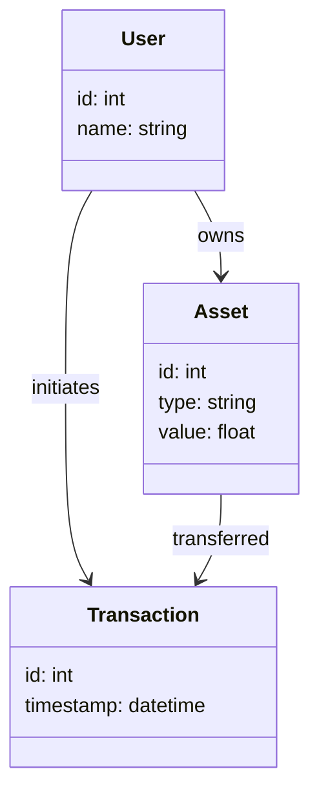
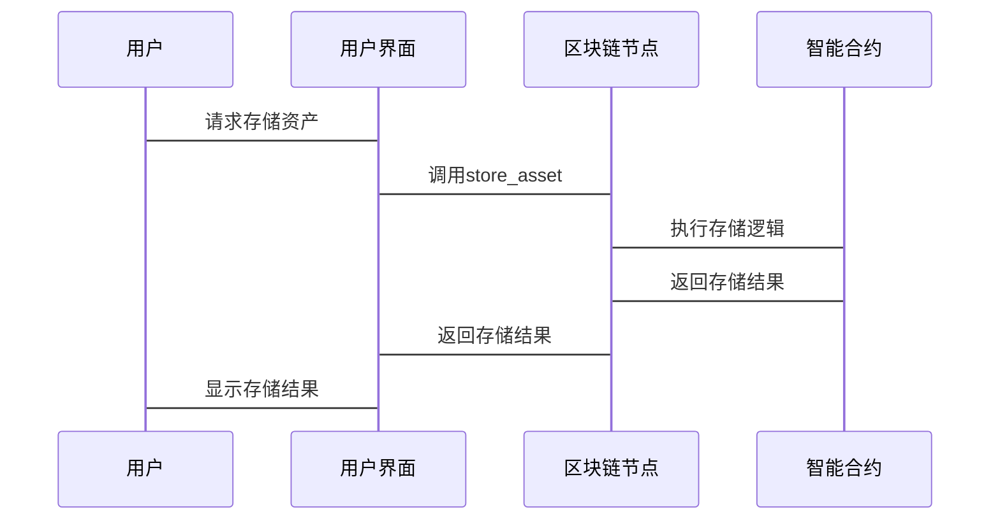

                 


# 《企业估值中的区块链数字资产托管系统评估》

> 关键词：企业估值，区块链，数字资产托管，系统评估，共识算法，智能合约，数学模型

> 摘要：区块链技术在数字资产托管中的应用对企业估值具有重要意义。本文详细探讨了区块链数字资产托管系统的背景、核心概念、算法原理、系统架构、项目实战以及最佳实践，通过理论与实践相结合的方式，深入分析了区块链技术如何提升数字资产托管的安全性、透明度和估值准确性，为企业估值提供新的视角和方法。

---

# 第一部分: 企业估值中的区块链数字资产托管系统评估背景与概念

## 第1章: 区块链数字资产托管系统概述

### 1.1 区块链数字资产托管的定义与特点

#### 1.1.1 区块链数字资产托管的定义
区块链数字资产托管系统是一种基于区块链技术的去中心化数字资产存储和管理平台，通过智能合约实现资产的自动托管、转移和结算，确保数字资产的安全性和透明性。

#### 1.1.2 区块链数字资产托管的核心特点
- **去中心化**：数据存储在多个节点上，避免单点故障。
- **不可篡改**：区块链记录的交易数据具有不可篡改的特性。
- **透明性**：所有交易记录公开可查，确保透明性。
- **智能合约**：通过智能合约自动执行资产托管和转移。

#### 1.1.3 区块链数字资产托管与传统资产托管的区别
- **去中心化**：传统托管依赖中心机构，区块链托管去中心化。
- **透明性**：传统托管过程不透明，区块链托管公开透明。
- **安全性**：区块链托管通过密码学技术确保数据安全。

### 1.2 区块链技术在数字资产托管中的作用

#### 1.2.1 区块链技术的基本原理
区块链通过分布式账本、共识机制和智能合约实现数据的安全性和可靠性。每个区块包含交易数据和时间戳，通过哈希指针链接成链式结构，确保数据不可篡改。

#### 1.2.2 区块链在数字资产托管中的优势
- **安全性**：防止数据篡改和丢失。
- **透明性**：所有交易记录公开可查。
- **高效性**：智能合约自动执行托管和转移。

#### 1.2.3 区块链技术对数字资产托管系统的潜在影响
区块链技术的应用将彻底改变数字资产托管的方式，降低信任成本，提升交易效率，为数字资产的估值提供更可靠的基础。

### 1.3 数字资产托管系统的法律与合规性

#### 1.3.1 数字资产托管的法律框架
数字资产托管涉及法律合规性，包括反洗钱（AML）、了解客户（KYC）等要求。各国对数字资产的监管政策不同，需要遵守当地法规。

#### 1.3.2 合规性要求与监管挑战
- **AML/KYC合规**：托管系统需记录用户身份信息，防止洗钱。
- **数据隐私**：保护用户隐私，防止数据泄露。
- **监管合规**：遵守各国数字资产监管法规。

#### 1.3.3 数字资产托管系统的法律风险与应对策略
- **法律风险**：数字资产托管可能涉及法律风险，如合规不达标。
- **应对策略**：加强合规管理，建立风险防控机制。

### 1.4 区块链数字资产托管与企业估值的关系

#### 1.4.1 企业估值的基本概念
企业估值是对企业价值的评估，通常包括资产价值、收益能力、市场竞争力等因素。

#### 1.4.2 区块链数字资产托管对估值的影响
区块链数字资产托管通过提升资产的安全性和透明性，增强数字资产的可信度，从而影响企业估值。

#### 1.4.3 区块链技术如何提升估值的准确性与透明度
区块链技术通过去中心化和透明性，减少信息不对称，提高估值的准确性和可信度。

### 1.5 本章小结
本章介绍了区块链数字资产托管系统的定义、特点和作用，探讨了其在企业估值中的重要性，为后续章节奠定了基础。

---

## 第2章: 区块链数字资产托管系统的核心概念与联系

### 2.1 区块链技术的核心概念

#### 2.1.1 区块链的分布式账本
分布式账本将数据分散存储在多个节点上，确保数据的安全性和一致性。

#### 2.1.2 区块链的共识机制
共识机制（如PoW、PoS）确保所有节点达成一致，保证区块链的安全性和稳定性。

#### 2.1.3 区块链的智能合约
智能合约是自动执行的脚本，根据预设条件自动执行资产托管和转移。

### 2.2 数字资产托管系统的核心要素

#### 2.2.1 数字资产的定义与分类
数字资产包括比特币、以太坊等加密货币，以及NFT等数字资产。

#### 2.2.2 托管系统的功能模块
- **资产存储**：存储数字资产。
- **资产转移**：通过智能合约实现资产转移。
- **资产估值**：提供数字资产的实时估值。

#### 2.2.3 托管系统的安全性与隐私性
通过密码学技术确保资产的安全性和用户隐私。

### 2.3 区块链技术与数字资产托管系统的关联

#### 2.3.1 区块链技术在数字资产托管中的应用场景
- **资产存储**：通过区块链实现数字资产的安全存储。
- **资产转移**：通过智能合约实现资产的自动转移。
- **资产估值**：通过区块链数据提供实时估值。

#### 2.3.2 区块链技术如何提升数字资产托管的安全性
通过去中心化和不可篡改的特性，防止资产被篡改或丢失。

#### 2.3.3 区块链技术对数字资产托管系统性能的影响
区块链技术可能影响系统的性能，如交易速度和费用。

### 2.4 核心概念对比与ER实体关系图

#### 2.4.1 区块链技术与传统数字资产托管的对比分析
| 特性          | 区块链技术                  | 传统托管                  |
|---------------|-----------------------------|---------------------------|
| 中心化        | 去中心化                    | 中心化                    |
| 透明性        | 高                        | 低                        |
| 安全性        | 高                        | 中                        |
| 成本          | 低                        | 高                        |

#### 2.4.2 数字资产托管系统核心要素的ER实体关系图
```mermaid
er
    %% 数字资产托管系统核心要素的ER实体关系图
    class User {
        id: int
        name: string
        asset_id: int
        timestamp: datetime
    }
    
    class Asset {
        id: int
        asset_type: string
        value: float
        user_id: int
    }
    
    class Transaction {
        id: int
        asset_id: int
        from_user: int
        to_user: int
        timestamp: datetime
    }
    
    User -> Asset: owns
    User -> Transaction: initiates
    Asset -> Transaction: transferred
```

### 2.5 本章小结
本章通过对比分析和ER实体关系图，详细阐述了区块链技术与数字资产托管系统的核心概念及其关联。

---

## 第3章: 区块链数字资产托管系统的算法原理与数学模型

### 3.1 区块链共识算法的原理

#### 3.1.1 共识算法的分类与特点
- **工作量证明（PoW）**：通过计算哈希找到特定值，证明工作量。
- **权益证明（PoS）**：根据持有代币的数量选择验证节点。

#### 3.1.2 工作量证明算法的数学模型
工作量证明算法通过计算哈希值来寻找满足条件的区块头，公式如下：
$$ H = hash(message + nonce) $$
其中，$H$ 是哈希值，$message$ 是区块头信息，$nonce$ 是随机数。

#### 3.1.3 权益证明算法的数学模型
权益证明算法通过随机选举验证节点，公式如下：
$$ probability = \frac{stake}{total\_stake} $$
其中，$stake$ 是用户持有的代币数量，$total\_stake$ 是系统总代币数量。

#### 3.1.4 共识算法的优缺点对比
| 特性          | PoW                | PoS                |
|---------------|--------------------|--------------------|
| 安全性        | 高                | 中                |
| 能耗          | 高                | 低                |
| 中心化        | 低                | 中                |

### 3.2 智能合约的实现原理

#### 3.2.1 智能合约的定义与特点
智能合约是运行在区块链上的自动执行脚本，通过预设条件自动执行资产托管和转移。

#### 3.2.2 智能合约的执行流程
1. 合约部署：将智能合约部署到区块链上。
2. 合约调用：用户发起调用请求，触发智能合约执行。
3. 合约状态更新：智能合约执行后更新区块链状态。

#### 3.2.3 智能合约的安全性与漏洞
智能合约的安全性依赖于代码的正确性，常见漏洞包括逻辑错误和重新入站攻击。

### 3.3 数字资产托管系统的估值模型

#### 3.3.1 估值模型的定义与分类
估值模型是用于评估数字资产价值的数学模型，常见的有市场法、成本法和收益法。

#### 3.3.2 基于区块链的估值模型
$$ value = f(price, volume, market\_cap) $$
其中，$price$ 是资产价格，$volume$ 是交易量，$market\_cap$ 是市值。

#### 3.3.3 估值模型的实现步骤
1. 收集数据：获取数字资产的价格、交易量等数据。
2. 建立模型：选择合适的估值模型。
3. 计算价值：根据模型计算资产价值。

### 3.4 本章小结
本章通过数学模型和算法原理，详细阐述了区块链数字资产托管系统的共识算法和智能合约的实现，以及估值模型的应用。

---

## 第4章: 区块链数字资产托管系统的系统分析与架构设计

### 4.1 问题场景介绍

#### 4.1.1 问题背景
数字资产托管系统面临安全性、透明性和效率性的问题，需要通过区块链技术解决。

#### 4.1.2 问题描述
数字资产托管系统需要实现资产的安全存储、自动托管和实时估值。

#### 4.1.3 问题解决
通过区块链技术实现去中心化存储、智能合约自动托管和实时估值。

### 4.2 系统功能设计

#### 4.2.1 功能模块划分
- **资产存储模块**：实现数字资产的安全存储。
- **资产转移模块**：通过智能合约实现资产转移。
- **资产估值模块**：提供数字资产的实时估值。

#### 4.2.2 功能模块的领域模型


### 4.3 系统架构设计

#### 4.3.1 系统架构的组成部分
- **区块链节点**：负责数据存储和共识。
- **智能合约**：实现资产托管和转移。
- **用户界面**：供用户进行资产操作。

#### 4.3.2 系统架构的mermaid图


### 4.4 系统接口设计

#### 4.4.1 接口定义
- **资产存储接口**：`store_asset(asset)`。
- **资产转移接口**：`transfer_asset(from, to, asset_id)`。
- **资产估值接口**：`get_asset_value(asset_id)`。

#### 4.4.2 接口实现
```python
def store_asset(asset):
    # 实现资产存储逻辑
    pass

def transfer_asset(from_user, to_user, asset_id):
    # 实现资产转移逻辑
    pass

def get_asset_value(asset_id):
    # 实现资产估值逻辑
    pass
```

### 4.5 系统交互设计

#### 4.5.1 系统交互的mermaid序列图


### 4.6 本章小结
本章通过系统分析与架构设计，详细阐述了区块链数字资产托管系统的组成部分和交互流程，为后续章节的实现奠定了基础。

---

## 第5章: 区块链数字资产托管系统的项目实战

### 5.1 环境安装与配置

#### 5.1.1 安装区块链框架
- 使用以太坊Solidity编译智能合约。
- 部署到以太坊测试网络。

#### 5.1.2 安装开发工具
- 使用 Remix 开发智能合约。
- 使用 MetaMask 连接测试网络。

#### 5.1.3 安装依赖库
```bash
npm install web3
npm install solc
```

### 5.2 系统核心实现

#### 5.2.1 智能合约实现
```solidity
// SPDX-License-Identifier: MIT
pragma solidity ^0.8.0;

contract AssetStorage {
    mapping(address => uint256) private balances;

    function storeAsset(uint256 amount) external {
        balances[msg.sender] += amount;
    }

    function transferAsset(address recipient, uint256 amount) external {
        require(balances[msg.sender] >= amount, "Insufficient balance");
        balances[recipient] += amount;
        balances[msg.sender] -= amount;
    }

    function getBalance(address account) external view returns (uint256) {
        return balances[account];
    }
}
```

#### 5.2.2 智能合约调用实现
```python
from web3 import Web3, HTTPProvider

# 连接到以太坊测试网络
w3 = Web3(HTTPProvider('http://localhost:8545'))

# 加载智能合约ABI
abi = [...]  # 替换为实际的ABI

contract = w3.eth.contract(address='0x...', abi=abi)

# 调用存储资产
contract.functions.storeAsset(100).transact()

# 调用转移资产
contract.functions.transferAsset('0x...', 50).transact()
```

### 5.3 代码应用解读与分析

#### 5.3.1 智能合约的功能实现
- `storeAsset`：存储资产。
- `transferAsset`：转移资产。
- `getBalance`：查询资产余额。

#### 5.3.2 智能合约的安全性分析
- **权限控制**：只有合约所有者可以执行关键操作。
- **交易验证**：确保交易金额不超过账户余额。

### 5.4 实际案例分析

#### 5.4.1 案例背景
某企业需要托管100个比特币，希望通过区块链技术实现安全托管。

#### 5.4.2 实施步骤
1. 部署智能合约到以太坊测试网络。
2. 用户调用`storeAsset`存储100个比特币。
3. 用户调用`transferAsset`转移部分比特币。

#### 5.4.3 案例分析结果
通过区块链技术实现了比特币的安全托管和转移，提升了资产的安全性和透明性。

### 5.5 本章小结
本章通过项目实战，详细讲解了区块链数字资产托管系统的环境安装、核心实现和实际案例分析，帮助读者掌握系统的实际应用。

---

## 第6章: 区块链数字资产托管系统的最佳实践

### 6.1 项目总结与经验分享

#### 6.1.1 项目总结
通过区块链技术实现了数字资产的安全托管和自动转移，提升了资产的透明性和安全性。

#### 6.1.2 实践经验
- **安全性**：加强智能合约的安全性审查。
- **性能优化**：优化区块链节点的性能。
- **用户体验**：提升用户界面的易用性。

### 6.2 最佳实践 tips

#### 6.2.1 安全性建议
- 定期进行智能合约审计。
- 防止重入攻击等漏洞。

#### 6.2.2 性能优化建议
- 采用轻量级共识算法。
- 优化区块链节点的网络性能。

#### 6.2.3 用户体验建议
- 提供详细的用户操作指南。
- 提供友好的用户界面设计。

### 6.3 本章小结
本章通过总结项目经验，提出了安全性、性能优化和用户体验等方面的建议，为后续项目的实施提供了参考。

---

## 参考文献

- 《区块链技术与应用》
- 《智能合约开发指南》
- 《企业估值方法论》
- 《数字资产托管系统设计》

---

# 结语

区块链技术在数字资产托管系统中的应用为企业估值提供了新的视角和方法。通过本文的详细讲解，读者可以全面了解区块链数字资产托管系统的核心概念、算法原理、系统架构和实际应用，为企业的估值和数字资产管理提供有力支持。未来，随着区块链技术的不断发展，数字资产托管系统将在企业估值中发挥越来越重要的作用。

