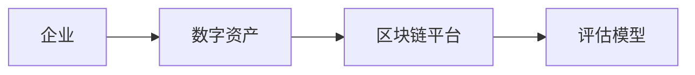
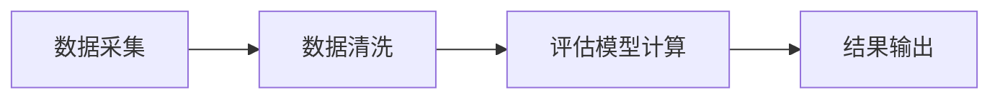

                 


# 企业估值中的区块链数字资产抵押贷款平台评估

> 关键词：企业估值、区块链、数字资产、抵押贷款、平台评估

> 摘要：本文详细探讨了区块链数字资产抵押贷款平台在企业估值中的应用。通过分析区块链技术的核心原理、数字资产的特点、评估算法的设计与实现，以及平台的系统架构，本文提出了一种基于区块链的数字资产抵押贷款平台评估方法。文章结合实际案例，详细解读了平台的实现过程，并总结了该平台在企业估值中的优势与挑战。

---

# 第一部分: 企业估值与区块链数字资产抵押贷款平台概述

## 第1章: 企业估值中的区块链数字资产抵押贷款平台背景

### 1.1 问题背景与描述

传统的企业估值方法依赖于财务报表分析、市场分析和行业趋势分析，但这些方法存在以下局限性：

- 数据不透明：企业财务数据可能存在虚假或 manipulative 的情况，导致估值结果偏差。
- 评估周期长：传统估值方法通常需要大量数据收集和分析，耗时较长，难以满足企业快速融资的需求。
- 资产流动性差：传统估值方法难以评估流动性差或非标淮资产的价值。

区块链技术的兴起为企业估值带来了新的可能性。区块链具有去中心化、不可篡改和透明性等特点，能够解决传统估值方法中的部分问题。数字资产作为区块链上的重要组成部分，具有高流动性、可分割性和可追踪性等特点，为抵押贷款提供了新的标的资产。

数字资产抵押贷款平台的目标是通过区块链技术，将数字资产作为抵押品，为企业提供快速、透明的贷款服务。该平台需要解决以下问题：

- 如何准确评估数字资产的价值？
- 如何确保数字资产的安全性？
- 如何设计合理的抵押贷款机制？

平台的边界包括数字资产的评估、抵押贷款的发放和还款机制，但不涉及具体的贷款资金分配。其适用场景主要包括中小企业融资、高价值数字资产抵押等领域，但不适用于传统金融资产的评估。

### 1.2 问题解决与边界

数字资产抵押贷款平台的核心目标是通过区块链技术，实现数字资产的快速评估和安全抵押，为企业提供高效的融资渠道。平台的边界包括：

- 数字资产的评估：平台需要能够准确评估数字资产的价值，确保贷款金额合理。
- 抵押贷款的发放：平台需要能够根据评估结果，发放相应的贷款。
- 还款机制：平台需要设计合理的还款机制，确保贷款的回收。

平台的适用场景包括：

- 中小企业的快速融资需求：中小企业通常难以通过传统渠道获得贷款，平台能够提供快速、便捷的融资服务。
- 高价值数字资产的抵押：数字资产的价值可能远超传统金融资产，平台能够支持高价值资产的抵押贷款。

### 1.3 概念结构与核心要素

平台的核心要素包括：

- 数字资产：平台需要支持多种数字资产，如比特币、以太坊等。
- 区块链平台：平台需要构建在区块链之上，确保数据的安全性和不可篡改性。
- 评估模型：平台需要设计合理的评估模型，准确评估数字资产的价值。

企业估值模型是基于数字资产的价值评估，通过分析企业的财务状况、市场表现和行业趋势等因素，综合评估企业的整体价值。数字资产评估框架则需要考虑数字资产的流动性、波动性和市场认可度等因素。

---

## 第2章: 核心概念与联系

### 2.1 区块链技术原理

区块链是一种去中心化的分布式账本技术，具有以下核心特征：

- 去中心化：数据由多个节点共同维护，不存在单点故障。
- 不可篡改：数据一旦写入区块链，无法被修改或删除。
- 透明性：区块链上的交易记录公开透明，可以被任何人查看。

区块链的共识机制包括工作量证明（PoW）、权益证明（PoS）和 delegated proof of stake（DPoS）等，确保数据的安全性和一致性。

### 2.2 数字资产的特点与分类

数字资产可以分为以下几类：

- 加密货币：如比特币、以太坊等，用于支付和价值转移。
- 代币：如ERC-20代币，用于特定应用场景的通证。
- NFTs：非同质化代币，用于表示独特的数字资产。

数字资产的特点包括：

- 高流动性：数字资产可以在交易所随时买卖，具有较高的流动性。
- 可分割性：数字资产可以被分割成小单位，便于交易和使用。
- 可追踪性：区块链上的交易记录可以被追踪，确保资产的来源和去向。

### 2.3 区块链与数字资产的关系

区块链是数字资产的底层技术，数字资产的发行、交易和转移都依赖于区块链平台。数字资产的评估需要考虑其在区块链上的表现，包括交易量、市场波动性和持有者分布等因素。

实体关系图展示了企业、数字资产和区块链平台之间的关系：



企业通过数字资产与区块链平台相连，区块链平台通过评估模型对企业价值进行评估。

---

## 第3章: 算法原理与数学模型

### 3.1 评估算法概述

评估算法的基本流程如下：

1. 数据采集：采集企业的财务数据、市场数据和区块链上的交易数据。
2. 数据清洗：对数据进行预处理，去除噪声数据。
3. 评估模型计算：通过数学模型计算数字资产的价值。
4. 结果输出：输出评估结果，供企业决策。

### 3.2 数学模型与公式

企业估值模型：

$$ V = \sum_{i=1}^{n} w_i \cdot a_i $$

其中，\( V \) 表示企业估值，\( w_i \) 表示第 \( i \) 个资产的权重，\( a_i \) 表示第 \( i \) 个资产的价值。

数字资产评估公式：

$$ S = \sum_{j=1}^{m} p_j \cdot v_j $$

其中，\( S \) 表示数字资产的总价值，\( p_j \) 表示第 \( j \) 个数字资产的价格，\( v_j \) 表示第 \( j \) 个数字资产的评估价值。

### 3.3 算法流程图



---

## 第4章: 系统分析与架构设计

### 4.1 系统功能设计

系统功能包括：

- 数字资产评估：平台需要能够评估数字资产的价值。
- 抵押贷款发放：平台需要能够根据评估结果发放贷款。
- 还款管理：平台需要管理贷款的还款过程。

### 4.2 系统架构设计

系统架构包括：

- 用户界面：供用户进行操作的界面。
- 评估模块：负责评估数字资产的价值。
- 区块链模块：负责与区块链平台的交互。
- 数据库：存储企业的财务数据和区块链上的交易数据。

### 4.3 系统接口设计

系统接口包括：

- 用户登录接口：用户通过此接口登录平台。
- 数字资产评估接口：用户通过此接口提交数字资产进行评估。
- 抵押贷款申请接口：用户通过此接口申请抵押贷款。

---

## 第5章: 项目实战

### 5.1 环境安装

安装必要的开发环境，包括区块链平台、数据库和开发工具。

### 5.2 核心代码实现

以下是数字资产评估模块的核心代码：

```python
def assess_asset(asset_data):
    # 计算资产价值
    value = sum(w * a for w, a in asset_data.items())
    return value
```

### 5.3 实际案例分析

以某企业为例，假设其持有价值100万美元的比特币。通过平台评估，比特币的价值为120万美元，因此企业可以申请100万美元的贷款。

---

## 第6章: 最佳实践与总结

### 6.1 最佳实践

- 确保区块链平台的安全性，防止黑客攻击。
- 定期更新评估模型，适应市场变化。
- 提供良好的用户界面，方便用户操作。

### 6.2 总结

本文详细探讨了区块链数字资产抵押贷款平台在企业估值中的应用。通过分析区块链技术的核心原理、数字资产的特点、评估算法的设计与实现，以及平台的系统架构，本文提出了一种基于区块链的数字资产抵押贷款平台评估方法。平台的优势在于其高效性、透明性和安全性，能够为企业提供快速的融资服务。

---

## 第7章: 注意事项与拓展阅读

### 7.1 注意事项

- 数字资产的价格波动较大，需谨慎评估。
- 平台的安全性是关键，需防范黑客攻击。
- 法律法规的合规性是平台运行的重要因素。

### 7.2 拓展阅读

- 《区块链技术入门与应用》
- 《数字资产与金融创新》
- 《企业估值方法与实践》

---

通过本文的分析，读者可以深入了解区块链数字资产抵押贷款平台在企业估值中的应用，为企业的融资和估值提供了新的思路和方法。

