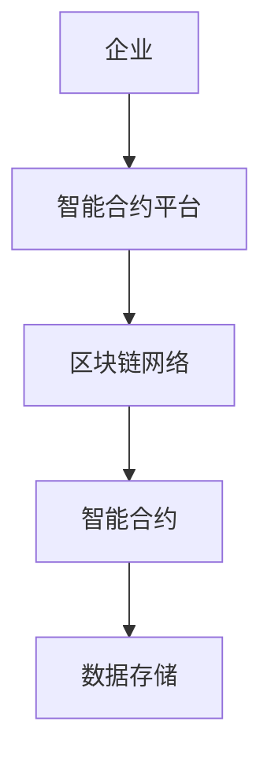
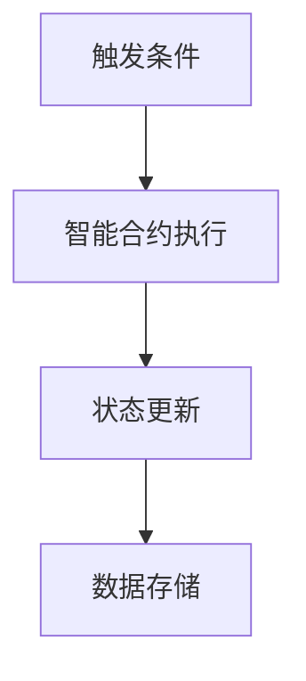
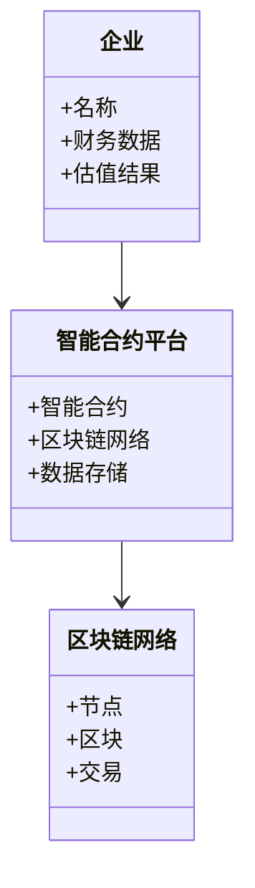

                 


# 企业估值中的区块链智能合约平台评估

> 关键词：企业估值、区块链、智能合约平台、评估方法、去中心化金融

> 摘要：随着区块链技术的快速发展，智能合约在企业估值中的应用逐渐成为关注的焦点。本文从区块链智能合约平台的核心概念出发，详细分析其在企业估值中的应用场景、评估指标和方法，结合实际案例和系统设计，为企业估值提供一种新的思路和解决方案。

---

## 第1章 区块链与智能合约平台的背景介绍

### 1.1 区块链技术的基本概念

区块链是一种分布式账本技术，通过去中心化的方式记录数据，确保数据的安全性和不可篡改性。智能合约是区块链技术的核心组件之一，它是一种自动执行的脚本，能够在区块链上自动执行预设的条件。

#### 1.1.1 区块链的定义与核心特性

区块链是一种去中心化的分布式数据库，具有以下核心特性：
- **去中心化**：数据不依赖于单一中心节点，而是分布在网络中的多个节点。
- **不可篡改性**：数据一旦写入区块链，无法被修改或删除。
- **透明性**：区块链上的数据对所有参与者公开可见。
- **安全性**：通过密码学算法确保数据的安全性。

#### 1.1.2 智能合约的定义与特点

智能合约是一种基于区块链的自动化程序，能够在满足特定条件时自动执行操作。其特点包括：
- **自动化**：智能合约能够在没有人工干预的情况下自动执行。
- **信任性**：通过区块链的去中心化特性，智能合约能够建立信任。
- **不可篡改性**：智能合约的代码和执行结果存储在区块链上，无法被篡改。

### 1.2 企业估值中的区块链应用背景

企业估值是企业在市场上的价值评估，传统的估值方法包括财务指标分析、市场比较法等。然而，这些方法存在数据不透明、人为干预较多等问题。

#### 1.2.1 企业估值的传统方法与挑战

传统企业估值方法存在以下挑战：
- 数据不透明：企业财务数据可能不公开或存在虚假信息。
- 人为干预：估值过程可能受到人为因素的影响，导致结果不准确。
- 成本高昂：传统估值方法需要大量的人力和时间。

#### 1.2.2 区块链技术在企业估值中的优势

区块链技术在企业估值中的优势包括：
- 数据透明：区块链上的数据不可篡改，能够提高估值的准确性。
- 自动化：智能合约可以自动执行估值逻辑，减少人为干预。
- 成本降低：区块链技术可以提高估值的效率，降低估值成本。

#### 1.2.3 智能合约平台在企业估值中的作用

智能合约平台在企业估值中的作用包括：
- 自动化估值：智能合约可以根据预设的逻辑自动计算企业的价值。
- 数据存储：智能合约可以将企业的财务数据存储在区块链上，确保数据的安全性和不可篡改性。
- 透明性：智能合约平台可以提供透明的估值过程，增加市场信任。

### 1.3 区块链智能合约平台的定义与核心要素

#### 1.3.1 平台的定义

区块链智能合约平台是一种基于区块链技术的平台，提供智能合约的开发、部署和执行环境。它能够支持企业估值相关的智能合约，实现自动化估值和数据存储。

#### 1.3.2 核心要素

区块链智能合约平台的核心要素包括：
- **区块链网络**：提供去中心化的数据存储和传输环境。
- **智能合约**：实现企业估值的自动化逻辑。
- **数据存储**：存储企业的财务数据和估值结果。
- **用户交互界面**：提供用户友好的操作界面，方便用户使用平台。

#### 1.3.3 平台的边界与外延

区块链智能合约平台的边界包括：
- **数据输入**：企业提供的财务数据和相关资料。
- **数据输出**：智能合约执行后的估值结果。
- **用户交互**：用户通过界面与平台进行交互。

平台的外延包括：
- **第三方服务**：如数据源、云服务等。
- **监管机构**：如金融监管机构，对平台进行监管和合规审查。

### 1.4 本章小结

本章介绍了区块链技术和智能合约的基本概念，分析了区块链技术在企业估值中的优势，以及智能合约平台在企业估值中的作用。通过定义区块链智能合约平台的核心要素和边界，为后续章节的分析奠定了基础。

---

## 第2章 智能合约平台评估的核心概念与联系

### 2.1 智能合约平台的评估指标

#### 2.1.1 技术指标

技术指标是评估智能合约平台性能的重要依据，包括：
- **安全性**：平台的安全性，防止黑客攻击和数据篡改。
- **可扩展性**：平台的扩展能力，能够处理大量的智能合约和数据。
- **去中心化程度**：平台的去中心化程度，确保数据的独立性和安全性。

#### 2.1.2 业务指标

业务指标是评估智能合约平台在企业估值中的实际应用效果，包括：
- **合约执行效率**：智能合约的执行速度和吞吐量。
- **数据准确性**：智能合约执行结果的准确性。
- **用户信任度**：用户对平台的信任程度。

#### 2.1.3 对比表格

以下是技术指标和业务指标的对比表格：

| 指标类型 | 技术指标 | 业务指标 |
|----------|----------|----------|
| 安全性 | 防篡改、防攻击 | 数据准确性 |
| 可扩展性 | 合约执行效率 | 用户信任度 |
| 去中心化程度 | 数据独立性 | 合约执行结果的可靠性 |

### 2.2 核心概念的原理与联系

#### 2.2.1 区块链智能合约的执行流程

智能合约的执行流程如下：

1. **触发条件**：智能合约的执行触发条件，如时间、事件等。
2. **合约执行**：智能合约根据预设的逻辑自动执行操作。
3. **状态更新**：智能合约执行后，更新区块链上的状态。
4. **数据存储**：智能合约的结果存储在区块链上。

#### 2.2.2 智能合约与企业估值的关系

智能合约在企业估值中的应用流程如下：

1. **数据输入**：企业将财务数据输入智能合约平台。
2. **合约执行**：智能合约根据预设的估值逻辑自动计算企业的价值。
3. **结果输出**：智能合约输出估值结果，供用户查看和使用。

### 2.3 智能合约平台的ER实体关系图

以下是智能合约平台的ER实体关系图：



### 2.4 本章小结

本章详细分析了智能合约平台的评估指标，包括技术指标和业务指标，并通过对比表格和ER实体关系图展示了核心概念的原理与联系。这为后续章节的系统设计和项目实战奠定了基础。

---

## 第3章 区块链智能合约平台评估的算法原理

### 3.1 智能合约执行的算法流程

智能合约的执行流程如下：

1. **触发条件**：智能合约的执行触发条件，如时间、事件等。
2. **合约执行**：智能合约根据预设的逻辑自动执行操作。
3. **状态更新**：智能合约执行后，更新区块链上的状态。
4. **数据存储**：智能合约的结果存储在区块链上。

#### 3.1.1 mermaid流程图

以下是智能合约执行的流程图：



### 3.2 算法实现的数学模型

智能合约的执行时间可以通过以下公式计算：

$$ \text{智能合约执行时间} = \frac{\text{合约复杂度} \times \text{网络负载}}{\text{节点处理能力}} $$

其中：
- 合约复杂度：智能合约的复杂程度，越复杂，执行时间越长。
- 网络负载：区块链网络的负载情况，负载越高，执行时间越长。
- 节点处理能力：区块链节点的处理能力，节点处理能力越强，执行时间越短。

### 3.3 算法实现的Python代码示例

以下是一个简单的智能合约执行时间计算的Python代码示例：

```python
def smart_contract_execution(contract_complexity, network_load, node_capacity):
    execution_time = (contract_complexity * network_load) / node_capacity
    return execution_time

# 示例参数
contract_complexity = 5
network_load = 80
node_capacity = 10

# 计算执行时间
execution_time = smart_contract_execution(contract_complexity, network_load, node_capacity)
print(f"智能合约执行时间: {execution_time} 秒")
```

### 3.4 本章小结

本章详细讲解了智能合约执行的算法原理，包括流程图和数学模型，并通过Python代码示例展示了算法的实现。这为后续章节的系统设计和项目实战提供了理论基础。

---

## 第4章 区块链智能合约平台评估的系统分析与架构设计

### 4.1 系统功能设计

#### 4.1.1 领域模型

以下是智能合约平台的领域模型：



#### 4.1.2 系统架构设计

以下是智能合约平台的系统架构图：


### 4.2 系统接口设计

智能合约平台的主要接口包括：
- **数据输入接口**：企业通过此接口将财务数据输入平台。
- **合约执行接口**：用户通过此接口触发智能合约的执行。
- **结果输出接口**：平台通过此接口输出智能合约的执行结果。

### 4.3 系统交互设计

以下是智能合约平台的系统交互图：


### 4.4 本章小结

本章详细分析了智能合约平台的系统功能设计、架构设计和接口设计，为后续章节的项目实战提供了系统设计依据。

---

## 第5章 区块链智能合约平台评估的项目实战

### 5.1 环境安装

以下是智能合约平台的环境安装步骤：
1. 安装区块链平台（如以太坊、Hyperledger等）。
2. 安装智能合约开发工具（如Solidity、Web3.py等）。
3. 配置开发环境（如Python、Node.js等）。

### 5.2 核心实现源代码

以下是智能合约平台的核心实现代码：

```python
from web3 import Web3, HTTPProvider
from web3.contract import Contract

# 初始化区块链节点
w3 = Web3(HTTPProvider("http://localhost:8545"))

# 定义智能合约地址
contract_address = "0x123456789abcde"

# 加载智能合约ABI
abi = [
    {"constant": true, "inputs": [], "name": "get_value", "type": "function"},
    # 其他ABI定义
]

# 创建智能合约对象
contract = w3.eth.contract(contract_address, abi=abi)

# 调用智能合约方法
def get_contract_value():
    value = contract.functions.get_value().call()
    return value

# 示例调用
print(get_contract_value())
```

### 5.3 实际案例分析

以下是智能合约平台的实际案例分析：
1. **数据输入**：企业将财务数据输入智能合约平台。
2. **合约执行**：智能合约根据预设的逻辑自动计算企业的价值。
3. **结果输出**：智能合约输出估值结果，供用户查看和使用。

### 5.4 本章小结

本章通过实际案例展示了智能合约平台的核心实现和项目实战，帮助读者更好地理解和应用区块链智能合约平台在企业估值中的应用。

---

## 第6章 总结与展望

### 6.1 总结

区块链智能合约平台在企业估值中的应用具有重要意义。通过自动化估值和数据存储，智能合约平台能够提高企业估值的准确性和效率，降低估值成本。

### 6.2 展望

未来，随着区块链技术的不断发展，智能合约平台在企业估值中的应用将更加广泛。可以通过优化智能合约的执行效率和扩展性，进一步提高平台的性能和应用范围。

### 6.3 最佳实践 Tips

1. 在选择智能合约平台时，应综合考虑其安全性、可扩展性和去中心化程度。
2. 在实现智能合约时，应确保合约逻辑的准确性和可执行性。
3. 在使用智能合约平台时，应遵循相关法律法规，确保合规性。

### 6.4 本章小结

本章总结了区块链智能合约平台在企业估值中的应用，展望了其未来的发展，并提出了最佳实践的建议。

---

# 结语

区块链智能合约平台在企业估值中的应用为企业估值提供了新的思路和解决方案。通过自动化估值和数据存储，智能合约平台能够提高企业估值的准确性和效率，降低估值成本。未来，随着区块链技术的不断发展，智能合约平台在企业估值中的应用将更加广泛和深入。

---

