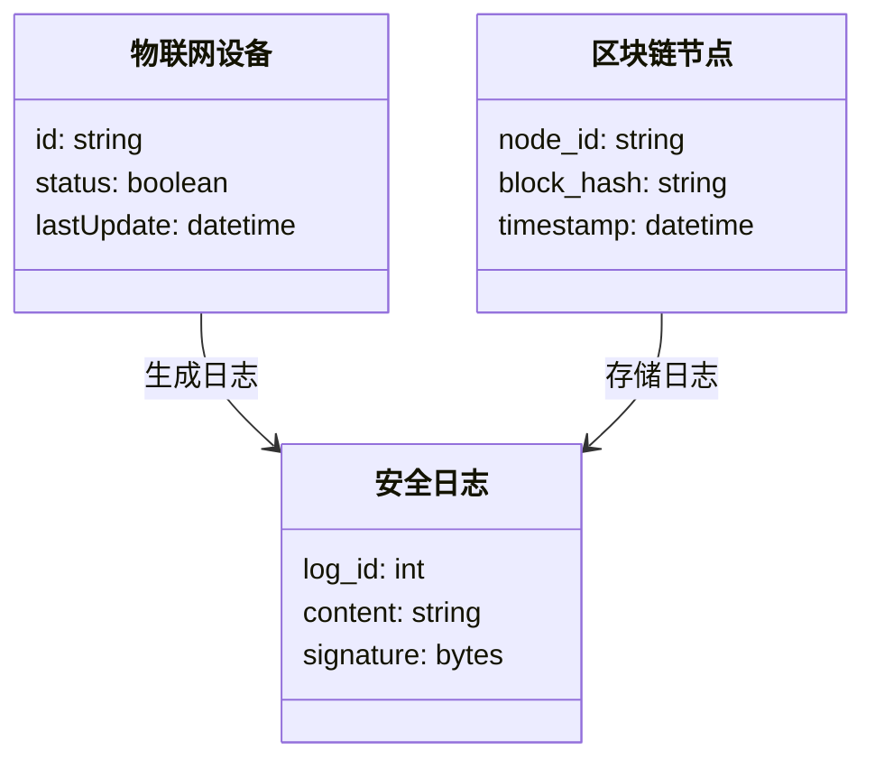
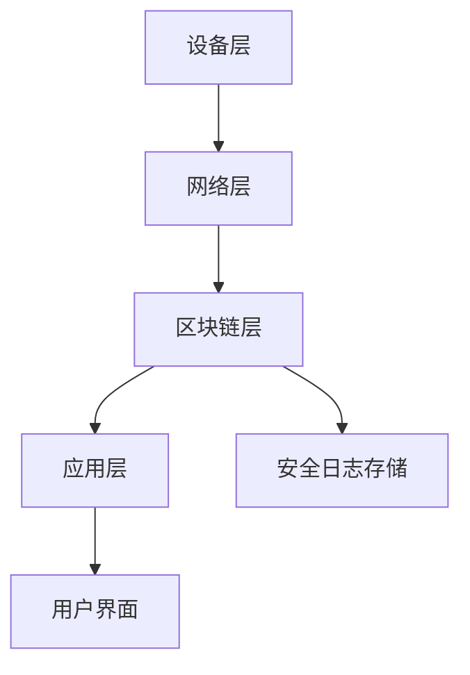

                 


# 《企业估值中的区块链物联网安全平台评估》

## 文章关键词：
- 企业估值
- 区块链
- 物联网
- 安全平台
- 技术评估

## 摘要：
本文详细探讨了在企业估值过程中，如何评估基于区块链的物联网安全平台的价值。通过分析区块链与物联网技术的结合，阐述了安全平台的核心概念、算法原理、系统架构以及实际应用案例。文章结合理论与实践，提供了从环境搭建到代码实现的完整指南，并展望了未来的发展方向。

---

# 第1章: 引言

## 1.1 本书的目的与意义
- **企业估值的重要性**：企业在市场中的价值评估是投资者决策的关键因素。
- **区块链与物联网技术的融合**：区块链的去中心化和不可篡改特性与物联网的安全需求完美结合。
- **安全平台评估的必要性**：保障物联网数据安全，提升企业信任度。

## 1.2 本书的结构与内容
- 各章节安排：从概念到技术，再到实战。
- 阅读建议：适合技术人员和企业管理人员阅读。

## 1.3 本章小结
本章介绍了文章的背景、目的和结构，为后续章节打下基础。

---

# 第2章: 企业估值与区块链物联网安全平台的背景介绍

## 2.1 企业估值的基本概念
- **定义**：企业估值是通过财务指标和市场分析确定企业价值的过程。
- **方法与模型**：包括DCF模型、EV/EBITDA等。
- **影响因素**：财务表现、市场地位、技术创新等。

## 2.2 区块链技术的简介
- **区块链的基本概念**：分布式账本技术，确保数据不可篡改。
- **核心特点**：去中心化、透明性、不可篡改。
- **应用领域**：金融、供应链、医疗等。

## 2.3 物联网安全的基本概念
- **物联网的定义**：连接设备的网络，实现数据的实时交换。
- **安全挑战**：设备被 hacking、数据泄露等。
- **重要性**：保护设备和数据安全，避免损失。

## 2.4 区块链与物联网的结合
- **区块链在物联网中的应用**：数据存储、身份认证。
- **区块链与物联网安全的关系**：区块链提升物联网的安全性。
- **平台的背景**：为解决物联网安全问题而开发。

## 2.5 本章小结
本章介绍了企业估值、区块链和物联网的基本概念及其相互关系，为后续分析打下基础。

---

# 第3章: 区块链物联网安全平台的核心概念与联系

## 3.1 平台的定义与结构
- **定义**：整合区块链技术的物联网安全解决方案。
- **结构**：设备层、网络层、区块链层、应用层。

## 3.2 核心概念的属性对比
| 特性    | 区块链    | 物联网    | 平台结合  |
|---------|-----------|-----------|-----------|
| 数据存储| 分布式    | 分散      | 集中与分散结合 |
| 安全性   | 高        | 低        | 极高       |
| 可扩展性| 中        | 高        | 优化       |

## 3.3 ER实体关系图架构
```mermaid
erd
    entity 区块链节点
    entity 物联网设备
    entity 用户
    entity 安全日志
    区块链节点 -->> 安全日志: 存储
    物联网设备 -->> 安全日志: 生成
    用户 -->> 区块链节点: 验证
```

## 3.4 本章小结
本章通过定义、属性对比和ER图分析，明确了区块链物联网安全平台的核心结构和关系。

---

# 第4章: 区块链物联网安全平台的算法原理讲解

## 4.1 区块链的核心算法
### 4.1.1 共识算法
- **工作量证明（PoW）**：通过计算解决数学难题来验证区块。
  ```mermaid
  graph TD
      A[开始] --> B[计算随机数] --> C[寻找符合条件的哈希值] --> D[验证通过] --> E[区块加入区块链]
  ```

### 4.1.2 加密算法
- **椭圆曲线加密（ECC）**：用于数字签名。
  ```python
  import hashlib
  def generate_signature(data):
      private_key = ...  # 秘钥
      public_key = ...   # 公钥
      signature = ...    # 签名
      return signature
  ```

### 4.1.3 智能合约
- **智能合约实现**：自动执行预定义的条件。
  ```solidity
  // Solidity代码示例
  contract SecurityContract {
      function verifySignature(bytes memory _signature) external returns (bool) {
          // 验证签名逻辑
          return true;
      }
  }
  ```

## 4.2 物联网安全的算法
### 4.2.1 数据加密
- **AES加密**：用于设备数据加密。
  ```python
  from cryptography.fernet import Fernet
  key = Fernet.generate_key()
  cipher = Fernet(key)
  encrypted_data = cipher.encrypt(b"敏感数据")
  ```

### 4.2.2 身份认证
- **OAuth2.0**：第三方认证协议。
  ```mermaid
  graph TD
      A[用户] --> B[设备] --> C[认证服务器] --> D[返回Token] --> E[访问受保护资源]
  ```

## 4.3 区块链与物联网结合的算法
### 4.3.1 数据上链流程
- **数据哈希化**：将物联网数据哈希后存储在区块链上。
  ```python
  def hash_data(data):
      return hashlib.sha256(data.encode()).hexdigest()
  ```

## 4.4 本章小结
本章详细讲解了区块链和物联网安全的核心算法，并展示了它们的结合应用。

---

# 第5章: 区块链物联网安全平台的系统分析与架构设计方案

## 5.1 项目场景介绍
- **问题场景**：物联网设备数据易被篡改，企业估值受影响。
- **解决方案**：通过区块链确保数据真实性和安全性。

## 5.2 系统功能设计
### 5.2.1 领域模型


### 5.2.2 系统架构设计


### 5.2.3 接口设计
- **API接口**：
  - `/api/device/status`：获取设备状态。
  - `/api/blockchain/hash`：获取区块哈希。

### 5.2.4 交互序列图
```mermaid
sequenceDiagram
    用户 -> 设备层: 请求设备状态
    设备层 -> 网络层: 发送数据
    网络层 -> 区块链层: 存储数据
    区块链层 -> 应用层: 返回确认
    用户 <- 应用层: 显示状态
```

## 5.3 本章小结
本章通过系统分析和架构设计，展示了区块链物联网安全平台的实现方案。

---

# 第6章: 区块链物联网安全平台的项目实战

## 6.1 环境安装
- **Python环境**：安装Python 3.8+。
- **依赖安装**：使用pip安装必要的库，如`cryptography`、`web3.py`。

## 6.2 核心代码实现
### 6.2.1 设备数据采集
```python
import serial

def read_device_data(port):
    ser = serial.Serial(port, 9600)
    data = ser.readline().decode()
    ser.close()
    return data
```

### 6.2.2 区块链数据存储
```python
from web3 import Web3

def store_data_on_blockchain(web3, contract, data):
    hashed_data = contract.functions.hashData(data).call()
    receipt = contract.functions.storeData(hashed_data).transact()
    return receipt
```

### 6.2.3 安全日志生成
```python
from datetime import datetime

def generate_security_log(action, data):
    log = {
        'timestamp': datetime.now().isoformat(),
        'action': action,
        'data': data
    }
    return log
```

## 6.3 案例分析与详细解读
- **案例背景**：某制造企业设备数据被篡改，导致估值下降。
- **实施步骤**：部署平台，实时监测设备数据，存储区块链上。
- **结果**：数据安全提升，企业估值增加。

## 6.4 本章小结
本章通过实战案例，展示了平台的安装、实现和应用效果。

---

# 第7章: 结论与未来展望

## 7.1 结论
- 区块链物联网安全平台在企业估值中的作用显著。
- 技术与业务结合，提升企业信任度和估值。

## 7.2 未来展望
- 技术优化：提高算法效率，降低成本。
- 应用扩展：探索更多行业应用。
- 结合AI：利用人工智能提升安全监测能力。

## 7.3 最佳实践 tips
- 选择合适的区块链平台。
- 定期进行安全演练。
- 培训相关人员。

## 7.4 小结
本章总结了平台的价值，并展望了未来发展方向。

---

通过以上内容，文章系统地介绍了区块链物联网安全平台的各个方面，从概念到技术，再到实际应用，为读者提供了全面的知识和指导。

