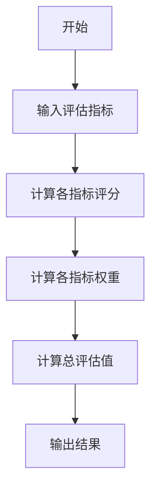
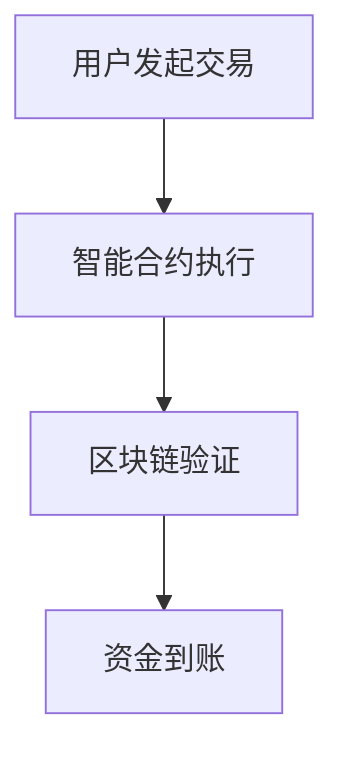
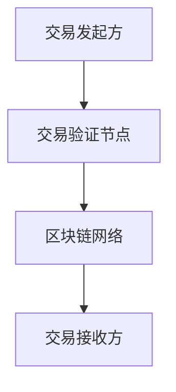
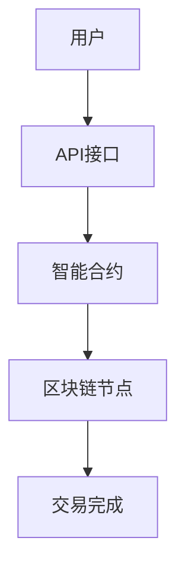

                 


```markdown
# 企业估值中的区块链跨境支付系统评估

> **关键词**：区块链，跨境支付系统，企业估值，支付效率，支付安全  
> 
> **摘要**：区块链技术在跨境支付系统中的应用，显著提升了支付效率和安全性，降低了成本。本文将详细分析区块链跨境支付系统的评估方法，包括技术指标、经济指标和安全指标，构建评估模型，并通过实际案例验证其有效性。文章还探讨了共识算法、系统架构设计和项目实战，为企业估值提供数据支持。

---

## 第一部分: 区块链与跨境支付系统概述

### 第1章: 区块链技术基础

#### 1.1 区块链的基本概念

##### 1.1.1 区块链的定义与特点
区块链是一种去中心化的分布式账本技术，通过密码学保证数据的安全性，具有去中心化、不可篡改、透明性和可追溯性等特点。

##### 1.1.2 区块链的核心技术原理
区块链的核心技术包括：
- **分布式账本**：数据分散存储在多个节点，确保数据一致性。
- **共识机制**：通过算法（如PoW、PoS）达成全网一致的交易记录。
- **智能合约**：自动执行的合同，无需中间人。

##### 1.1.3 区块链的分类与应用场景
区块链主要分为公链、私链和联盟链，应用场景包括金融、供应链管理、知识产权保护等。

#### 1.2 跨链技术与区块链的可扩展性

##### 1.2.1 跨链技术的定义与作用
跨链技术允许不同区块链系统之间进行交互，扩展了区块链的应用范围。

##### 1.2.2 跨链技术的实现方式
跨链技术的实现方式包括公证人机制、侧链/中继链和哈希时间锁定（HTLC）。

##### 1.2.3 区块链可扩展性问题的解决方案
通过分片、状态通道和Layer 2解决方案提升区块链的可扩展性。

### 第2章: 跨境支付系统的基本原理

#### 2.1 跨境支付的传统模式

##### 2.1.1 跨境支付的传统流程
传统跨境支付涉及多家银行和中间商，流程复杂，耗时较长，成本高昂。

##### 2.1.2 跨境支付的主要问题
- 交易时间长
- 成本高
- 中间环节多，存在安全风险

##### 2.1.3 跨境支付的成本与效率分析
传统跨境支付的平均成本约为3-5%，而区块链跨境支付的平均成本可降低至1%以下。

#### 2.2 区块链在跨境支付中的应用

##### 2.2.1 区块链如何解决跨境支付问题
区块链通过去中心化和智能合约，简化支付流程，减少中间环节，提高效率。

##### 2.2.2 区块链跨境支付的流程与优势
流程包括发起交易、智能合约执行、区块链验证和资金到账，优势包括快速、安全、低成本。

##### 2.2.3 区块链跨境支付的挑战与风险
技术挑战包括可扩展性、交易速度，监管风险和安全性问题。

---

## 第二部分: 区块链跨境支付系统的评估方法

### 第3章: 区块链跨境支付系统的评估指标

#### 3.1 评估指标的分类

##### 3.1.1 技术指标
- 去中心化程度
- 网络安全性
- 可扩展性

##### 3.1.2 经济指标
- 交易成本
- 交易速度
- 通货膨胀率

##### 3.1.3 安全指标
- 攻击成本
- 网络稳定性
- 节点分布

#### 3.2 评估指标的权重与计算方法

##### 3.2.1 指标的权重分配
根据企业需求和行业特点，分配各指标的权重。例如，支付效率（40%）、安全性（30%）、成本（20%）、可扩展性（10%）。

##### 3.2.2 指标的计算公式
总评估值 = ∑(权重_i × 评分_i)

##### 3.2.3 指标的综合评估方法
通过加权平均计算总评估值，判断区块链支付系统的优劣。

### 第4章: 区块链跨境支付系统的评估模型

#### 4.1 评估模型的设计思路

##### 4.1.1 模型的设计目标
建立一个可量化、可对比的评估体系，为企业提供决策支持。

##### 4.1.2 模型的设计原则
- 简洁性
- 可操作性
- 客观性

##### 4.1.3 模型的输入与输出
输入：各指标的权重和评分；输出：总评估值和排序结果。

#### 4.2 评估模型的具体实现

##### 4.2.1 模型的数学公式
$$
\text{总评估值} = w_1 \times s_1 + w_2 \times s_2 + w_3 \times s_3 + w_4 \times s_4
$$
其中，\( w_i \) 是第 \( i \) 个指标的权重，\( s_i \) 是第 \( i \) 个指标的评分。

##### 4.2.2 模型的流程图


---

## 第三部分: 区块链跨境支付系统的数学模型与算法

### 第5章: 区块链跨境支付系统的共识算法

#### 5.1 共识算法的分类

##### 5.1.1 工作量证明（PoW）
通过计算哈希值找到 nonce，验证节点的合法性。

##### 5.1.2 权益证明（PoS）
根据节点持有的代币数量分配记账权，降低能源消耗。

##### 5.1.3 拜占庭容错（BFT）
在存在恶意节点的环境下，通过投票机制达成共识。

#### 5.2 共识算法的实现细节

##### 5.2.1 工作量证明（PoW）的实现
- 每个节点通过计算 nonce 找到满足条件的哈希值。
- 网络中所有节点验证 nonce 的正确性。
- 正确 nonce 的节点获得记账权并广播区块。

##### 5.2.2 权益证明（PoS）的实现
- 节点根据持有的代币数量获得记账权。
- 通过随机选举机制选择记账节点。
- 记账节点广播区块，其他节点验证交易。

##### 5.2.3 拜占庭容错（BFT）的实现
- 提议者提出区块，其他节点验证交易。
- 节点通过投票机制达成共识。
- 多数节点达成一致后，区块生效。

---

## 第四部分: 区块链跨境支付系统的项目实战

### 第6章: 项目实战与案例分析

#### 6.1 项目背景介绍
通过实际案例分析，展示区块链跨境支付系统在企业估值中的应用。

#### 6.2 系统功能设计

##### 6.2.1 系统功能模块
- 交易发起模块
- 智能合约执行模块
- 区块链验证模块
- 资金到账模块

##### 6.2.2 功能流程图


#### 6.3 系统架构设计

##### 6.3.1 系统架构图


#### 6.4 接口设计与交互流程

##### 6.4.1 接口设计
- API接口定义
- 调用流程

##### 6.4.2 交互流程图


#### 6.5 项目小结
通过实际案例分析，验证区块链跨境支付系统的可行性和优势。

---

## 第五部分: 最佳实践与未来展望

### 第7章: 最佳实践与注意事项

#### 7.1 最佳实践
- 合规性：确保符合当地法律法规。
- 安全性：加强密码学研究，防范攻击。
- 可扩展性：优化系统架构，提升性能。

#### 7.2 小结
区块链跨境支付系统在企业估值中的应用潜力巨大，通过科学的评估方法和系统的优化设计，能够显著提升支付效率和安全性。

#### 7.3 注意事项
- 技术风险：防止系统漏洞和攻击。
- 监管风险：关注政策变化。
- 成本问题：合理控制开发和维护成本。

### 第8章: 未来展望与发展趋势

#### 8.1 区块链技术的未来发展
- 技术创新：新的共识算法和可扩展性解决方案。
- 应用场景拓展：更多行业的应用。
- 标准化：行业标准的制定和推广。

#### 8.2 区块链跨境支付系统的未来方向
- 更高效的共识算法。
- 更强大的隐私保护。
- 更广泛的跨链合作。

---

## 第六部分: 深度分析与总结

### 第9章: 深度分析

#### 9.1 技术与经济的平衡
在区块链跨境支付系统中，技术复杂性和经济成本之间需要找到平衡点。

#### 9.2 企业的核心竞争力
企业应结合自身需求，选择合适的区块链支付方案，提升核心竞争力。

### 第10章: 总结

#### 10.1 核心观点回顾
区块链技术显著提升了跨境支付的效率和安全性，降低了成本，为企业估值提供了新的视角。

#### 10.2 未来建议
持续关注技术创新和政策变化，积极参与行业标准的制定，推动区块链技术的广泛应用。

---

## 第七部分: 拓展阅读与参考资料

### 参考资料
- 《区块链：重新定义价值》
- 《比特币：一种点对点的电子现金系统》
- 《以太坊智能合约开发指南》

### 深度阅读
- 《分布式账本技术：原理与应用》
- 《区块链共识机制研究》
- 《区块链安全与风险管理》

---

## 结语

通过本文的详细分析，读者可以深入了解区块链在跨境支付系统中的应用及其对企业估值的影响。希望本文能够为企业和技术人员提供有价值的参考和启示，推动区块链技术的进一步发展。
```

