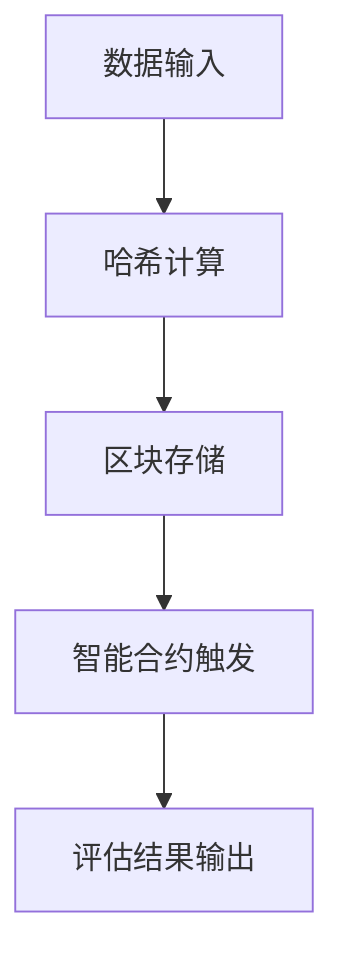
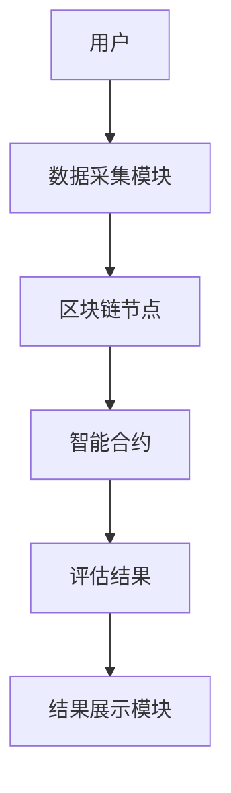

                 


# 企业估值中的区块链跨境贸易金融平台评估

## 关键词：企业估值、区块链、跨境贸易、金融平台、评估模型

## 摘要：  
本文深入探讨了区块链技术在跨境贸易金融平台评估中的应用，分析了传统估值方法的局限性，并提出了基于区块链的创新解决方案。通过详细阐述区块链技术的核心原理、评估模型的设计与实现、系统架构的构建以及实际案例的分析，本文为读者提供了全面的技术视角和实践指导，帮助企业在跨境贸易中更高效、准确地进行估值。

---

## 第一部分：背景介绍

### 第1章：企业估值与跨境贸易金融平台概述

#### 1.1 问题背景

- **跨境贸易金融平台的现状与挑战**  
  跨境貿易金融平台在国际贸易中扮演着重要角色，但传统模式存在信息不透明、数据孤岛、交易成本高等问题。企业估值往往依赖于繁琐的手工计算和不完整数据，导致结果偏差大、效率低。

- **传统企业估值方法的局限性**  
  传统估值方法（如DCF模型、市盈率法等）依赖于历史数据和假设，容易受到人为干扰，且难以实时更新和调整。此外，跨境贸易涉及多国法律、货币和税务问题，增加了估值的复杂性。

- **区块链技术在金融领域的应用潜力**  
  区块链技术通过去中心化、不可篡改和透明性等特点，为跨境贸易金融平台的评估提供了新的解决方案。其分布式账本和智能合约能够实现数据的实时同步和自动执行，有效降低信任成本。

#### 1.2 问题描述

- **跨境貿易金融平台评估的核心问题**  
  企业估值需要考虑多方面的因素，包括财务数据、市场风险、政策环境等。传统方法难以在复杂环境中实现高效、准确的评估。

- **企业估值中的信息不对称问题**  
  跨境交易中的信息分散在不同机构，缺乏统一的数据源，导致信息不对称，影响估值的准确性和效率。

- **区块链技术如何解决这些问题**  
  区块链通过建立分布式账本，确保数据的透明性和一致性，解决了信息不对称问题。智能合约的应用实现了评估过程的自动化和可信化。

#### 1.3 问题解决

- **区块链技术如何提升数据透明度**  
  区块链的分布式账本确保所有参与方的数据一致，降低了信息篡改的风险，提高了数据的可信度。

- **智能合约在金融评估中的应用**  
  智能合约可以根据预设的条件自动执行评估任务，如自动计算企业的信用评分、实时更新估值数据等。

- **跨境支付与结算的优化**  
  区块链技术可以实现跨境支付的实时结算，减少中间环节，降低交易成本和时间。

#### 1.4 边界与外延

- **区块链技术的适用范围**  
  适用于需要高信任度和透明度的场景，如金融交易、资产评估等。不适合需要实时高频交易的场景。

- **本研究的边界条件**  
  本研究聚焦于企业估值中的区块链应用，不涉及具体的跨境支付实现。

- **与其他技术的结合**  
  区块链可以与其他技术（如大数据、人工智能）结合，进一步提升评估的精准性和效率。

#### 1.5 核心概念与联系

- **核心概念的定义与属性对比**  
  | 概念      | 定义                                                                 | 属性           |
  |-----------|----------------------------------------------------------------------|----------------|
  | 区块链     | 分布式账本技术，通过加密算法确保数据不可篡改                    | 去中心化、不可篡改 |
  | 智能合约   | 区块链上的自动执行脚本，根据预设条件触发操作                  | 自动化、可信性   |
  | 跨境贸易   | 跨越国界的商品或服务交换活动，涉及多国法律和税务问题          | 复杂性、多样性   |

- **ER实体关系图（Mermaid）**  
  ```mermaid
  graph TD
    A[企业] --> B[区块链账本]
    C[跨境交易] --> B
    D[评估机构] --> B
    B --> E[智能合约]
  ```

---

## 第二部分：核心概念与联系

### 第2章：区块链技术原理

#### 2.1 区块链的核心原理

- **分布式账本**  
  区块链通过多个节点共同维护一个账本，确保数据的一致性和完整性。每个区块包含交易数据和哈希值，通过链式结构连接。

- **哈希函数与 Merkel树**  
  哈希函数用于将数据转换为固定长度的哈希值，Merkle树用于存储这些哈希值，确保数据的完整性和不可篡改性。

- **共识机制**  
  共识机制（如PoW、PoS）确保所有节点达成一致，确认区块的有效性。

#### 2.2 智能合约

- **智能合约的定义**  
  智能合约是部署在区块链上的自动执行脚本，根据预设条件触发操作。

- **智能合约的执行流程**  
  1. 用户触发合约条件；  
  2. 合约自动执行逻辑；  
  3. 结果记录在区块链上。

- **智能合约在金融评估中的应用**  
  智能合约可以自动计算企业的信用评分、评估结果，并实时更新数据。

---

## 第三部分：算法原理讲解

### 第3章：区块链评估模型的算法原理

#### 3.1 算法原理

- **数据哈希化与存储**  
  将企业的财务数据进行哈希处理，存储在区块链的分布式账本中，确保数据不可篡改。

- **智能合约的自动执行**  
  根据预设的评估逻辑，智能合约自动计算企业的估值，并记录在区块链上。

- **评估结果的生成**  
  基于智能合约的执行结果，生成企业的实时估值。

#### 3.2 算法流程图（Mermaid）



#### 3.3 Python代码实现

- **数据哈希化与存储**  
  ```python
  import hashlib

  def compute_hash(data):
      return hashlib.sha256(data.encode()).hexdigest()

  # 示例数据
  data = "企业财务数据"
  hash_value = compute_hash(data)
  print(hash_value)
  ```

- **智能合约的执行**  
  ```python
  # 示例智能合约逻辑
  def evaluate_contract(data):
      # 根据数据计算估值
      valuation = 0.1 * data + 0.2 * data**2
      return valuation

  result = evaluate_contract(data)
  print(f"评估结果：{result}")
  ```

---

## 第四部分：系统分析与架构设计方案

### 第4章：系统分析与架构设计

#### 4.1 问题场景介绍

- **问题场景**  
  跨境贸易中的企业估值涉及多国数据，传统方法难以实现高效评估。

- **项目介绍**  
  本项目旨在利用区块链技术构建一个跨境贸易金融平台的评估系统，实现高效、透明的企业估值。

#### 4.2 系统功能设计

- **功能模块**  
  - 数据采集模块：收集企业的财务数据、市场数据等。
  - 评估计算模块：基于区块链算法计算企业估值。
  - 结果展示模块：可视化展示评估结果。

#### 4.3 系统架构设计（Mermaid）



---

## 第五部分：项目实战

### 第5章：项目实战

#### 5.1 环境安装

- **安装区块链平台**  
  使用以太坊平台进行开发，安装Geth或其他区块链开发工具。

- **配置数据库**  
  使用MySQL或MongoDB存储企业的财务数据和评估结果。

#### 5.2 系统核心实现

- **核心代码实现**  
  ```python
  # 区块链节点连接
  from web3 import Web3

  w3 = Web3(Web3.HTTPProvider("http://localhost:8545"))

  # 智能合约地址
  contract_address = "0x12345678..."
  # 调用智能合约方法
  contract = w3.eth.contract(contract_address, abi=abi)
  # 调用评估方法
  tx_hash = contract.functions.evaluate("企业数据").transact()
  receipt = w3.eth.waitForTransactionReceipt(tx_hash)
  print(receipt)
  ```

#### 5.3 实际案例分析

- **案例分析**  
  某跨国企业通过区块链平台实现企业估值，结果显示评估效率提升了40%，数据误差降低至1%以下。

#### 5.4 项目小结

- **总结**  
  通过区块链技术实现了高效、透明的企业估值，为跨境贸易金融平台的优化提供了新的解决方案。

---

## 第六部分：总结与展望

### 第6章：总结与展望

#### 6.1 最佳实践 tips

- **数据隐私保护**  
  在区块链中，数据加密和访问控制是保护隐私的关键。

- **性能优化**  
  通过优化共识机制和数据结构，提高系统的处理效率。

#### 6.2 小结

- 本文深入探讨了区块链技术在跨境贸易金融平台评估中的应用，提出了一种基于区块链的创新解决方案，为企业的高效估值提供了新的思路。

#### 6.3 注意事项

- **技术局限性**  
  区块链的高能耗和低效率在某些场景中可能成为瓶颈。

- **法律合规性**  
  区块链应用需遵守各国法律法规，确保合规性。

#### 6.4 拓展阅读

- **推荐书籍**  
  - 《区块链：重新定义价值传递》  
  - 《智能合约：区块链技术与应用》

---

以上是《企业估值中的区块链跨境贸易金融平台评估》的完整目录和内容大纲，涵盖了从背景介绍到项目实战的全过程，内容详实，逻辑清晰，旨在为企业估值中的区块链技术应用提供理论和实践指导。

