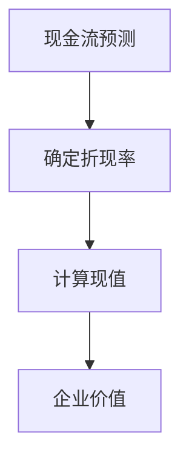
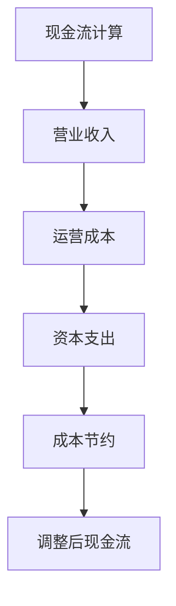
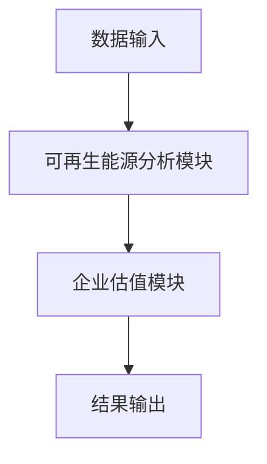

                 


# 企业估值中的可再生能源使用分析

## 关键词：企业估值，可再生能源，现金流，DCF模型，绿色债券，风险管理

## 摘要：在企业估值过程中，可再生能源的使用已成为影响企业价值的重要因素。本文从企业估值的传统方法出发，分析可再生能源对现金流、风险管理和市场竞争力的影响，并详细阐述如何将可再生能源因素纳入企业估值模型。通过实际案例和系统架构设计，本文为读者提供可操作的分析框架和方法。

---

## 第一章：企业估值的传统方法

### 1.1 股权自由现金流模型（DCF）

#### 1.1.1 DCF模型的基本原理

DCF（Discounted Cash Flow）模型是企业估值的核心方法之一。其基本原理是通过预测企业未来现金流，并将其折现到当前价值，以确定企业的内在价值。

$$ \text{企业价值} = \sum_{t=1}^{n} \frac{\text{现金流}_t}{(1 + r)^t} $$

其中，$r$ 是折现率，$t$ 是时间单位。

#### 1.1.2 DCF模型的步骤

1. 预测未来现金流：根据企业的历史数据和行业趋势，预测未来各期的现金流。
2. 确定折现率：通常使用加权平均资本成本（WACC）作为折现率。
3. 计算现值：将各期现金流折现并求和，得到企业价值。



### 1.2 可再生能源在企业运营中的作用

#### 1.2.1 可再生能源的定义与分类

可再生能源是指来源于自然界的能源，包括太阳能、风能、水能、生物质能等。与传统能源相比，可再生能源具有清洁、可持续的特点。

---

## 第二章：可再生能源对企业发展的影响

### 2.1 可再生能源对现金流的影响

#### 2.1.1 初始成本与长期节约

可再生能源项目通常需要较高的初始投资，但其运营成本较低，且可以享受政府补贴和税收优惠。

#### 2.1.2 政府补贴与税收优惠

许多国家和地区提供可再生能源补贴、税收抵免等优惠政策，降低了企业的财务负担。

#### 2.1.3 长期成本节约

通过使用可再生能源，企业可以降低能源消耗成本，减少对传统能源的依赖。

---

## 第三章：可再生能源在企业估值中的核心概念

### 3.1 调整后的DCF模型

#### 3.1.1 现金流的计算公式

$$ \text{调整后的现金流} = \text{营业收入} - \text{运营成本} - \text{资本支出} + \text{可再生能源带来的成本节约} $$

#### 3.1.2 调整步骤



### 3.2 绿色债券与可再生能源融资

#### 3.2.1 绿色债券的定义与特点

绿色债券是专门用于支持可再生能源项目融资的债券，具有低利率和高流动性的特点。

#### 3.2.2 对估值的影响

绿色债券降低了企业的融资成本，提高了企业的市场价值。

---

## 第四章：系统架构设计

### 4.1 系统功能设计

#### 4.1.1 领域模型


#### 4.1.2 系统架构



### 4.2 系统接口设计

- 数据输入接口：接收企业财务数据和可再生能源项目参数。
- 结果输出接口：返回调整后的企业价值和可再生能源影响分析。

---

## 第五章：项目实战

### 5.1 环境安装

- 安装Python和相关库（如numpy、pandas、scipy）。

### 5.2 核心代码实现

```python
import numpy as np

def calculate_adjusted_cash_flow(revenue, operating_cost, capital_expenditure, renewable_savings):
    return revenue - operating_cost - capital_expenditure + renewable_savings

# 示例数据
revenue = 1000
operating_cost = 500
capital_expenditure = 200
renewable_savings = 100

cash_flow = calculate_adjusted_cash_flow(revenue, operating_cost, capital_expenditure, renewable_savings)
print("调整后的现金流：", cash_flow)
```

### 5.3 案例分析

以一家制造企业为例，分析可再生能源对其估值的影响。假设企业年营业收入为1000万元，运营成本为500万元，资本支出为200万元，可再生能源带来的成本节约为100万元。调整后的现金流为：

$$ \text{现金流} = 1000 - 500 - 200 + 100 = 400 \text{万元} $$

---

## 第六章：总结与建议

### 6.1 总结

可再生能源的使用显著影响企业的现金流和风险管理，企业在估值时必须考虑这些因素。

### 6.2 最佳实践

- 在DCF模型中明确考虑可再生能源的成本节约和风险降低。
- 选择合适的可再生能源项目，以优化企业的财务表现。

---

## 参考资料

1. 现金流折现模型 (DCF) 的应用
2. 绿色债券与可再生能源融资
3. 企业风险管理与可再生能源

---

## 拓展阅读

1. 如何在企业估值中使用机器学习
2. 可再生能源项目的财务可行性分析
3. 企业风险管理的现代方法

