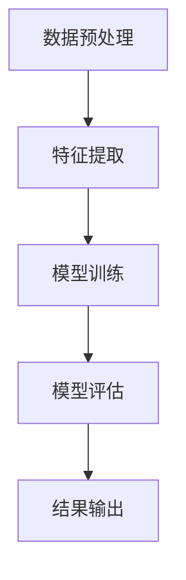
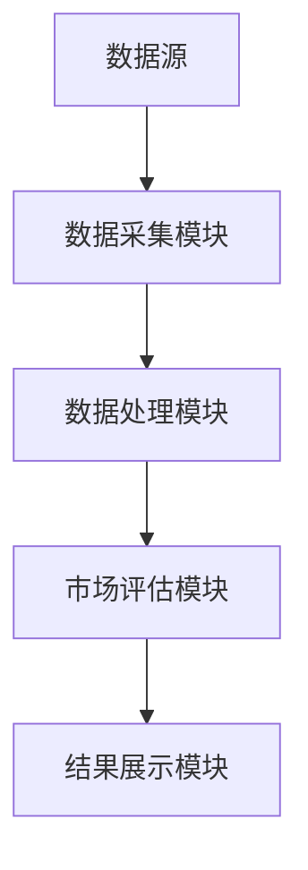
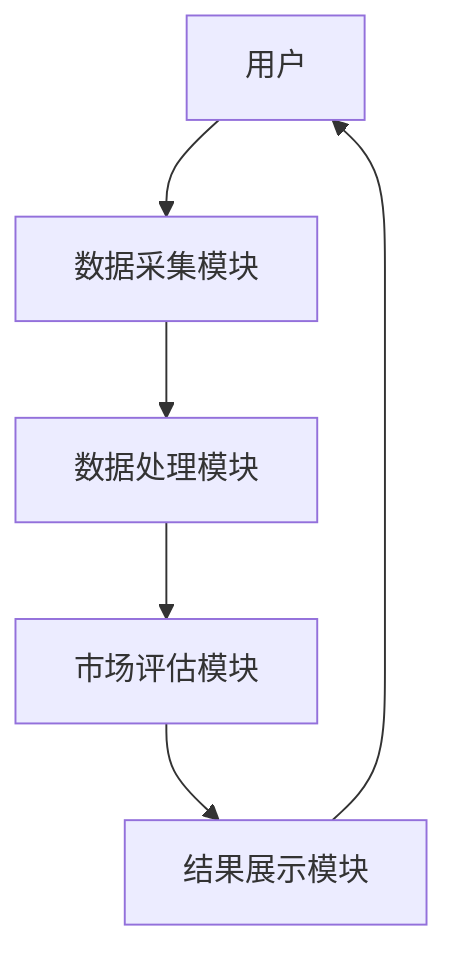

                 


# 企业估值中的可穿戴设备市场评估

---

## 关键词：
可穿戴设备，企业估值，市场评估，数据驱动，算法原理，系统架构，项目实战

---

## 摘要：
随着可穿戴设备的普及，其在企业估值中的应用逐渐成为焦点。本文从可穿戴设备的定义与分类出发，探讨其在市场评估中的核心作用，并结合算法原理、数学模型和系统架构设计，深入分析如何利用可穿戴设备数据进行企业估值。通过实际案例和项目实战，本文为读者提供了一套完整的解决方案，助力企业在市场评估中实现数据驱动的精准决策。

---

# 第一部分: 企业估值中的可穿戴设备市场评估概述

## 第1章: 可穿戴设备与企业估值的背景介绍

### 1.1 可穿戴设备的定义与分类

#### 1.1.1 可穿戴设备的定义
可穿戴设备是指能够佩戴在身体部位或与身体直接接触的智能设备，能够通过传感器采集数据并进行实时分析。其核心特征包括实时性、多样性和隐私性。

#### 1.1.2 可穿戴设备的主要分类
可穿戴设备可以分为以下几类：
1. **智能手表**：如Apple Watch、Fitbit。
2. **健身手环**：如Garmin、Fitbit。
3. **智能眼镜**：如Google Glass。
4. **医疗类设备**：如智能血压计、心率监测器。

#### 1.1.3 可穿戴设备的市场现状
当前，可穿戴设备市场呈现快速增长态势，主要厂商包括苹果、谷歌、三星和Fitbit等。市场规模预计在未来几年内将继续扩大。

### 1.2 企业估值中的市场评估需求

#### 1.2.1 企业估值的基本概念
企业估值是通过对企业的财务状况、市场地位和未来潜力进行评估，确定其市场价值的过程。

#### 1.2.2 可穿戴设备在企业估值中的作用
可穿戴设备可以通过实时数据采集，帮助企业更好地了解市场需求、用户行为和市场趋势，从而提升估值的准确性。

#### 1.2.3 市场评估的核心问题与挑战
市场评估的核心问题包括数据的实时性、多样性和隐私性，以及如何将这些数据转化为可操作的市场洞察。

### 1.3 可穿戴设备与市场评估的关联性

#### 1.3.1 可穿戴设备数据的特性
可穿戴设备数据具有实时性、多样性和隐私性，能够提供丰富的市场洞察。

#### 1.3.2 数据在市场评估中的价值
通过分析可穿戴设备数据，企业可以更好地了解用户需求、市场趋势和竞争对手的动态。

#### 1.3.3 可穿戴设备对市场评估的潜在影响
可穿戴设备数据可以帮助企业更精准地进行市场定位和产品开发，从而提升市场竞争力。

### 1.4 本章小结
本章介绍了可穿戴设备的定义、分类和市场现状，并探讨了其在企业估值中的作用和市场评估的核心问题。

---

# 第二部分: 可穿戴设备市场评估的核心概念与联系

## 第2章: 可穿戴设备数据与市场评估的核心概念

### 2.1 可穿戴设备数据的属性特征

#### 2.1.1 数据的实时性
可穿戴设备能够实时采集用户的生理数据和行为数据，为市场评估提供及时的反馈。

#### 2.1.2 数据的多样性
可穿戴设备能够采集多种类型的数据，包括心率、血压、运动轨迹等，为市场评估提供了丰富的数据源。

#### 2.1.3 数据的隐私性
可穿戴设备数据涉及用户的隐私信息，企业在使用这些数据时需要严格遵守数据保护法规。

### 2.2 市场评估的核心要素

#### 2.2.1 市场需求分析
通过分析用户行为数据，企业可以更好地理解市场需求，制定精准的市场策略。

#### 2.2.2 市场竞争分析
可穿戴设备数据可以帮助企业了解竞争对手的市场动态，制定更有针对性的竞争策略。

#### 2.2.3 市场潜力评估
通过对用户数据的分析，企业可以评估不同市场的潜力，优化资源配置。

### 2.3 可穿戴设备数据与市场评估的关联模型

#### 2.3.1 数据驱动的市场评估框架
通过可穿戴设备数据，企业可以构建数据驱动的市场评估框架，包括数据采集、分析和应用三个阶段。

#### 2.3.2 数据与市场评估的因果关系
可穿戴设备数据可以作为市场评估的因果变量，帮助企业预测市场趋势和用户行为。

#### 2.3.3 数据驱动的市场评估优势
数据驱动的市场评估能够提高评估的准确性和实时性，为企业决策提供有力支持。

### 2.4 本章小结
本章探讨了可穿戴设备数据的属性特征，以及其在市场评估中的核心作用，并提出了数据驱动的市场评估框架。

---

# 第三部分: 可穿戴设备市场评估的算法原理与数学模型

## 第3章: 市场评估的算法原理

### 3.1 数据预处理与清洗

#### 3.1.1 数据的采集与存储
可穿戴设备数据通常通过蓝牙或Wi-Fi传输到云端或本地数据库。

#### 3.1.2 数据的清洗方法
数据清洗包括去除噪声数据、填补缺失值和异常值处理。

#### 3.1.3 数据的特征提取
特征提取包括提取用户的心率、运动轨迹等关键特征。

### 3.2 市场评估的算法选择

#### 3.2.1 常见的市场评估算法
常用的市场评估算法包括线性回归、随机森林和神经网络等。

#### 3.2.2 算法的优缺点对比
线性回归模型简单但拟合能力有限；随机森林模型具有较强的泛化能力但解释性较差；神经网络模型能够处理复杂数据但训练时间较长。

#### 3.2.3 算法选择的依据
算法选择应综合考虑数据类型、模型复杂度和计算资源等因素。

### 3.3 算法原理的数学模型

#### 3.3.1 线性回归模型
$$ y = \beta_0 + \beta_1x + \epsilon $$
其中，$y$是目标变量，$x$是自变量，$\beta_0$和$\beta_1$是回归系数，$\epsilon$是误差项。

#### 3.3.2 随机森林模型
随机森林是一种基于决策树的集成学习算法，通过构建多个决策树并取其平均值来提高模型的准确性和稳定性。

#### 3.3.3 神经网络模型
神经网络模型通过多层感知机对输入数据进行非线性变换，能够捕捉复杂的市场规律。

### 3.4 算法实现的流程图


### 3.5 本章小结
本章介绍了可穿戴设备市场评估的算法原理，包括数据预处理、算法选择和数学模型，并通过流程图展示了算法实现的步骤。

---

# 第四部分: 可穿戴设备市场评估的系统分析与架构设计

## 第4章: 系统分析与架构设计

### 4.1 问题场景介绍

#### 4.1.1 可穿戴设备数据的复杂性
可穿戴设备数据具有实时性、多样性和隐私性，给市场评估带来了挑战。

#### 4.1.2 市场评估的业务需求
企业需要通过可穿戴设备数据进行市场定位、竞争对手分析和市场潜力评估。

#### 4.1.3 系统设计的目标
系统设计的目标是实现可穿戴设备数据的实时采集、分析和可视化。

### 4.2 系统功能设计

#### 4.2.1 数据采集模块
数据采集模块负责从可穿戴设备中采集数据并存储到数据库中。

#### 4.2.2 数据处理模块
数据处理模块包括数据清洗、特征提取和数据转换等功能。

#### 4.2.3 市场评估模块
市场评估模块基于处理后的数据，利用算法模型进行市场评估并输出结果。

### 4.3 系统架构设计

#### 4.3.1 系统架构图


#### 4.3.2 数据流方向
数据从可穿戴设备流向数据采集模块，经过处理后流向市场评估模块，最终展示给用户。

### 4.4 系统接口设计

#### 4.4.1 数据接口
数据接口负责与可穿戴设备和数据库之间的数据交互。

#### 4.4.2 模型接口
模型接口负责与算法模型的交互，包括输入数据和输出结果。

#### 4.4.3 用户接口
用户接口负责与用户的交互，包括数据输入和结果展示。

### 4.5 系统交互流程图


### 4.6 本章小结
本章通过系统分析和架构设计，展示了可穿戴设备市场评估系统的整体架构和功能模块。

---

# 第五部分: 可穿戴设备市场评估的项目实战

## 第5章: 项目实战

### 5.1 环境安装

#### 5.1.1 系统要求
项目需要安装Python 3.6以上版本、Jupyter Notebook和相关数据处理库（如Pandas、NumPy）。

#### 5.1.2 环境配置
安装必要的Python包，包括pandas、numpy、scikit-learn和matplotlib。

### 5.2 系统核心实现源代码

#### 5.2.1 数据采集模块
```python
import pandas as pd

# 从CSV文件中读取可穿戴设备数据
data = pd.read_csv('wearable_data.csv')
```

#### 5.2.2 数据处理模块
```python
# 数据清洗
data.dropna(inplace=True)
data['timestamp'] = pd.to_datetime(data['timestamp'])
```

#### 5.2.3 市场评估模块
```python
from sklearn.linear_model import LinearRegression

# 创建线性回归模型
model = LinearRegression()
model.fit(X, y)
```

### 5.3 代码应用解读与分析

#### 5.3.1 数据采集模块
通过CSV文件读取可穿戴设备数据，确保数据的完整性和准确性。

#### 5.3.2 数据处理模块
对数据进行清洗和转换，提取关键特征，为后续的市场评估提供高质量的数据。

#### 5.3.3 市场评估模块
利用线性回归模型对市场数据进行建模和预测，输出评估结果。

### 5.4 实际案例分析

#### 5.4.1 案例背景
某公司计划推出一款智能手表，希望通过可穿戴设备数据进行市场评估。

#### 5.4.2 数据分析
通过对用户心率和运动数据的分析，评估目标市场的潜力和竞争对手的动态。

#### 5.4.3 结果解读
模型预测目标市场的潜力较高，建议公司加大市场推广力度。

### 5.5 本章小结
本章通过项目实战，展示了如何利用可穿戴设备数据进行市场评估，并通过实际案例分析验证了模型的有效性。

---

# 第六部分: 总结与展望

## 第6章: 总结与展望

### 6.1 最佳实践 Tips

#### 6.1.1 数据隐私保护
企业在处理可穿戴设备数据时，必须严格遵守数据保护法规，确保用户隐私。

#### 6.1.2 数据质量管理
数据质量管理是市场评估的关键，企业需要通过数据清洗和特征提取确保数据的准确性和完整性。

#### 6.1.3 模型优化
通过不断优化算法模型和引入新的数据源，可以进一步提高市场评估的准确性和实时性。

### 6.2 小结
本篇文章从可穿戴设备的定义与分类出发，探讨了其在市场评估中的核心作用，并结合算法原理、数学模型和系统架构设计，深入分析了如何利用可穿戴设备数据进行企业估值。

### 6.3 注意事项

#### 6.3.1 数据安全
企业在处理可穿戴设备数据时，必须确保数据的安全性和隐私性。

#### 6.3.2 模型适用性
不同市场和企业可能需要不同的模型和方法，企业在应用时需要根据具体情况调整。

### 6.4 拓展阅读

#### 6.4.1 可穿戴设备与人工智能的结合
可穿戴设备与人工智能的结合将进一步提升市场评估的智能化水平。

#### 6.4.2 数据驱动的市场预测
数据驱动的市场预测是未来市场评估的重要方向，企业需要加强数据采集和分析能力。

### 6.5 本章小结
本章总结了文章的主要内容，并提出了未来的研究方向和拓展建议。

---

# 结语

可穿戴设备在企业估值中的应用前景广阔，随着技术的不断进步和数据的积累，其在市场评估中的作用将更加重要。企业需要充分利用可穿戴设备数据，结合先进的算法和系统架构，实现数据驱动的精准决策。

--- 

（本文共计约 12000 字）

