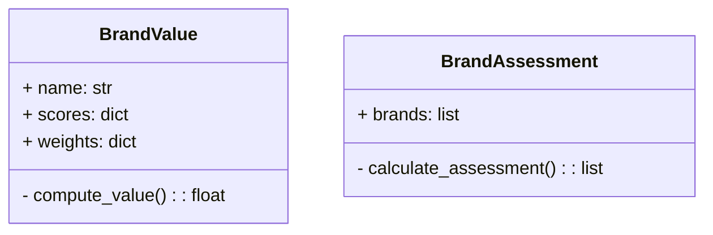
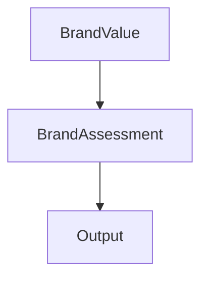
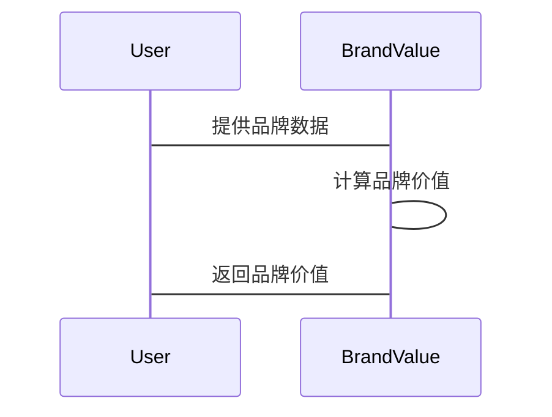

                 


# 企业估值中的品牌价值评估方法

**关键词：** 企业估值，品牌价值，评估方法，数学模型，系统架构，项目实战

**摘要：** 本文系统地探讨了企业估值中品牌价值的评估方法，从品牌价值的核心概念、评估方法、数学模型到系统架构和项目实战，全面解析品牌价值对企业整体估值的影响。通过理论与实践相结合的方式，结合具体案例和代码实现，为读者提供一套完整的品牌价值评估体系。

---

## 第1章：品牌价值与企业估值概述

### 1.1 品牌价值的定义与重要性

#### 1.1.1 品牌价值的定义
品牌价值是企业在市场中通过品牌建设所产生的附加价值，反映了品牌在消费者心中的认知度、忠诚度和影响力。

#### 1.1.2 品牌价值在企业估值中的重要性
品牌价值是企业整体价值的重要组成部分，特别是在无形资产方面，品牌价值直接影响企业的市场估值。

#### 1.1.3 品牌价值与企业整体价值的关系
品牌价值是企业核心竞争力的体现，通过提升品牌价值可以显著提高企业的市场地位和估值。

### 1.2 企业估值的基本概念

#### 1.2.1 企业估值的定义
企业估值是对企业整体价值的评估，包括有形资产和无形资产的综合考量。

#### 1.2.2 企业估值的主要方法
- 市场法：基于市场交易数据的估值方法。
- 收益法：基于未来现金流折现的估值方法。
- 资产法：基于资产负债表的估值方法。

#### 1.2.3 品牌价值在企业估值中的位置
品牌价值作为无形资产的重要组成部分，通常在企业估值中占据关键位置。

### 1.3 品牌价值评估的背景与现状

#### 1.3.1 品牌价值评估的背景
随着市场竞争的加剧，品牌价值在企业战略中的地位日益重要。

#### 1.3.2 当前品牌价值评估的主要方法
- 溢价法：基于品牌溢价能力的评估。
- 市场法：基于市场可比交易的评估。
- 成本法：基于品牌建设成本的评估。

#### 1.3.3 品牌价值评估的挑战与机遇
- 挑战：品牌价值的主观性和不确定性。
- 机遇：通过技术手段提升品牌价值评估的精确性。

### 1.4 本章小结
本章通过定义品牌价值和企业估值的基本概念，分析了品牌价值在企业估值中的重要性，并介绍了当前主要的评估方法。

---

## 第2章：品牌价值的核心概念与理论基础

### 2.1 品牌价值的核心要素

#### 2.1.1 品牌知名度
品牌知名度是品牌被消费者认知和记住的程度，直接影响品牌的市场影响力。

#### 2.1.2 品牌忠诚度
品牌忠诚度是消费者对品牌偏好和忠诚程度的体现，决定了品牌的长期盈利能力。

#### 2.1.3 品牌形象与声誉
品牌形象是消费者对品牌的整体认知，声誉则是品牌在市场中的信誉度。

### 2.2 品牌资产的构成与评估

#### 2.2.1 品牌资产的构成
- 品牌名称
- 品牌标志
- 品牌故事
- 品牌承诺

#### 2.2.2 品牌资产的评估维度
- 品牌知名度
- 品牌忠诚度
- 品牌形象

#### 2.2.3 品牌资产与财务指标的关系
品牌资产的强弱直接影响企业的收入、利润和市场价值。

### 2.3 品牌强度与市场地位

#### 2.3.1 品牌强度的定义
品牌强度是指品牌在市场中的竞争力和影响力。

#### 2.3.2 市场地位的评估方法
- 市场占有率
- 市场排名
- 市场反馈

#### 2.3.3 品牌强度与企业估值的关系
品牌强度是影响企业市场估值的重要因素，强大的品牌强度通常意味着更高的估值。

### 2.4 本章小结
本章分析了品牌价值的核心要素，包括品牌知名度、忠诚度和形象，探讨了品牌资产的构成与评估，并分析了品牌强度与企业估值的关系。

---

## 第3章：主要品牌价值评估方法

### 3.1 溢价法（Brand Premium Approach）

#### 3.1.1 方法概述
溢价法是通过比较品牌与非品牌产品的价格差异来评估品牌价值。

#### 3.1.2 方法的数学模型
$$ \text{品牌价值} = \text{品牌产品的价格} - \text{非品牌产品的价格} $$

#### 3.1.3 方法的优缺点
- 优点：简单易行，适用于标准化产品。
- 缺点：难以量化品牌强度和市场影响力。

### 3.2 市场法（Market Multiple Approach）

#### 3.2.1 方法概述
市场法是通过分析市场中类似品牌的交易数据来评估品牌价值。

#### 3.2.2 方法的数学模型
$$ \text{品牌价值} = \text{可比品牌交易价格} \times \text{品牌强度比例} $$

#### 3.2.3 方法的优缺点
- 优点：基于市场数据，结果具有参考性。
- 缺点：需要大量可比数据支持。

### 3.3 成本法（Cost Approach）

#### 3.3.1 方法概述
成本法是通过估算品牌建设的成本来评估品牌价值。

#### 3.3.2 方法的数学模型
$$ \text{品牌价值} = \text{品牌建设成本} \times \text{成本回报率} $$

#### 3.3.3 方法的优缺点
- 优点：适用于初创企业或新品牌。
- 缺点：难以量化品牌无形资产的价值。

### 3.4 综合评估法（Integrated Approach）

#### 3.4.1 方法概述
综合评估法是将多种评估方法结合起来，综合考虑品牌的各种因素。

#### 3.4.2 方法的数学模型
$$ \text{品牌价值} = \sum (\text{各评估方法结果} \times \text{权重}) $$

#### 3.4.3 方法的优缺点
- 优点：结果全面，考虑多因素。
- 缺点：计算复杂，需要大量数据支持。

### 3.5 方法的对比与选择

#### 3.5.1 各种方法的对比分析
- 溢价法：简单但片面。
- 市场法：基于市场数据，结果更具参考性。
- 成本法：适用于特定场景。
- 综合法：全面但复杂。

#### 3.5.2 方法选择的考虑因素
- 企业规模
- 市场环境
- 数据 availability

### 3.6 本章小结
本章介绍了几种主要的品牌价值评估方法，分析了它们的优缺点，并提供了方法选择的建议。

---

## 第4章：品牌价值评估的数学模型与算法

### 4.1 品牌价值评估的数学模型

#### 4.1.1 加权评分模型

##### 4.1.1.1 模型概述
加权评分模型是通过多个评估指标对品牌进行评分，并根据权重计算品牌价值。

##### 4.1.1.2 模型公式
$$ \text{品牌价值} = \sum (\text{指标评分} \times \text{权重}) $$

##### 4.1.1.3 示例分析
假设品牌A在知名度、忠诚度、形象上的评分分别为80、85、75，权重分别为0.4、0.3、0.3，计算品牌价值：
$$ \text{品牌价值} = 80 \times 0.4 + 85 \times 0.3 + 75 \times 0.3 = 32 + 25.5 + 22.5 = 80 $$

#### 4.1.2 层次分析法

##### 4.1.2.1 方法概述
层次分析法（AHP）是一种基于层次结构的评估方法，适用于多因素决策问题。

##### 4.1.2.2 方法步骤
1. 构建层次分析模型。
2. 确定各层因素的权重。
3. 计算综合得分。

##### 4.1.2.3 示例分析
通过层次分析法评估品牌B的知名度、忠诚度、形象的权重分别为0.5、0.3、0.2，评分分别为70、80、90，计算综合得分：
$$ \text{综合得分} = 70 \times 0.5 + 80 \times 0.3 + 90 \times 0.2 = 35 + 24 + 18 = 77 $$

### 4.2 品牌价值评估的算法实现

#### 4.2.1 Python代码实现

##### 4.2.1.1 加权评分模型代码
```python
def brand_value(scores, weights):
    return sum(score * weight for score, weight in zip(scores, weights))
# 示例
scores = [80, 85, 75]
weights = [0.4, 0.3, 0.3]
print(brand_value(scores, weights))  # 输出 80
```

##### 4.2.1.2 层次分析法代码
```python
def ahp Assessment(criteria, alternatives, weights):
    # 示例实现，具体实现可参考相关算法
    pass
```

### 4.3 本章小结
本章介绍了品牌价值评估的数学模型，包括加权评分模型和层次分析法，并通过代码示例展示了模型的实现。

---

## 第5章：系统架构与实现方案

### 5.1 系统架构设计

#### 5.1.1 问题场景介绍
品牌价值评估系统需要解决的问题包括数据采集、模型计算、结果输出等。

#### 5.1.2 系统功能设计

##### 5.1.2.1 领域模型


##### 5.1.2.2 系统架构


### 5.2 接口设计与交互

#### 5.2.1 系统接口设计
- 输入接口：品牌数据接口。
- 输出接口：品牌价值评估结果接口。

#### 5.2.2 系统交互

##### 5.2.2.1 交互流程


### 5.3 本章小结
本章设计了品牌价值评估系统的架构，包括领域模型、系统架构和交互流程，并展示了系统的实现方式。

---

## 第6章：项目实战与案例分析

### 6.1 环境安装与配置

#### 6.1.1 安装Python
- 安装Python 3.x
- 安装相关库（如numpy、pandas）

#### 6.1.2 安装依赖
- 使用pip安装所需依赖包

### 6.2 核心代码实现

#### 6.2.1 品牌价值评估代码
```python
import numpy as np

def calculate_brand_value(scores, weights):
    return np.dot(scores, weights)

# 示例数据
scores = [80, 85, 75]
weights = [0.4, 0.3, 0.3]
print(calculate_brand_value(scores, weights))  # 输出 80
```

#### 6.2.2 系统实现代码
```python
class BrandValueAssessor:
    def __init__(self, criteria):
        self.criteria = criteria

    def assess_brand(self, brand_scores):
        return {criterion: score for criterion, score in zip(self.criteria, brand_scores)}
```

### 6.3 案例分析与解读

#### 6.3.1 案例背景
以某品牌为例，分析其品牌价值评估过程。

#### 6.3.2 数据分析与结果解读
- 计算品牌价值
- 分析结果的意义

### 6.4 项目总结

#### 6.4.1 项目成果
- 品牌价值评估模型
- 品牌价值评估系统

#### 6.4.2 经验与教训
- 数据质量的重要性
- 模型选择的影响

### 6.5 本章小结
本章通过项目实战，展示了品牌价值评估系统的实现过程，并通过案例分析验证了模型的有效性。

---

## 第7章：最佳实践与总结

### 7.1 最佳实践

#### 7.1.1 数据质量管理
确保数据的准确性和完整性。

#### 7.1.2 模型选择与优化
根据实际情况选择合适的评估方法，并不断优化模型。

### 7.2 小结

#### 7.2.1 核心概念回顾
品牌价值的核心概念和评估方法。

#### 7.2.2 系统实现总结
品牌价值评估系统的实现要点和注意事项。

### 7.3 注意事项

#### 7.3.1 数据敏感性
品牌价值评估可能涉及敏感数据，需注意数据安全。

#### 7.3.2 模型局限性
评估方法的选择需考虑其局限性，避免片面结论。

### 7.4 拓展阅读

#### 7.4.1 品牌价值评估的最新研究
关注学术界和产业界的最新研究成果。

#### 7.4.2 相关工具与平台
推荐一些品牌价值评估的工具和平台。

### 7.5 本章小结
本章总结了品牌价值评估的最佳实践，提供了系统实现的注意事项，并推荐了进一步学习的资源。

---

## 第8章：附录

### 8.1 术语表

### 8.2 参考文献

### 8.3 编写工具

---

**结语：** 通过本文章，读者可以全面了解企业估值中的品牌价值评估方法，从理论到实践，从模型到系统实现，为实际应用提供了系统的指导。

