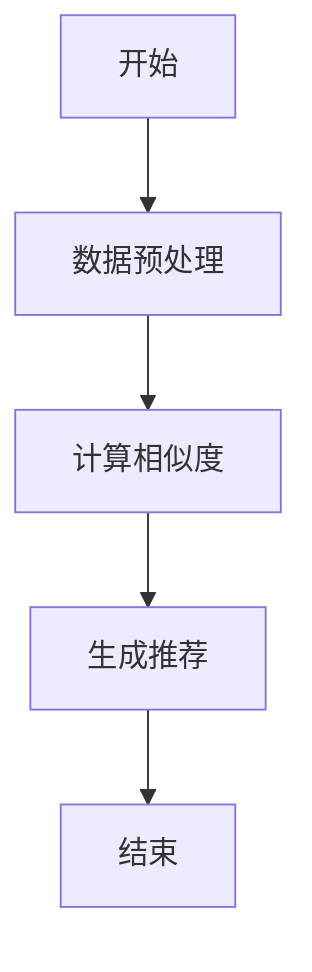
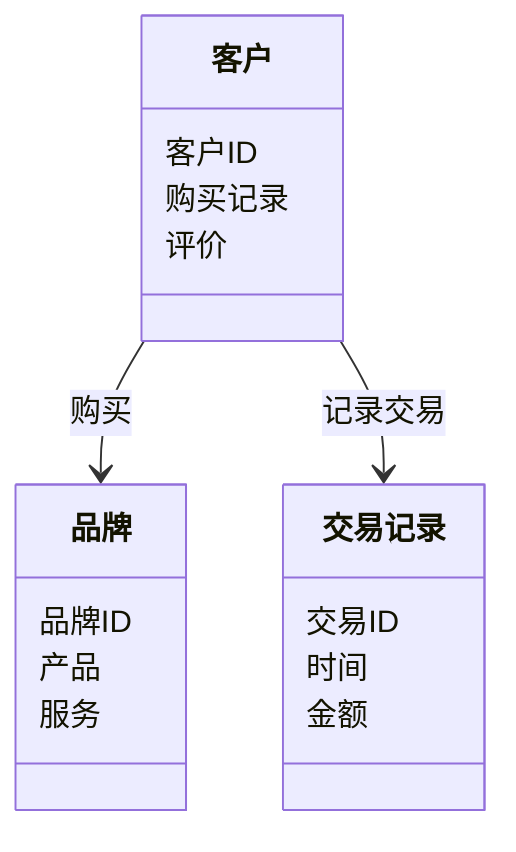

                 


# 《企业估值中的品牌忠诚度评估》

---

## 关键词：
企业估值, 品牌忠诚度, 客户行为分析, 数据挖掘, 机器学习

---

## 摘要：
本文探讨了品牌忠诚度在企业估值中的重要性及其评估方法。通过分析客户行为数据和情感数据，结合机器学习算法，提出了品牌忠诚度的量化评估模型。文章详细介绍了从数据采集到算法实现的完整流程，并通过实际案例展示了如何利用品牌忠诚度评估提升企业估值。

---

## 目录：
1. [企业估值中的品牌忠诚度评估概述](#企业估值中的品牌忠诚度评估概述)
2. [品牌忠诚度评估的核心概念与联系](#品牌忠诚度评估的核心概念与联系)
3. [品牌忠诚度评估的算法原理](#品牌忠诚度评估的算法原理)
4. [品牌忠诚度评估的系统设计](#品牌忠诚度评估的系统设计)
5. [品牌忠诚度评估的项目实战](#品牌忠诚度评估的项目实战)
6. [品牌忠诚度评估的最佳实践与未来展望](#品牌忠诚度评估的最佳实践与未来展望)

---

## 第一部分: 企业估值中的品牌忠诚度评估概述

### 1. 企业估值中的品牌忠诚度评估概述

#### 1.1 品牌忠诚度的基本概念

品牌忠诚度是指客户对企业品牌、产品或服务的持续购买和推荐意愿。它是企业在市场中的核心竞争力之一，直接影响企业的长期价值和市场地位。

- **定义**：品牌忠诚度是客户在面对多个选择时，仍然选择特定品牌或企业的行为倾向。
- **核心要素**：
  - 客户满意度
  - 重复购买率
  - 品牌推荐意愿
- **与企业估值的关系**：品牌忠诚度高的企业通常具有更高的客户 retention 率和更高的利润率，从而在估值中占据优势。

#### 1.2 品牌忠诚度评估的重要性

- **对企业价值的影响**：
  - 高品牌忠诚度意味着客户更愿意为企业产品支付溢价。
  - 忠诚客户通常具有更高的生命周期价值（Customer Lifetime Value, CLV）。
- **对估值的影响**：
  - 忠诚客户能够为企业带来稳定的收入流，从而提高企业的整体估值。
  - 品牌忠诚度是企业在市场竞争中差异化的重要指标。

#### 1.3 品牌忠诚度与其他相关概念的对比

- **品牌知名度 vs. 品牌忠诚度**：
  - 品牌知名度是客户对品牌的认知程度，而品牌忠诚度是客户对品牌的购买倾向。
- **品牌忠诚度 vs. 客户满意度**：
  - 客户满意度是客户对产品或服务的即时感受，而品牌忠诚度是客户长期的购买行为。
- **品牌忠诚度 vs. 品牌影响力**：
  - 品牌影响力是品牌的市场覆盖范围和知名度，而品牌忠诚度是客户对品牌的偏好程度。

---

## 第二部分: 品牌忠诚度评估的核心概念与联系

### 2. 品牌忠诚度评估的核心原理

#### 2.1 品牌忠诚度的形成机制

品牌忠诚度的形成是一个复杂的过程，涉及客户的情感、认知和行为等多个方面：

- **情感因素**：客户对品牌的信任、情感依赖和归属感。
- **认知因素**：客户对品牌的认知、产品质量和创新能力的评价。
- **行为因素**：客户实际的购买行为和消费习惯。

#### 2.2 品牌忠诚度的测量方法

- **净推荐值（Net Promoter Score, NPS）**：
  - 通过客户对品牌的推荐意愿进行评分（1-10分），计算NPS值。
  - NPS = (推荐者比例 - 怀疑者比例) × 100
- **客户满意度（Customer Satisfaction, CSAT）**：
  - 通过客户满意度调查，计算客户对产品或服务的满意度评分。
  - CSAT = (满意客户比例 + 非常满意客户比例) / 总客户数 × 100

#### 2.3 品牌忠诚度的动态变化

- **品牌忠诚度的周期性**：
  - 在市场环境变化、竞争对手策略调整等因素影响下，品牌忠诚度可能会发生波动。
- **品牌忠诚度的可塑性**：
  - 通过有效的市场推广和客户关系管理，品牌忠诚度可以被提升或修复。

### 2.4 品牌忠诚度评估的核心要素

#### 2.4.1 客户行为数据

- **购买记录**：
  - 客户的购买频率、购买金额、购买时间等。
- **重复购买率**：
  - 重复购买率 = (重复购买的客户数量) / 总客户数量

#### 2.4.2 客户情感数据

- **客户评价**：
  - 客户在社交媒体、电商平台上的评论和评分。
- **情感分析**：
  - 利用自然语言处理（NLP）技术，分析客户评论的情感倾向。

#### 2.4.3 产品和服务质量

- **产品质量**：
  - 产品性能、耐用性、创新性等。
- **服务质量**：
  - 售前咨询、售后服务、客户支持等。

### 2.5 品牌忠诚度评估的ER实体关系图

```mermaid
er
  title 品牌忠诚度评估的ER实体关系图
  章节
    客户
    品牌
    交易记录
    产品
  关系
    客户 - 品牌
    品牌 - 产品
    客户 - 交易记录
```

---

## 第三部分: 品牌忠诚度评估的算法原理

### 3. 品牌忠诚度评估的主要算法

#### 3.1 协同过滤算法

- **协同过滤的原理**：
  - 基于“相似的客户会有相似的偏好”这一假设，推荐客户可能感兴趣的产品或服务。
- **实现流程**：
  1. 数据预处理（清洗、归一化）。
  2. 计算用户或产品的相似度（如余弦相似度）。
  3. 根据相似度生成推荐列表。

#### 3.2 聚类分析算法

- **聚类分析的原理**：
  - 将客户分为不同的群体，分析每个群体的品牌偏好。
- **实现流程**：
  1. 数据预处理。
  2. 选择合适的聚类算法（如K-means）。
  3. 分析每个聚类群体的品牌忠诚度。

#### 3.3 机器学习算法

- **机器学习的原理**：
  - 利用训练数据，构建模型预测客户的品牌忠诚度。
- **常用算法**：
  - 随机森林（Random Forest）。
  - 支持向量机（SVM）。
  - 神经网络（Neural Networks）。

### 3.4 协同过滤算法的实现流程



### 3.5 协同过滤算法的Python实现

```python
import numpy as np
from sklearn.metrics.pairwise import cosine_similarity

# 示例数据：客户-产品评分矩阵
customer_product_matrix = np.array([
    [4, 3, 5],
    [2, 4, 3],
    [5, 1, 4],
    [3, 5, 2]
])

# 计算余弦相似度
similarities = cosine_similarity(customer_product_matrix)

# 根据相似度生成推荐
def get_recommendations(similarities, customer_index, top_n=3):
    recommendations = []
    for i in range(len(similarities)):
        if i != customer_index:
            recommendations.append((i, similarities[customer_index, i]))
    recommendations.sort(key=lambda x: x[1], reverse=True)
    return recommendations[:top_n]

# 示例：为第0个客户生成推荐
recommendations = get_recommendations(similarities, 0)
print(recommendations)
```

---

## 第四部分: 品牌忠诚度评估的系统设计

### 4.1 系统功能设计

#### 4.1.1 领域模型



#### 4.1.2 系统架构设计


---

## 第五部分: 品牌忠诚度评估的项目实战

### 5.1 项目背景与目标

- **项目背景**：
  - 某电商平台希望通过品牌忠诚度评估，优化客户 retention 策略。
- **项目目标**：
  - 构建品牌忠诚度评估模型。
  - 提供客户分层和个性化推荐。

### 5.2 数据采集与处理

#### 5.2.1 数据采集

- **数据来源**：
  - 平台交易记录。
  - 客户评价和反馈。
  - 产品和服务数据。

#### 5.2.2 数据清洗

- **去重**：
  - 删除重复的客户记录。
- **填充缺失值**：
  - 使用均值或中位数填充缺失值。

### 5.3 算法实现

#### 5.3.1 特征工程

- **特征提取**：
  - 提取客户购买频率、购买金额、评价情感等特征。
- **特征标准化**：
  - 使用归一化或标准化处理特征。

#### 5.3.2 模型训练

- **选择算法**：
  - 使用随机森林模型预测客户忠诚度。
- **训练过程**：
  - 输入特征数据，训练模型。

### 5.4 模型优化

- **参数调优**：
  - 使用网格搜索优化模型参数。
- **交叉验证**：
  - 使用k折交叉验证评估模型性能。

---

## 第六部分: 品牌忠诚度评估的最佳实践与未来展望

### 6.1 最佳实践 tips

- **数据质量**：
  - 确保数据的准确性和完整性。
- **模型选择**：
  - 根据具体场景选择合适的算法。
- **持续监控**：
  - 定期更新模型，适应市场变化。

### 6.2 项目小结

通过本文的详细讲解，我们了解了品牌忠诚度评估的核心概念、算法原理和系统设计。实际案例展示了如何利用技术手段提升企业估值。

### 6.3 未来展望

- **技术进步**：
  - 结合AI和大数据技术，进一步提升品牌忠诚度评估的精度。
- **应用场景**：
  - 在更多行业和场景中应用品牌忠诚度评估，优化企业价值。

---

## 结语

品牌忠诚度评估是企业估值中的关键因素，通过科学的评估方法和先进的技术手段，企业可以更好地管理和提升品牌价值。希望本文的内容能够为读者提供有价值的参考和启发。

--- 

以上是完整的文章大纲和内容框架，您可以根据需要进一步扩展和补充细节。

