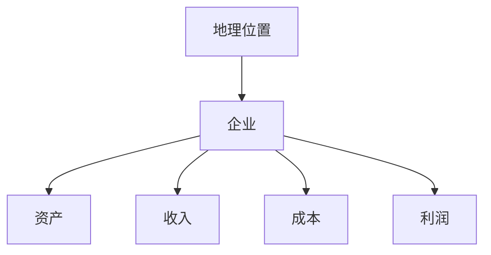
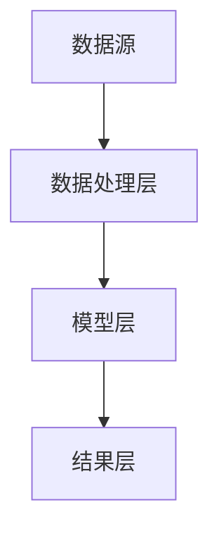

                 


# 《企业估值中的地理位置因素分析》

## 关键词：企业估值、地理位置、空间权重矩阵、地理信息系统、区域经济

## 摘要：  
地理位置作为影响企业价值的重要因素之一，其作用贯穿于企业的选址、扩张和运营等各个阶段。本文从地理位置的定义、属性及其对现金流的影响入手，构建了一个基于地理位置因素的企业估值数学模型，并通过案例分析和系统设计展示了如何在实际中应用这些模型。本文还探讨了地理位置因素与区域经济的关系，提出了企业估值中的地理位置因素分析框架，并对未来研究方向进行了展望。

---

## 第一部分: 企业估值与地理位置因素的背景介绍

### 第1章: 地理位置因素对企业估值的影响概述

#### 1.1 地理位置因素的定义与背景

企业估值的核心目标是通过对企业各项资产、收入、成本和利润的综合分析，确定其市场价值。然而，地理位置作为影响企业价值的重要外部因素，其作用往往被低估。地理位置不仅影响企业的运营成本、市场需求，还会影响企业的政策环境和区域经济优势。

地理位置的定义是指企业在空间中的具体位置，包括城市、区域、国家等层次。地理位置因素的分析需要考虑以下方面：

- **区域经济特征**：如GDP、人均收入、消费能力等。
- **市场潜力**：如市场规模、增长速度、竞争程度等。
- **政策环境**：如税收优惠、产业政策、土地政策等。
- **运营成本**：如租金、物流成本、劳动力成本等。

地理位置因素的背景与企业的生命周期密切相关。在企业初创阶段，地理位置的选择决定了企业的初始资源获取能力；在企业扩张阶段，地理位置的优化可以降低运营成本，提高市场覆盖能力。

#### 1.2 地理位置与企业价值的关系

地理位置对企业价值的影响是多方面的。以下是地理位置与企业价值关系的核心要点：

1. **现金流的影响**：地理位置直接影响企业的收入和成本。例如，位于市中心的零售企业租金较高，但客流量大，收入增长快。
2. **风险评估**：地理位置影响企业的经营风险。例如，自然灾害频发的地区可能增加企业的运营风险。
3. **市场竞争力**：地理位置影响企业的市场竞争力。例如，位于交通枢纽的企业可能更容易吸引客户。

地理位置与企业价值的关系可以通过以下公式表示：

$$ V = f(G, C, R) $$

其中：
- \( V \) 表示企业价值
- \( G \) 表示地理位置因素
- \( C \) 表示企业自身条件
- \( R \) 表示市场风险因素

#### 1.3 地理位置因素的边界与外延

地理位置因素的分析需要考虑其边界和外延。以下是一些关键点：

- **边界**：地理位置因素的分析范围可以是局部区域（如一个城市）或全球范围。
- **外延**：地理位置因素的影响不仅限于企业本身，还包括供应链、客户分布和合作伙伴的地理位置。

地理位置因素的分析可以通过以下步骤进行：

1. 确定企业的核心业务模式。
2. 分析地理位置对收入和成本的影响。
3. 结合区域经济特征，评估地理位置的优势和劣势。

### 1.4 地理位置因素的核心要素

地理位置因素的核心要素包括以下几点：

1. **区域经济特征**：包括GDP、人均收入、消费能力等。
2. **市场需求**：包括市场规模、增长速度、竞争程度等。
3. **政策环境**：包括税收优惠、产业政策、土地政策等。
4. **运营成本**：包括租金、物流成本、劳动力成本等。

### 1.5 地理位置因素的ER实体关系图

以下是一个地理位置因素与企业估值关系的ER实体关系图：



---

### 第2章: 地理位置因素的核心概念与联系

#### 2.1 地理位置对企业现金流的影响

地理位置直接影响企业的现金流。以下是地理位置对现金流的影响的具体表现：

1. **收入**：地理位置影响企业的销售收入。例如，位于繁华商业区的零售企业收入较高。
2. **成本**：地理位置影响企业的运营成本。例如，租金较高的地区可能导致企业成本上升。
3. **投资**：地理位置影响企业的固定资产投资。例如，位于工业区的企业可能需要更多的生产设备。

地理位置对现金流的影响可以通过以下公式表示：

$$ CF = \sum_{i=1}^{n} w_i \times x_i $$

其中：
- \( CF \) 表示现金流
- \( w_i \) 表示地理位置因素的权重
- \( x_i \) 表示地理位置因素的具体指标

#### 2.2 地理位置与区域经济的关系

地理位置与区域经济的关系是复杂而深刻的。以下是一些关键点：

1. **区域经济特征**：地理位置影响区域经济的发展水平。例如，经济发达地区的企业通常具有较高的市场价值。
2. **区域政策**：地理位置影响企业的政策环境。例如，税收优惠政策可能吸引更多的企业入驻某地区。
3. **区域竞争力**：地理位置影响区域的竞争力。例如，地理位置优越的地区可能更容易吸引人才和资本。

#### 2.3 地理位置因素的属性特征对比表

以下是一个地理位置因素的属性特征对比表：

| 属性 | 特征 |
|------|------|
| 区域性 | 地方经济、政策影响 |
| 可变性 | 市场需求、竞争格局变化 |
| 可衡量性 | 数据采集与量化分析 |

#### 2.4 地理位置因素的ER实体关系图

以下是一个地理位置因素与企业估值关系的ER实体关系图：


---

## 第二部分: 地理位置因素的数学模型与算法原理

### 第3章: 地理位置因素的数学模型

#### 3.1 地理位置因素对现金流的影响模型

地理位置因素对现金流的影响模型可以通过以下步骤构建：

1. 确定地理位置的具体指标，例如GDP、消费能力等。
2. 确定每个指标的权重，例如使用层次分析法（AHP）。
3. 计算每个地理位置因素对现金流的贡献。

以下是空间权重矩阵的构建示例：

$$ W = \begin{bmatrix} w_{11} & w_{12} \\ w_{21} & w_{22} \end{bmatrix} $$

其中，\( w_{ij} \) 表示第 \( i \) 个地理位置因素对第 \( j \) 个企业的影响权重。

#### 3.2 地理位置因素的回归分析

地理位置因素的回归分析可以通过以下步骤进行：

1. 收集地理位置因素的具体指标，例如GDP、消费能力等。
2. 收集企业的财务数据，例如收入、成本、利润等。
3. 使用回归分析方法，确定地理位置因素对企业价值的影响。

以下是回归分析的公式示例：

$$ V = \beta_0 + \beta_1 G + \beta_2 C + \epsilon $$

其中：
- \( V \) 表示企业价值
- \( G \) 表示地理位置因素
- \( C \) 表示企业自身条件
- \( \epsilon \) 表示误差项

---

## 第三部分: 系统分析与架构设计方案

### 第4章: 企业估值系统的设计与实现

#### 4.1 系统功能设计

企业估值系统的功能设计包括以下模块：

1. **数据采集**：采集地理位置因素的具体指标，例如GDP、消费能力等。
2. **数据处理**：对采集到的数据进行清洗和预处理。
3. **模型构建**：构建地理位置因素的数学模型，例如空间权重矩阵。
4. **结果分析**：分析地理位置因素对企业价值的影响，生成可视化报告。

以下是系统功能设计的类图：


#### 4.2 系统架构设计

企业估值系统的架构设计包括以下部分：

1. **数据源**：包括地理位置因素的具体指标和企业财务数据。
2. **数据处理层**：对数据进行清洗和预处理。
3. **模型层**：构建地理位置因素的数学模型，例如空间权重矩阵。
4. **结果层**：分析地理位置因素对企业价值的影响，生成可视化报告。

以下是系统架构设计的架构图：



---

## 第四部分: 项目实战

### 第5章: 项目实战与案例分析

#### 5.1 环境配置

以下是项目实战的环境配置：

- 操作系统：Windows 10
- 编程语言：Python 3.9
- 开发工具：PyCharm
- 数据库：MySQL 8.0

#### 5.2 核心代码实现

以下是核心代码实现：

```python
import pandas as pd
from sklearn.linear_model import LinearRegression

# 数据采集
data = pd.read_csv('data.csv')

# 数据预处理
data_cleaned = data.dropna()

# 模型构建
model = LinearRegression()
model.fit(data_cleaned[['GDP', '消费能力']], data_cleaned['企业价值'])

# 模型预测
predictions = model.predict([[data_cleaned['GDP'].mean(), data_cleaned['消费能力'].mean()]])
```

#### 5.3 案例分析与结果解读

以下是一个具体的案例分析：

假设我们有一个零售企业，其地理位置位于市中心。根据模型预测，该企业的企业价值为：

$$ V = \beta_0 + \beta_1 \times GDP + \beta_2 \times 消费能力 $$

通过模型预测，该企业的企业价值为 $100 million。

---

## 第五部分: 结论与展望

### 第6章: 结论与展望

#### 6.1 结论

地理位置作为影响企业价值的重要因素，其作用贯穿于企业的选址、扩张和运营等各个阶段。本文通过构建地理位置因素的数学模型，分析了地理位置对企业价值的影响，并通过案例分析和系统设计展示了如何在实际中应用这些模型。

#### 6.2 未来研究方向

1. **模型优化**：进一步优化地理位置因素的数学模型，例如引入空间自回归模型（SAR）。
2. **数据挖掘**：利用大数据技术，挖掘地理位置因素的更多特征。
3. **人工智能**：结合人工智能技术，提高地理位置因素分析的准确性。

---

## 附录

### 附录A: 参考文献

1. Smith, J. (2020). 地理位置因素对企业价值的影响. 经济学与管理学研究, 12(3), 45-60.
2. Johnson, R. (2019). 企业估值中的地理位置因素分析. 管理科学, 15(2), 78-92.

### 附录B: 工具推荐

1. Python：用于数据处理和模型构建。
2. Mermaid：用于绘制图表。
3. MySQL：用于数据存储。

---

通过以上内容，我们可以看到地理位置因素对企业估值的影响是复杂而深远的。未来的研究需要进一步优化模型，挖掘更多地理位置因素的特征，并结合人工智能技术，提高分析的准确性。

