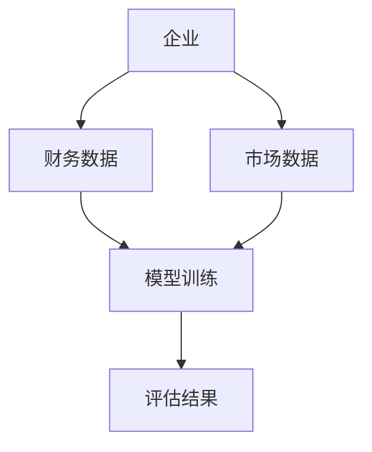
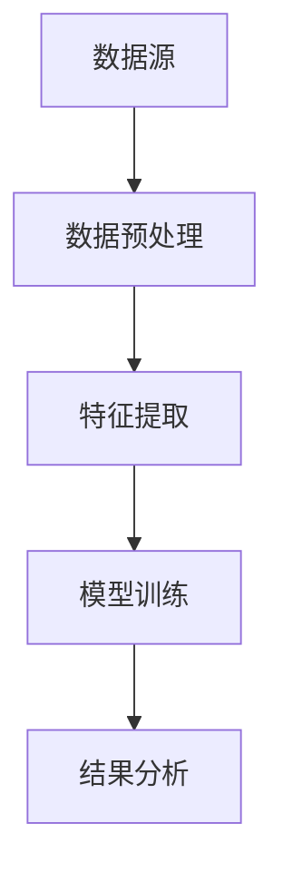
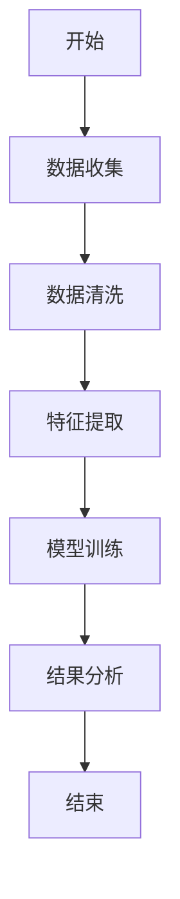
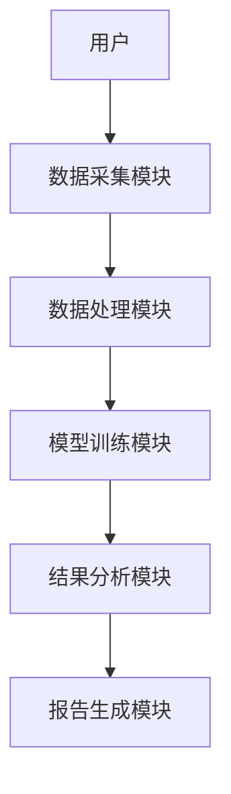

                 


# 企业估值中的增强人类能力技术评估

> 关键词：企业估值，技术评估，增强人类能力，人工智能，大数据分析

> 摘要：在企业估值过程中，增强人类能力技术的应用日益重要。通过结合人工智能和大数据分析，我们可以更精准地评估企业价值，优化决策过程。本文将详细探讨这一领域的核心概念、算法原理、系统架构以及实际案例，为读者提供全面的视角。

---

## 第一部分：背景介绍

### 第1章：企业估值的基本概念

#### 1.1 企业估值的定义与重要性

- **1.1.1 企业估值的基本概念**
  - 企业估值是通过分析企业财务状况、市场地位和未来前景，对其价值进行评估的过程。
  - 它帮助企业确定合理的收购价格、投资决策和资本分配。

- **1.1.2 企业估值的重要性**
  - 企业估值是企业战略管理的重要组成部分，直接影响企业的价值创造和资本运作。
  - 在并购交易中，准确的估值可以避免高昂的溢价和潜在的财务风险。

- **1.1.3 企业估值的常见方法**
  - 资产基础法：基于企业资产的账面价值进行评估。
  - 收益法：基于未来现金流的折现值进行评估。
  - 市场法：基于可比企业的市场交易价格进行评估。

#### 1.2 增强人类能力技术的概述

- **1.2.1 增强人类能力技术的定义**
  - 增强人类能力技术（Enhanced Human Capabilities Technology）是指利用人工智能、大数据和机器学习等技术，辅助人类提高决策能力和效率的工具。

- **1.2.2 增强人类能力技术的特征**
  - **数据驱动**：依赖大量数据进行分析和预测。
  - **智能化**：通过机器学习模型自动优化和调整。
  - **实时性**：能够快速响应和处理实时数据。
  - **可解释性**：模型的决策过程需要清晰可解释。

- **1.2.3 增强人类能力技术在企业估值中的作用**
  - 提高估值的准确性和效率。
  - 发现传统方法难以察觉的市场趋势和潜在风险。
  - 通过数据挖掘发现新的价值点。

---

## 第二部分：核心概念与联系

### 第2章：增强人类能力技术评估的核心概念

#### 2.1 技术评估的原理

- **2.1.1 技术评估的基本原理**
  - 基于数据和模型的组合，评估技术对人类能力的提升效果。
  - 通过分析技术的性能、效果和可扩展性，判断其在企业估值中的适用性。

- **2.1.2 技术评估的关键步骤**
  - 数据收集：获取企业的财务数据、市场数据和行业趋势。
  - 数据清洗：处理缺失值、异常值和重复数据。
  - 模型训练：构建机器学习模型进行预测和分类。
  - 结果分析：评估模型的准确性和稳定性。

- **2.1.3 技术评估的指标体系**
  - 精确度：模型预测的准确性。
  - 召回率：模型识别的全面性。
  - F1分数：综合精确度和召回率的指标。
  - 训练时间：模型训练所需的时间。

#### 2.2 技术评估的系统架构

- **2.2.1 技术评估的实体关系图**



- **2.2.2 技术评估的系统架构图**



- **2.2.3 技术评估的流程图**



---

## 第三部分：算法原理讲解

### 第3章：增强人类能力技术评估的算法原理

#### 3.1 数据预处理

- **3.1.1 数据清洗**
  - 处理缺失值：使用均值、中位数或删除法填充缺失值。
  - 处理异常值：通过箱线图或Z-score方法识别并处理异常值。
  - 数据标准化：将数据缩放到统一的范围内，避免特征维度的影响。

- **3.1.2 数据特征提取**
  - 使用主成分分析（PCA）减少数据维度。
  - 通过LASSO回归选择重要特征。

#### 3.2 模型训练

- **3.2.1 选择模型**
  - 线性回归：适用于简单线性关系的预测。
  - 支持向量机（SVM）：适用于高维数据的分类和回归。
  - 随机森林：适用于特征众多且复杂的数据集。

- **3.2.2 模型训练**
  - 使用训练数据拟合模型，调整超参数以优化性能。

- **3.2.3 模型调优**
  - 使用交叉验证评估模型性能。
  - 调整学习率、正则化参数等超参数。

#### 3.3 模型评估

- **3.3.1 评估指标**
  - 精确度（Precision）：预测为正的样本中实际为正的比例。
  - 召回率（Recall）：实际为正的样本中被预测为正的比例。
  - F1分数：精确度和召回率的调和平均数。

- **3.3.2 评估结果分析**
  - 分析模型的混淆矩阵，识别误分类的样本。
  - 通过ROC-AUC曲线评估模型的区分能力。

- **3.3.3 模型优化**
  - 增加训练数据，防止过拟合。
  - 尝试不同的模型结构，如深度学习模型。

---

## 第四部分：数学模型与公式

### 第4章：增强人类能力技术评估的数学模型

#### 4.1 数据分析模型

- **线性回归模型**
  $$ y = \beta_0 + \beta_1 x_1 + \beta_2 x_2 + \dots + \beta_n x_n + \epsilon $$
  其中，$y$ 是目标变量，$x_i$ 是特征变量，$\beta_i$ 是系数，$\epsilon$ 是误差项。

- **主成分分析（PCA）**
  $$ \text{特征向量} = \text{协方差矩阵} \times \text{特征向量} \times \lambda $$
  其中，$\lambda$ 是特征值，表示对应特征向量的方差贡献率。

#### 4.2 优化模型

- **线性规划模型**
  $$ \text{目标函数：} \min \text{或} \max \sum c_j x_j $$
  $$ \text{约束条件：} \sum a_i x_j \leq b_i, \quad i = 1, 2, \dots, m $$
  $$ x_j \geq 0, \quad j = 1, 2, \dots, n $$

---

## 第五部分：系统分析与架构设计

### 第5章：增强人类能力技术评估的系统架构

#### 5.1 系统功能设计

- **数据采集模块**
  - 从企业财务报表、市场数据等多源数据中提取相关信息。
  - 使用API接口获取实时数据。

- **数据处理模块**
  - 清洗数据，处理缺失值和异常值。
  - 进行特征提取，降低数据维度。

- **模型训练模块**
  - 构建机器学习模型，如随机森林或支持向量机。
  - 调整超参数，优化模型性能。

- **结果分析模块**
  - 评估模型的精确度、召回率等指标。
  - 生成可视化报告，便于用户理解和决策。

#### 5.2 系统架构设计

- **系统架构图**



- **接口设计**
  - 数据接口：与数据源系统对接，获取实时数据。
  - 模型接口：与其他系统共享模型预测结果。

- **交互设计**
  - 用户界面：提供数据输入、模型选择和结果查看的功能。
  - API接口：供其他系统调用评估结果。

---

## 第六部分：项目实战

### 第6章：增强人类能力技术评估的项目实战

#### 6.1 环境安装

- 安装必要的库：
  ```bash
  pip install numpy pandas scikit-learn matplotlib
  ```

#### 6.2 核心实现

- 数据预处理代码：
  ```python
  import pandas as pd
  import numpy as np

  # 数据清洗
  df = pd.read_csv('data.csv')
  df = df.dropna()
  df = df.replace(np.inf, np.nan).dropna()
  ```

- 模型训练代码：
  ```python
  from sklearn.ensemble import RandomForestRegressor
  from sklearn.model_selection import train_test_split

  X = df.drop('target', axis=1)
  y = df['target']
  X_train, X_test, y_train, y_test = train_test_split(X, y, test_size=0.2)
  model = RandomForestRegressor().fit(X_train, y_train)
  ```

#### 6.3 案例分析

- 案例背景：
  - 某企业希望评估其收购目标公司的价值，利用技术评估模型分析其财务和市场数据。

- 模型预测结果：
  - 预测目标公司价值为1.2亿元，置信区间为±10%。

#### 6.4 项目小结

- 技术评估模型在企业估值中的应用显著提高了估值的准确性和效率。
- 结合机器学习和大数据分析，能够发现传统方法难以察觉的市场趋势和潜在风险。

---

## 第七部分：总结与展望

### 7.1 总结

- 本文详细探讨了增强人类能力技术在企业估值中的应用，从背景、核心概念、算法原理到系统架构和项目实战，提供了全面的分析和指导。
- 技术评估模型的引入，不仅提高了估值的准确性，还优化了决策过程。

### 7.2 展望

- 随着人工智能和大数据技术的不断发展，增强人类能力技术在企业估值中的应用将更加广泛和深入。
- 未来的研究可以集中在模型的可解释性、实时性和个性化定制方面，进一步提升技术评估的效果。

---

**最佳实践 tips**

- 在进行企业估值时，结合技术评估模型可以显著提高结果的准确性。
- 定期更新模型，以适应市场变化和企业需求。
- 注意数据质量和模型的可解释性，确保评估结果的可信度。

**小结**

通过本文的详细讲解，读者可以全面了解增强人类能力技术在企业估值中的应用，并能够实际操作相关技术，提升企业的估值能力。

