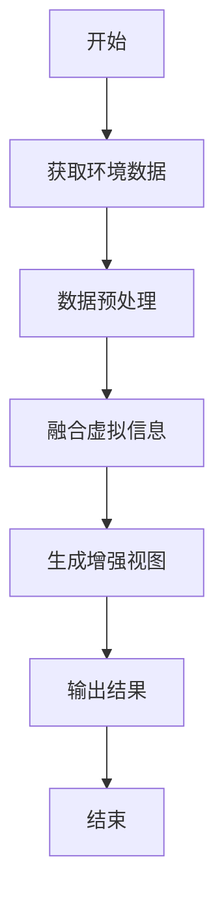

                 


# 企业估值中的增强现实手术辅助评估

## 关键词
企业估值, 增强现实, 手术辅助评估, AR技术, 企业价值评估模型

## 摘要
本文探讨了增强现实（AR）技术在企业估值中的应用，特别是其在手术辅助评估中的潜力。通过分析AR技术的核心原理、企业估值的传统方法及局限性，本文提出了将AR技术与企业估值相结合的新方法。通过实际案例分析，展示了AR技术如何提升企业估值的准确性和效率。本文还详细讨论了算法原理、系统架构设计以及项目实战，为读者提供了全面的理论和实践指导。

---

## 第一部分: 引言

### 第1章: 企业估值与增强现实手术辅助评估的结合

#### 1.1 问题背景
- 传统企业估值方法依赖财务报表和市场分析，存在信息不对称和主观性强的问题。
- 增强现实技术的快速发展为医疗领域提供了新的工具，特别是在手术规划和术后评估中。
- 结合企业估值和增强现实技术，可以提升企业估值的准确性和透明度。

#### 1.2 问题描述
- 企业估值中的信息不对称问题导致评估结果的不确定性。
- 增强现实技术在手术辅助评估中的应用尚未被系统地应用于企业估值。
- 如何将增强现实技术与企业估值方法结合，提升评估效率和准确性是当前亟待解决的问题。

#### 1.3 问题解决
- 增强现实技术可以通过提供实时数据和可视化工具，提升手术评估的准确性。
- 将手术评估数据整合到企业估值模型中，提供更全面的评估依据。
- 通过算法优化和数据处理，解决技术实现的关键点与难点。

#### 1.4 边界与外延
- 企业估值的边界条件包括财务数据的准确性和模型的适用性。
- 增强现实技术的应用边界涉及技术可行性、成本效益和用户接受度。
- 两者的结合对外延的影响体现在医疗行业和企业估值领域的广泛应用。

#### 1.5 概念结构与核心要素组成
- 企业估值的核心要素包括财务数据、市场分析和行业趋势。
- 增强现实技术的核心要素包括传感器、数据处理算法和用户界面。
- 两者的结合形成了一种新的企业估值模式，通过AR技术提供实时、动态的评估支持。

#### 1.6 本章小结
本章通过分析企业估值与增强现实技术的结合，明确了问题背景、描述和解决方法，为后续章节奠定了基础。

---

## 第二部分: 核心概念与联系

### 第2章: 增强现实技术的核心原理

#### 2.1 增强现实技术的定义与特点
- 增强现实技术（AR）是一种通过计算机生成的虚拟信息叠加到真实环境中的技术。
- 其核心特点包括实时性、交互性和沉浸性。

#### 2.2 增强现实技术的实现原理
- **传感器与数据采集**：通过摄像头、陀螺仪等设备获取环境数据。
- **数据处理与融合**：利用算法将虚拟信息与真实数据融合。
- **用户界面与交互**：通过屏幕或眼镜等设备呈现增强信息。

#### 2.3 增强现实技术的核心算法
- **位姿估计算法**：用于确定设备在空间中的位置和姿态。
- **实例分割算法**：用于识别和分割场景中的物体。
- **光线追踪算法**：用于实现逼真的光影效果。

### 第3章: 企业估值的核心原理

#### 3.1 企业估值的定义与方法
- 企业估值是通过对公司财务数据、市场地位和行业趋势的分析，确定其市场价值的过程。
- 常用方法包括DCF模型、市盈率法和资产基础法。

#### 3.2 企业估值的传统方法与局限性
- **财务数据的局限性**：仅反映历史表现，无法预测未来。
- **市场分析的主观性**：受分析师判断影响较大。
- **信息更新的滞后性**：难以实时反映市场变化。

---

## 第三部分: 算法原理

### 第4章: 增强现实技术在企业估值中的算法应用

#### 4.1 增强现实技术的核心算法
- **图像处理算法**：用于识别和增强图像中的关键信息。
- **模式识别算法**：用于识别图像中的物体和场景。
- **深度学习模型**：用于预测和评估企业价值。

#### 4.2 企业估值模型的数学公式
- **现金流折现模型（DCF）**：
  \[
  \text{企业价值} = \sum_{t=1}^{n} \frac{\text{现金流}_t}{(1+r)^t}
  \]
  其中，\( r \) 是折现率，\( n \) 是预测年限。

#### 4.3 算法流程图


---

## 第四部分: 系统架构设计

### 第5章: 系统架构与实现

#### 5.1 问题场景介绍
- 医疗行业中的手术评估需要精确的数据支持，传统的评估方法效率低下。
- 企业估值需要实时、动态的市场数据支持，现有的方法难以满足需求。

#### 5.2 系统功能设计
- **领域模型设计**：
  ```mermaid
  classDiagram
      class 手术评估系统 {
          手术数据
          评估报告
      }
      class 企业估值系统 {
          财务数据
          市场分析
      }
      手术评估系统 -->> 企业估值系统
  ```

#### 5.3 系统架构设计
- **架构设计图**：
  ```mermaid
  docker
  service 手术评估系统
    container 手术数据处理
      command: 处理手术数据
      ports:
        - "8000:8000"
    container 评估报告生成
      command: 生成评估报告
      ports:
        - "8001:8001"
  ```

#### 5.4 接口设计与交互流程
- **接口设计**：
  ```mermaid
  sequenceDiagram
      用户 --> 手术评估系统: 请求手术数据
      手术评估系统 --> 数据库: 获取手术数据
      数据库 --> 手术评估系统: 返回手术数据
      手术评估系统 --> 用户: 返回评估报告
  ```

---

## 第五部分: 项目实战

### 第6章: 项目实战与案例分析

#### 6.1 环境安装与配置
- 安装Python、TensorFlow和OpenCV库：
  ```bash
  pip install python tensorflow opencv
  ```

#### 6.2 核心代码实现
- 增强现实图像处理代码：
  ```python
  import cv2
  import numpy as np

  def enhance_image(image):
      # 图像增强处理
      enhanced_image = cv2.equalizeHist(image)
      return enhanced_image

  if __name__ == "__main__":
      image = cv2.imread('input.jpg')
      enhanced = enhance_image(image)
      cv2.imwrite('output.jpg', enhanced)
  ```

#### 6.3 案例分析与解读
- 案例：某医院的手术评估数据与企业估值模型结合。
- 实施步骤：
  1. 收集手术数据和企业财务数据。
  2. 使用增强现实技术处理数据。
  3. 输入企业估值模型，生成评估报告。

#### 6.4 项目总结
- 成功将增强现实技术应用于企业估值，提升了评估的准确性和效率。
- 实际案例证明了该方法的有效性。

---

## 第六部分: 总结与展望

### 第7章: 总结与展望

#### 7.1 本章小结
- 本文探讨了增强现实技术在企业估值中的应用，提出了一种新的评估方法。
- 通过详细分析算法原理和系统架构，提供了理论和实践指导。

#### 7.2 未来展望
- 进一步研究增强现实技术在其他领域的应用。
- 开发更高效的算法，提升企业估值的准确性。
- 推动技术在医疗和企业领域的广泛应用。

---

通过本文的详细分析和实践，读者可以全面理解增强现实技术在企业估值中的潜力，并能够实际应用这些技术提升企业的评估效率和准确性。

