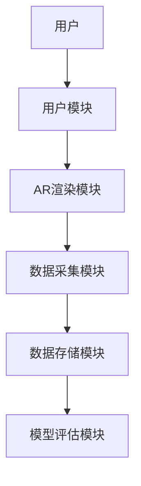
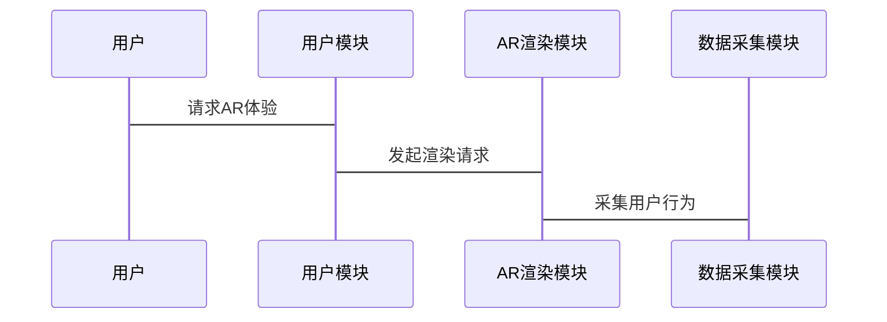

                 


# 企业估值中的增强现实营销效果评估

## 关键词
企业估值, 增强现实营销, 效果评估, 数学模型, 系统架构, 项目实战

## 摘要
本文探讨了增强现实技术在营销效果评估中的应用及其对企业估值的影响。通过分析AR营销的原理、评估指标及数学模型，结合系统架构设计和实际案例，展示了如何利用AR技术提升营销效果评估的准确性和效率，进而优化企业估值。

---

## 第1章：企业估值与增强现实营销概述

### 1.1 问题背景
- **传统营销评估的局限性**：传统方法难以量化用户互动，难以实时反馈。
- **增强现实技术的兴起**：AR技术的沉浸式体验为营销提供了新方式。
- **企业估值与营销效果的关系**：营销效果直接影响企业品牌价值和市场表现。

### 1.2 增强现实营销的定义与特点
- **定义**：通过AR技术将虚拟元素叠加到现实环境中，增强用户体验。
- **特点**：沉浸性、交互性、实时性、数据驱动。

### 1.3 当前企业估值中的营销效果评估现状
- **现有方法的优缺点**：难以实时评估，缺乏互动数据。
- **AR技术的应用现状**：部分企业开始采用AR营销，但评估体系不完善。

### 1.4 增强现实营销效果评估的挑战与机遇
- **技术挑战**：数据采集、处理和分析的复杂性。
- **市场机遇**：提升用户体验，增强品牌认知。

---

## 第2章：增强现实营销效果评估的核心概念

### 2.1 增强现实营销的原理
- **AR技术的基本原理**：通过摄像头和算法将虚拟内容叠加到现实场景。
- **营销应用方式**：互动广告、虚拟试用、品牌展示。

### 2.2 营销效果评估的指标体系
- **用户参与度**：互动频率、时长。
- **品牌认知度**：品牌记忆、提及率。
- **营销转化率**：从互动到购买的转化。

### 2.3 增强现实营销效果评估的核心要素
- **用户行为数据**：记录用户的互动行为。
- **内容互动性**：内容设计是否吸引用户。
- **技术稳定性**：AR系统的运行流畅性。

---

## 第3章：增强现实营销效果评估的数学模型

### 3.1 模型概述
- **构建目的**：预测营销效果，优化策略。
- **适用范围**：适用于AR营销活动的效果预测。

### 3.2 模型的数学表达
- **用户参与度预测模型**：
  $$ P(u) = \alpha \cdot T + \beta \cdot C + \gamma \cdot S $$
  其中，$T$为时间，$C$为内容吸引力，$S$为系统稳定性。
- **营销转化率预测模型**：
  $$ C(u) = \theta \cdot P(u) + \phi \cdot R $$
  其中，$R$为用户反馈。

### 3.3 算法实现
- **数据预处理**：清洗和归一化。
- **模型训练**：使用历史数据训练模型。
- **模型评估**：通过AUC、F1分数等指标评估效果。

---

## 第4章：增强现实营销效果评估系统的架构设计

### 4.1 系统功能模块划分
- **用户模块**：用户注册、登录、互动。
- **AR渲染模块**：生成虚拟内容并叠加到现实。
- **数据采集模块**：收集用户行为数据。

### 4.2 系统架构设计


### 4.3 系统接口设计
- **用户接口**：API用于用户交互。
- **数据接口**：实时传输用户行为数据。

### 4.4 系统交互设计


---

## 第5章：项目实战

### 5.1 环境安装
- **工具**：安装AR开发框架和相关库。
- **依赖管理**：使用pip安装Python库。

### 5.2 核心代码实现
```python
import numpy as np
from sklearn.metrics import accuracy_score

# 用户行为数据
def model_predict(X):
    # 模型预测
    return np.dot(X, weights) + bias

# 评估函数
def evaluate_model(y_true, y_pred):
    return accuracy_score(y_true, y_pred)
```

### 5.3 案例分析
- **案例背景**：某品牌AR广告活动。
- **数据输入**：用户点击次数、停留时间。
- **模型输出**：预测用户参与度和转化率。

---

## 第6章：最佳实践

### 6.1 技巧与注意事项
- 数据质量至关重要。
- 模型需定期更新。
- 优化用户体验。

### 6.2 小结
通过增强现实技术提升营销效果评估，优化企业估值。

### 6.3 注意事项
确保数据隐私和系统稳定性。

### 6.4 拓展阅读
推荐相关书籍和论文。

---

## 附录
- **术语表**：解释关键术语。
- **参考文献**：引用的相关资料。

---

通过以上结构，文章详细探讨了增强现实营销效果评估对企业估值的影响，结合理论与实践，提供了全面的技术指导。

