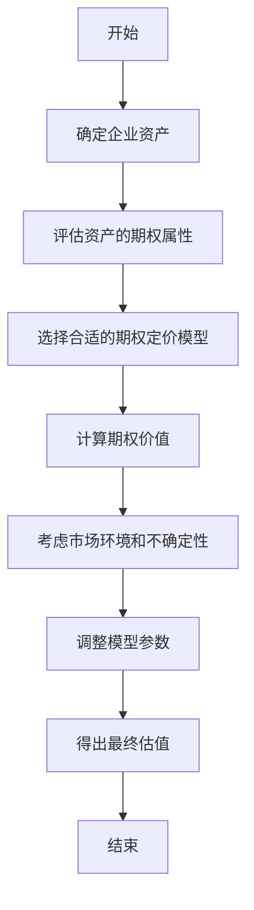
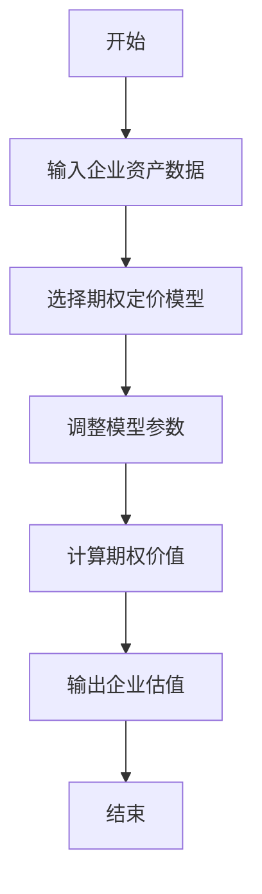
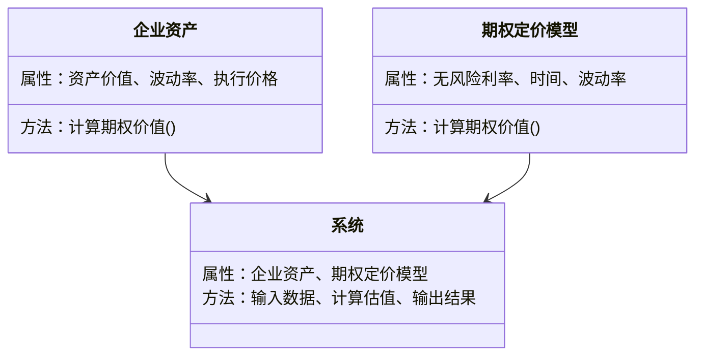
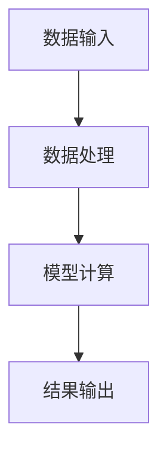
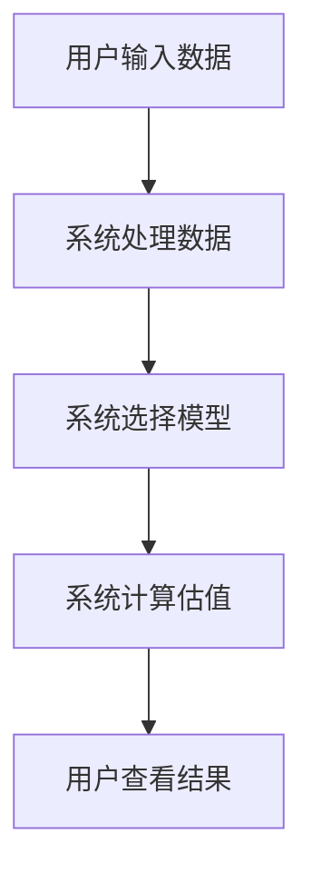

                 


# 企业估值中的实物期权法

> 关键词：实物期权法、企业估值、期权定价模型、Black-Scholes模型、企业资产评估

> 摘要：本文详细探讨了实物期权法在企业估值中的应用，分析了其实质原理、数学模型、系统架构，并通过实际案例展示了如何将实物期权法应用于企业估值。文章旨在帮助企业更好地理解实物期权法的优势，并在实践中有效应用。

---

## 第1章: 实物期权法概述

### 1.1 实物期权法的概念与背景
实物期权法是一种将企业的某些资产或业务视为期权的估值方法，特别适用于具有高度不确定性的企业或项目。它通过考虑企业资产的灵活性和未来发展的潜力，提供更准确的企业估值。

#### 1.1.1 什么是实物期权法
实物期权法将企业的资产或业务看作一种期权，允许企业在特定条件下行使选择权，如扩展、收缩或终止某个项目。这种方法能够捕捉到企业资产的期权价值，帮助企业在不确定环境下做出更明智的决策。

#### 1.1.2 实物期权法的起源与发展
实物期权法起源于金融期权定价理论，尤其是Black-Scholes模型。它最初用于金融市场，后来被扩展应用到企业估值领域。随着企业面临的不确定性和复杂性增加，实物期权法逐渐成为一种重要的估值工具。

#### 1.1.3 实物期权法在企业估值中的应用范围
实物期权法适用于各种类型的企业，特别是在技术快速变化、市场不确定性较高的行业。它特别适合评估具有可延展性资产或多个潜在增长点的企业。

---

### 1.2 企业估值的传统方法与局限性

#### 1.2.1 现金流量折现法（DCF）
DCF方法通过预测未来现金流并将其折现为现值来评估企业价值。然而，这种方法高度依赖于对未来现金流的准确预测，在不确定性较高的情况下可能不够可靠。

#### 1.2.2 市盈率法与市净率法
市盈率法和市净率法基于市场价格与财务指标（如净利润、净资产）的比率进行估值。这些方法简单易用，但在企业价值较高的不确定性情况下，可能无法准确反映企业的潜在价值。

#### 1.2.3 传统方法的局限性
传统估值方法通常假设市场是完全理性和确定的，但现实中市场常常存在不确定性，企业资产具有灵活性和期权价值，传统方法难以捕捉这些因素。

---

### 1.3 实物期权法的核心优势

#### 1.3.1 灵活性与适应性
实物期权法将企业的资产或业务视为期权，能够捕捉到企业资产的灵活性和未来发展的潜力，从而提供更准确的估值。

#### 1.3.2 考虑不确定性与期权价值
实物期权法通过考虑市场波动、资产成长性等因素，能够更准确地评估企业在不确定环境下的价值。

#### 1.3.3 与现代金融理论的结合
实物期权法基于现代金融理论，尤其是期权定价模型，能够将企业估值与金融市场工具相结合，提供更科学的估值方法。

---

## 第2章: 实物期权法的核心概念与联系

### 2.1 实物期权法的核心原理

#### 2.1.1 期权的基本定义与属性
期权是一种权利，允许其持有者在特定时间内以预定价格购买或出售某种资产。实物期权法将企业的资产或业务视为这种期权，从而在估值时考虑其潜在的期权价值。

#### 2.1.2 实物期权法的数学模型
实物期权法的数学模型基于Black-Scholes模型，但根据企业的具体情况进行了扩展和调整。模型考虑了资产的波动性、执行价格、到期时间等因素，以计算期权的价值。

#### 2.1.3 实物期权与金融期权的对比分析
实物期权与金融期权在本质上相似，但实物期权更加灵活，可以根据企业的实际情况进行定制化调整，而金融期权通常是在标准化市场上交易。

---

### 2.2 实物期权法的实体关系图

#### 2.2.1 实物期权法的ER实体关系图
以下是实物期权法的ER实体关系图：

```mermaid
erd
  实体：企业
  实体：资产
  实体：期权
  实体：市场环境

  关系：企业拥有资产
  关系：资产对应期权
  关系：市场环境影响期权价值
```

#### 2.2.2 实物期权与企业资产的关系
企业资产可以被视为期权标的资产，而企业本身可以被视为期权的持有者，拥有对资产的控制权和决策权。

#### 2.2.3 实物期权法的流程图
以下是实物期权法的流程图：



---

### 2.3 实物期权法的数学模型与算法原理

#### 2.3.1 Black-Scholes模型的扩展
Black-Scholes模型是金融领域常用的期权定价模型，其基本公式如下：

$$
C = S_0 \cdot N(d_1) - K \cdot e^{-rT} \cdot N(d_2)
$$

其中：
- \( C \) 是期权的价值
- \( S_0 \) 是标的资产的当前价格
- \( K \) 是执行价格
- \( r \) 是无风险利率
- \( T \) 是到期时间
- \( N(d) \) 是标准正态分布的累积分布函数
- \( d_1 = \frac{\ln(S_0/K) + (r + \sigma^2/2)T}{\sigma \sqrt{T}} \)
- \( d_2 = d_1 - \sigma \sqrt{T} \)
- \( \sigma \) 是标的资产价格的波动率

#### 2.3.2 实物期权法的数学推导
实物期权法在Black-Scholes模型的基础上，根据企业的实际情况进行了扩展和调整。例如，考虑企业的成长性、竞争环境等因素，引入更多的变量和假设。

#### 2.3.3 实物期权的 Greeks 计算
Greeks是衡量期权价格对不同变量敏感性的指标，包括delta、gamma、theta等。以下是delta的计算公式：

$$
\Delta = N(d_1)
$$

---

## 第3章: 实物期权法的系统分析与架构设计

### 3.1 实物期权评估系统的功能设计

#### 3.1.1 系统功能模块划分
- 数据输入模块：接收企业资产、市场环境等数据
- 模型构建模块：选择合适的期权定价模型
- 参数调整模块：根据实际情况调整模型参数
- 结果输出模块：输出企业估值结果

#### 3.1.2 系统功能流程图
以下是系统功能流程图：



#### 3.1.3 系统功能的领域模型
以下是系统功能的领域模型：



---

### 3.2 实物期权评估系统的架构设计

#### 3.2.1 系统架构图
以下是系统架构图：



#### 3.2.2 系统模块之间的关系
数据输入模块接收企业资产数据，数据处理模块选择合适的期权定价模型，模型计算模块调整模型参数并计算期权价值，结果输出模块将估值结果呈现给用户。

#### 3.2.3 系统接口设计
系统接口包括数据输入接口、模型选择接口、参数调整接口和结果输出接口。

---

### 3.3 实物期权评估系统的交互设计

#### 3.3.1 系统交互流程图
以下是系统交互流程图：



---

## 第4章: 实物期权法的项目实战

### 4.1 项目背景与目标

#### 4.1.1 项目背景
选择一家科技公司作为案例，该公司拥有多项专利和技术，具有较高的成长性和不确定性。

#### 4.1.2 项目目标
通过实物期权法评估该科技公司的企业价值，验证其在实际应用中的有效性和准确性。

---

### 4.2 项目实施步骤

#### 4.2.1 数据收集与准备
收集公司的财务数据、市场数据、资产信息等，为模型计算提供输入。

#### 4.2.2 模型选择与实现
选择Black-Scholes模型，根据公司实际情况调整模型参数，如波动率、执行价格等。

#### 4.2.3 案例分析与结果解读
计算期权价值，将其纳入企业整体估值，分析结果的合理性和准确性。

---

### 4.3 核心代码实现

#### 4.3.1 环境安装
安装必要的Python库，如numpy、scipy、matplotlib等。

#### 4.3.2 核心代码
以下是核心代码：

```python
import numpy as np
from scipy.stats import norm

def black_scholes(S, K, r, T, sigma):
    d1 = (np.log(S/K) + (r + sigma**2/2)*T) / (sigma*np.sqrt(T))
    d2 = d1 - sigma*np.sqrt(T)
    C = S * norm.cdf(d1) - K * np.exp(-r*T) * norm.cdf(d2)
    return C

# 示例数据
S = 100
K = 105
r = 0.05
T = 1
sigma = 0.2

value = black_scholes(S, K, r, T, sigma)
print("期权价值:", value)
```

#### 4.3.3 代码解读与分析
以上代码实现了Black-Scholes模型，计算了期权的价值。根据输入的参数，模型能够准确反映资产的波动性和市场环境对企业价值的影响。

---

### 4.4 项目总结与反思

#### 4.4.1 实施过程中的挑战
在实际应用中，模型参数的准确性和假设的合理性对结果影响较大，需要结合实际情况进行调整。

#### 4.4.2 实施效果与改进方向
实物期权法能够有效捕捉企业资产的期权价值，但在高度不确定的环境下，模型的准确性可能受到限制，需要进一步优化和调整。

---

## 第5章: 实物期权法的最佳实践与注意事项

### 5.1 实物期权法的最佳实践

#### 5.1.1 模型选择与参数调整
根据企业的实际情况选择合适的模型，并合理调整参数，以提高估值的准确性。

#### 5.1.2 数据收集与处理
确保数据的准确性和完整性，特别是市场波动率和资产流动性等关键变量。

#### 5.1.3 结果解读与应用
结合企业的战略目标和市场环境，合理解读模型结果，并制定相应的决策策略。

---

### 5.2 实物期权法的注意事项

#### 5.2.1 模型的局限性
实物期权法基于一系列假设，如资产价格的随机游走、市场无套利机会等，在实际应用中可能不完全成立。

#### 5.2.2 数据的敏感性
模型结果对输入数据的敏感性较高，特别是在波动率和执行价格方面，需要谨慎处理。

#### 5.2.3 模型的适用性
实物期权法适用于具有高度不确定性和灵活性的企业，但在稳定性和确定性较高的行业可能效果有限。

---

## 第6章: 总结与展望

### 6.1 总结
实物期权法是一种强大的企业估值工具，能够捕捉企业资产的期权价值，帮助企业在不确定环境下做出更明智的决策。

### 6.2 展望
随着人工智能和大数据技术的发展，实物期权法的应用前景广阔，未来可以通过更多的技术创新和实践应用进一步优化模型和提升估值效果。

---

通过本文的详细讲解，读者可以全面了解实物期权法的理论基础、数学模型和实际应用，并能够在实际工作中有效运用这一方法进行企业估值。

