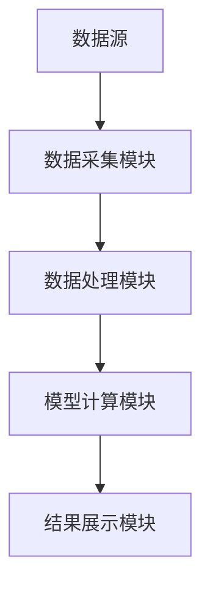
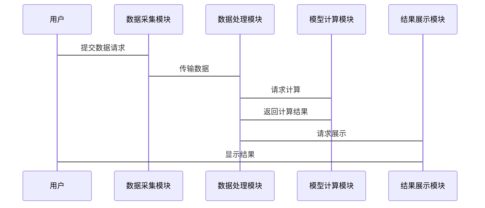

                 

# 《企业估值中的客户价值评估法》

---

## 关键词：
企业估值、客户价值评估、客户终身价值、数据分析、机器学习、系统架构、项目实战

---

## 摘要：
企业估值是企业管理和决策中的核心问题，而客户价值评估是其中的关键环节。本文系统地探讨了客户价值评估的核心理论、数学模型、数据分析方法以及系统实现方案。通过客户生命周期理论和客户终身价值（CLV）模型，结合实际案例分析和系统架构设计，为读者提供从理论到实践的完整指导。

---

# 目录大纲

---

## 第1章: 客户价值评估的基本概念

### 1.1 企业估值中的客户价值概念

#### 1.1.1 什么是客户价值
客户价值是指客户为企业带来的长期经济收益，包括直接收入和间接价值。

#### 1.1.2 客户价值在企业估值中的作用
客户价值是企业估值的重要组成部分，影响企业的市场价值和投资决策。

#### 1.1.3 客户价值评估的必要性
通过评估客户价值，企业可以优化资源配置，提升客户生命周期价值。

### 1.2 客户价值评估的背景与问题

#### 1.2.1 传统企业估值方法的局限性
传统方法忽视客户粘性和客户质量的差异，无法准确评估企业价值。

#### 1.2.2 客户价值评估的兴起
随着数据技术的发展，客户价值评估成为企业估值的重要手段。

#### 1.2.3 企业估值中的客户价值问题描述
如何量化客户价值，如何预测客户流失率，如何优化客户生命周期管理。

### 1.3 客户价值评估的核心要素

#### 1.3.1 客户生命周期模型
客户从获取到流失的全过程，不同阶段的客户价值贡献不同。

#### 1.3.2 客户价值的构成要素
包括客户收入贡献、客户生命周期、客户保留率等。

#### 1.3.3 客户价值评估的边界与外延
客户价值的评估范围和适用场景。

---

## 第2章: 客户价值评估的理论基础

### 2.1 客户生命周期理论

#### 2.1.1 客户生命周期的阶段划分
客户生命周期分为获取阶段、成长阶段、成熟阶段和衰退阶段。

#### 2.1.2 各阶段的客户价值特征
不同阶段的客户价值贡献和行为特征。

#### 2.1.3 生命周期模型与客户价值的关系
客户生命周期模型是客户价值评估的重要工具。

### 2.2 客户价值评估的数学模型

#### 2.2.1 客户终身价值（CLV）的定义
CLV是客户在企业生命周期中为企业带来的净现值。

#### 2.2.2 CLV的计算公式与变量解释
$$ CLV = \frac{R \times (1 - \frac{1}{(1 + d)^n})}{d} $$

其中：
- R为客户的年收入贡献
- d为贴现率
- n为客户生命周期长度

#### 2.2.3 CLV模型的应用场景
适用于长期客户价值预测和客户保留策略制定。

### 2.3 数据驱动的客户价值评估方法

#### 2.3.1 数据驱动的客户价值评估优势
基于数据的客户价值评估更精准、更科学。

#### 2.3.2 数据驱动方法的实现步骤
数据收集、数据清洗、特征工程、模型构建与验证。

#### 2.3.3 数据驱动方法的优缺点对比
优势：精准性高；劣势：数据依赖性强。

---

## 第3章: 客户价值的量化方法

### 3.1 客户分层与价值量化

#### 3.1.1 客户分层的依据
基于收入贡献、客户生命周期、客户行为特征等。

#### 3.1.2 客户分层的实现方法
使用聚类分析、决策树等机器学习方法。

#### 3.1.3 不同客户层的价值量化
高价值客户、中价值客户和低价值客户的价值计算。

### 3.2 客户价值的RFM模型

#### 3.2.1 RFM模型的定义
R（Recency）：最近一次消费的时间
F（Frequency）：消费频率
M（Monetary）：消费金额

#### 3.2.2 RFM模型的实现步骤
数据收集、特征提取、客户分层、价值评估。

#### 3.2.3 RFM模型的应用案例
基于RFM模型的客户价值分层与预测。

---

## 第4章: 客户价值评估的关键指标分析

### 4.1 客户获取成本（CAC）分析

#### 4.1.1 CAC的定义与计算
CAC = （营销成本 + 销售成本） / 客户获取数量

#### 4.1.2 CAC与客户生命周期价值的关系
CAC < CLV时，客户获取是盈利的。

#### 4.1.3 CAC的优化策略
降低营销成本、提高客户转化率。

### 4.2 客户保留率分析

#### 4.2.1 客户保留率的定义
客户保留率 = （现有客户数 - 新增客户数） / 现有客户数

#### 4.2.2 客户保留率的影响因素
客户满意度、产品价值、客户忠诚度。

#### 4.2.3 客户保留率的提升策略
优化客户体验、提供增值服务、建立客户忠诚计划。

### 4.3 客户满意度分析

#### 4.3.1 客户满意度的定义
客户满意度是客户对企业产品或服务的满意程度。

#### 4.3.2 客户满意度的测量方法
问卷调查、数据分析、对比分析。

#### 4.3.3 客户满意度与客户价值的关系
高满意度客户更可能成为高价值客户。

---

## 第5章: 数据分析与客户价值评估建模

### 5.1 数据预处理与特征工程

#### 5.1.1 数据清洗
处理缺失值、异常值、重复值。

#### 5.1.2 特征提取
从原始数据中提取有用的特征，如交易频率、交易金额、客户行为特征。

#### 5.1.3 特征工程
特征标准化、特征组合、特征降维。

### 5.2 客户价值评估模型的选择与实现

#### 5.2.1 模型选择
基于客户价值预测的常用模型，如线性回归、随机森林、XGBoost。

#### 5.2.2 模型实现步骤
数据分割、模型训练、模型验证、模型优化。

#### 5.2.3 模型评估指标
MAE、RMSE、R²等回归模型评估指标。

### 5.3 客户价值预测与可视化

#### 5.3.1 客户价值预测结果
基于模型预测的客户终身价值（CLV）。

#### 5.3.2 预测结果的可视化
使用折线图、柱状图、散点图等展示客户价值分布。

#### 5.3.3 可视化工具
Matplotlib、Seaborn、Tableau。

---

## 第6章: 系统架构与客户价值评估实现

### 6.1 客户价值评估系统架构设计

#### 6.1.1 系统功能模块
数据采集模块、数据处理模块、模型计算模块、结果展示模块。

#### 6.1.2 系统架构图
使用Mermaid绘制系统架构图。

#### 6.1.3 系统交互设计
使用Mermaid绘制系统交互序列图。

### 6.2 客户价值评估系统的实现

#### 6.2.1 数据接口设计
API接口设计，如RESTful API。

#### 6.2.2 系统集成
前后端分离架构，前端展示结果，后端处理数据和模型计算。

#### 6.2.3 系统优化
使用分布式计算、缓存机制优化性能。

---

## 第7章: 项目实战与案例分析

### 7.1 项目背景与目标

#### 7.1.1 项目背景
某电商企业希望通过客户价值评估优化客户管理。

#### 7.1.2 项目目标
构建客户价值评估系统，预测客户终身价值，优化客户管理策略。

### 7.2 项目实施步骤

#### 7.2.1 环境搭建
安装Python、Pandas、Scikit-learn、Flask等工具。

#### 7.2.2 数据采集
从数据库中提取客户交易数据、行为数据。

#### 7.2.3 数据预处理
清洗数据、特征工程。

#### 7.2.4 模型实现
选择XGBoost模型，训练客户价值预测模型。

#### 7.2.5 结果分析
输出客户价值分层结果，优化客户管理策略。

### 7.3 项目小结

#### 7.3.1 项目成果
构建了客户价值评估系统，实现了客户价值预测。

#### 7.3.2 项目经验
数据质量对模型性能影响重大，系统架构设计需考虑可扩展性。

---

## 第8章: 最佳实践与总结

### 8.1 最佳实践

#### 8.1.1 数据质量管理
确保数据准确性和完整性。

#### 8.1.2 模型优化
定期更新模型，结合最新数据进行优化。

#### 8.1.3 系统维护
持续监控系统性能，及时修复问题。

### 8.2 小结

#### 8.2.1 全文总结
客户价值评估是企业估值的重要组成部分，数据驱动的方法更具优势。

#### 8.2.2 未来趋势
人工智能和大数据技术将进一步提升客户价值评估的精准性。

---

## 附录

### 附录A: 工具安装指南
安装Python、Pandas、Scikit-learn等工具的步骤说明。

### 附录B: 数据来源与处理
常用数据清洗方法和数据增强技术。

### 附录C: 参考文献
列出相关文献和资料。

---

通过以上目录大纲，我们可以系统地从理论到实践，全面掌握企业估值中的客户价值评估方法。

