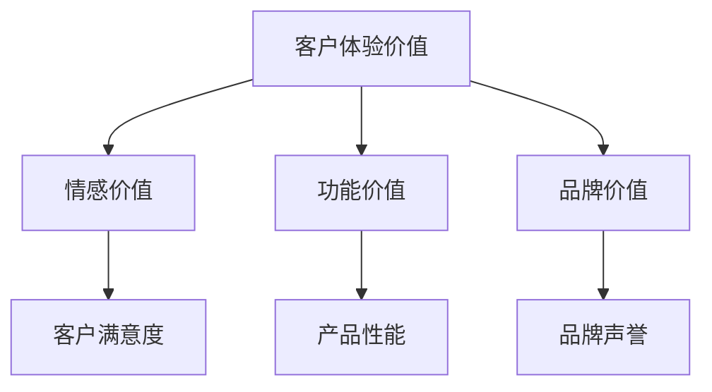
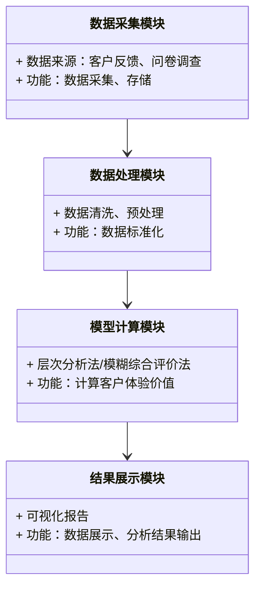

                 


# 企业估值中的客户体验价值分析

## 关键词：企业估值，客户体验，价值分析，层次分析法，模糊综合评价法，系统架构

## 摘要：  
本文探讨了客户体验在企业估值中的重要性，通过分析客户体验价值的核心构成、量化方法和系统设计，结合实际案例，展示了如何通过客户体验价值分析提升企业估值。文章详细介绍了层次分析法和模糊综合评价法的应用，并提出了构建客户体验价值分析系统的架构设计。

---

# 目录

1. **客户体验价值与企业估值概述**  
   - 1.1 客户体验价值的定义与内涵  
   - 1.2 企业估值的基本概念  
   - 1.3 客户体验在企业估值中的作用  

2. **客户体验价值的构成与分析框架**  
   - 2.1 客户体验价值的构成要素  
   - 2.2 客户体验价值与其他价值的关系  
   - 2.3 客户体验价值的分析框架  

3. **客户体验价值的量化方法**  
   - 3.1 层次分析法（AHP）的应用  
   - 3.2 模糊综合评价法的应用  
   - 3.3 数学模型与公式  

4. **客户体验价值分析系统的架构设计**  
   - 4.1 系统功能设计  
   - 4.2 系统架构设计  
   - 4.3 接口与交互设计  

5. **项目实战：客户体验价值分析系统实现**  
   - 5.1 环境安装与配置  
   - 5.2 核心代码实现  
   - 5.3 案例分析与解读  

6. **最佳实践与小结**  
   - 6.1 小结与总结  
   - 6.2 注意事项与建议  
   - 6.3 未来研究方向  

---

## 第1章：客户体验价值与企业估值概述

### 1.1 客户体验价值的定义与内涵  
客户体验（Customer Experience，CX）是指客户在与企业互动过程中所经历的所有感受、情感和认知的总和。客户体验价值则是这些互动所产生的价值，反映了客户对企业的满意度、忠诚度和推荐意愿。

### 1.2 企业估值的基本概念  
企业估值是通过对企业的财务状况、市场地位、盈利能力等多方面因素的综合评估，确定企业的市场价值。传统的企业估值方法包括市盈率法、DCF模型等，但忽略了客户体验对企业价值的影响。

### 1.3 客户体验在企业估值中的作用  
客户体验直接影响客户忠诚度和客户生命周期价值，进而影响企业的收入和利润。通过量化客户体验价值，企业可以在估值中更准确地反映客户资产的价值。

---

## 第2章：客户体验价值的构成与分析框架

### 2.1 客户体验价值的构成要素  
客户体验价值由以下三个核心要素构成：  
1. **情感价值**：客户在与企业互动过程中产生的情感共鸣。  
2. **功能价值**：企业提供的产品或服务的实际价值。  
3. **品牌价值**：客户对品牌的认知和信任度。  

### 2.2 客户体验价值与其他价值的关系  
| 价值类型 | 定义 | 与客户体验的关系 |  
|----------|------|------------------|  
| 情感价值 | 客户在使用产品或服务时的情感体验 | 核心驱动因素 |  
| 功能价值 | 产品或服务的实际效用 | 支撑因素 |  
| 品牌价值 | 品牌的声誉和信任度 | 长期影响因素 |  

### 2.3 客户体验价值的分析框架  
客户体验价值的分析框架包括以下步骤：  
1. **确定关键指标**：如客户满意度（CSAT）、净推荐值（NPS）。  
2. **数据收集**：通过问卷调查、客户反馈等方式获取数据。  
3. **数据分析**：使用统计方法量化客户体验价值。  
4. **结果应用**：将分析结果应用于企业估值模型中。  

---

## 第3章：客户体验价值的量化方法

### 3.1 层次分析法（AHP）的应用  
层次分析法是一种常用的决策分析方法，适用于多指标评价问题。  
**步骤**：  
1. 建立层次结构模型（如图1所示）。  
2. 构造比较矩阵并计算权重。  
3. 计算一致性检验。  
4. 综合计算客户体验价值。  



**数学公式**：  
$$ A = \lambda_{max} - \frac{n-1}{n} $$  

### 3.2 模糊综合评价法的应用  
模糊综合评价法适用于指标模糊、难于量化的场景。  
**步骤**：  
1. 确定评价指标体系。  
2. 构造模糊关系矩阵。  
3. 计算模糊综合评价结果。  

**数学公式**：  
$$ V = \sum_{i=1}^{n} w_i x_i $$  

### 3.3 数学模型与公式  
层次分析法的权重计算公式：  
$$ w_i = \frac{a_{ij}}{\sum_{j=1}^{n} a_{ij}} } $$  

模糊综合评价法的评价结果公式：  
$$ V = \sum_{i=1}^{n} w_i \cdot r_i $$  

---

## 第4章：客户体验价值分析系统的架构设计

### 4.1 系统功能设计  
系统功能模块包括：  
- 数据采集模块：收集客户反馈数据。  
- 数据处理模块：清洗和预处理数据。  
- 模型计算模块：应用层次分析法或模糊综合评价法计算客户体验价值。  
- 结果展示模块：生成可视化报告。  



### 4.2 系统架构设计  
系统架构采用分层设计：  
- **表现层**：用户界面，展示分析结果。  
- **业务逻辑层**：处理用户请求，调用模型计算。  
- **数据访问层**：与数据库交互，存储和检索数据。  


### 4.3 接口与交互设计  
接口设计采用RESTful API，交互流程如下：  
1. 用户提交请求（如客户反馈数据）。  
2. 系统处理请求，计算客户体验价值。  
3. 返回结果，展示在用户界面上。  

```mermaid
sequenceDiagram
    客户 --> 系统：提交反馈数据
    系统 --> 数据采集模块：接收数据
    数据采集模块 --> 数据处理模块：数据清洗
    数据处理模块 --> 模型计算模块：计算价值
    模型计算模块 --> 结果展示模块：生成报告
    系统 --> 客户：返回报告
```

---

## 第5章：项目实战：客户体验价值分析系统实现

### 5.1 环境安装与配置  
- 安装Python和相关库（如pandas、numpy、scipy）。  
- 安装Jupyter Notebook用于开发和测试。  

### 5.2 核心代码实现  
以下是层次分析法的Python实现示例：  

```python
import numpy as np

def ahp(weights):
    n = len(weights)
    # 计算一致性检验
    CI = (np.max(weights) - np.mean(weights)) / (np.max(weights) - np.min(weights))
    CR = CI / 0.05  # 假设随机一致性指标为0.05
    if CR < 0.1:
        return weights
    else:
        return "不一致，请重新输入权重。"

# 示例权重向量
weights = [0.4, 0.3, 0.3]
print(ahp(weights))
```

### 5.3 案例分析与解读  
以某电商企业为例，通过收集客户反馈数据，计算客户体验价值，并将其纳入企业估值模型中，提升估值的准确性。

---

## 第6章：最佳实践与小结

### 6.1 小结与总结  
客户体验价值分析是企业估值的重要组成部分，通过量化客户体验价值，企业可以更全面地评估自身价值。

### 6.2 注意事项与建议  
- 数据收集要全面，确保指标的代表性。  
- 模型选择要根据实际情况，避免过度复杂化。  
- 结果应用要结合企业实际情况，避免片面性。  

### 6.3 未来研究方向  
- 探索更多客户体验量化方法，如机器学习模型的应用。  
- 研究客户体验价值的动态变化，提升模型的实时性。  

---

通过本文的分析与实践，读者可以掌握客户体验价值分析的核心方法，并将其应用于实际的企业估值中，为企业创造更大的价值。

