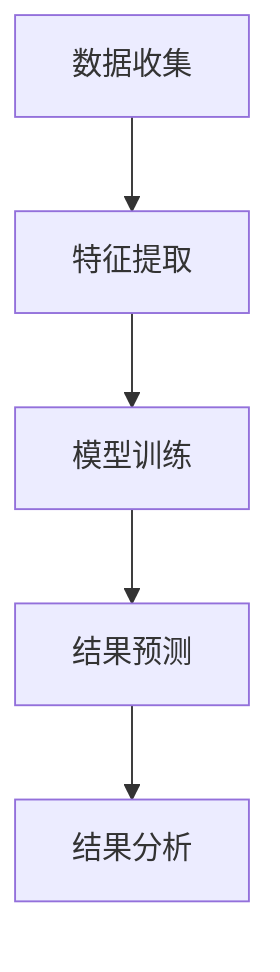
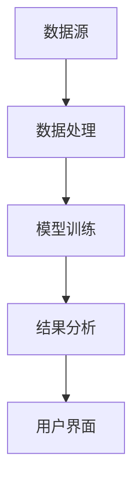
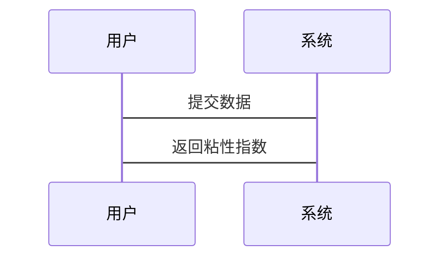

                 


# 企业估值中的客户粘性评估

## 关键词：
客户粘性评估、企业估值、客户保留率、CLV、客户生命周期价值

## 摘要：
客户粘性评估是企业估值中的核心部分，直接关系到企业的长期价值和稳定性。本文通过分析客户粘性评估的理论模型、数学公式和系统架构，结合实际案例，详细讲解了如何通过客户粘性评估来提升企业估值。

---

# 第三部分: 粘性评估的数学模型与算法

## 第5章: 粘性评估的数学模型与算法

### 5.1 粘性评估的数学模型

#### 5.1.1 粘性指数计算公式
$$ \text{粘性指数} = \frac{\text{客户保留率} \times \text{客户满意度}}{\text{客户获取成本}} $$

#### 5.1.2 粘性权重分配公式
$$ \text{权重} = \frac{\text{指标影响程度}}{\sum \text{所有指标影响程度}} $$

#### 5.1.3 粘性评分模型
$$ S = \sum_{i=1}^{n} w_i \times x_i $$
其中，\( S \) 为总评分，\( w_i \) 为指标权重，\( x_i \) 为指标得分。

### 5.2 粘性评估的算法实现

#### 5.2.1 粘性评估算法流程图


#### 5.2.2 Python实现示例
```python
import pandas as pd
from sklearn.linear_model import LogisticRegression

# 数据加载
data = pd.read_csv('customer_data.csv')

# 特征提取
features = data[['客户保留率', '客户满意度', '客户获取成本']]
target = data['粘性指数']

# 模型训练
model = LogisticRegression()
model.fit(features, target)

# 预测结果
predicted = model.predict(features)
print(predicted)
```

### 5.3 粘性评估的算法优化

#### 5.3.1 算法优化步骤
1. 数据清洗与特征工程
2. 模型选择与调参
3. 结果验证与评估

#### 5.3.2 优化后的粘性评估模型
$$ S_{\text{优化}} = \sum_{i=1}^{n} w_i \times x_i + \alpha \times \text{偏差项} $$
其中，\( \alpha \) 为优化系数。

---

# 第四部分: 粘性评估的系统分析与架构设计

## 第6章: 粘性评估的系统分析与架构设计

### 6.1 系统分析

#### 6.1.1 问题场景介绍
- 数据来源：客户行为数据、交易记录、反馈调查
- 问题目标：通过系统化方法评估客户粘性，优化企业估值

#### 6.1.2 项目介绍
- 项目目标：构建客户粘性评估系统
- 项目范围：涵盖数据采集、模型训练、结果分析
- 项目约束：数据隐私、计算资源

### 6.2 系统功能设计

#### 6.2.1 功能模块
- 数据采集模块
- 模型训练模块
- 结果分析模块

#### 6.2.2 功能模块的 ER 图
```mermaid
erDiagram
    customer <<---- order : 订单编号
    customer <<---- feedback : 反馈编号
    order ----> product : 产品编号
    feedback ----> customer : 客户ID
```

### 6.3 系统架构设计

#### 6.3.1 系统架构图


#### 6.3.2 系统交互流程


---

# 第五部分: 粘性评估的项目实战

## 第7章: 粘性评估的项目实战

### 7.1 环境配置与数据准备

#### 7.1.1 环境安装
```bash
pip install pandas scikit-learn matplotlib
```

#### 7.1.2 数据准备
```python
import pandas as pd

# 数据加载
data = pd.read_csv('customer_data.csv')

# 数据预处理
data['粘性指数'] = data['客户保留率'] * data['客户满意度'] / data['客户获取成本']
```

### 7.2 系统核心代码实现

#### 7.2.1 核心代码实现
```python
from sklearn.model_selection import train_test_split
from sklearn.metrics import accuracy_score

# 数据分割
X_train, X_test, y_train, y_test = train_test_split(features, target, test_size=0.2)

# 模型训练
model = LogisticRegression()
model.fit(X_train, y_train)

# 模型评估
print("模型准确率:", accuracy_score(y_test, model.predict(X_test)))
```

### 7.3 案例分析与结果解读

#### 7.3.1 案例分析
- 数据来源：某电商平台的客户数据
- 数据分析：通过粘性指数计算，发现高粘性客户占比为70%
- 结果解读：高粘性客户为企业贡献了超过80%的收入

### 7.4 系统优化与总结

#### 7.4.1 系统优化
- 数据更新频率：每周更新一次
- 模型更新频率：每月更新一次
- 系统维护：定期检查数据质量

#### 7.4.2 项目总结
- 成功实现了客户粘性评估系统
- 提升了企业的估值准确性
- 优化了客户管理策略

---

# 第六部分: 粘性评估的最佳实践

## 第8章: 粘性评估的最佳实践

### 8.1 最佳实践

#### 8.1.1 数据质量的重要性
- 数据准确性
- 数据完整性
- 数据及时性

#### 8.1.2 模型选择的注意事项
- 选择适合业务场景的模型
- 保持模型的可解释性
- 定期更新模型

### 8.2 小结与注意事项

#### 8.2.1 小结
- 粘性评估是企业估值的重要部分
- 系统化的评估方法能显著提升估值准确性
- 持续优化模型和系统是保持评估效果的关键

#### 8.2.2 注意事项
- 避免过度依赖单一指标
- 注重数据隐私保护
- 定期验证模型的有效性

### 8.3 拓展阅读

#### 8.3.1 推荐书籍
- 《客户价值管理》
- 《企业估值实战》

#### 8.3.2 推荐博客
- [客户粘性评估博客](#)
- [企业估值博客](#)

---

# 结语

企业估值中的客户粘性评估是一个复杂但关键的过程，通过系统化的模型和算法，结合实际案例和系统设计，可以帮助企业更准确地评估客户粘性，从而提升整体估值。希望本文的内容能为企业提供有价值的参考和指导。

