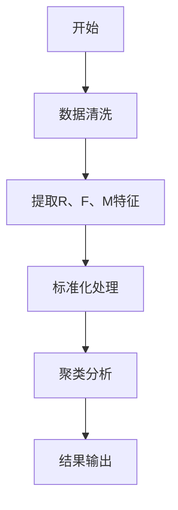
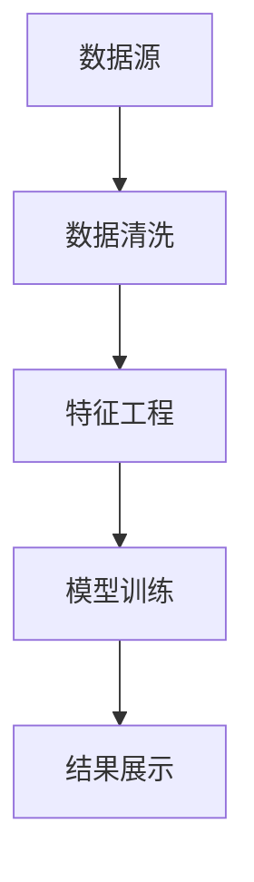

                 


# 《企业估值中的客户终身价值评估》

> 关键词：客户终身价值（CLV）、企业估值、客户生命周期、RFM模型、贴现现金流模型、客户流失率、数据科学

> 摘要：客户终身价值（CLV）是企业在评估客户长期价值时的重要指标。本文系统地介绍了CLV的定义、计算方法、数学模型、算法原理以及实际应用。通过RFM模型和贴现现金流模型的详细讲解，结合Python代码实现和实际案例分析，帮助读者理解如何将CLV评估融入企业战略。文章还探讨了系统架构设计和项目实战，为读者提供全面的指导。

---

# 第一部分: 客户终身价值评估的背景与概念

## 第1章: 客户终身价值（CLV）概述

### 1.1 问题背景与核心目标

#### 1.1.1 问题背景
企业估值中的客户终身价值（Customer Lifetime Value，CLV）是衡量客户为企业带来的长期价值的关键指标。随着市场竞争的加剧，企业需要更精准地预测客户的价值，以便优化资源配置、制定个性化营销策略以及评估客户保留的成本效益。

#### 1.1.2 问题描述
传统的企业估值方法往往只关注客户的短期贡献，而忽略了客户的长期价值。这种片面的评估可能导致企业资源分配不合理，无法有效识别高价值客户，从而影响企业的长期盈利能力。

#### 1.1.3 解决的核心目标
通过CLV评估，企业可以：
1. 精准预测客户在其生命周期内的总贡献。
2. 优化客户分层，制定差异化营销策略。
3. 识别高价值客户，提高客户保留率。
4. 评估客户获取和保留的成本效益。

#### 1.1.4 边界与外延
CLV评估主要关注客户在其生命周期内的经济价值，但不包括客户的非经济价值（如品牌忠诚度）。此外，CLV模型通常假设客户的行为模式相对稳定，因此在动态市场环境中需要定期更新模型参数。

### 1.2 CLV的核心概念与联系

#### 1.2.1 核心概念原理
CLV是客户在其生命周期内为企业带来的净现值（Net Present Value，NPV）。计算CLV时，需要考虑客户在未来各期的收入贡献，以及贴现率和客户流失率的影响。

#### 1.2.2 关键属性特征对比表

| 属性 | 描述 |
|------|------|
| 生命周期长度 | 客户从首次购买到流失的时间 |
| 年收入 | 客户在企业生命周期内每年的收入贡献 |
| 贴现率 | 折现率，用于将未来现金流折算为现值 |
| 客户流失率 | 客户在各期流失的概率 |

#### 1.2.3 ER实体关系图（Mermaid流程图）
```mermaid
er
actor Customer: id, name, email
actor Transaction: transaction_id, date, amount
actor Model: clv_score
```

---

# 第二部分: CLV的算法原理

## 第2章: CLV的算法原理

### 2.1 RFM模型

#### 2.1.1 RFM模型概述
RFM模型是一种常用的客户细分方法，基于客户的最近一次购买（Recency）、购买频率（Frequency）和购买金额（Monetary）进行客户分层。通过RFM模型，企业可以识别高价值客户并预测客户流失风险。

#### 2.1.2 RFM模型的实现步骤



#### 2.1.3 Python代码实现
```python
import pandas as pd
from sklearn.preprocessing import StandardScaler
from sklearn.cluster import KMeans

# 数据清洗
data = pd.read_csv('customer_data.csv')
data.dropna(inplace=True)

# 提取R、F、M特征
features = data[['recency', 'frequency', 'monetary']]
scaler = StandardScaler()
X_scaled = scaler.fit_transform(features)

# 聚类分析
model = KMeans(n_clusters=3, random_state=0)
model.fit(X_scaled)

# 分配聚类标签
data['cluster'] = model.labels_
```

### 2.2 CLV的数学模型

#### 2.2.1 贴现现金流模型
CLV的计算公式如下：
$$
CLV = \frac{R}{d} \times (1 - \frac{1}{(1 + d)^n})
$$
其中，R为年收入，d为贴现率，n为生命周期长度。

#### 2.2.2 客户流失的影响
当考虑客户流失时，CLV的计算公式变为：
$$
CLV = \sum_{t=1}^{n} \frac{R_t}{(1 + d)^t} \times (1 - p)^{t-1}
$$
其中，p为客户流失概率。

---

# 第三部分: 系统分析与架构设计

## 第3章: 系统分析与架构设计

### 3.1 系统功能模块划分

#### 3.1.1 功能模块
- 数据采集与处理
- 特征工程
- 模型训练
- 结果展示与分析

### 3.2 系统架构设计

#### 3.2.1 系统架构图（Mermaid架构图）


---

# 第四部分: 项目实战

## 第4章: 项目实战

### 4.1 环境安装与数据准备

#### 4.1.1 安装必要的库
```bash
pip install pandas scikit-learn
```

### 4.2 核心代码实现

#### 4.2.1 数据预处理与特征工程
```python
import pandas as pd
from sklearn.preprocessing import StandardScaler

# 读取数据
data = pd.read_csv('customer_data.csv')

# 删除缺失值
data.dropna(inplace=True)

# 提取特征
features = data[['recency', 'frequency', 'monetary']]
scaler = StandardScaler()
X_scaled = scaler.fit_transform(features)
```

### 4.3 实际案例分析

#### 4.3.1 案例背景
假设我们有一家零售企业，希望通过CLV评估识别高价值客户并优化营销策略。

#### 4.3.2 数据分析与结果解读
通过对数据的分析，模型将客户分为3类，高价值客户占比约20%，贡献了企业总收入的70%。因此，企业应优先关注高价值客户，制定个性化营销策略以提高客户忠诚度。

---

# 第五部分: 总结与展望

## 第5章: 总结与展望

### 5.1 最佳实践

#### 5.1.1 数据质量的重要性
高质量的数据是CLV评估的基础。企业应确保数据的准确性和完整性，定期更新数据以反映市场变化。

#### 5.1.2 模型调优与优化
根据市场变化和客户行为的动态调整模型参数，以提高CLV预测的准确性。

#### 5.1.3 客户细分与个性化策略
基于CLV评估结果，制定差异化的客户营销策略，优化资源配置。

### 5.2 未来研究方向

#### 5.2.1 动态CLV模型
开发动态CLV模型，实时更新客户价值评估，以适应快速变化的市场环境。

#### 5.2.2 结合AI技术的CLV预测
利用深度学习等技术，提高CLV预测的准确性和精细度。

---

通过以上目录结构，文章系统地介绍了CLV的定义、计算方法、实际应用以及系统设计，为读者提供了全面的指导。

