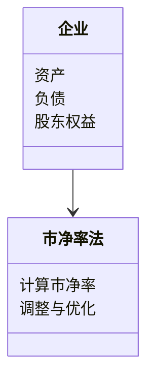
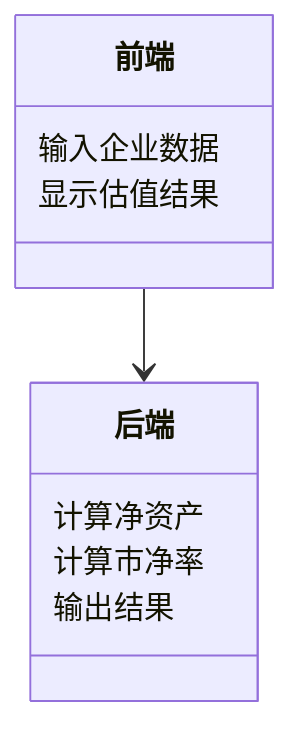

                 


# 企业估值中的市净率法详解

**关键词**：企业估值、市净率法、净资产、企业价值、投资分析

**摘要**：  
市净率法是企业估值中的一种重要方法，基于企业的净资产来评估其市场价值。本文详细介绍了市净率法的理论基础、计算方法、实际应用以及与其他估值方法的结合，通过案例分析和系统设计，帮助读者全面理解并掌握市净率法的精髓。文章还探讨了市净率法的局限性，并展望了未来的发展趋势。

---

# 第1章：市净率法的背景与概念

## 1.1 企业估值的基本概念
### 1.1.1 企业估值的定义与意义
企业估值是通过分析企业的财务状况、市场地位、盈利能力等因素，确定其市场价值的过程。它是企业并购、投资决策、融资等活动的重要依据。

### 1.1.2 企业估值的核心问题
企业估值的核心问题是确定企业的公平市场价值，这需要综合考虑企业的资产、负债、盈利能力、成长潜力等因素。

### 1.1.3 市净率法的提出与应用
市净率法是一种基于企业净资产的估值方法，广泛应用于金融、投资等领域。它通过比较企业的市净率与行业平均水平，评估企业的价值。

## 1.2 市净率法的定义与特点
### 1.2.1 市净率法的定义
市净率（P/B）是企业市值与其净资产的比率，公式为：
$$ P/B = \frac{Market\ Value}{Book\ Value\ of\ Equity} $$

### 1.2.2 市净率法的核心特点
- 基于净资产，适合重资产行业。
- 简单易懂，计算方便。
- 受行业和资产结构影响较大。

### 1.2.3 市净率法与其他估值方法的对比
与市盈率法相比，市净率法更关注企业的资产价值，适合亏损企业；与现金流折现法相比，市净率法计算复杂性较低。

## 1.3 市净率法的适用场景与局限性
### 1.3.1 市净率法的适用场景
- 适合重资产行业，如银行、房地产。
- 企业净资产稳定，资产流动性较高。

### 1.3.2 市净率法的局限性
- 忽略了企业的盈利能力和发展潜力。
- 受行业特性影响较大，不适合轻资产行业。

### 1.3.3 市净率法的改进方向
结合其他估值方法，如市盈率法和现金流折现法，综合评估企业价值。

## 1.4 本章小结

---

# 第2章：市净率法的理论基础

## 2.1 市净率法的理论框架
### 2.1.1 资产负债表的核心要素
- 资产：流动资产、非流动资产。
- 负债：流动负债、非流动负债。
- 股东权益：净资产的核心组成部分。

### 2.1.2 股东权益的构成与计算
股东权益包括股本、资本公积、盈余公积、未分配利润等，公式为：
$$ \text{股东权益} = \text{资产} - \text{负债} $$

### 2.1.3 资产流动性与估值的关系
资产流动性越高，变现能力越强，市净率法的适用性越强。

## 2.2 市净率法的数学模型
### 2.2.1 市净率（P/B）的定义公式
$$ P/B = \frac{Market\ Value}{Book\ Value\ of\ Equity} $$

### 2.2.2 市净率法的计算步骤
1. 计算企业净资产。
2. 确定企业的市场价值。
3. 计算市净率并与行业平均水平对比。

### 2.2.3 市净率法的调整与优化
根据行业特点和企业具体情况，对市净率进行调整，如考虑资产减值、重组等因素。

## 2.3 市净率法的核心要素分析
### 2.3.1 资产结构的特征与影响
资产结构影响企业的净资产规模和市净率的计算。

### 2.3.2 股东权益的评估与调整
股东权益的评估需要考虑历史成本与公允价值的差异。

### 2.3.3 资产流动性对估值的影响
资产流动性高的企业，市净率法的估值结果更可靠。

## 2.4 本章小结

---

# 第3章：市净率法的计算与应用

## 3.1 市净率法的计算步骤
### 3.1.1 确定企业的净资产
通过资产负债表计算企业净资产。

### 3.1.2 确定企业的市场价值
根据企业市值或行业平均市净率计算。

### 3.1.3 计算市净率并进行对比
与行业平均水平对比，评估企业的估值合理性。

## 3.2 市净率法的实际应用案例
### 3.2.1 案例背景
某银行的财务数据：资产总额100亿元，负债总额80亿元，股东权益20亿元。

### 3.2.2 计算过程
市场价值假设为25亿元，市净率为：
$$ P/B = \frac{25}{20} = 1.25 $$

### 3.2.3 结论与分析
与行业平均市净率1.2比较，该银行的市净率偏高，可能高估了市场价值。

## 3.3 市净率法的调整与优化
### 3.3.1 资产质量调整
考虑资产减值、重组等因素，调整净资产价值。

### 3.3.2 行业差异调整
根据不同行业的资产结构和流动性，调整市净率的计算基准。

## 3.4 本章小结

---

# 第4章：市净率法的系统分析与架构设计方案

## 4.1 系统分析
### 4.1.1 项目介绍
设计一个基于市净率法的企业估值系统。

### 4.1.2 领域模型


### 4.1.3 系统架构


## 4.2 系统实现
### 4.2.1 环境安装
- 安装Python和相关库（如pandas、numpy）。

### 4.2.2 核心代码实现
```python
import pandas as pd

def calculate_p_b_ratio(market_value, book_value):
    return market_value / book_value

# 示例数据
market_value = 25
book_value = 20

# 计算市净率
p_b_ratio = calculate_p_b_ratio(market_value, book_value)
print(f"市净率 = {p_b_ratio}")
```

### 4.2.3 代码解读与分析
- 输入企业市值和净资产，计算市净率，与行业平均水平对比。

## 4.3 本章小结

---

# 第5章：市净率法的实际案例分析

## 5.1 成功案例分析
### 5.1.1 案例背景
某银行的市值为25亿元，净资产为20亿元。

### 5.1.2 分析过程
计算市净率为1.25，高于行业平均1.2，可能高估。

## 5.2 失败案例分析
### 5.2.1 案例背景
某科技公司的市值为10亿元，净资产为5亿元。

### 5.2.2 分析过程
市净率为2.0，远高于行业平均，可能低估了企业价值。

## 5.3 案例总结
市净率法在不同行业中的表现不同，需结合其他因素分析。

## 5.4 本章小结

---

# 第6章：市净率法的局限性与改进

## 6.1 市净率法的局限性
### 6.1.1 忽略盈利能力
市净率法不考虑企业的盈利情况，可能高估或低估价值。

### 6.1.2 受行业限制
适合重资产行业，不适合轻资产行业。

## 6.2 市净率法的改进方向
### 6.2.1 结合其他估值方法
如市盈率法、现金流折现法，综合评估企业价值。

### 6.2.2 考虑资产质量
调整资产质量，优化市净率计算。

## 6.3 本章小结

---

# 第7章：总结与展望

## 7.1 本章总结
市净率法是一种简单有效的估值方法，但需结合实际情况使用。

## 7.2 未来展望
结合人工智能和大数据，优化市净率法的计算和应用。

## 7.3 最佳实践 Tips
- 结合行业特点和企业实际情况。
- 综合使用多种估值方法。

## 7.4 本章小结

---

**结语**  
市净率法是企业估值中的重要工具，通过本文的详细讲解，读者可以全面理解并掌握市净率法的应用。未来，随着技术的进步，市净率法将更加精准和多样化。

---

**附录**  
- 市净率法相关术语表
- 市净率法常用公式汇总
- 市净率法实战项目代码

