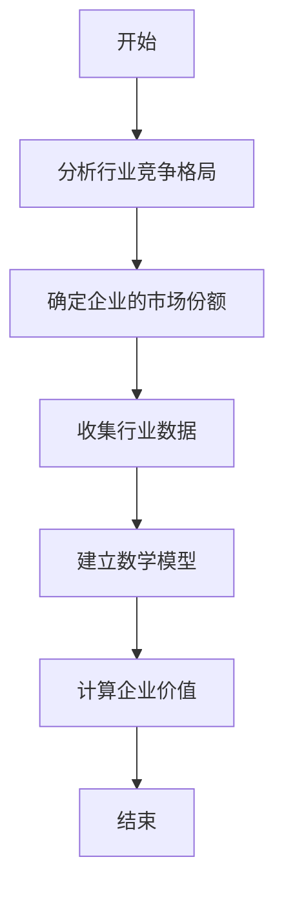
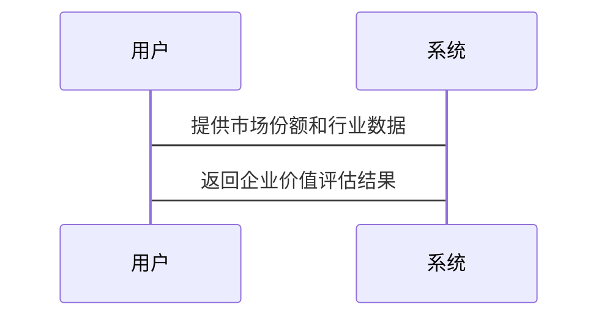

                 


# 企业估值中的市场份额价值法

> 关键词：企业估值，市场份额，价值评估，市场分析，经济模型，竞争分析，投资决策

> 摘要：本文深入探讨了企业估值中的市场份额价值法，结合市场分析、竞争评估和经济模型，提出了一种创新性的企业价值评估方法。通过详细分析市场份额与企业价值的关系，结合实际案例，为企业估值提供了新的思路和方法。

---

## 第1章: 企业估值与市场份额价值法的背景介绍

### 1.1 企业估值的核心问题
- **企业价值的定义**：企业价值是企业整体的市场价值，包括资产、负债和所有者权益。
- **股权价值评估的基本方法**：市场法、收益法和资产法是常见的企业估值方法。
- **市场份额的定义**：市场份额是指企业在某个市场或产品中的销售量、收入或利润所占的比例。

### 1.2 市场份额价值法的起源与发展
- **传统估值方法的局限性**：传统方法难以准确反映市场竞争对企业价值的影响。
- **市场份额价值法的提出**：通过分析市场份额与企业价值的关系，提出了市场份额价值法。
- **应用场景**：适用于竞争激烈的行业，如科技、互联网和消费品行业。

### 1.3 市场份额价值法的理论基础
- **市场份额与企业价值的关系模型**：市场份额与企业收入、利润和估值密切相关。
- **核心假设**：市场竞争是企业价值的重要驱动因素，市场份额的变化直接影响企业价值。
- **适用场景**：适用于有明确市场竞争格局的企业。

---

## 第2章: 市场份额价值法的核心概念与联系

### 2.1 市场份额的测量与影响因素
- **市场份额的测量方法**：通过销售数据、行业报告等进行测量。
- **影响市场份额的因素**：产品竞争力、品牌影响力、价格策略和市场推广等。

### 2.2 企业价值的构成要素
- **资产与负债**：企业的资产和负债是影响价值的重要因素。
- **收入与利润**：企业的收入和利润直接反映企业的经营状况。
- **市场地位**：企业的市场地位决定了其在行业中的竞争力。

### 2.3 市场份额与企业价值的关系模型
- **收入模型**：市场份额与收入呈正相关关系。
- **利润模型**：市场份额影响企业的利润水平。
- **估值模型**：通过市场份额和竞争环境评估企业的估值。

### 2.4 市场份额价值法与其他估值方法的对比
- **市场法**：基于可比企业的市场交易价格进行估值。
- **收益法**：基于企业的未来现金流折现进行估值。
- **资产法**：基于企业的资产负债表进行估值。

---

## 第3章: 市场份额价值法的算法原理与数学模型

### 3.1 算法原理
- **市场分析**：分析行业竞争格局，确定企业的市场份额。
- **经济模型构建**：建立市场份额与企业价值的数学模型。
- **数据输入**：包括市场份额、行业增长率、利润率等。
- **计算与输出**：根据模型计算企业价值。

### 3.2 数学模型
- **市场份额与收入的关系**：$收入 = 市场份额 \times 行业总收入$
- **市场份额与利润的关系**：$利润 = 收入 - 成本$
- **企业价值评估公式**：$企业价值 = 收益 \times 市场倍数$

### 3.3 算法流程


---

## 第4章: 市场份额价值法的系统分析与架构设计

### 4.1 系统功能设计
- **市场分析模块**：分析行业竞争格局。
- **数据输入模块**：输入市场份额、行业数据等。
- **模型计算模块**：计算企业价值。
- **结果输出模块**：展示评估结果。

### 4.2 系统架构设计


### 4.3 系统接口设计
- **输入接口**：接受市场份额、行业数据等输入。
- **输出接口**：展示计算结果和评估报告。

### 4.4 系统交互流程


---

## 第5章: 项目实战：基于市场份额价值法的企业估值系统开发

### 5.1 环境安装
- **工具安装**：安装Python、Jupyter Notebook、Pandas、NumPy等。
- **数据获取**：收集行业数据和企业市场份额数据。

### 5.2 核心代码实现
```python
import pandas as pd
import numpy as np

def market_share_value(share, industry_revenue, profit_margin):
    revenue = share * industry_revenue
    profit = revenue * profit_margin
    return profit

# 示例数据
industry_revenue = 1000  # 行业总收入（百万）
share = 0.3  # 企业市场份额
profit_margin = 0.2  # 利润率

# 计算企业价值
enterprise_value = market_share_value(share, industry_revenue, profit_margin)
print(f"企业价值为：{enterprise_value}百万")
```

### 5.3 实际案例分析
- **案例选择**：以互联网行业为例，分析某企业的市场份额和企业价值。

### 5.4 代码应用解读
- **代码功能**：计算企业基于市场份额和利润率的企业价值。
- **结果分析**：解释计算结果对企业估值的影响。

---

## 第6章: 市场份额价值法的最佳实践与注意事项

### 6.1 最佳实践
- **数据质量**：确保数据的准确性和完整性。
- **模型假设**：合理假设市场份额与企业价值的关系。
- **行业差异**：不同行业适用性不同，需调整模型参数。

### 6.2 注意事项
- **市场竞争动态**：市场份额可能随时变化，需定期更新数据。
- **多方法结合**：结合市场法、收益法等方法进行综合评估。

### 6.3 小结
- **关键点总结**：市场份额是影响企业价值的重要因素。
- **未来研究方向**：结合其他估值方法，提高模型的准确性和适用性。

---

## 第7章: 总结与展望

### 7.1 总结
- **核心观点回顾**：市场份额价值法是企业估值的重要方法，能够有效反映市场竞争对企业价值的影响。
- **方法优势**：适用于竞争激烈的行业，提供新的估值思路。

### 7.2 展望
- **未来研究方向**：结合AI技术，优化市场份额价值法的应用。
- **扩展应用**：探索在更多行业中的应用潜力。

---

通过本文的系统分析与详细讲解，读者可以全面了解企业估值中的市场份额价值法，掌握其核心原理和实际应用，为企业估值提供新的思路和方法。

