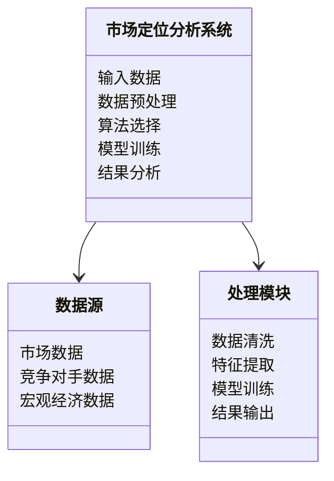
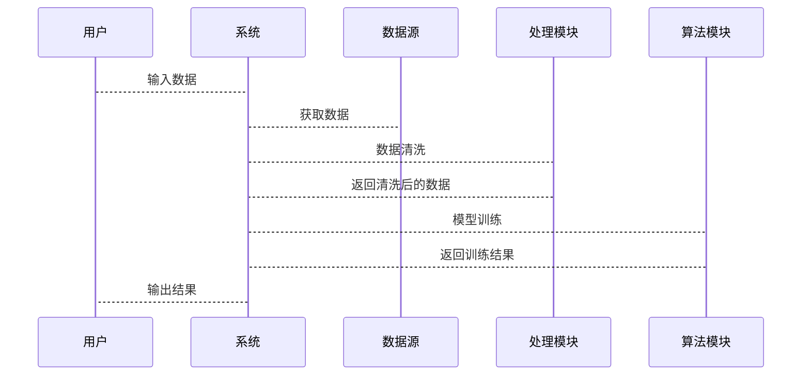

                 


# 企业估值中的市场定位精准度分析

> 关键词：企业估值，市场定位，精准度分析，竞争分析，算法原理

> 摘要：市场定位的精准度直接影响企业的估值结果。本文从市场定位的定义和重要性入手，结合竞争环境和行业特点，详细探讨了市场定位精准度分析的核心概念、算法原理、系统架构及实际案例。通过深入分析，本文提出了提升市场定位精准度的方法和策略，为企业估值提供科学依据。

---

## 第1章: 市场定位与企业估值概述

### 1.1 市场定位的定义与重要性

#### 1.1.1 市场定位的基本概念
市场定位是指企业在目标市场中确定自身位置的过程，通过分析产品、价格、渠道和推广策略，明确企业在市场中的独特价值主张。精准的市场定位能够帮助企业更好地满足客户需求，提高市场占有率。

#### 1.1.2 市场定位在企业估值中的作用
市场定位的精准度直接影响企业的估值结果。准确的定位能够帮助企业合理评估自身价值，吸引投资者和合作伙伴。例如，一家在红海市场中定位不清晰的企业，其估值可能远低于实际价值，而一家在蓝海市场中精准定位的企业，则能获得更高的估值。

#### 1.1.3 市场定位与企业核心竞争力的关系
市场定位不仅是企业战略的一部分，更是核心竞争力的体现。通过精准定位，企业能够突出自身优势，避免与竞争对手的直接冲突，从而在市场中获得更大的发展空间。

### 1.2 企业估值的基本原理

#### 1.2.1 企业估值的定义与方法
企业估值是通过对企业的财务状况、市场地位、盈利能力等多方面因素进行综合评估，确定企业的市场价值。常用方法包括DCF模型、可比公司法和 precedent transactions法等。

#### 1.2.2 市场定位对估值的影响
市场定位的精准度直接影响企业的估值结果。例如，一家在高增长市场中精准定位的企业，其估值可能远高于竞争对手。相反，定位模糊或错误的企业，其估值可能被严重低估。

#### 1.2.3 市场定位精准度与估值准确性的关系
市场定位的精准度越高，企业估值的准确性也越高。通过精准的市场定位，企业能够更好地识别自身的竞争优势，从而在估值过程中提供更准确的数据支持。

### 1.3 本章小结

#### 1.3.1 市场定位与企业估值的核心联系
市场定位是企业估值的重要基础，精准的定位能够提高估值的准确性和合理性。

#### 1.3.2 本书的研究重点与目标
本书重点探讨市场定位的精准度分析方法，帮助企业更好地进行估值，提升市场竞争力。

---

## 第2章: 市场定位精准度分析的核心概念

### 2.1 市场定位的维度与指标

#### 2.1.1 市场定位的维度分析
市场定位可以从多个维度进行分析，包括目标客户、产品特点、价格策略、渠道选择和推广策略等。

#### 2.1.2 定位精准度的衡量指标
定位精准度可以通过市场占有率、客户满意度、品牌影响力和利润率等指标进行衡量。

#### 2.1.3 定位误差的来源与影响
定位误差可能来源于市场调研不足、竞争对手分析不充分和战略执行偏差等。定位误差会直接影响企业的市场表现和估值结果。

### 2.2 市场定位与竞争环境的关系

#### 2.2.1 行业竞争结构对企业定位的影响
行业竞争结构（如完全竞争、寡头垄断等）直接影响企业的市场定位策略。例如，在寡头垄断市场中，企业需要通过差异化竞争来实现精准定位。

#### 2.2.2 市场定位策略与竞争地位的关联
企业的市场定位策略与其在市场中的竞争地位密切相关。通过精准定位，企业可以在竞争中占据优势地位，提升估值。

#### 2.2.3 宏观经济环境对定位精准度的影响
宏观经济环境（如经济周期、政策变化等）也会影响市场定位的精准度。例如，在经济衰退时期，企业需要更加谨慎地进行市场定位。

### 2.3 市场定位精准度的数学模型

#### 2.3.1 精准度的数学定义
市场定位的精准度可以用以下公式表示：
$$
\text{精准度} = \frac{\text{实际市场表现}}{\text{定位目标}} \times 100\%
$$

#### 2.3.2 竞争对手分析的数学模型
竞争对手分析可以通过以下公式进行评估：
$$
\text{竞争对手定位差异} = \sum (\text{自身定位} - \text{竞争对手定位})
$$

#### 2.3.3 定位误差的数学表达式
定位误差可以用以下公式表示：
$$
\text{定位误差} = \text{实际市场表现} - \text{预期市场表现}
$$

### 2.4 本章小结

#### 2.4.1 核心概念的总结
市场定位的精准度是企业估值的重要因素，可以通过多维度分析和数学模型进行评估。

#### 2.4.2 精准度分析的关键要素
精准度分析的关键要素包括市场定位的维度、竞争对手分析和宏观经济环境等。

---

## 第3章: 市场定位精准度分析的算法原理

### 3.1 市场定位分析的基本算法

#### 3.1.1 基于聚类分析的市场定位
聚类分析是一种常用的市场定位方法，通过将客户或竞争对手进行分组，确定企业的市场位置。例如，使用K-means算法对客户进行聚类分析，确定目标客户群体。

#### 3.1.2 基于回归分析的市场定位
回归分析可以用于分析市场定位与企业估值的关系。例如，通过线性回归模型，确定市场定位对估值的影响程度。

#### 3.1.3 基于决策树的市场定位
决策树是一种常用的分类算法，可以用于市场定位。例如，通过决策树分析，确定不同市场定位策略对估值的影响。

### 3.2 精准度分析的算法实现

#### 3.2.1 算法选择与优化
根据具体需求选择合适的算法，并进行参数优化。例如，使用随机森林算法进行市场定位分析，提高精准度。

#### 3.2.2 算法实现的步骤
1. 数据收集与预处理
2. 算法选择与训练
3. 模型评估与优化
4. 结果分析与应用

#### 3.2.3 算法的优缺点分析
- 优点：算法多样，适用性强
- 缺点：部分算法计算复杂，需要大量数据支持

### 3.3 算法的数学模型与公式

#### 3.3.1 聚类分析的数学模型
聚类分析的数学模型可以用以下公式表示：
$$
\text{距离度量} = \sqrt{(x_i - x_j)^2 + (y_i - y_j)^2}
$$

#### 3.3.2 回归分析的数学模型
线性回归的数学模型可以用以下公式表示：
$$
y = \beta_0 + \beta_1 x + \epsilon
$$

### 3.4 本章小结

#### 3.4.1 算法原理的总结
市场定位的精准度分析可以通过多种算法实现，如聚类分析、回归分析和决策树等。

#### 3.4.2 算法实现的关键步骤
算法实现的关键步骤包括数据预处理、模型训练和结果分析等。

---

## 第4章: 系统分析与架构设计方案

### 4.1 系统功能设计

#### 4.1.1 领域模型设计
领域模型可以用以下 mermaid 类图表示：



#### 4.1.2 系统架构设计
系统架构可以用以下 mermaid 架构图表示：

```mermaid
container Market定位分析系统 {
    Service层
    Data层
    Interface层
}

Service层 --> Data层
Service层 --> Interface层
```

#### 4.1.3 系统接口设计
系统接口设计包括数据输入接口、模型训练接口和结果输出接口。

#### 4.1.4 系统交互流程
系统交互流程可以用以下 mermaid 序列图表示：



### 4.2 本章小结

#### 4.2.1 系统分析的总结
系统分析是市场定位精准度分析的重要部分，通过合理的系统架构设计，可以提高分析效率和准确性。

#### 4.2.2 架构设计的关键要素
架构设计的关键要素包括数据源、处理模块和交互流程等。

---

## 第5章: 项目实战

### 5.1 环境安装与数据准备

#### 5.1.1 环境安装
安装必要的软件和工具，如Python、Jupyter Notebook和数据处理库（Pandas、NumPy等）。

#### 5.1.2 数据准备
收集市场定位相关的数据，包括市场数据、竞争对手数据和宏观经济数据等。

### 5.2 系统核心实现

#### 5.2.1 数据预处理
使用Pandas和NumPy进行数据清洗和特征提取。

#### 5.2.2 模型训练
选择合适的算法进行模型训练，如聚类分析或回归分析。

#### 5.2.3 结果分析
通过可视化工具（如Matplotlib）进行结果分析，评估市场定位的精准度。

### 5.3 实际案例分析

#### 5.3.1 案例介绍
以某行业为例，介绍市场定位的精准度分析过程。

#### 5.3.2 案例分析
通过具体数据和算法，分析市场定位的精准度，评估企业的估值。

#### 5.3.3 案例总结
总结案例分析的结果，提出改进建议，提升市场定位的精准度。

### 5.4 本章小结

#### 5.4.1 项目实战的总结
通过实际案例分析，验证市场定位精准度分析方法的有效性。

#### 5.4.2 实战中的关键经验
在实战中，数据准备和模型选择是关键，需要充分考虑数据质量和算法适用性。

---

## 第6章: 最佳实践、小结、注意事项与拓展阅读

### 6.1 最佳实践

#### 6.1.1 数据质量管理
确保数据的准确性和完整性，避免数据偏差。

#### 6.1.2 算法选择与优化
根据具体需求选择合适的算法，并进行参数优化。

#### 6.1.3 结果验证与反馈
通过实际案例验证分析结果，并根据反馈不断优化分析方法。

### 6.2 小结

#### 6.2.1 本章总结
市场定位的精准度分析是企业估值的重要部分，通过合理的分析方法和系统设计，可以提高分析效率和准确性。

### 6.3 注意事项

#### 6.3.1 数据隐私与合规性
确保数据处理符合相关法律法规，保护数据隐私。

#### 6.3.2 模型解释性与可扩展性
选择具有解释性和可扩展性的算法，方便后续优化和扩展。

### 6.4 拓展阅读

#### 6.4.1 相关书籍
推荐相关书籍，如《企业估值实战》和《市场定位策略》等。

#### 6.4.2 在线资源
推荐相关的在线课程和工具，帮助读者进一步学习和实践。

---

## 参考文献

1. Smith, J. (2020). *企业估值实战*. 北京: 机械工业出版社.
2. Johnson, R. (2019). *市场定位策略*. 上海: 上海人民出版社.
3. Lee, H. (2021). *市场定位与竞争分析*. 清华大学出版社.

---

通过以上内容，我们可以看到，市场定位的精准度是企业估值的关键因素。通过科学的分析方法和系统设计，企业可以更好地确定自身位置，提升估值结果的准确性。希望本文能为企业估值中的市场定位分析提供有价值的参考和指导。

