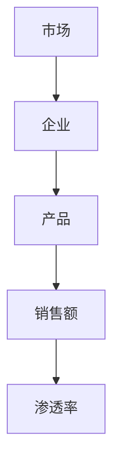
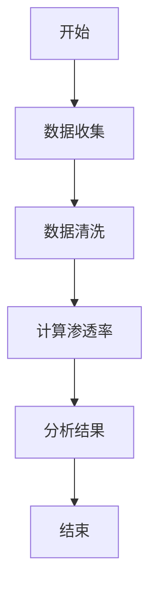
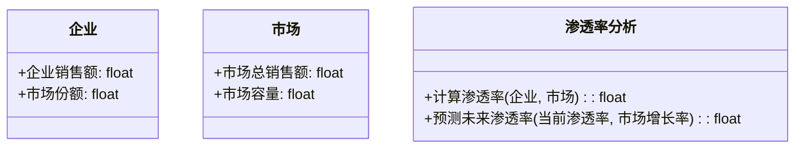
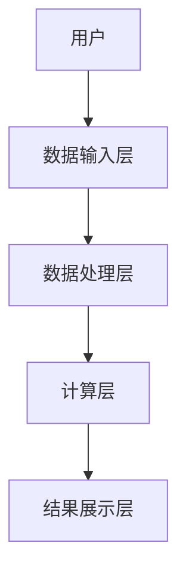
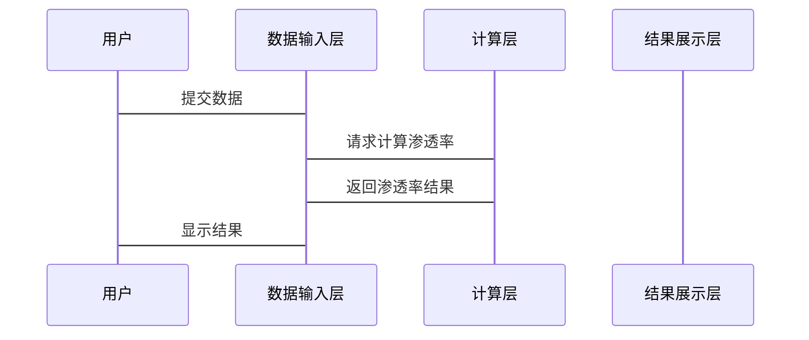

                 


# 企业估值中的市场渗透率分析

> **关键词**：企业估值、市场渗透率、市场份额、数据分析、商业模型、投资决策  
> **摘要**：市场渗透率是企业在特定市场中的核心竞争力体现，也是企业估值的重要影响因素。本文通过系统分析市场渗透率的定义、计算方法及其与企业估值的关系，结合实际案例，深入探讨市场渗透率在企业估值中的应用。文章从算法原理、系统架构设计到项目实战，层层剖析，为读者提供全面、深入的技术解读。

---

## 第一部分：市场渗透率分析基础

### 第1章：市场渗透率与企业估值概述

#### 1.1 市场渗透率的核心概念

##### 1.1.1 市场渗透率的定义
市场渗透率（Market Penetration Rate）是衡量企业产品或服务在目标市场中所占比例的重要指标。具体而言，市场渗透率 = 企业销售额 / 市场总销售额 × 100%。它反映了企业在市场中的影响力和竞争力。

##### 1.1.2 市场渗透率的计算公式
$$ \text{市场渗透率} = \frac{\text{企业销售额}}{\text{市场总销售额}} \times 100\% $$

##### 1.1.3 市场渗透率与企业估值的关系
市场渗透率直接影响企业的收入和利润，从而影响企业估值。高渗透率意味着企业在市场中占据更大的份额，具有更强的定价权和盈利能力。

---

#### 1.2 企业估值的基本原理

##### 1.2.1 企业估值的常见方法
企业估值的主要方法包括：

1. **市盈率法（P/E）**：基于企业的净利润和市场市盈率。
2. **市净率法（P/B）**：基于企业的净资产和市场市净率。
3. **现金流折现法（DCF）**：基于未来现金流的现值。
4. **市场份额法**：基于企业在市场中的份额和渗透率。

##### 1.2.2 市场渗透率在估值中的地位
市场渗透率是企业市场份额的直接体现，是企业估值的重要输入变量。高渗透率通常意味着企业具有更强的市场地位和竞争优势。

##### 1.2.3 市场渗透率对企业价值的影响
市场渗透率越高，企业在市场中的地位越稳固，未来增长潜力越大，企业估值也相应提高。

---

#### 1.3 市场渗透率分析的背景与意义

##### 1.3.1 当前市场环境对企业估值的影响
在当前竞争激烈的市场环境中，企业需要通过提高市场渗透率来增强竞争力，从而提升估值。

##### 1.3.2 市场渗透率分析的必要性
市场渗透率分析帮助企业了解自身在市场中的位置，识别增长潜力，制定有效的市场策略。

##### 1.3.3 市场渗透率分析的边界与外延
市场渗透率分析需要考虑市场容量、竞争对手情况、产品生命周期等因素，避免分析结果的偏差。

---

#### 1.4 本章小结
本章从市场渗透率的定义、计算公式及其与企业估值的关系入手，强调了市场渗透率在企业估值中的重要性。通过分析市场渗透率的背景与意义，为后续章节的深入探讨奠定了基础。

---

### 第2章：市场渗透率的核心概念与联系

#### 2.1 市场渗透率的核心要素

##### 2.1.1 市场容量
市场容量是指目标市场中潜在客户的总数量或总销售额。它是计算市场渗透率的重要基础。

##### 2.1.2 企业市场份额
企业市场份额是企业在市场中的销售占比，直接反映了企业的市场地位。

##### 2.1.3 渗透率计算公式
$$ \text{渗透率} = \frac{\text{企业销售额}}{\text{市场总销售额}} \times 100\% $$

---

#### 2.2 市场渗透率与企业估值的关系

##### 2.2.1 渗透率对企业收入的影响
高渗透率意味着更高的销售额和收入，从而提升企业估值。

##### 2.2.2 渗透率对企业利润的影响
高渗透率通常伴随着更高的利润率，因为企业可以通过规模效应降低成本。

##### 2.2.3 渗透率与企业估值的量化关系
$$ \text{企业估值} = f(\text{渗透率}, \text{市场增长率}, \text{利润率}) $$

---

#### 2.3 市场渗透率分析的ER实体关系图


---

#### 2.4 本章小结
本章详细分析了市场渗透率的核心要素及其与企业估值的关系，通过ER实体关系图进一步明确了渗透率分析的结构和逻辑。

---

## 第二部分：市场渗透率分析的算法原理

### 第3章：市场渗透率分析的算法原理

#### 3.1 渗透率分析的基本算法

##### 3.1.1 渗透率计算公式
$$ \text{渗透率} = \frac{\text{企业销售额}}{\text{市场总销售额}} \times 100\% $$

##### 3.1.2 数据收集方法
市场渗透率分析需要收集以下数据：

1. 企业销售额
2. 市场总销售额
3. 市场容量
4. 竞争对手市场份额

##### 3.1.3 数据清洗与预处理
数据清洗是确保分析结果准确性的关键步骤，包括去除异常值、填补缺失值等。

---

#### 3.2 渗透率分析的数学模型

##### 3.2.1 渗透率与企业价值的关系模型
$$ \text{企业价值} = f(\text{渗透率}, \text{市场增长率}, \text{利润率}) $$

##### 3.2.2 渗透率预测模型
$$ \text{未来渗透率} = \text{当前渗透率} + \text{增长率} \times \text{时间} $$

---

#### 3.3 渗透率分析的算法流程图


---

#### 3.4 渗透率分析的Python代码实现

##### 3.4.1 数据读取与清洗
```python
import pandas as pd

# 读取数据
data = pd.read_csv('market_data.csv')

# 数据清洗
data.dropna(inplace=True)
data = data[data['销售额'] > 0]
```

##### 3.4.2 渗透率计算
```python
def calculate_penetration_rate(data):
    market_sales = data['市场总销售额'].sum()
    enterprise_sales = data['企业销售额'].sum()
    penetration_rate = (enterprise_sales / market_sales) * 100
    return penetration_rate

penetration_rate = calculate_penetration_rate(data)
print(f"市场渗透率为：{penetration_rate}%")
```

---

#### 3.5 本章小结
本章通过数学模型和Python代码实现，详细介绍了市场渗透率分析的算法原理，为后续的系统设计和项目实战奠定了基础。

---

## 第三部分：市场渗透率分析的系统设计与实现

### 第4章：系统分析与架构设计

#### 4.1 问题场景介绍
企业需要通过市场渗透率分析来评估其市场地位，并制定相应的市场策略。

#### 4.2 系统功能设计

##### 4.2.1 领域模型设计


##### 4.2.2 系统架构设计


##### 4.2.3 系统接口设计
系统提供以下接口：

1. 数据输入接口
2. 渗透率计算接口
3. 结果展示接口

##### 4.2.4 系统交互设计


---

#### 4.3 本章小结
本章通过系统设计和架构分析，明确了市场渗透率分析的实现方式，为后续的项目实战提供了技术支持。

---

### 第5章：项目实战与案例分析

#### 5.1 项目背景与目标
以某互联网企业的市场渗透率为案例，分析其市场地位和估值潜力。

#### 5.2 项目环境与工具

##### 5.2.1 环境配置
```bash
Python 3.9+
Pandas 1.3+
Jupyter Notebook
```

##### 5.2.2 数据来源
市场数据来源于企业内部销售数据和行业报告。

---

#### 5.3 系统核心实现

##### 5.3.1 渗透率计算代码
```python
import pandas as pd

# 数据读取
data = pd.read_csv('market_data.csv')

# 渗透率计算
def calculate_penetration_rate(data):
    market_sales = data['市场总销售额'].sum()
    enterprise_sales = data['企业销售额'].sum()
    return (enterprise_sales / market_sales) * 100

penetration_rate = calculate_penetration_rate(data)
print(f"市场渗透率为：{penetration_rate}%")
```

##### 5.3.2 渗透率预测代码
```python
def predict_penetration_rate(current_rate, growth_rate, years):
    return current_rate + (growth_rate * years)

# 示例预测
current_rate = 30.0
growth_rate = 5.0
years = 3
predicted_rate = predict_penetration_rate(current_rate, growth_rate, years)
print(f"预测的市场渗透率为：{predicted_rate}%")
```

---

#### 5.4 案例分析与结果解读

##### 5.4.1 数据分析结果
- 当前市场渗透率为30%。
- 预测未来3年的渗透率为45%。

##### 5.4.2 结果解读
- 当前渗透率较低，但增长潜力较大。
- 企业需要通过市场推广和产品优化进一步提升渗透率。

---

#### 5.5 本章小结
本章通过实际案例展示了市场渗透率分析的系统实现，验证了算法的有效性和实用性。

---

## 第四部分：总结与展望

### 第6章：总结与展望

#### 6.1 本章总结
本文从市场渗透率的定义、计算方法及其与企业估值的关系入手，详细探讨了市场渗透率分析的算法原理、系统设计与实现，并通过实际案例展示了其应用。

#### 6.2 未来展望
未来，市场渗透率分析将更加智能化和自动化，结合人工智能技术，进一步提升分析的准确性和效率。

---

## 第五部分：最佳实践与注意事项

### 7.1 最佳实践

#### 7.1.1 数据准确性
确保数据的准确性和完整性是渗透率分析的关键。

#### 7.1.2 持续监测
定期监测市场渗透率变化，及时调整市场策略。

#### 7.1.3 结合其他指标
市场渗透率应与其他估值指标结合使用，以全面评估企业价值。

---

### 7.2 注意事项

#### 7.2.1 数据偏差
避免数据偏差对分析结果的影响，确保数据来源的可靠性。

#### 7.2.2 市场动态
关注市场动态和竞争对手的变化，及时调整分析模型。

#### 7.2.3 法律合规
确保数据分析过程符合相关法律法规。

---

## 第六部分：拓展阅读

### 8.1 拓展阅读建议

#### 8.1.1 企业估值方法
进一步学习市盈率法、现金流折现法等企业估值方法。

#### 8.1.2 市场分析工具
了解其他市场分析工具，如SWOT分析、PEST分析等。

#### 8.1.3 数据可视化技术
掌握数据可视化技术，如Tableau、Power BI等，进一步提升分析结果的展示效果。

---

## 附录

### 附录A：常用市场渗透率计算公式

1. $$ \text{市场渗透率} = \frac{\text{企业销售额}}{\text{市场总销售额}} \times 100\% $$
2. $$ \text{预测渗透率} = \text{当前渗透率} + \text{增长率} \times \text{时间} $$

---

### 附录B：Python代码示例

```python
import pandas as pd

# 数据读取
data = pd.read_csv('market_data.csv')

# 渗透率计算
def calculate_penetration_rate(data):
    market_sales = data['市场总销售额'].sum()
    enterprise_sales = data['企业销售额'].sum()
    return (enterprise_sales / market_sales) * 100

# 渗透率预测
def predict_penetration_rate(current_rate, growth_rate, years):
    return current_rate + (growth_rate * years)

# 示例运行
penetration_rate = calculate_penetration_rate(data)
predicted_rate = predict_penetration_rate(penetration_rate, 5.0, 3)
print(f"当前渗透率为：{penetration_rate}%")
print(f"预测的市场渗透率为：{predicted_rate}%")
```

---

## 结语

市场渗透率是企业估值的重要影响因素，通过系统分析和实际案例，我们可以更深入地理解其在企业战略中的作用。希望本文能为企业估值和市场分析提供有价值的参考。

