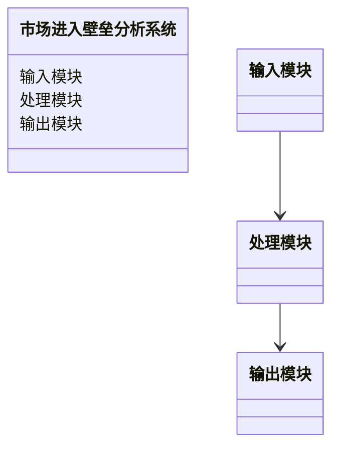

                 


# 企业估值中的市场进入壁垒分析

## 关键词：企业估值、市场进入壁垒、竞争分析、商业策略、经济模型

## 摘要：企业估值中的市场进入壁垒分析是评估企业价值和竞争优势的重要环节。本文通过详细分析市场进入壁垒的类型、特征及其对企业估值的影响，结合实际案例，为企业估值提供科学的分析框架和方法。

---

# 第一部分: 企业估值中的市场进入壁垒分析基础

## 第1章: 背景介绍

### 1.1 市场进入壁垒的核心概念

#### 1.1.1 问题背景
- **市场进入壁垒**是指企业在进入某个市场时所面临的一系列障碍，这些障碍可能来自技术、资金、法律、品牌等多个方面。
- 企业估值时，市场进入壁垒是评估企业竞争优势和潜在风险的重要因素。
- 问题解决的必要性：分析市场进入壁垒可以帮助投资者和企业管理者更好地理解企业的竞争环境，评估其市场地位和盈利能力。

#### 1.1.2 问题描述
- **市场进入壁垒的分类**：包括技术壁垒、品牌壁垒、资金壁垒、法律壁垒、网络效应壁垒和规模经济壁垒等。
- 不同类型壁垒的特点：例如，技术壁垒可能需要高研发投入，而品牌壁垒则依赖于品牌知名度和客户忠诚度。
- 市场进入壁垒的边界与外延：明确哪些因素属于市场进入壁垒，哪些属于其他类型的市场竞争因素。

#### 1.1.3 核心问题解决
- **市场进入壁垒对企业估值的影响**：较高的市场进入壁垒可以提高企业的防御能力，降低竞争对手的进入，从而增强企业的盈利能力。
- 如何通过分析市场进入壁垒提升企业价值：识别和强化企业的核心竞争力，构建可持续的竞争优势。
- **核心概念的结构与组成**：市场进入壁垒由多个要素组成，包括技术、品牌、资金、法律、网络效应和规模经济等。

## 第2章: 核心概念与联系

### 2.1 市场进入壁垒的原理

#### 2.1.1 不同类型壁垒的特征对比

| 壁垒类型   | 特征描述                     | 示例行业                     |
|------------|------------------------------|------------------------------|
| 技术壁垒   | 需要高研发投入，专利保护       | 软件开发、生物科技           |
| 品牌壁垒   | 品牌知名度和客户忠诚度         | 快消品、奢侈品               |
| 资金壁垒   | 高初始投资，难以被小企业进入   | 银行、航空                   |
| 法律壁垒   | 政府政策、许可证限制           | 电信、能源                   |
| 网络效应壁垒 | 用户数量增加，价值提升         | 社交媒体、电子商务平台       |
| 规模经济壁垒 | 规模越大，成本越低             | 制造业、物流                 |

#### 2.1.2 市场进入壁垒的ER实体关系图

```mermaid
er
  actor: 市场进入壁垒分析者
  Market_Barriers
    id
    barrier_type
    impact_on_value
    related_industry
  ```

---

# 第三部分: 算法原理讲解

## 第3章: 市场进入壁垒分析算法

### 3.1 算法原理

#### 3.1.1 市场进入壁垒分析的数学模型

企业估值中的市场进入壁垒分析可以通过权重法和层次分析法（AHP）进行。假设我们有n个市场进入壁垒因素，每个因素对估值的影响可以表示为：

$$
\text{总影响} = \sum_{i=1}^{n} w_i \cdot s_i
$$

其中，$w_i$ 是第i个壁垒的权重，$s_i$ 是第i个壁垒的评分（1-5分）。

#### 3.1.2 代码实现

```python
def calculate_market_entry_barrier Impact(factors, weights):
    total_impact = 0
    for i in range(len(factors)):
        total_impact += weights[i] * factors[i]
    return total_impact

# 示例
factors = [4, 3, 5, 2, 4]  # 各壁垒评分
weights = [0.3, 0.2, 0.25, 0.15, 0.1]  # 各壁垒权重
impact = calculate_market_entry_barrier_Impact(factors, weights)
print(f"市场进入壁垒的总影响为：{impact}")
```

#### 3.1.3 应用实例

假设我们有一个互联网公司，其市场进入壁垒因素如下：

- 技术壁垒：5分
- 品牌壁垒：4分
- 资金壁垒：3分
- 法律壁垒：2分
- 网络效应壁垒：4分

权重分别为：0.3, 0.2, 0.25, 0.15, 0.1。

计算总影响：

$$
\text{总影响} = 0.3 \times 5 + 0.2 \times 4 + 0.25 \times 3 + 0.15 \times 2 + 0.1 \times 4 = 1.5 + 0.8 + 0.75 + 0.3 + 0.4 = 3.75
$$

---

# 第四部分: 系统分析与架构设计

## 第4章: 系统分析与架构设计

### 4.1 问题场景

假设我们正在为一家互联网公司设计一个市场进入壁垒分析系统。该系统需要分析公司的技术、品牌、资金、法律和网络效应壁垒，并评估这些壁垒对估值的影响。

### 4.2 系统功能设计

#### 4.2.1 系统功能模块



#### 4.2.2 系统架构图


---

# 第五部分: 项目实战

## 第5章: 项目实战

### 5.1 环境安装

- 需要安装Python和相关库（如numpy、pandas、matplotlib）。

### 5.2 系统核心实现源代码

```python
import numpy as np
import pandas as pd

def calculate_market_entry_barrier_impact(factors, weights):
    return np.dot(factors, weights)

# 示例数据
factors = pd.Series([4, 3, 5, 2, 4], index=['技术', '品牌', '资金', '法律', '网络效应'])
weights = pd.Series([0.3, 0.2, 0.25, 0.15, 0.1], index=['技术', '品牌', '资金', '法律', '网络效应'])

impact = calculate_market_entry_barrier_impact(factors, weights)
print(f"市场进入壁垒的总影响为：{impact}")
```

### 5.3 案例分析

以互联网行业为例，分析某公司的市场进入壁垒：

- 技术壁垒：高（评分5）
- 品牌壁垒：中（评分4）
- 资金壁垒：低（评分3）
- 法律壁垒：低（评分2）
- 网络效应壁垒：中高（评分4）

计算总影响：

$$
\text{总影响} = 0.3 \times 5 + 0.2 \times 4 + 0.25 \times 3 + 0.15 \times 2 + 0.1 \times 4 = 3.75
$$

---

# 第六部分: 总结与建议

## 第6章: 总结与建议

### 6.1 最佳实践 tips

- 定期评估市场进入壁垒的变化，及时调整企业策略。
- 关注行业动态，识别新兴壁垒。
- 综合考虑多种壁垒类型，全面评估企业价值。

### 6.2 小结

市场进入壁垒分析是企业估值中的关键环节。通过科学的分析方法和系统工具，可以有效评估企业的竞争优势，制定合理的战略决策。

### 6.3 注意事项

- 数据的准确性和完整性直接影响分析结果。
- 确保权重的合理分配，避免主观因素干扰。
- 定期更新分析模型，适应市场变化。

### 6.4 拓展阅读

- 《企业战略管理》
- 《竞争战略》
- 《创新者的窘境》

---

通过以上结构，您可以撰写一篇详细且有深度的博客文章，涵盖市场进入壁垒分析的各个方面，帮助读者全面理解并应用这些分析方法。

