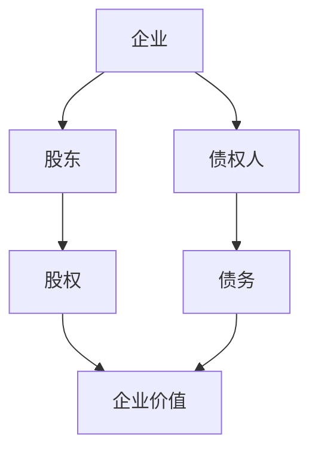
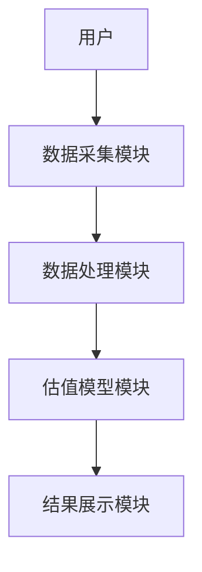

                 


# 企业估值中的常见误区及解决方案

> **关键词**：企业估值、误区、解决方案、DCF模型、市盈率、市净率、治理结构

> **摘要**：企业估值是企业管理和投资决策中的核心问题，但在实际操作中，人们常常陷入各种误区，导致估值结果偏差，影响决策效果。本文系统分析了企业估值中的常见误区，包括忽视财务数据的真实性、只关注短期收益、忽略市场环境变化等，并提出了相应的解决方案。通过构建科学的估值体系、优化模型参数、关注非财务因素等方法，可以有效避免误区，提升估值准确性。文章还详细介绍了企业估值的数学模型与算法原理，并通过实际案例分析，展示了如何在实践中应用这些方法。

---

## 第一部分：企业估值背景与常见误区

### 第1章：企业估值概述

#### 1.1 企业估值的基本概念

企业估值是通过对企业的财务状况、市场环境、管理能力等多方面因素的综合分析，确定企业价值的过程。企业价值通常包括资产、股权、未来现金流等多个维度，是企业在市场上的公允价格。

企业估值的核心要素包括：

1. **财务数据**：收入、利润、现金流等。
2. **市场环境**：行业竞争、政策变化、经济周期等。
3. **管理能力**：管理层的战略规划、执行能力等。
4. **未来预期**：企业未来的增长潜力和盈利能力。

#### 1.2 企业估值中的常见误区

在企业估值实践中，人们常常陷入一些误区，导致估值结果偏差。以下是常见误区及其分析：

1. **误区一：忽视财务数据的真实性**
   - **表现**：仅依赖公开财务报表，忽略企业内部数据和非财务信息。
   - **影响**：可能导致估值结果与实际价值不符。

2. **误区二：只关注短期收益**
   - **表现**：过分关注当期利润，忽视长期发展潜力。
   - **影响**：可能导致高估企业价值。

3. **误区三：忽略市场环境的变化**
   - **表现**：不考虑宏观经济、行业趋势等因素。
   - **影响**：可能导致低估或高估企业价值。

4. **误区四：过度依赖单一估值方法**
   - **表现**：仅采用一种估值方法，如市盈率或DCF模型。
   - **影响**：可能导致结果片面。

5. **误区五：忽视企业治理结构**
   - **表现**：不考虑企业管理层的能力和治理结构。
   - **影响**：可能导致低估企业风险。

#### 1.3 误区对企业估值的影响

误区的存在会导致企业估值结果出现偏差，进而影响投资决策。如何识别和避免这些误区，是提升估值准确性的重要环节。

---

## 第二部分：企业估值的核心概念与联系

### 第2章：核心概念与联系

#### 2.1 企业估值的核心概念

企业估值涉及多个核心概念，包括企业价值、股东价值、股权价值等。这些概念之间的关系需要清晰理解。

1. **企业价值**：企业的整体价值，包括股权和债权。
2. **股东价值**：股东的股权价值，取决于企业的整体价值和债务结构。
3. **股权价值**：企业股权的市场价值，受企业盈利能力、市场环境等因素影响。

#### 2.2 企业估值的属性特征对比

以下是企业估值相关概念的对比：

| 概念 | 定义 | 作用 |
|------|------|------|
| 财务指标 | 反映企业财务状况的数据，如收入、利润等 | 用于量化分析企业价值 |
| 非财务指标 | 包括管理能力、品牌价值等 | 用于定性分析企业价值 |
| 宏观经济指标 | GDP、利率等 | 影响企业估值的外部环境 |
| 微观企业指标 | 企业内部数据，如市场份额 | 用于具体分析企业情况 |

#### 2.3 实体关系图（ER图）

以下是企业估值的核心实体关系图：



---

## 第三部分：企业估值的数学模型与算法原理

### 第3章：企业估值的数学模型

#### 3.1 现金流贴现模型（DCF模型）

现金流贴现模型是企业估值中最常用的数学模型之一。

**公式：**
$$
\text{企业价值} = \sum_{t=1}^{n} \frac{\text{现金流}_t}{(1 + r)^t} + \frac{\text{终值}}{(1 + r)^n}
$$

**步骤：**
1. **预测未来现金流**：根据企业的财务数据和市场环境，预测未来各期的现金流。
2. **确定合适的折现率**：通常使用加权平均资本成本（WACC）。
3. **计算终值**：终值通常基于永续增长率计算。
4. **累加求和**：将各期现金流的现值与终值相加，得到企业价值。

**示例：**
假设某企业未来3年的现金流分别为100万元、150万元、200万元，折现率为10%。计算其现值：

$$
PV = \frac{100}{1.1} + \frac{150}{1.1^2} + \frac{200}{1.1^3} = 90.91 + 113.64 + 137.17 = 341.72 \text{万元}
$$

---

#### 3.2 市盈率与市净率模型

市盈率模型和市净率模型是基于相对估值法的常见方法。

**市盈率模型：**
$$
\text{目标股价} = \text{目标市盈率} \times \text{每股收益}
$$

**市净率模型：**
$$
\text{目标股价} = \text{目标市净率} \times \text{每股净资产}
$$

---

## 第四部分：企业估值的系统分析与架构设计

### 第4章：企业估值系统架构

#### 4.1 企业估值系统架构图

以下是企业估值系统的模块化架构图：



---

## 第五部分：项目实战

### 第5章：企业估值项目实战

#### 5.1 环境配置

需要安装以下工具：
- Python
- NumPy
- Pandas
- Matplotlib

#### 5.2 核心代码实现

以下是DCF模型的Python代码实现：

```python
import numpy as np

def calculateDCF(cash_flows, discount_rate, terminal_value):
    present_value = 0
    for t in range(len(cash_flows)):
        present_value += cash_flows[t] / (1 + discount_rate) ** t
    total_value = present_value + terminal_value / (1 + discount_rate) ** len(cash_flows)
    return total_value

# 示例数据
cash_flows = [100, 150, 200]
discount_rate = 0.1
terminal_value = 200 * 1.05

DCF_value = calculateDCF(cash_flows, discount_rate, terminal_value)
print(f"DCF模型计算的企业价值为：{DCF_value:.2f}万元")
```

---

## 第六部分：总结与展望

### 第6章：总结与展望

#### 6.1 总结

企业估值是企业管理与投资决策中的关键环节，常见的误区会导致估值结果偏差。通过构建科学的估值体系、优化模型参数、关注非财务因素等方法，可以有效避免误区，提升估值准确性。

#### 6.2 展望

未来，企业估值将更加依赖于人工智能和大数据技术。通过机器学习算法优化估值模型，可以进一步提升估值的准确性和效率。

---

通过本文的分析，读者可以更好地理解企业估值中的常见误区，并掌握相应的解决方案。希望本文能为企业的估值实践提供有价值的参考。

