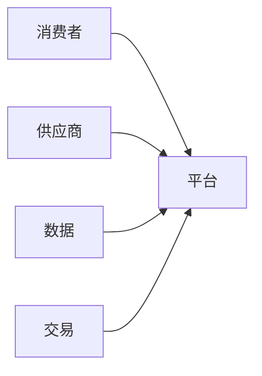

                 


# 企业估值中的平台经济效应分析

> 关键词：企业估值，平台经济，网络效应，双边市场，数学模型，平台增长

> 摘要：本文深入探讨了平台经济效应在企业估值中的应用，分析了平台经济的核心概念、数学模型、系统架构设计以及实际案例。通过理论与实践相结合的方式，为读者提供了全面的企业估值分析框架，帮助他们更好地理解和应用平台经济效应。

---

## 第一部分：背景介绍

### 第1章：平台经济与企业估值概述

#### 1.1 平台经济的基本概念
- 1.1.1 平台经济的定义与特征
  - 平台经济是通过数字技术连接供需双方，降低交易成本，提高效率的经济模式。
  - 特征：双边市场、网络效应、数据驱动、动态扩展性。

- 1.1.2 平台经济的参与者与角色
  - 用户：包括消费者和供应商。
  - 平台：提供连接和交易的基础设施。
  - 中介：如支付、物流等第三方服务。

- 1.1.3 平台经济的商业模式
  - 收入来源：佣金、订阅费、广告费、数据变现。

#### 1.2 企业估值的基本概念
- 1.2.1 企业估值的定义与方法
  - 企业估值是对其未来现金流的折现，常用方法包括DCF（现金流贴现法）、相对估值法、资产重置法等。

- 1.2.2 企业估值的核心要素
  - 收益能力、资产质量、财务状况、市场地位、管理团队。

- 1.2.3 企业估值的常见模型
  - DCF模型、 Comparable公司分析、 LCM（Last Comparable Mergers）模型。

#### 1.3 平台经济效应对企业估值的影响
- 1.3.1 平台经济效应的定义
  - 平台经济效应是指平台通过连接供需双方，形成网络效应，从而提升整体经济效率的现象。

- 1.3.2 平台经济效应的分类与特征
  - 双边市场效应：供需双方的相互促进。
  - 网络效应：用户数量增加，平台价值提升。
  - 规模经济效应：用户基数扩大，边际成本下降。

- 1.3.3 平台经济效应与企业估值的关系
  - 平台经济效应增强了企业的盈利能力和市场竞争力，从而影响其估值。

---

## 第二部分：平台经济效应的核心概念与联系

### 第2章：平台经济效应的原理与模型

#### 2.1 平台经济效应的原理
- 2.1.1 平台的双边市场特征
  - 双边市场模型：平台连接两个不同的用户群体，如消费者和供应商。
  - 价格歧视：平台对两边用户制定不同的价格。

- 2.1.2 网络效应与平台扩张
  - 网络效应：随着用户数量增加，平台的边际成本降低，价值提升。
  - 平台扩张：通过数据和技术扩展服务范围。

- 2.1.3 平台的规模经济与范围经济
  - 规模经济：随着用户数量增加，单位成本下降。
  - 范围经济：平台扩展服务种类，提高效率。

#### 2.2 平台经济效应的核心模型
- 2.2.1 双边市场定价模型
  - 模型：$$ P_1 = a - bQ_1 $$
  $$ P_2 = c - dQ_2 $$
  其中，Q1和Q2分别为两边的用户数量，P1和P2为价格。

- 2.2.2 网络效应模型
  - 模型：$$ V = k \times N^{n} $$
  其中，V为平台价值，N为用户数量，k为常数，n为网络效应指数。

- 2.2.3 平台用户增长模型
  - 模型：$$ G(t) = G_0 \times e^{rt} $$
  其中，G(t)为t时间点的用户数量，r为增长率，G0为初始用户数量。

#### 2.3 平台经济效应的实体关系图


---

## 第三部分：平台经济效应的数学模型与算法

### 第3章：平台经济效应的数学建模

#### 3.1 平台用户增长模型
- 3.1.1 用户增长的数学公式
  - 模型：$$ 用户增长 = a \times e^{rt} $$
  其中，a为初始增长系数，r为增长率，t为时间。

- 3.1.2 用户增长的影响因素
  - 网络效应：用户数量增加，吸引更多用户加入。
  - 平台功能：平台提供的服务种类和质量影响用户增长。

#### 3.2 平台收益预测模型
- 3.2.1 收益预测的数学公式
  - 模型：$$ 收益 = P \times Q $$
  其中，P为价格，Q为用户数量。

- 3.2.2 价格与用户数量的动态关系
  - 当用户数量增加时，平台可能降低价格以吸引更多用户，或提高价格以增加收益。

#### 3.3 平台经济效应的算法实现
- 3.3.1 算法步骤
  1. 收集平台用户和收益数据。
  2. 建立用户增长模型和收益预测模型。
  3. 使用历史数据训练模型参数。
  4. 预测未来用户数量和收益。

- 3.3.2 代码实现
  ```python
  import numpy as np
  import matplotlib.pyplot as plt

  # 示例：用户增长模型
  def user_growth(a, r, t):
      return a * np.exp(r * t)

  # 参数设置
  a = 100
  r = 0.1
  t = np.arange(0, 10, 0.1)

  # 计算用户增长
  user = user_growth(a, r, t)

  # 绘制图表
  plt.plot(t, user)
  plt.xlabel('时间 (t)')
  plt.ylabel('用户数量')
  plt.title('用户增长模型')
  plt.show()
  ```

---

## 第四部分：系统分析与架构设计

### 第4章：系统架构设计与实现

#### 4.1 系统功能设计
- 4.1.1 功能模块
  - 数据采集：收集用户和交易数据。
  - 数据分析：计算用户增长和收益预测。
  - 可视化：展示分析结果。

- 4.1.2 领域模型
  ```mermaid
  classDiagram
      class 平台 {
          用户数量
          收益
          数据
      }
      class 用户 {
          ID
          类型（消费者/供应商）
      }
      class 交易 {
          时间
          金额
      }
      平台 --> 用户
      平台 --> 交易
  ```

#### 4.2 系统架构设计
- 4.2.1 架构设计
  ```mermaid
  architecture
      前端 --> 后端
      后端 --> 数据库
      后端 --> 分析模块
  ```

- 4.2.2 系统接口设计
  - API接口：数据采集、分析结果查询。

#### 4.3 系统交互设计
- 4.3.1 交互流程
  ```mermaid
  sequenceDiagram
      用户 ->> 平台: 请求数据
      平台 ->> 数据库: 查询数据
      数据库 ->> 平台: 返回数据
      平台 ->> 分析模块: 进行分析
      分析模块 ->> 平台: 返回结果
      平台 ->> 用户: 展示结果
  ```

---

## 第五部分：项目实战

### 第5章：项目实战与案例分析

#### 5.1 环境配置
- 安装必要的库：Python、numpy、pandas、matplotlib、mermaid。

#### 5.2 系统核心实现
- 实现用户增长模型和收益预测模型。
  ```python
  import numpy as np
  import pandas as pd
  import matplotlib.pyplot as plt

  # 示例：收益预测
  def predict_revenue(users, price):
      return users * price

  # 数据示例
  users = np.array([100, 200, 300, 400, 500])
  price = 10
  revenue = predict_revenue(users, price)

  # 绘制图表
  plt.plot(users, revenue)
  plt.xlabel('用户数量')
  plt.ylabel('收益')
  plt.title('收益预测模型')
  plt.show()
  ```

#### 5.3 案例分析
- 以某电商平台为例，分析用户增长和收益预测。

#### 5.4 实际案例分析
- 数据分析：用户增长趋势、收益变化、平台经济效应的影响。

#### 5.5 项目小结
- 通过实际案例验证模型的有效性，总结经验教训。

---

## 第六部分：总结与展望

### 第6章：总结与注意事项

#### 6.1 核心内容回顾
- 平台经济效应的核心概念与模型。
- 数学模型与算法的实现。
- 系统架构设计与项目实战。

#### 6.2 最佳实践 tips
- 数据质量是关键：确保数据准确性和完整性。
- 模型选择要合理：根据实际情况选择合适的模型。
- 持续优化：定期更新模型参数，适应市场变化。

#### 6.3 未来研究方向
- 更复杂的网络效应模型。
- 多边市场模型的应用。
- 结合人工智能的自动化估值系统。

#### 6.4 拓展阅读
- 推荐书籍：《平台经济学》、《企业估值实战》。
- 推荐博客：技术博客、行业分析博客。

---

通过以上结构和内容，本文系统地介绍了平台经济效应在企业估值中的应用，从理论到实践，层层递进，为读者提供了全面的分析框架和实践指南。

