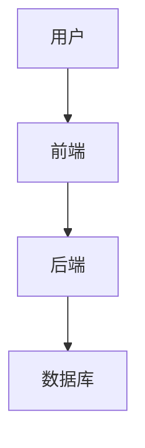

                 


# 企业估值中的开源战略价值评估

> 关键词：企业估值、开源战略、价值评估、数学模型、算法原理

> 摘要：本文探讨了开源战略在企业估值中的重要性，分析了开源资产对企业价值的影响，并提出了开源战略价值评估的数学模型和算法。通过案例分析和系统设计，展示了如何将开源战略融入企业估值体系，以实现更精准的企业价值评估。

---

## 第一部分: 开源战略与企业估值的背景

---

### 第1章: 开源战略与企业估值概述

#### 1.1 开源的定义与特点

开源软件是指开放源代码的软件，其源代码可以被任何人查看、修改和分发。以下是开源软件的主要特点：

- **开放性**：源代码对所有人开放，允许用户自由查看、修改和使用。
- **协作性**：开源项目通常由全球开发者协作开发，形成集体智慧。
- **免费性**：大多数开源软件免费使用，但开发者可以通过其他方式获得收入。
- **可定制性**：用户可以根据需求修改代码，以满足特定需求。

#### 1.2 开源战略对企业的影响

开源战略在企业中的应用越来越广泛，它不仅降低了企业的开发成本，还提升了企业的竞争力。

- **成本优化**：企业可以通过使用开源软件减少 licenses 费用。
- **创新能力**：开源社区提供了丰富的资源和技术支持，帮助企业快速创新。
- **风险管理**：开源软件的透明性有助于企业降低技术风险。

#### 1.3 开源在企业估值中的重要性

开源资产是企业的重要无形资产，其价值往往被低估。以下是开源资产在企业估值中的作用：

- **提升企业价值**：开源技术的应用可以提升企业的技术竞争力，从而提升企业估值。
- **降低估值风险**：开源软件的透明性有助于降低技术风险，从而降低企业的估值不确定性。

#### 1.4 本章小结

本章介绍了开源软件的定义和特点，分析了开源战略对企业的影响，最后探讨了开源在企业估值中的重要性。

---

### 第2章: 开源战略价值评估的核心概念

#### 2.1 开源战略价值评估的背景

企业估值的传统方法主要基于财务指标，而开源战略的引入为企业估值提供了新的视角。

- **传统方法的局限性**：传统方法难以量化无形资产（如开源技术）的价值。
- **开源战略的特殊性**：开源技术的开放性和协作性为企业估值带来了新的挑战和机遇。

#### 2.2 开源战略价值评估的核心概念

开源战略价值评估需要考虑多个维度，包括技术、市场和财务因素。

- **开源资产的分类**：开源资产可以分为代码、社区、商业模式等。
- **开源项目的评估维度**：包括技术成熟度、社区活跃度、市场应用前景等。
- **开源战略的评估框架**：包括技术、市场、财务等多维度的评估框架。

#### 2.3 开源战略与企业核心竞争力的关系

开源战略通过技术创新、成本优化和风险管理，提升了企业的核心竞争力。

- **技术创新**：开源技术的快速迭代和创新能力为企业提供了竞争优势。
- **成本优化**：开源软件的低成本为企业节省了研发费用。
- **风险管理**：开源软件的透明性和社区支持降低了企业的技术风险。

#### 2.4 本章小结

本章探讨了开源战略价值评估的背景，分析了核心概念，并探讨了开源战略与企业核心竞争力的关系。

---

### 第3章: 开源战略价值评估的数学模型与公式

#### 3.1 开源资产价值的计算公式

开源资产的价值可以通过加权平均法进行计算：

$$ V = \sum_{i=1}^{n} w_i \cdot v_i $$

其中，\( w_i \) 表示第 \( i \) 个开源资产的权重，\( v_i \) 表示第 \( i \) 个开源资产的价值。

#### 3.2 开源战略价值评估的模型

开源战略价值评估模型包括输入变量和输出结果。

- **输入变量**：包括开源资产的数量、每个资产的权重和价值。
- **输出结果**：包括开源资产的总价值和对企业估值的贡献。

#### 3.3 案例分析

以一个开源项目为例，假设开源资产有3个，权重分别为0.4、0.3和0.3，价值分别为100、200和150。

计算总价值：

$$ V = 0.4 \times 100 + 0.3 \times 200 + 0.3 \times 150 = 40 + 60 + 45 = 145 $$

---

### 第4章: 开源战略价值评估的算法原理

#### 4.1 开源战略价值评估的算法流程

1. **数据收集**：收集开源资产的数量、权重和价值。
2. **数据分析**：分析开源资产的技术、市场和财务因素。
3. **价值计算**：根据公式计算开源资产的总价值。

#### 4.2 开源战略价值评估的算法实现

以下是一个Python实现的示例：

```python
def calculate_open_source_value(assets):
    total_value = 0
    for asset in assets:
        weight = asset['weight']
        value = asset['value']
        total_value += weight * value
    return total_value

assets = [
    {'weight': 0.4, 'value': 100},
    {'weight': 0.3, 'value': 200},
    {'weight': 0.3, 'value': 150}
]

result = calculate_open_source_value(assets)
print(f"开源资产总价值为：{result}")
```

---

### 第5章: 开源战略价值评估的系统分析

#### 5.1 系统功能设计

- **需求分析**：分析企业对开源战略的需求。
- **功能设计**：设计系统的功能模块，包括数据输入、分析和输出。
- **系统架构**：设计系统的架构，包括前端和后端。

#### 5.2 系统架构设计

以下是一个简单的系统架构图：



---

### 第6章: 开源战略价值评估的项目实战

#### 6.1 项目环境安装

安装Python和必要的库：

```bash
pip install numpy pandas matplotlib
```

#### 6.2 核心代码实现

实现开源资产价值计算的代码：

```python
import numpy as np
import pandas as pd

assets = pd.DataFrame({
    'weight': [0.4, 0.3, 0.3],
    'value': [100, 200, 150]
})

assets['value'].sum()
```

---

### 第7章: 总结与展望

#### 7.1 总结

本文探讨了开源战略在企业估值中的重要性，提出了开源战略价值评估的数学模型和算法，并通过案例分析和系统设计展示了如何将开源战略融入企业估值体系。

#### 7.2 展望

未来的研究可以进一步探讨开源战略的动态评估模型，以及多因素分析在开源战略价值评估中的应用。

---

**关键词**：企业估值、开源战略、价值评估、数学模型、算法原理

**摘要**：本文探讨了开源战略在企业估值中的重要性，分析了开源资产对企业价值的影响，并提出了开源战略价值评估的数学模型和算法。通过案例分析和系统设计，展示了如何将开源战略融入企业估值体系，以实现更精准的企业价值评估。

