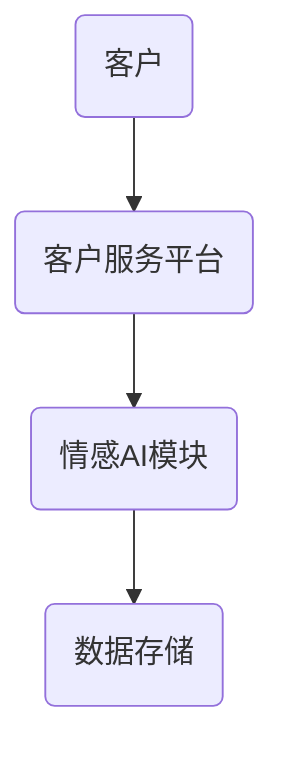
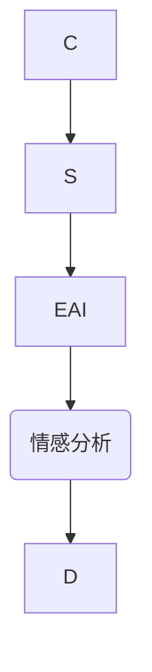
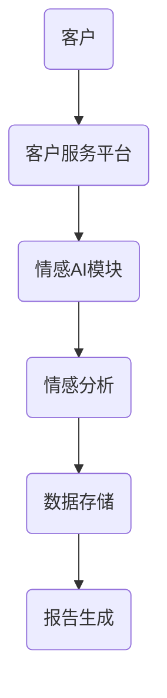

                 


# 企业估值中的情感AI客户服务平台评估

## 关键词：
- 情感AI
- 客户服务平台
- 企业估值
- 情感分析
- 机器学习
- 客户满意度
- 数据驱动决策

## 摘要：
本文探讨了情感AI在客户服务平台评估中的应用及其对企业估值的影响。通过分析情感AI的核心原理、算法实现、系统架构以及实际案例，展示了如何利用情感数据提升客户满意度和忠诚度，从而在企业估值中发挥关键作用。文章结合理论与实践，提供了一套基于情感AI的客户服务平台评估方法，为企业估值提供了新的视角和工具。

---

# 第一部分：企业估值与情感AI客户服务平台概述

## 第1章：企业估值中的情感AI客户服务平台背景

### 1.1 企业估值的核心要素
#### 1.1.1 企业价值的多维度评估
企业估值是一个复杂的系统工程，涉及财务表现、市场地位、管理团队、创新能力等多个维度。其中，客户关系和客户满意度是影响企业长期价值的重要因素。客户不仅是企业收入的来源，更是企业品牌价值的核心。

#### 1.1.2 客户满意度对企业估值的影响
客户满意度是衡量企业客户关系管理（CRM） effectiveness的关键指标。高满意度的客户通常具有更高的忠诚度和复购率，为企业创造持续的收入。此外，满意或忠诚的客户还可能主动为企业推荐新客户，降低营销成本。

#### 1.1.3 情感AI在客户关系管理中的作用
情感AI（Emotion Artificial Intelligence）通过分析客户的语言、语调和行为模式，识别客户的情感状态。这种技术能够帮助企业在客户互动中更精准地理解客户需求，优化客户体验，从而提升客户满意度和忠诚度。

### 1.2 情感AI客户服务平台的定义与特点
#### 1.2.1 情感AI的基本概念
情感AI是一种模拟人类情感识别和理解的技术，旨在通过自然语言处理（NLP）、语音分析和面部识别等手段，识别和分析人类的情感状态。情感AI的核心在于理解客户的情感反馈，帮助企业更好地与客户互动。

#### 1.2.2 客户服务平台的功能模块
客户服务平台通常包括以下功能模块：
- 客户信息管理：记录客户的基本信息和历史互动记录。
- 情感分析模块：分析客户的文本、语音和行为数据，识别情感状态。
- 智能客服：基于情感分析结果，提供个性化的客户服务。
- 数据可视化：展示客户情感数据的统计结果，帮助企业决策。

#### 1.2.3 情感AI与传统客户服务平台的对比
传统客户服务平台主要依赖人工客服和简单的关键词匹配技术，难以深入理解客户的情感需求。而情感AI客户服务平台通过引入自然语言处理和机器学习技术，能够更精准地识别客户情感，提供更智能化的服务。

### 1.3 企业估值与情感AI的结合
#### 1.3.1 情感AI在客户情感分析中的应用
情感AI可以帮助企业分析客户的反馈数据，识别客户的情感倾向。例如，通过分析客户的评论、反馈和投诉，企业可以了解客户对产品或服务的满意度，进而优化产品设计和服务流程。

#### 1.3.2 情感数据对企业估值的影响
情感数据是企业客户关系的重要组成部分。高满意度的客户群体通常意味着更强的市场竞争力和更高的品牌价值。情感数据还可以帮助企业预测客户流失率，优化成本结构，从而提高企业估值。

#### 1.3.3 情感AI客户服务平台的行业现状
目前，情感AI客户服务平台在金融、零售、医疗和教育等行业得到了广泛应用。随着技术的不断发展，情感AI客户服务平台的功能和性能也在不断提升，为企业估值提供了更多可能性。

---

## 第2章：情感AI客户服务平台的核心概念与联系

### 2.1 情感AI的核心原理
#### 2.1.1 情感分析的基本原理
情感分析是情感AI的核心技术之一，主要用于识别文本中的情感倾向。常见的情感分析任务包括二分类（正面/负面）和多分类（正面、中性、负面）。

#### 2.1.2 情感数据的采集与处理
情感数据的采集通常通过以下方式：
- 文本数据：客户评论、社交媒体帖子等。
- 语音数据：客户电话录音。
- 面部数据：客户面部表情识别。

情感数据的处理包括分词、词性标注、情感分类等步骤。

#### 2.1.3 情感分析的算法实现
情感分析的算法主要包括基于规则的和基于机器学习的方法。基于规则的方法依赖于预定义的词汇表和情感规则，而基于机器学习的方法则通过训练数据学习情感特征。

### 2.2 情感AI与客户服务平台的关系
#### 2.2.1 客户服务平台的功能架构
客户服务平台通常包括以下功能模块：
- 用户管理：记录用户的基本信息和历史互动记录。
- 情感分析模块：分析用户的文本、语音和行为数据，识别情感状态。
- 智能客服：基于情感分析结果，提供个性化的客户服务。
- 数据可视化：展示用户情感数据的统计结果，帮助企业决策。

#### 2.2.2 情感AI在客户服务平台中的应用场景
情感AI在客户服务平台中的应用场景包括：
- 情感监控：实时监控客户的情感状态，识别负面情绪并及时处理。
- 智能路由：根据客户的情感状态和需求，智能分配客服人员。
- 服务优化：通过情感数据分析，优化客户服务流程和产品设计。

#### 2.2.3 情感AI如何影响企业估值
情感AI通过提升客户满意度和忠诚度，增强客户关系，从而提高企业估值。具体表现在以下几个方面：
- 提高客户保留率：高满意度的客户更可能长期支持企业。
- 增强品牌价值：良好的客户体验提升品牌形象。
- 降低客户获取成本：满意客户更可能推荐新客户。

### 2.3 实体关系图与流程图
#### 2.3.1 情感AI客户服务平台的实体关系图


#### 2.3.2 情感分析流程图


---

## 第3章：情感AI客户服务平台的算法原理

### 3.1 情感分析算法概述
#### 3.1.1 基于规则的情感分析
基于规则的情感分析依赖于预定义的词汇表和情感规则。例如，将“非常好”标记为正面情感，将“很差”标记为负面情感。

#### 3.1.2 基于机器学习的情感分析
基于机器学习的情感分析通过训练数据学习情感特征。常用的算法包括支持向量机（SVM）和随机森林（Random Forest）。

#### 3.1.3 深度学习在情感分析中的应用
深度学习通过神经网络模型（如卷积神经网络（CNN）和长短期记忆网络（LSTM））进行情感分析，能够捕捉文本中的语义信息。

### 3.2 情感分析的数学模型和公式
#### 3.2.1 基于概率论的情感分析模型
概率论是情感分析的基础之一。例如，使用贝叶斯定理进行文本分类：
$$ P(\text{正面} | \text{文本}) = \frac{P(\text{文本} | \text{正面}) \cdot P(\text{正面})}{P(\text{文本})} $$

#### 3.2.2 情感分析的特征提取
特征提取是情感分析的关键步骤。常用特征包括词袋模型（Bag of Words）和词嵌入（如Word2Vec）。

---

## 第4章：系统分析与架构设计

### 4.1 项目背景介绍
情感AI客户服务平台的开发旨在通过情感分析技术提升客户体验，优化客户服务流程，从而提高企业估值。

### 4.2 系统功能设计
#### 4.2.1 用户管理模块
- 记录用户基本信息。
- 管理用户权限和角色。

#### 4.2.2 情感分析模块
- 接收用户输入的文本或语音数据。
- 使用预训练的情感分析模型进行情感分类。

#### 4.2.3 智能客服模块
- 根据情感分析结果分配客服人员。
- 提供个性化的客户服务。

### 4.3 系统架构设计


### 4.4 系统接口设计
- API接口：提供情感分析功能的接口。
- 数据接口：连接数据库，存储情感分析结果。

### 4.5 系统交互流程图


---

## 第5章：项目实战

### 5.1 环境安装
- 安装Python和必要的库（如NLTK、scikit-learn、TensorFlow）。

### 5.2 核心代码实现
```python
import nltk
from sklearn.feature_extraction.text import TfidfVectorizer
from sklearn.svm import SVC

# 数据预处理
nltk.download('stopwords')
stopwords = nltk.corpus.stopwords.words('english')

# 特征提取
vectorizer = TfidfVectorizer(stop_words=stopwords)
X = vectorizer.fit_transform(text_data)

# 模型训练
model = SVC()
model.fit(X, labels)
```

### 5.3 功能测试与结果分析
测试情感分析模型的准确率、召回率和F1分数，分析模型的性能。

### 5.4 案例分析
通过实际案例（如电商平台的情感分析）展示情感AI客户服务平台的实际应用。

---

## 第6章：总结与展望

### 6.1 总结
本文详细探讨了情感AI在客户服务平台评估中的应用及其对企业估值的影响。通过理论分析和实际案例，展示了情感AI如何提升客户满意度和忠诚度，进而优化企业估值。

### 6.2 最佳实践 tips
- 定期更新情感分析模型，保持模型的准确性。
- 结合其他数据源（如行为数据）进行综合分析。

### 6.3 未来展望
未来，随着人工智能和大数据技术的不断发展，情感AI客户服务平台将更加智能化和个性化，为企业估值提供更强大的支持。

---

通过以上章节的内容，我们可以全面了解情感AI客户服务平台在企业估值中的重要性及其实际应用。希望本文能够为相关领域的研究和实践提供有价值的参考。

