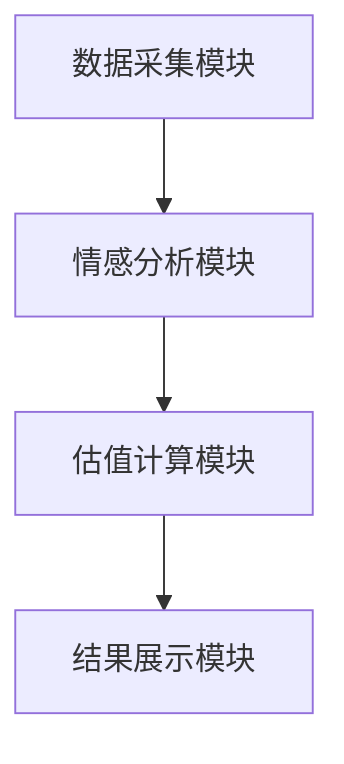
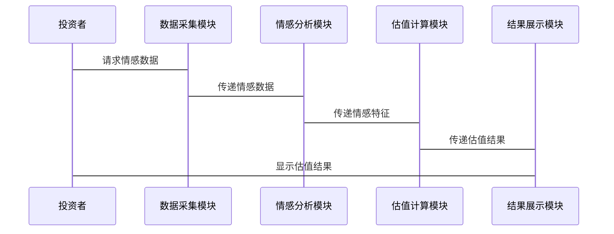

                 


# 企业估值中的情感AI应用价值评估

> 关键词：情感AI，企业估值，情感计算，价值评估，机器学习，深度学习，自然语言处理

> 摘要：随着人工智能技术的快速发展，情感AI在企业估值中的应用逐渐成为研究的热点。本文系统地探讨了情感AI在企业估值中的价值评估方法，分析了情感AI的核心算法与模型，详细讲解了情感AI在企业估值中的具体应用，并通过实际案例展示了情感AI在企业估值系统中的架构设计与实现。文章最后总结了情感AI在企业估值中的优势与挑战，并提出了未来的研究方向。

---

# 第1章 情感AI与企业估值概述

## 1.1 情感AI的定义与核心概念

### 1.1.1 情感AI的定义
情感AI（Emotion AI）是一种结合人工智能技术，能够识别、理解和模拟人类情感的系统。它通过分析文本、语音和图像等多模态数据，提取其中的情感信息，并将其转化为可用于决策支持的结构化数据。

### 1.1.2 情感AI的核心要素
情感AI的核心要素包括：
1. **数据采集**：从多模态数据中提取情感信息。
2. **情感识别**：通过算法对情感信息进行分类和量化。
3. **情感分析**：对情感数据进行深度分析，挖掘潜在价值。
4. **情感计算**：将情感数据转化为可量化的指标，用于决策支持。

### 1.1.3 情感AI与传统数据分析的区别
传统数据分析主要依赖于结构化数据，而情感AI则关注非结构化数据中的情感信息。情感AI能够捕捉到数据背后的情感倾向，为决策提供更全面的依据。

## 1.2 企业估值的定义与方法

### 1.2.1 企业估值的基本概念
企业估值是指对企业未来盈利能力的估计，通常用于投资决策、并购评估等领域。传统的企业估值方法主要包括DCF模型、相对估值法等。

### 1.2.2 传统企业估值方法
1. **DCF模型**：通过现金流折现法评估企业价值。
2. **相对估值法**：通过比较企业与可比公司的估值指标来确定企业价值。

### 1.2.3 情感AI在企业估值中的应用潜力
情感AI可以通过分析市场情绪、行业趋势等非结构化数据，为传统估值方法提供更丰富的数据支持，从而提高估值的准确性。

## 1.3 情感AI在企业估值中的价值

### 1.3.1 情感AI对企业决策的支持
情感AI可以帮助企业更好地理解市场情绪，优化投资决策。

### 1.3.2 情感AI在市场情绪分析中的作用
通过分析社交媒体、新闻媒体等渠道的情感数据，情感AI可以捕捉市场情绪的变化，为估值提供实时反馈。

### 1.3.3 情感AI对投资决策的影响
情感AI可以识别市场情绪中的潜在风险，帮助投资者做出更明智的投资决策。

## 1.4 本章小结
本章介绍了情感AI的定义和核心概念，探讨了企业估值的基本方法，分析了情感AI在企业估值中的应用潜力和价值。

---

# 第2章 情感AI的核心算法与模型

## 2.1 情感计算的基本原理

### 2.1.1 情感计算的定义
情感计算是指通过计算技术对人类情感进行识别、理解和模拟的过程。

### 2.1.2 情感计算的关键步骤
1. 数据采集：从文本、语音、图像等多模态数据中提取情感信息。
2. 特征提取：将情感信息转化为可用于分类的特征向量。
3. 情感分类：通过机器学习算法对情感数据进行分类。
4. 情感计算：将情感数据转化为可量化的指标。

### 2.1.3 情感计算的数学模型
情感计算的数学模型可以表示为：
$$
\text{Valence} = f(x_1, x_2, ..., x_n)
$$
其中，$x_i$表示情感特征，$f$表示情感计算函数。

## 2.2 情感分析的主流算法

### 2.2.1 基于规则的分类算法
基于规则的分类算法通过预定义的情感词典对文本进行情感分类。例如，可以将“正面”词汇赋予正权重，“负面”词汇赋予负权重。

### 2.2.2 基于机器学习的情感分析算法
基于机器学习的情感分析算法包括支持向量机（SVM）、随机森林（Random Forest）等。这些算法通过训练数据学习情感特征，从而实现情感分类。

### 2.2.3 基于深度学习的情感分析模型
基于深度学习的情感分析模型包括循环神经网络（RNN）、长短期记忆网络（LSTM）和Transformer等。这些模型能够捕捉文本中的语义信息，实现更准确的情感分类。

## 2.3 情感AI的模型训练与优化

### 2.3.1 数据预处理与特征提取
数据预处理包括文本清洗、分词、去停用词等步骤。特征提取可以通过词袋模型、TF-IDF等方法实现。

### 2.3.2 模型训练与调优
通过交叉验证和网格搜索等方法，选择最优的模型参数，提高模型的准确率。

### 2.3.3 模型评估与验证
模型评估可以通过准确率、召回率、F1分数等指标进行。

## 2.4 情感AI算法的优缺点对比

### 2.4.1 各种算法的优缺点分析
- 基于规则的分类算法：简单易实现，但难以处理复杂的情感语境。
- 基于机器学习的情感分析算法：准确率较高，但需要大量标注数据。
- 基于深度学习的情感分析模型：准确率最高，但计算资源消耗较大。

### 2.4.2 算法选择的依据与策略
算法选择应综合考虑数据规模、计算资源和准确率要求。

## 2.5 本章小结
本章介绍了情感AI的核心算法与模型，分析了各种算法的优缺点，并提出了算法选择的依据与策略。

---

# 第3章 情感AI在企业估值中的应用

## 3.1 企业估值中的情感数据来源

### 3.1.1 市场情绪数据的来源
市场情绪数据可以来源于社交媒体、新闻媒体、论坛等渠道。

### 3.1.2 企业财报与管理情绪分析
通过分析企业财报中的文本信息，识别管理层的情绪倾向。

### 3.1.3 行业趋势与竞争情绪分析
通过分析行业报告和竞争企业的新闻，识别行业趋势和竞争情绪。

## 3.2 情感数据对估值的影响

### 3.2.1 情感数据对企业价值的评估
情感数据可以反映市场对企业的看法，从而影响企业的估值。

### 3.2.2 情感数据对投资决策的影响
通过分析市场情绪，投资者可以更好地把握市场趋势，优化投资决策。

### 3.2.3 情感数据与企业风险评估
情感数据可以识别潜在风险，如负面情绪可能预示着企业风险的增加。

## 3.3 情感AI在企业估值中的具体应用

### 3.3.1 基于情感AI的市场情绪分析
通过分析社交媒体上的情感数据，预测市场情绪的变化趋势。

### 3.3.2 情感AI在企业财务分析中的应用
通过分析企业财报中的情感数据，识别财务风险。

### 3.3.3 情感AI在企业战略规划中的应用
通过分析行业趋势和竞争情绪，帮助企业制定更有效的战略规划。

## 3.4 情感AI在企业估值中的案例分析

### 3.4.1 典型案例一：社交媒体情绪与股价波动
通过分析社交媒体上的情感数据，预测某企业的股价波动。

### 3.4.2 典型案例二：行业趋势与企业估值调整
通过分析行业报告中的情感数据，调整企业的估值模型。

### 3.4.3 案例分析总结
情感AI在企业估值中的应用可以帮助投资者更好地把握市场情绪，提高估值的准确性。

## 3.5 本章小结
本章分析了情感AI在企业估值中的具体应用，通过实际案例展示了情感AI在市场情绪分析、企业财务分析和战略规划中的作用。

---

# 第4章 情感AI驱动的企业估值系统架构

## 4.1 企业估值系统的需求分析

### 4.1.1 系统目标与功能需求
系统目标：构建一个基于情感AI的企业估值系统。
功能需求：数据采集、情感分析、估值计算、结果展示。

### 4.1.2 系统用户与使用场景
用户包括投资者、企业高管等，使用场景包括投资决策、企业估值报告等。

### 4.1.3 系统性能与可扩展性
系统需要具备高并发处理能力和良好的可扩展性。

## 4.2 情感AI驱动的系统架构设计

### 4.2.1 系统整体架构图


### 4.2.2 数据采集模块设计
数据采集模块负责从社交媒体、新闻媒体等渠道采集情感数据。

### 4.2.3 情感分析模块设计
情感分析模块通过情感AI算法对采集的数据进行情感分类和分析。

### 4.2.4 估值计算模块设计
估值计算模块结合情感数据和传统估值方法，计算企业的估值。

### 4.2.5 结果展示与反馈模块设计
结果展示模块将估值结果以可视化的方式呈现，并提供反馈接口。

## 4.3 系统接口与交互设计

### 4.3.1 数据接口设计
数据接口采用RESTful API，支持JSON格式的数据传输。

### 4.3.2 系统交互流程设计


## 4.4 本章小结
本章设计了一个基于情感AI的企业估值系统架构，详细描述了各模块的功能和交互流程。

---

# 第5章 项目实战：情感AI驱动的企业估值系统实现

## 5.1 环境安装与配置

### 5.1.1 安装Python环境
安装Python 3.x版本，并配置虚拟环境。

### 5.1.2 安装依赖库
安装以下依赖库：
- `numpy`
- `pandas`
- `scikit-learn`
- `tensorflow`

## 5.2 系统核心实现源代码

### 5.2.1 数据采集模块实现
```python
import requests
from bs4 import BeautifulSoup

def fetch_data(url):
    response = requests.get(url)
    soup = BeautifulSoup(response.text, 'html.parser')
    return [tag.text for tag in soup.find_all('div', class_='tweet')]
```

### 5.2.2 情感分析模块实现
```python
from sklearn.feature_extraction.text import TfidfVectorizer
from sklearn.svm import SVC

vectorizer = TfidfVectorizer()
model = SVC()

def train_model(X, y):
    vectorizer.fit(X)
    X_vec = vectorizer.transform(X)
    model.fit(X_vec, y)

def predict_emotion(text):
    X_test = vectorizer.transform([text])
    return model.predict(X_test)[0]
```

### 5.2.3 估值计算模块实现
```python
import numpy as np

def calculate_valuation(financial_data, emotion_score):
    return np.dot(financial_data, emotion_score)
```

## 5.3 代码应用解读与分析

### 5.3.1 数据采集模块解读
数据采集模块通过爬取社交媒体上的文本数据，提取情感信息。

### 5.3.2 情感分析模块解读
情感分析模块使用TF-IDF和SVM算法，对文本数据进行情感分类。

### 5.3.3 估值计算模块解读
估值计算模块将情感数据与财务数据相结合，计算企业的估值。

## 5.4 实际案例分析与详细讲解剖析
以某科技公司为例，通过情感AI技术分析社交媒体上的情绪数据，结合企业财务数据，计算企业的估值。

## 5.5 项目小结
本章通过实际案例展示了情感AI驱动的企业估值系统的实现过程，详细解读了各模块的核心代码。

---

# 第6章 情感AI在企业估值中的优势与挑战

## 6.1 情感AI的优势

### 6.1.1 提高估值的准确性
情感AI能够捕捉市场情绪的变化，为估值提供更全面的依据。

### 6.1.2 实时性与动态性
情感AI可以实时分析市场情绪，动态调整估值模型。

### 6.1.3 数据的丰富性
情感AI能够利用多模态数据，提供更丰富的信息。

## 6.2 情感AI的挑战

### 6.2.1 数据的质量与可靠性
情感AI依赖于高质量的数据，数据的噪声可能影响结果的准确性。

### 6.2.2 情感计算的复杂性
情感计算涉及多模态数据的处理，算法复杂性较高。

### 6.2.3 模型的可解释性
深度学习模型的黑箱特性可能影响情感AI在企业估值中的应用。

## 6.3 应对挑战的最佳实践

### 6.3.1 数据预处理与清洗
通过数据清洗和特征提取，提高数据的质量。

### 6.3.2 模型优化与调优
通过网格搜索和交叉验证，选择最优的模型参数。

### 6.3.3 可解释性增强
通过可视化和解释性模型，提高情感AI的可解释性。

## 6.4 本章小结
本章分析了情感AI在企业估值中的优势与挑战，并提出了应对挑战的最佳实践。

---

# 第7章 未来的研究方向与总结

## 7.1 未来的研究方向

### 7.1.1 多模态情感计算
结合文本、语音、图像等多种数据源，提高情感计算的准确性。

### 7.1.2 情感AI与强化学习
探索情感AI在强化学习中的应用，提高决策的智能性。

### 7.1.3 情感AI的可解释性研究
研究如何提高情感AI的可解释性，增强其在企业估值中的应用。

## 7.2 总结
情感AI作为一种新兴的技术，为

