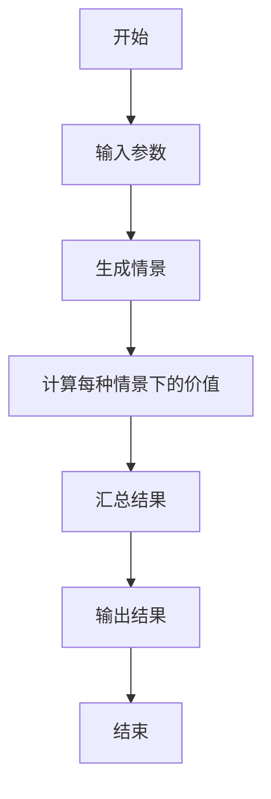
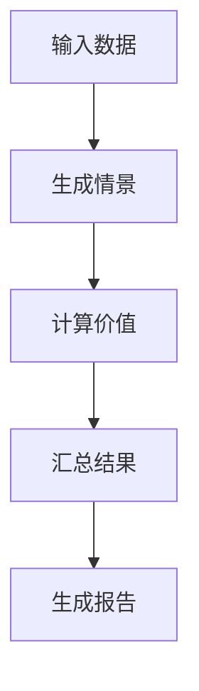
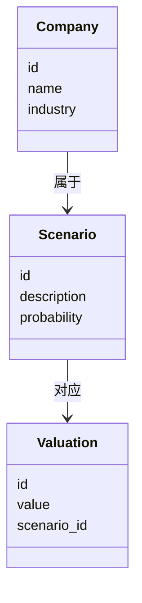
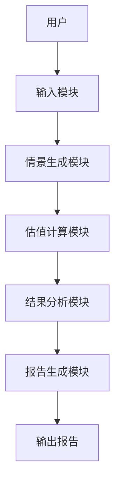

                 


# 企业估值中的情景分析技巧

**关键词**：企业估值、情景分析、财务建模、风险评估、投资决策

**摘要**：情景分析是企业估值中不可或缺的工具，它通过构建不同假设条件下的多种可能情景，评估企业在不同环境下的表现和价值。本文从情景分析的基本概念出发，结合数学模型、系统架构和实际案例，详细讲解情景分析在企业估值中的应用技巧。通过本篇文章，读者可以掌握如何利用情景分析进行更准确、更全面的企业估值。

---

## 第一部分：企业估值中的情景分析基础

### 第1章：情景分析与企业估值概述

#### 1.1 情景分析的基本概念

**1.1.1 什么是情景分析**

情景分析是一种通过构建不同假设条件下的多种可能情景，来评估企业在不同环境下的表现和价值的方法。它不仅考虑单一的最佳预测，还分析企业在不同市场条件、政策变化或经济波动下的表现。

**1.1.2 情景分析的目的与作用**

- **目的**：帮助企业在不确定的环境中制定更稳健的决策。
- **作用**：通过分析多种可能的情景，评估企业应对不同挑战的能力，为投资者和管理层提供更全面的视角。

**1.1.3 情景分析与企业估值的关系**

情景分析是企业估值的重要组成部分。传统的估值方法通常基于单一预测，而情景分析通过考虑多种可能的结果，提供更全面的估值区间和风险评估。

---

#### 1.2 企业估值的基本原理

**1.2.1 企业估值的核心概念**

企业估值是通过对企业未来现金流的预测和折现，计算其当前价值的过程。常见的估值方法包括DCF（ discounted cash flow）、可比公司分析、资产重置成本法等。

**1.2.2 常见的企业估值方法**

- **DCF模型**：通过预测未来现金流，使用适当的折现率计算现值。
- **可比公司分析**：基于可比公司的市场价值和财务指标，推断目标公司的价值。
- **资产重置成本法**：基于企业资产的重置成本，扣除可能的贬值。

**1.2.3 情景分析在估值中的应用**

在企业估值中，情景分析可以帮助评估不同假设（如经济增长率、利率变化、行业趋势）对估值结果的影响。通过分析多种情景，可以更好地理解估值的敏感性和不确定性。

---

#### 1.3 情景分析的关键要素

**1.3.1 情景的定义与分类**

- **情景的定义**：一组假设条件下的未来经济和市场情况。
- **情景的分类**：通常分为乐观、中性、悲观三种情景，也可能根据行业特点进行更细致的分类。

**1.3.2 情景分析的驱动因素**

- **宏观经济因素**：如GDP增长率、通货膨胀率、利率变化等。
- **行业因素**：如行业竞争状况、技术进步、政策变化等。
- **企业特定因素**：如企业的成本结构、利润率、资本支出等。

**1.3.3 情景分析的边界与外延**

情景分析需要明确假设的边界，例如时间范围、假设的合理性等。外延则包括情景分析如何与其他估值方法结合使用。

---

### 第2章：情景分析的核心概念与联系

#### 2.1 情景分析的原理

**2.1.1 概率分布与情景生成**

情景分析通常基于概率分布，例如正态分布、均匀分布等。通过模拟这些分布，生成多种可能的情景。

**2.1.2 敏感性分析与情景权重**

敏感性分析可以帮助确定哪些因素对估值影响最大。情景权重则根据这些因素的重要性和概率分布，为每种情景分配权重。

**2.1.3 情景间的相互关系**

不同情景之间可能存在相互影响，例如经济衰退可能影响企业的收入和成本，进而影响现金流。

---

#### 2.2 情景分析的核心要素对比

**2.2.1 不同情景类型对比表格**

| 情景类型 | 描述 | 概率 | 影响 |
|----------|------|------|------|
| 乐观     | 高增长、低风险 | 20% | 高估值 |
| 中性     | 平稳增长、中等风险 | 60% | 中估值 |
| 悲观     | 低增长、高风险 | 20% | 低估值 |

**2.2.2 情景属性特征对比分析**

- **乐观情景**：高增长率、低利率、高市场需求。
- **中性情景**：平稳增长率、中等利率、正常市场需求。
- **悲观情景**：低增长率、高利率、低市场需求。

**2.2.3 情景分析的ER实体关系图**

```mermaid
erDiagram
    company {
        id
        name
        industry
    }
    scenario {
        id
        description
        probability
    }
    valuation {
        id
        value
        scenario_id
    }
    company --> scenario : 属于
    scenario --> valuation : 对应
```

---

#### 2.3 情景分析的数学模型与算法原理

**2.3.1 情景分析的数学模型**

情景分析通常基于概率分布和蒙特卡洛模拟。以下是常见的数学模型：

- **蒙特卡洛模拟**：通过随机抽样生成大量可能的情景，计算每种情景下的企业价值，然后汇总结果。

**2.3.2 情景分析的算法流程**

以下是情景分析的算法流程图：



---

### 第3章：情景分析的系统架构与设计

#### 3.1 系统功能设计

**3.1.1 需求分析与功能模块划分**

- **输入模块**：用户输入企业财务数据、市场数据等。
- **情景生成模块**：根据输入数据生成不同情景。
- **估值计算模块**：计算每种情景下的企业价值。
- **结果分析模块**：汇总结果并生成报告。

**3.1.2 系统功能流程图**



**3.1.3 系统功能的领域模型类图**



---

#### 3.2 系统架构设计

**3.2.1 系统架构图**



**3.2.2 模块间的交互关系**

- **输入模块**：接收用户输入的数据，如财务数据、市场数据等。
- **情景生成模块**：根据输入数据生成不同情景。
- **估值计算模块**：计算每种情景下的企业价值。
- **结果分析模块**：汇总结果并生成报告。

---

## 第四部分：总结与最佳实践

### 6.1 最佳实践 tips

**6.1.1 情景分析中的常见误区**

- 忽略情景之间的相互影响。
- 使用过于简化的假设。
- 忽略数据的不确定性。

**6.1.2 如何选择合适的情景**

- 根据企业的行业特点选择情景。
- 结合宏观经济环境选择情景。
- 考虑企业的具体情况选择情景。

**6.1.3 情景分析的优化技巧**

- 使用蒙特卡洛模拟生成大量情景。
- 使用敏感性分析确定关键因素。
- 使用压力测试评估极端情况下的企业表现。

---

通过以上步骤，我们可以系统地进行企业估值中的情景分析，帮助企业在不确定的环境中制定更稳健的决策。

