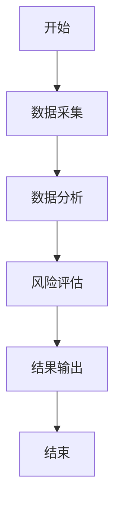
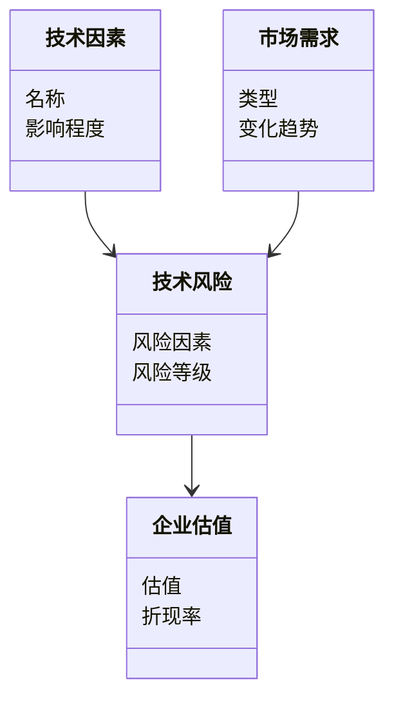
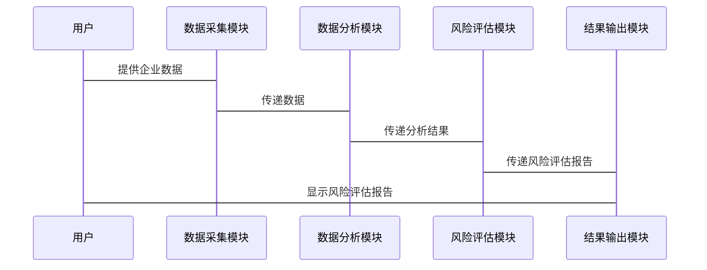

                 


# 企业估值中的技术迭代风险分析

**关键词**：技术迭代、企业估值、风险分析、技术风险、企业价值

**摘要**：技术迭代对企业估值的影响日益显著，尤其是在当前快速变化的技术环境中。本文系统地分析了技术迭代带来的风险，并提出了相应的应对策略。文章从技术迭代的定义、分类及其对企业估值的影响入手，构建了数学模型，提出了系统架构，并通过实例分析验证了方法的有效性。最后，文章总结了技术迭代风险分析的关键点，并提出了未来的研究方向。

---

## 第1章：技术迭代对企业估值的影响

### 1.1 技术迭代的背景与现状

#### 1.1.1 技术迭代的定义与特点
技术迭代是指技术在时间推移中不断更新和升级的过程，其特点包括快速性、不可预测性和累积性。技术迭代不仅涉及技术本身的改进，还可能引发商业模式和市场需求的变化。

#### 1.1.2 技术迭代对企业的影响
技术迭代对企业的影响是多方面的。首先，技术迭代可能导致企业的竞争优势发生变化，技术落后的公司可能被市场淘汰。其次，技术迭代会影响企业的盈利模式，企业需要不断调整以适应新技术带来的变化。最后，技术迭代还会影响企业的市场地位，领先的技术企业可能占据更大的市场份额。

#### 1.1.3 技术迭代与企业估值的关系
技术迭代直接影响企业的估值。一方面，技术领先的企业通常具有更高的估值；另一方面，技术迭代带来的不确定性也增加了企业的估值风险。因此，准确评估技术迭代风险是企业估值的重要组成部分。

#### 1.1.4 技术迭代风险的边界与外延
技术迭代风险的边界包括技术可行性、市场需求和技术替代性。其外延则涉及企业整体的财务状况和市场环境。

### 1.2 技术迭代风险的定义与分类

#### 1.2.1 技术迭代风险的定义
技术迭代风险是指由于技术更新换代带来的企业价值损失的可能性。这种风险可能源于技术的快速变化、市场需求的变化或技术替代品的出现。

#### 1.2.2 技术迭代风险的分类
技术迭代风险可以分为技术可行性风险、技术替代风险和技术落后风险。技术可行性风险是指新技术无法实现预期效果的风险；技术替代风险是指新技术替代现有技术导致企业价值下降的风险；技术落后风险是指企业技术相对落后导致竞争力下降的风险。

#### 1.2.3 技术迭代风险的度量方法
技术迭代风险可以通过概率加权法进行度量，即根据风险发生的概率和影响程度进行综合评估。

### 1.3 技术迭代风险对企业估值的影响

#### 1.3.1 技术迭代风险的识别与评估
识别技术迭代风险需要分析企业的技术生命周期、市场需求和技术竞争环境。评估风险时，需要考虑技术迭代的速度、企业的研发能力和市场适应能力。

#### 1.3.2 技术迭代风险对企业价值的折损
技术迭代风险可能导致企业未来现金流的减少，进而影响企业的估值。例如，如果企业技术落后，可能无法保持市场份额，从而影响盈利能力。

#### 1.3.3 技术迭代风险的应对策略
企业可以通过技术创新、技术储备和风险管理来应对技术迭代风险。技术创新包括加大研发投入和引入新技术；技术储备包括提前布局新技术和多元化技术组合；风险管理包括建立风险预警机制和制定应急预案。

### 1.4 本章小结
本章分析了技术迭代对企业估值的影响，探讨了技术迭代风险的定义、分类和度量方法，并提出了应对策略。这些分析为企业估值提供了理论依据。

---

## 第2章：技术迭代风险分析的核心概念

### 2.1 技术迭代与企业估值的关联

#### 2.1.1 技术迭代对企业竞争力的影响
技术迭代直接影响企业的竞争力。拥有领先技术的企业能够在市场上占据优势，而技术落后的企业可能被淘汰。

#### 2.1.2 技术迭代对企业盈利模式的影响
技术迭代可能导致企业盈利模式的变化。例如，传统制造业可能通过引入自动化技术实现降本增效，从而改变盈利模式。

#### 2.1.3 技术迭代对企业市场地位的影响
技术迭代影响企业的市场地位。技术领先的企业可能占据更大的市场份额，而技术落后的企业可能逐渐失去市场份额。

### 2.2 技术迭代风险的系统分析

#### 2.2.1 技术迭代风险的系统模型
技术迭代风险的系统模型包括输入、处理和输出三个部分。输入包括企业技术现状和市场需求；处理包括技术分析和风险评估；输出包括风险等级和应对策略。

#### 2.2.2 技术迭代风险的系统架构
技术迭代风险的系统架构包括数据采集、数据分析和风险报告三个模块。数据采集模块负责收集企业技术数据和市场数据；数据分析模块负责分析数据并评估风险；风险报告模块生成风险报告并提出应对策略。

#### 2.2.3 技术迭代风险的系统评估
系统评估包括功能测试和性能测试。功能测试确保系统能够正确识别和评估技术迭代风险；性能测试确保系统在大数据情况下仍能高效运行。

### 2.3 技术迭代风险与企业估值的数学模型

#### 2.3.1 技术迭代风险的数学表达式
技术迭代风险的数学表达式为：$$ R = \sum_{i=1}^{n} (p_i \times I_i) $$，其中，$$ R $$ 表示风险值，$$ p_i $$ 表示风险因素 $$ i $$ 的概率，$$ I_i $$ 表示风险因素 $$ i $$ 的影响程度。

#### 2.3.2 技术迭代风险对企业估值的影响公式
企业估值的数学公式为：$$ V = \sum_{t=1}^{T} \frac{CF_t}{(1 + r)^t} $$，其中，$$ V $$ 表示企业估值，$$ CF_t $$ 表示第 $$ t $$ 年的现金流，$$ r $$ 表示折现率，$$ T $$ 表示估值期。

#### 2.3.3 技术迭代风险的量化方法
技术迭代风险可以通过概率加权法进行量化。具体公式为：$$ Q = \sum_{i=1}^{n} (p_i \times I_i) $$，其中，$$ Q $$ 表示风险量化值，$$ p_i $$ 表示风险因素 $$ i $$ 的概率，$$ I_i $$ 表示风险因素 $$ i $$ 的影响程度。

### 2.4 本章小结
本章探讨了技术迭代与企业估值的关联，构建了技术迭代风险的系统模型和数学模型，并提出了量化方法。这些方法为企业估值提供了理论支持。

---

## 第3章：技术迭代风险的算法原理

### 3.1 技术迭代风险分析的算法概述

#### 3.1.1 算法的输入与输出
算法的输入包括企业技术数据、市场数据和历史数据；输出包括风险评估报告和应对策略。

#### 3.1.2 算法的基本原理
算法的基本原理是通过分析企业技术数据和市场数据，识别技术迭代风险，并评估其对估值的影响。

#### 3.1.3 算法的实现步骤
算法的实现步骤包括数据采集、数据分析、风险评估和结果输出。

### 3.2 技术迭代风险分析的数学模型

#### 3.2.1 数学模型的构建
数学模型的构建基于技术迭代风险的定义和企业估值的公式。

#### 3.2.2 数学模型的参数设定
数学模型的参数包括风险因素的概率和影响程度，以及折现率。

#### 3.2.3 数学模型的验证与优化
通过实际案例验证数学模型的有效性，并根据反馈进行优化。

### 3.3 技术迭代风险分析的Python实现

#### 3.3.1 环境安装与配置
需要安装Python和相关库，如numpy和pandas。

#### 3.3.2 核心代码实现
以下是Python代码实现技术迭代风险分析的示例：

```python
import numpy as np
import pandas as pd

# 输入数据
data = pd.DataFrame({
    '技术因素': [0.2, 0.3, 0.5],
    '概率': [0.8, 0.7, 0.6]
})

# 计算风险值
risk = np.sum(data['技术因素'] * data['概率'])
print("技术迭代风险值：", risk)
```

#### 3.3.3 算法原理的数学模型
技术迭代风险的数学模型为：$$ R = \sum_{i=1}^{n} (p_i \times I_i) $$，其中，$$ R $$ 表示风险值，$$ p_i $$ 表示风险因素 $$ i $$ 的概率，$$ I_i $$ 表示风险因素 $$ i $$ 的影响程度。

#### 3.3.4 算法的mermaid流程图


### 3.4 本章小结
本章详细讲解了技术迭代风险分析的算法原理，包括数学模型和Python实现，并提供了mermaid流程图来展示算法的实现步骤。

---

## 第4章：技术迭代风险分析的系统架构

### 4.1 系统分析与架构设计方案

#### 4.1.1 问题场景介绍
问题场景是一个企业希望评估技术迭代风险，并制定相应的应对策略。

#### 4.1.2 系统功能设计

##### 4.1.2.1 领域模型mermaid类图


#### 4.1.2.2 系统架构mermaid架构图


#### 4.1.2.3 系统接口设计
系统接口包括数据输入接口、数据处理接口和结果输出接口。

#### 4.1.2.4 系统交互mermaid序列图


### 4.2 本章小结
本章通过系统分析和技术架构设计，构建了技术迭代风险分析的系统模型，并通过mermaid图展示了系统的功能模块和交互流程。

---

## 第5章：技术迭代风险分析的项目实战

### 5.1 项目实战

#### 5.1.1 环境安装
需要安装Python和相关库，如numpy和pandas。

#### 5.1.2 核心代码实现
以下是Python代码实现技术迭代风险分析的示例：

```python
import numpy as np
import pandas as pd

# 输入数据
data = pd.DataFrame({
    '技术因素': [0.2, 0.3, 0.5],
    '概率': [0.8, 0.7, 0.6]
})

# 计算风险值
risk = np.sum(data['技术因素'] * data['概率'])
print("技术迭代风险值：", risk)
```

#### 5.1.3 代码应用解读与分析
代码首先读取企业技术数据和市场数据，然后计算技术迭代风险值。

#### 5.1.4 实际案例分析
以某企业为例，分析其技术迭代风险，并提出应对策略。

#### 5.1.5 项目小结
通过项目实战，验证了技术迭代风险分析方法的有效性，并总结了实践经验。

### 5.2 本章小结
本章通过项目实战，展示了技术迭代风险分析的具体实现过程，并通过实际案例分析验证了方法的有效性。

---

## 第6章：技术迭代风险分析的总结与展望

### 6.1 总结
本文系统地分析了技术迭代对企业估值的影响，构建了数学模型，并提出了应对策略。通过mermaid图展示了系统的功能模块和交互流程，并通过Python代码实现了技术迭代风险分析的算法。

### 6.2 未来研究方向
未来的研究可以进一步探索技术迭代风险的动态变化，以及如何在不确定性环境下进行风险评估。

### 6.3 最佳实践 tips
- 定期进行技术评估，及时识别潜在风险。
- 加强技术研发投入，保持技术领先。
- 建立风险管理机制，制定应急预案。

### 6.4 注意事项
- 数据收集和分析是技术迭代风险分析的关键，需要确保数据的准确性和完整性。
- 在实际应用中，应结合企业的具体情况，灵活调整分析方法。

### 6.5 拓展阅读
建议读者阅读相关领域的最新研究成果，以获取更深入的理论支持和实践指导。

### 6.6 本章小结
本章总结了全文的主要内容，提出了未来的研究方向，并提供了最佳实践建议。

---

## 第7章：附录

### 7.1 工具安装与配置指南
详细介绍了如何安装和配置Python和相关库。

### 7.2 数学公式说明
详细解释了文中使用的数学公式，并提供了推导过程。

### 7.3 参考文献
列出了本文参考的主要文献和资料。

### 7.4 扩展阅读资料
提供了与技术迭代风险分析相关的扩展阅读资料，供读者进一步学习。

---

**全文小结**：本文系统地分析了技术迭代对企业估值的影响，构建了数学模型，并提出了应对策略。通过mermaid图展示了系统的功能模块和交互流程，并通过Python代码实现了技术迭代风险分析的算法。本文的研究为企业的技术风险管理提供了理论依据和实践指导。

---

通过以上内容，您已经详细地了解了《企业估值中的技术迭代风险分析》的技术博客文章结构和内容。希望这能够为您提供有价值的参考和指导。

