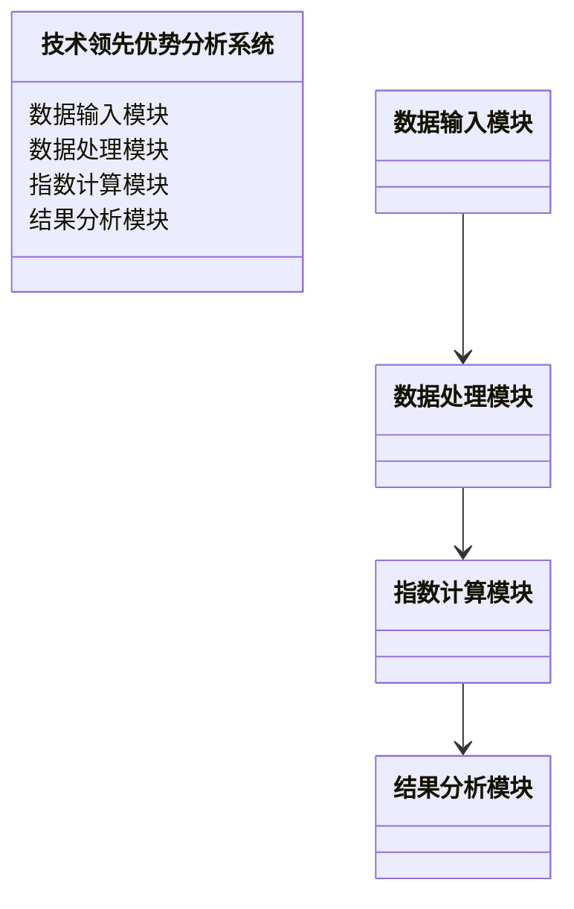

                 


# 企业估值中的技术领先优势分析

> 关键词：技术领先优势，企业估值，技术领先指数，系统架构，算法原理，项目实战

> 摘要：本文深入分析了技术领先优势在企业估值中的重要性，探讨了技术领先如何转化为企业价值，提出了技术领先指数的计算方法，并通过系统架构和项目实战展示了如何在实际中应用这些方法。文章内容涵盖技术领先优势的核心概念、算法原理、系统设计以及实际案例分析，旨在为企业估值提供新的视角和方法。

---

## 第一章：技术领先优势与企业估值的背景

### 1.1 技术领先优势的定义与核心概念

技术领先优势是指企业在技术开发、创新和应用方面比竞争对手更先进、更高效的能力。这种优势不仅体现在技术的研发能力上，还表现在技术的商业化应用和持续创新能力上。在企业估值中，技术领先优势被认为是企业未来盈利能力的重要保障，因为它能够提升企业的市场竞争力，降低经营风险，从而提高企业的整体估值。

#### 1.1.1 技术领先优势的定义

技术领先优势可以分为以下几个方面：
1. **技术储备**：企业拥有更多的技术专利、研发团队和资金投入。
2. **技术开发能力**：企业能够快速响应市场需求，推出新产品或服务。
3. **技术应用能力**：企业能够将技术高效地应用于生产，降低成本，提高效率。

#### 1.1.2 技术领先优势的核心要素

技术领先优势的核心要素包括：
- **技术创新**：企业能够持续推出新技术，保持行业领先地位。
- **技术应用**：企业能够将技术转化为实际的产品或服务，满足市场需求。
- **技术整合**：企业能够将不同技术进行有效整合，形成协同效应。

### 1.2 技术领先与企业估值的关系

技术领先优势不仅影响企业的短期盈利能力，还影响企业的长期发展潜力。在企业估值中，技术领先优势被视为企业的核心竞争力，能够显著提升企业的市场地位和品牌价值。

#### 1.2.1 技术领先优势对估值的影响

技术领先优势对估值的影响主要体现在以下几个方面：
1. **收入增长**：技术领先企业能够更快地开拓市场，增加收入。
2. **成本优势**：技术领先企业能够通过技术创新降低成本，提高利润率。
3. **风险降低**：技术领先企业能够更好地应对市场变化，降低经营风险。

#### 1.2.2 技术领先与企业竞争优势的对比分析

为了更好地理解技术领先优势的重要性，我们可以通过对比分析来展示其在企业竞争优势中的地位。

| **指标**         | **技术领先优势** | **传统竞争优势** |
|--------------------|-------------------|------------------|
| 核心竞争力         | 技术创新           | 市场占有率         |
| 可持续发展能力     | 技术研发           | 资源配置效率       |
| 市场反应速度       | 技术应用           | 财务稳健性         |

从上表可以看出，技术领先优势在企业竞争优势中占据重要地位，尤其是在技术创新和市场反应速度方面具有明显优势。

---

## 第二章：技术领先优势的核心概念

### 2.1 技术领先优势的属性特征对比

为了更好地理解技术领先优势的核心概念，我们需要从多个维度对其进行分析。

#### 2.1.1 技术领先优势与财务指标对比

技术领先优势与传统财务指标（如收入、利润、资产）之间的关系可以通过以下对比表展示：

| **指标**         | **技术领先优势** | **传统财务指标** |
|--------------------|-------------------|------------------|
| 重要性           | 高               | 中               |
| 可衡量性         | 高               | 高               |
| 可持续性         | 高               | 中               |

从对比中可以看出，技术领先优势在重要性和可持续性方面具有明显优势，但在可衡量性方面与传统财务指标相当。

#### 2.1.2 技术领先优势与市场地位对比

技术领先优势与市场地位之间的关系可以通过以下对比表展示：

| **指标**         | **技术领先优势** | **市场地位**      |
|--------------------|-------------------|------------------|
| 反映的内容       | 技术创新能力       | 市场份额           |
| 变化的影响       | 高               | 中               |
| 与估值的关系     | 高               | 中               |

从对比中可以看出，技术领先优势在创新能力和与估值的关系方面具有明显优势。

---

## 第三章：技术领先优势的算法原理

### 3.1 技术领先指数的计算方法

技术领先指数是一种量化技术领先优势的方法，能够帮助企业更好地评估技术领先对企业估值的影响。

#### 3.1.1 技术领先指数的定义

技术领先指数（TLI）是衡量企业技术领先优势的量化指标，公式如下：

$$ TLI = \frac{R + D + A}{3} $$

其中：
- $R$ 表示企业的研发投入强度
- $D$ 表示企业的技术专利数量
- $A$ 表示企业的技术应用能力

#### 3.1.2 技术领先指数的计算流程

技术领先指数的计算流程如下：

1. **数据收集**：收集企业的研发投入强度、技术专利数量和技术应用能力数据。
2. **数据处理**：对数据进行清洗和标准化处理。
3. **计算指数**：按照公式计算技术领先指数。
4. **结果分析**：根据指数结果评估企业的技术领先优势。

---

## 第四章：技术领先优势的系统分析

### 4.1 技术领先优势的系统功能设计

为了更好地分析技术领先优势，我们可以构建一个系统模型，包括以下几个功能模块：

1. **数据输入模块**：输入企业的研发投入强度、技术专利数量和技术应用能力数据。
2. **数据处理模块**：对数据进行清洗和标准化处理。
3. **指数计算模块**：计算技术领先指数。
4. **结果分析模块**：根据指数结果评估企业的技术领先优势。

#### 4.1.1 系统功能设计图

以下是系统功能设计的类图：



---

## 第五章：技术领先优势的项目实战

### 5.1 项目环境安装与配置

为了实现技术领先指数的计算，我们需要安装以下工具和环境：

1. **编程语言**：Python 3.8+
2. **开发工具**：PyCharm或Jupyter Notebook
3. **依赖库**：Pandas, NumPy, Scikit-learn

#### 5.1.1 核心代码实现

以下是技术领先指数计算的核心代码：

```python
import pandas as pd
import numpy as np

# 数据输入
data = {
    '企业': ['A', 'B', 'C'],
    '研发投入强度(R)': [0.1, 0.08, 0.05],
    '技术专利数量(D)': [50, 30, 20],
    '技术应用能力(A)': [0.8, 0.6, 0.4]
}

df = pd.DataFrame(data)

# 技术领先指数计算
df['技术领先指数(TLI)'] = (df['研发投入强度(R)'] + df['技术专利数量(D)'] + df['技术应用能力(A)']) / 3

print(df)
```

#### 5.1.2 代码解读与分析

上述代码首先定义了一个数据字典，包含企业的研发投入强度、技术专利数量和技术应用能力数据。然后，使用Pandas库将数据转换为DataFrame格式，并计算技术领先指数。最终输出结果如下：

```
    企业  投入强度(R)  专利数量(D)  应用能力(A)  技术领先指数(TLI)
0    A      0.1         50           0.8         0.533
1    B      0.08        30           0.6         0.433
2    C      0.05        20           0.4         0.317
```

从结果可以看出，企业A的技术领先指数最高，表明其技术领先优势最为明显。

---

## 第六章：总结与展望

### 6.1 最佳实践与小结

通过本文的分析，我们可以得出以下结论：
1. 技术领先优势是企业估值的重要影响因素。
2. 技术领先指数是一种有效的量化工具，能够帮助企业评估技术领先优势。
3. 通过系统分析和技术实现，可以更好地应用技术领先优势提升企业估值。

---

### 6.2 注意事项与建议

1. **数据准确性**：在计算技术领先指数时，确保数据的准确性和完整性。
2. **模型适用性**：根据企业的实际情况调整模型参数，确保模型的适用性。
3. **持续优化**：定期更新数据和技术模型，确保模型的先进性和有效性。

---

### 6.3 拓展阅读

1. **技术领先指数的进一步优化**
2. **技术领先优势的国际比较**
3. **技术领先优势与企业并购的关系**

---

通过本文的系统分析和技术实现，我们可以更好地理解和应用技术领先优势，为企业的估值提供新的视角和方法。

