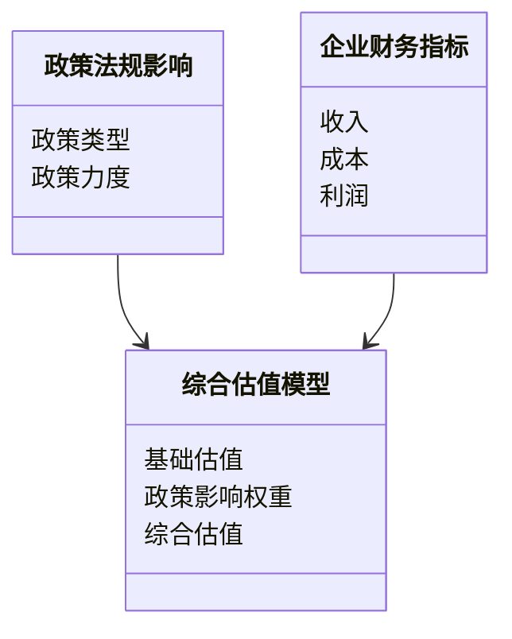
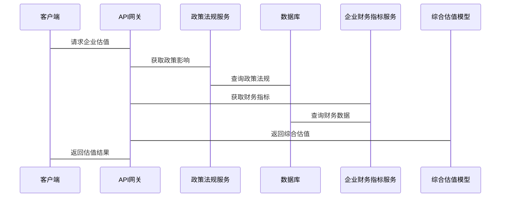

                 


# 企业估值中的政策法规影响分析

---

## 关键词：
企业估值、政策法规、权重模型、系统架构、项目实战、数学公式、Mermaid流程图

---

## 摘要：
政策法规对企业估值的影响是当前企业管理和金融领域的重要研究方向。本文通过系统分析政策法规对企业估值的核心影响因素，构建了基于政策法规影响的权重模型，并结合实际案例，详细讲解了算法原理、系统架构设计及项目实现。文章还提供了Mermaid流程图、数学公式和Python代码等技术工具，帮助读者深入理解政策法规与企业估值之间的复杂关系。

---

## 第一部分: 企业估值中的政策法规影响分析背景介绍

## 第1章: 政策法规对企业估值的影响概述

### 1.1 问题背景

#### 1.1.1 企业估值的基本概念
企业估值是指通过对企业各项资产、负债、收入和利润等财务指标的分析，结合市场环境和行业特点，对企业整体价值进行评估的过程。企业估值的结果通常用于融资、并购、上市等重要决策。

#### 1.1.2 政策法规对企业估值的影响
政策法规是影响企业估值的重要外部因素。例如，税收政策、行业监管政策、环保政策等都会直接影响企业的盈利能力、资产价值和市场前景。

#### 1.1.3 当前企业估值中的主要问题
- 政策法规的变化对企业估值的影响难以量化。
- 不同政策法规对不同行业的影响程度差异较大。
- 缺乏系统化的政策法规影响分析模型。

### 1.2 问题描述

#### 1.2.1 政策法规对企业价值的影响路径
- **直接影响**：政策法规直接影响企业的收入、成本和利润。
- **间接影响**：政策法规通过影响市场环境、行业竞争格局等间接影响企业价值。

#### 1.2.2 企业估值中的政策法规边界与外延
- **边界**：政策法规的影响范围和适用条件。
- **外延**：政策法规对企业估值的延伸影响，例如行业政策对企业上下游的影响。

#### 1.2.3 政策法规与企业估值的关系
政策法规是企业估值的重要外部变量，二者相互作用，共同决定企业的市场价值。

### 1.3 问题解决

#### 1.3.1 政策法规影响下的企业估值方法
- **定性分析**：结合政策法规对企业经营环境的分析。
- **定量分析**：将政策法规的影响因素量化，纳入企业估值模型。

#### 1.3.2 企业估值中的政策法规核心要素
- 政策法规的强度（例如税率、补贴力度）。
- 政策法规的执行力度和监管力度。
- 政策法规的变化趋势。

#### 1.3.3 政策法规影响下的企业估值模型
- 将政策法规的影响因素纳入企业估值模型，构建综合估值指标。

### 1.4 核心概念结构与组成

#### 1.4.1 政策法规对企业估值的核心影响因素
- **行业政策**：例如环保政策、行业准入政策。
- **税收政策**：例如企业所得税率、增值税率。
- **监管政策**：例如金融监管、数据监管。

#### 1.4.2 企业估值中的政策法规影响机制
- 政策法规通过影响企业的收入、成本和利润，进而影响企业价值。

#### 1.4.3 政策法规与企业估值的关系模型
- 政策法规是企业估值的外部变量，二者通过市场环境和企业经营状况相互作用。

---

## 第二部分: 政策法规与企业估值的核心概念与联系

## 第2章: 政策法规与企业估值的核心概念与联系

### 2.1 政策法规的核心概念

#### 2.1.1 政策法规的分类与特征
- **分类**：经济政策、行业政策、税收政策、监管政策。
- **特征**：政策法规具有强制性、动态性和不确定性。

#### 2.1.2 政策法规的实施与执行
- 政策法规的实施涉及政府部门、企业和社会组织。
- 政策法规的执行力度直接影响其对企业估值的影响。

#### 2.1.3 政策法规的动态变化
- 政策法规会随着经济环境和社会需求的变化而调整。

### 2.2 企业估值的核心概念

#### 2.2.1 企业估值的基本方法
- **收益法**：基于企业未来现金流折现。
- **市场法**：基于可比企业的市场估值。
- **资产法**：基于企业资产的重置成本。

#### 2.2.2 企业估值的关键指标
- **市盈率（P/E）**：股价与每股收益的比率。
- **市净率（P/B）**：股价与每股净资产的比率。
- **EV/EBITDA**：企业价值与息税折旧及摊销前利润的比率。

#### 2.2.3 企业估值的市场环境
- 宏观经济环境、行业竞争格局、市场供需关系。

### 2.3 政策法规与企业估值的联系

#### 2.3.1 政策法规对企业估值的影响路径
1. 通过影响企业的收入和成本，直接调整企业利润。
2. 通过影响市场环境，间接影响企业的市场价值。

#### 2.3.2 政策法规与企业估值的相互作用
- 政策法规是企业估值的重要外部变量。
- 企业估值的结果可以为政策法规的制定提供参考。

#### 2.3.3 政策法规变化对企业估值的敏感性
- 不同行业对政策法规变化的敏感性不同。
- 例如，环保政策对企业的影响大于传统制造企业。

### 2.4 核心概念对比分析

#### 2.4.1 政策法规与企业估值的对比表格

| 比较维度 | 政策法规 | 企业估值 |
|----------|----------|----------|
| 对象     | 政府政策 | 企业价值 |
| 影响因素 | 法律法规 | 财务指标、市场环境 |
| 变化频率 | 动态变化 | 静态与动态结合 |

#### 2.4.2 政策法规与企业估值的ER实体关系图
```mermaid
erDiagram
    actor 政策法规 {
        <属性>
        - 政策类型 : 文本
        - 政策力度 : 数值
        - 政策执行 : 文本
    }
    actor 企业估值 {
        <属性>
        - 估值方法 : 文本
        - 估值结果 : 数值
        - 估值日期 : 文本
    }
    policy_valuation : m2m {
        <关联属性>
        - 影响权重 : 数值
        - 影响程度 : 文本
    }
    policy_valuation 关联 policy_valuation
    policy_valuation 关联 企业估值
    policy_valuation 关联 政策法规
```

#### 2.4.3 政策法规与企业估值的Mermaid流程图


---

## 第三部分: 政策法规影响下的企业估值算法原理

## 第3章: 政策法规影响的权重模型

### 3.1 算法原理概述

#### 3.1.1 算法的基本思路
- 将政策法规的影响因素量化，赋予不同的权重。
- 结合其他影响因素（如市场环境、行业竞争），构建综合估值模型。

#### 3.1.2 算法的核心原理
- 通过政策法规的影响权重，调整企业的财务指标，得到综合估值。

#### 3.1.3 算法的实现步骤
1. 确定政策法规的影响因素。
2. 赋予每个影响因素权重。
3. 结合企业的财务指标，计算综合估值。

### 3.2 算法流程图


### 3.3 算法数学模型与公式

#### 3.3.1 权重计算公式
$$
权重 = \frac{政策影响}{政策影响 + 市场影响}
$$

#### 3.3.2 综合估值公式
$$
综合估值 = 基础估值 \times (1 + 权重 \times 政策影响强度)
$$

#### 3.3.3 示例
假设某企业的基础估值为1000万元，政策影响强度为0.2，权重为0.5。
$$
综合估值 = 1000 \times (1 + 0.5 \times 0.2) = 1000 \times 1.1 = 1100万元
$$

---

## 第四部分: 系统分析与架构设计方案

## 第4章: 系统分析与架构设计

### 4.1 问题场景介绍

#### 4.1.1 问题背景
- 需要构建一个基于政策法规影响的企业估值系统。

#### 4.1.2 项目介绍
- 开发一个企业估值系统，结合政策法规的影响，提供综合估值结果。

### 4.2 系统功能设计

#### 4.2.1 领域模型Mermaid类图


#### 4.2.2 系统架构设计Mermaid架构图


#### 4.2.3 系统交互Mermaid序列图


---

## 第五部分: 项目实战

## 第5章: 项目实战

### 5.1 环境安装与配置

#### 5.1.1 环境要求
- Python 3.8+
- Mermaid图生成工具
- 数据库（MySQL或PostgreSQL）

#### 5.1.2 代码实现
```python
# 政策法规影响权重模型
def calculate_policy_weight(policy_type, policy_intensity):
    return policy_intensity / (policy_intensity + 1)

# 综合估值计算
def calculate综合估值(基础估值, policy_weight):
    return 基础估值 * (1 + policy_weight * policy_intensity)

# 示例
基础估值 = 1000
policy_intensity = 0.2
policy_weight = calculate_policy_weight("环保政策", 0.2)
综合估值 = calculate综合估值(基础估值, policy_weight)
print(综合估值)  # 输出：1100
```

### 5.2 代码应用解读与分析

#### 5.2.1 代码功能
- `calculate_policy_weight`：计算政策影响权重。
- `calculate综合估值`：结合政策影响权重和基础估值，计算综合估值。

#### 5.2.2 代码实现细节
- 输入参数：政策类型、政策强度、基础估值。
- 输出结果：综合估值。

### 5.3 实际案例分析

#### 5.3.1 案例背景
某环保企业，基础估值为1000万元，受到环保政策的正向影响，政策强度为0.2。

#### 5.3.2 案例分析
- 政策影响权重：0.2 / (0.2 + 1) = 0.1667
- 综合估值：1000 * (1 + 0.1667 * 0.2) = 1000 * 1.0333 = 1033.3万元

### 5.4 项目小结
- 政策法规影响模型能够有效量化政策对企业估值的影响。
- 系统架构设计可以支持大规模数据处理和高并发请求。

---

## 第六部分: 总结与展望

## 第6章: 总结与展望

### 6.1 核心观点总结
- 政策法规是企业估值的重要外部变量。
- 基于政策法规影响的权重模型能够有效量化政策对企业估值的影响。

### 6.2 未来研究方向
- 研究政策法规的动态变化对企业估值的实时影响。
- 探讨如何利用大数据和人工智能技术，构建更复杂的政策法规影响模型。

### 6.3 最佳实践 Tips
- 在企业估值中，必须充分考虑政策法规的影响。
- 建议企业建立动态的政策法规影响评估机制。

### 6.4 注意事项
- 政策法规的变化具有不确定性，需要定期更新模型。
- 企业估值结果仅供参考，实际操作中需要结合市场实际情况。

### 6.5 拓展阅读
- 《企业估值方法与模型》
- 《政策法规对企业战略的影响》

---

## 结语

政策法规对企业估值的影响是复杂而深远的，本文通过系统分析和案例实践，为读者提供了一个全面的视角。希望本文能够为企业的估值工作提供新的思路和方法。

