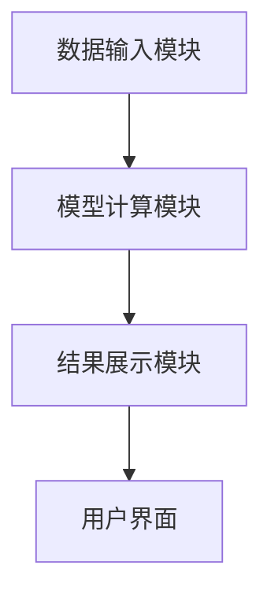
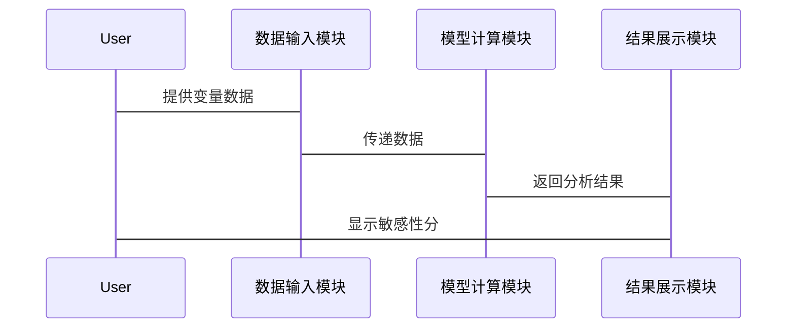

                 


# 《企业估值中的敏感性分析技巧》

---

## 关键词：
- 企业估值
- 敏感性分析
- 数学模型
- 系统架构
- 项目实战

---

## 摘要：
本文详细探讨了敏感性分析在企业估值中的应用技巧，从基本概念到数学模型，再到系统架构和项目实战，系统性地介绍了如何通过敏感性分析优化企业估值过程。通过本文，读者将能够掌握敏感性分析的核心原理、实际应用场景以及系统实现方法。

---

## 第一部分: 企业估值与敏感性分析基础

### 第1章: 敏感性分析的基本概念与背景

#### 1.1 什么是敏感性分析
敏感性分析（Sensitivity Analysis）是一种评估模型输入变量对输出结果影响程度的方法。在企业估值中，它用于分析关键变量（如收入、成本、增长率等）的变化对企业整体价值的影响。通过敏感性分析，可以识别出对估值影响最大的变量，从而指导决策者更有效地管理风险。

#### 1.2 企业估值中的关键变量
在企业估值过程中，以下变量通常具有较高的敏感性：
- 收入增长率
- 毛利率
- 投资支出
- 税率
- 加权平均资本成本（WACC）

#### 1.3 敏感性分析的背景与应用领域
敏感性分析并非新概念，但随着企业估值需求的增加，其应用领域不断扩大。特别是在金融、投资和风险管理领域，敏感性分析已成为评估模型稳健性的重要工具。通过敏感性分析，企业可以更好地理解不同变量对企业价值的影响，从而制定更有效的战略。

---

## 第二部分: 敏感性分析的核心原理与方法

### 第2章: 敏感性分析的数学模型与方法

#### 2.1 敏感性分析的数学模型
敏感性分析的基本公式如下：
$$ V = f(x_1, x_2, ..., x_n) $$
其中，\( V \) 是企业价值，\( x_i \) 是输入变量。

通过敏感性分析，我们可以计算每个变量的变化对价值的影响：
$$ \Delta V = \sum_{i=1}^n \frac{\partial V}{\partial x_i} \Delta x_i $$

#### 2.2 方差分解与敏感性指标
方差分解是一种将输出变量的方差分解为输入变量贡献的方法。其公式为：
$$ \sigma_V^2 = \sum_{i=1}^n \sigma_i^2 + 2\sum_{i < j} \text{Cov}(x_i, x_j) $$

敏感性指标 \( S_i \) 定义为：
$$ S_i = \frac{\sigma_i^2}{\sigma_V^2} $$

#### 2.3 蒙特卡洛模拟在敏感性分析中的应用
蒙特卡洛模拟是一种通过随机采样来估计模型输出分布的方法。其步骤如下：
1. 为每个输入变量设定概率分布。
2. 生成随机样本。
3. 计算模型输出。
4. 统计输出结果，分析变量敏感性。

---

## 第三部分: 企业估值中的敏感性分析实践

### 第3章: 企业估值中的关键变量与敏感性分析框架

#### 3.1 企业估值的关键变量分析
以某科技公司为例，其关键变量包括：
- 收入增长率（\( g \)）
- 毛利率（\( \text{Margin} \)）
- 投资支出（\( I \)）
- 税率（\( t \)）
- 加权平均资本成本（\( r \)）

#### 3.2 敏感性分析框架的设计
敏感性分析框架包括以下步骤：
1. **变量选择**：确定关键变量。
2. **变量变化范围**：设定变量的变化区间。
3. **模型计算**：计算不同变量变化对企业价值的影响。
4. **结果分析**：识别敏感变量并排序。

---

## 第四部分: 敏感性分析的系统架构与实现

### 第4章: 敏感性分析的系统架构设计

#### 4.1 敏感性分析系统的功能模块
- **数据输入模块**：接收变量数据。
- **模型计算模块**：执行敏感性分析。
- **结果展示模块**：输出分析结果。

#### 4.2 系统架构的Mermaid图


#### 4.3 系统接口设计
- 数据接口：输入变量数据。
- 计算接口：返回敏感性指标。
- 展示接口：显示分析结果。

#### 4.4 系统交互的Mermaid图


---

## 项目实战

### 4.5 项目实战：科技公司估值分析

#### 4.5.1 环境安装
安装Python和相关库（如numpy、pandas、matplotlib）。

#### 4.5.2 核心实现代码
```python
import numpy as np
import matplotlib.pyplot as plt

def calculate_value(g, margin, I, t, r):
    # 计算企业价值
    value = (g * margin * (1 - t) - I * (1 - t)) / (r - g * (1 - t))
    return value

# 定义变量范围
g_values = np.linspace(0.1, 0.2, 100)
margin_values = np.linspace(0.2, 0.4, 100)
I_values = np.linspace(0.1, 0.2, 100)
t_values = np.linspace(0.1, 0.3, 100)
r_values = np.linspace(0.05, 0.1, 100)

# 计算所有组合
sensitivity = []
for g in g_values:
    for margin in margin_values:
        value = calculate_value(g, margin, 0.1, 0.2, 0.075)
        sensitivity.append({'g': g, 'margin': margin, 'value': value})

# 绘制图表
sensitivity_df = pd.DataFrame(sensitivity)
plt.scatter(sensitivity_df['g'], sensitivity_df['margin'], c=sensitivity_df['value'])
plt.colorbar()
plt.xlabel('增长率(g)')
plt.ylabel('毛利率(margin)')
plt.show()
```

#### 4.5.3 结果解读
从图表中可以看出，收入增长率和毛利率是影响企业价值的主要变量。通过调整这些变量，可以更好地理解其对估值的影响。

---

## 总结

### 4.6 总结与最佳实践
- **总结**：敏感性分析是优化企业估值的重要工具。
- **最佳实践**：
  - 确定关键变量。
  - 选择合适的分析方法。
  - 使用系统工具提高效率。

---

通过本文的详细讲解，读者可以全面了解敏感性分析在企业估值中的应用，并能够实际操作相关分析。

