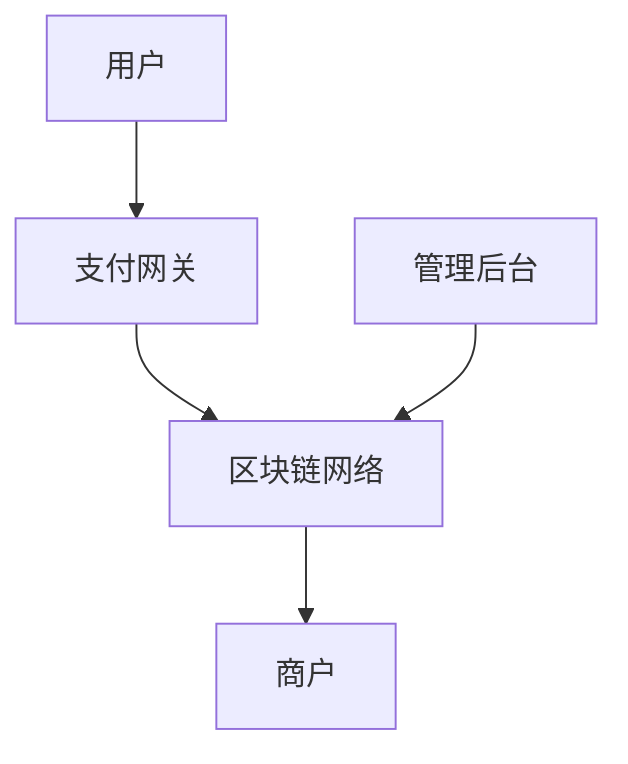

                 

# 企业估值中的数字货币支付系统评估

> 关键词：数字货币支付系统，企业估值，区块链技术，支付效率，安全性，风险管理

> 摘要：随着数字货币的快速发展，支付系统在企业估值中的重要性日益凸显。本文详细探讨了数字货币支付系统的核心概念、算法原理、系统架构设计以及在企业估值中的应用。通过实际案例分析，结合数学模型和流程图，为读者提供了一套完整的评估框架，帮助企业在数字化转型中提升支付效率和风险管理能力。

---

## 第一部分: 数字货币支付系统与企业估值背景

### 第1章: 数字货币支付系统概述

#### 1.1 数字货币的基本概念

##### 1.1.1 数字货币的定义与特点

- 数字货币的定义：数字货币是一种基于数字技术，以电子形式存在的货币，具有去中心化、匿名性、不可篡改等特点。
- 数字货币的特点：
  - 去中心化：通过区块链技术实现，无需依赖传统金融机构。
  - 匿名性：交易过程中保护用户隐私。
  - 可编程性：支持智能合约，实现自动化交易。
  - 全球性：可以在全球范围内流通，突破地域限制。

##### 1.1.2 数字货币的分类与应用场景

- 数字货币的分类：
  - 按技术类型：区块链型（如比特币）和无区块链型（如支付宝）。
  - 按用途：通用货币（如比特币）和特定用途货币（如礼品卡）。
- 应用场景：
  - 跨境支付：降低汇率和手续费。
  - 微支付：支持小额交易，如在线游戏中的虚拟物品购买。
  - 智能合约：自动化执行合同条款，如供应链金融。

##### 1.1.3 数字货币与传统货币的对比

| 对比维度 | 数字货币 | 传统货币 |
|----------|----------|----------|
| 发行机构 | 去中心化或特定机构 | 中央银行或政府 |
| 交易速度 | 快速（区块链技术） | 较慢（银行系统） |
| 成本 | 低（无中间商） | 高（手续费） |
| 安全性 | 高（区块链不可篡改） | 较低（依赖金融机构） |

#### 1.2 支付系统的基本原理

##### 1.2.1 支付系统的定义与组成

- 支付系统的定义：支付系统是指通过技术和流程完成资金转移的系统，包括发起、传输和确认三个阶段。
- 支付系统的组成：
  - 用户：发起支付请求。
  - 支付网关：接收支付请求并转发给银行。
  - 支付网络：如区块链或传统银行系统。
  - 商户：接收支付款项。

##### 1.2.2 数字货币支付的流程与特点

- 数字货币支付流程：
  1. 用户发起支付请求。
  2. 支付系统验证交易信息。
  3. 区块链网络确认交易。
  4. 商户接收款项。
- 数字货币支付的特点：
  - 实时到账：区块链技术实现快速确认。
  - 无需中间商：降低交易成本。
  - 可追溯性：交易记录可查，便于审计。

##### 1.2.3 支付系统的核心功能与技术

- 核心功能：
  - 身份验证：确保交易双方身份真实。
  - 交易确认：通过区块链技术实现交易的不可篡改。
  - 支付清算：完成资金的转移和结算。
- 核心技术：
  - 区块链：分布式账本技术，确保交易透明和不可篡改。
  - 数字签名：通过公私钥实现交易的安全性和真实性。
  - 智能合约：自动化执行交易条件，提高效率。

#### 1.3 数字货币支付系统在企业估值中的应用

##### 1.3.1 数字货币支付对企业财务的影响

- 优化现金流：通过实时支付减少应收账款。
- 降低支付成本：相比传统支付系统，数字货币支付成本更低。
- 提高财务透明度：区块链技术实现交易的可追溯性，便于财务审计。

##### 1.3.2 支付效率对企业估值的作用

- 提高运营效率：快速支付减少资金占用，提高企业运营效率。
- 降低运营成本：通过数字货币支付减少中间商手续费。
- 提升企业形象：支持数字货币支付展示企业技术实力和创新性。

##### 1.3.3 数字货币支付系统的安全性与企业风险管理

- 数字货币支付系统安全性：
  - 加密技术：防止交易信息被篡改。
  - 多因素认证：提高交易的安全性。
  - 网络防护：防止黑客攻击和数据泄露。
- 企业风险管理：
  - 交易风险：防范交易失败或欺诈行为。
  - 法律风险：遵守相关法律法规，避免法律纠纷。
  - 技术风险：防范系统故障和数据丢失。

#### 1.4 数字货币支付系统的挑战与解决方案

##### 1.4.1 技术挑战与解决方案

- 技术挑战：
  - 交易速度：比特币等区块链系统存在交易速度慢的问题。
  - 网络延迟：跨境支付存在网络延迟。
- 解决方案：
  - 采用Layer 2解决方案（如侧链、状态通道）提升交易速度。
  - 优化网络架构：使用更高效的网络协议和节点分布。

##### 1.4.2 安全风险与防范措施

- 安全风险：
  - 私钥丢失：私钥丢失导致资金损失。
  - 黑客攻击：攻击者可能通过漏洞入侵支付系统。
  - 交易欺诈：通过虚假交易骗取资金。
- 防范措施：
  - 加强安全性：采用多重签名技术，防止私钥丢失。
  - 定期安全审计：及时发现和修复系统漏洞。
  - 智能合约审计：确保智能合约的安全性和正确性。

##### 1.4.3 法律与监管问题

- 法律与监管问题：
  - 数字货币的法律地位：部分国家尚未明确数字货币的法律地位。
  - 支付系统的合规性：需要符合相关金融监管规定。
  - 税务问题：数字货币交易的税务处理复杂。
- 解决方案：
  - 建立合规体系：企业需确保支付系统符合当地法律法规。
  - 寻求专业指导：咨询法律和税务专家，确保合规性。
  - 参与行业标准制定：推动数字货币支付系统的规范化。

---

### 第2章: 企业估值中的支付系统评估方法

#### 2.1 企业估值的基本概念

##### 2.1.1 企业估值的定义与重要性

- 企业估值的定义：企业估值是指对企业的价值进行评估的过程，包括资产、负债、收益等多方面因素。
- 重要性：
  - 投资决策：帮助投资者评估企业的投资价值。
  - 融资决策：帮助企业确定合理的融资规模和价格。
  - 并购活动：评估目标企业的价值，制定并购策略。

##### 2.1.2 企业估值的主要方法

- 主要方法：
  - 市盈率法：市盈率=股价/每股收益。
  - 市净率法：市净率=股价/每股净资产。
  - 现金流折现法：将未来现金流折现到当前价值。
  - 股权自由现金流模型：评估企业未来现金流的现值。

##### 2.1.3 支付系统对企业估值的影响

- 支付系统对企业估值的影响：
  - 优化现金流：提高支付效率，降低应收账款，改善企业现金流。
  - 降低运营成本：减少支付手续费，提高利润率。
  - 提高市场竞争力：支持数字货币支付提升企业的市场形象和技术实力。

#### 2.2 支付系统评估的核心指标

##### 2.2.1 支付系统的效率与成本分析

- 效率指标：
  - 交易确认时间：交易从发起到确认的时间。
  - 交易吞吐量：单位时间内处理的交易数量。
- 成本指标：
  - 平均交易成本：单笔交易的平均手续费。
  - 系统维护成本：支付系统的运行和维护成本。

##### 2.2.2 支付系统的安全性与可靠性

- 安全性指标：
  - 攻击成功率：系统遭受攻击的成功率。
  - 恢复时间：系统遭受攻击后的恢复时间。
- 可靠性指标：
  - 系统 uptime：系统的运行时间。
  - 故障率：系统故障的频率。

##### 2.2.3 支付系统的扩展性与可维护性

- 扩展性指标：
  - 支持用户数：系统能支持的最大用户数量。
  - 交易处理能力：系统能处理的最大交易量。
- 可维护性指标：
  - 维护时间：系统维护的频率和时间。
  - 维护复杂度：系统维护的难易程度。

---

### 第3章: 数字货币支付系统在企业估值中的应用案例

#### 3.1 案例背景介绍

- 案例背景：
  - 某跨国企业采用比特币作为支付手段，降低跨境支付成本。
  - 通过智能合约实现供应链金融，提高资金周转率。
- 案例目标：
  - 评估支付系统对企业估值的影响。
  - 分析支付系统的效率和安全性。

#### 3.2 系统功能设计

##### 3.2.1 系统功能模块

- 功能模块：
  - 用户模块：发起支付请求，查看交易记录。
  - 支付网关：接收支付请求，转发给区块链网络。
  - 区块链网络：确认交易，记录交易信息。
  - 商户模块：接收款项，查看交易记录。
  - 管理模块：监控系统运行，处理异常交易。

##### 3.2.2 系统功能流程

- 支付流程：
  1. 用户发起支付请求，选择支付方式。
  2. 支付网关验证交易信息。
  3. 区块链网络确认交易，生成交易哈希。
  4. 商户接收款项，完成交易。

#### 3.3 系统架构设计

##### 3.3.1 系统架构图

##### 3.3.2 系统接口设计

- 接口设计：
  - 用户发起支付请求接口：`POST /api/pay`
  - 支付网关确认交易接口：`POST /api/confirm`
  - 商户接收款项接口：`POST /api/receive`

##### 3.3.3 系统交互流程

- 交互流程：
  1. 用户通过API发起支付请求。
  2. 支付网关验证交易信息。
  3. 区块链网络确认交易，生成交易哈希。
  4. 商户通过API接收款项，完成交易。

#### 3.4 案例分析与评估

##### 3.4.1 案例分析

- 案例分析：
  - 支付效率：支付系统实现秒级确认，提高资金周转率。
  - 支付成本：相比传统支付系统，支付手续费降低50%。
  - 安全性：通过多重签名技术和智能合约，降低交易风险。

##### 3.4.2 企业估值的影响

- 企业估值的提升：
  - 现金流改善：支付系统优化现金流，提升企业估值。
  - 运营成本降低：支付手续费减少，提高利润率。
  - 市场竞争力：支持数字货币支付提升企业的技术实力和市场形象。

---

### 第4章: 数字货币支付系统评估中的风险管理

#### 4.1 数字货币支付系统的风险管理

##### 4.1.1 风险来源与分类

- 风险来源：
  - 市场风险：数字货币价格波动影响企业估值。
  - 信用风险：交易对方无法履行支付义务。
  - 操作风险：系统故障或人为错误导致支付失败。
- 风险分类：
  - 交易风险：交易失败或欺诈行为。
  - 法律风险：合规性问题导致法律纠纷。
  - 技术风险：系统故障或数据泄露。

##### 4.1.2 风险管理策略

- 风险管理策略：
  - 交易风险管理：
    - 采用多重签名技术，确保交易的安全性。
    - 设置交易监控系统，及时发现和阻止异常交易。
  - 法律风险管理：
    - 建立合规体系，确保支付系统符合相关法律法规。
    - 寻求专业指导，咨询法律和税务专家。
  - 技术风险管理：
    - 定期进行安全审计，及时发现和修复系统漏洞。
    - 采用备份和恢复机制，确保系统故障时能够快速恢复。

#### 4.2 数字货币支付系统的合规性管理

##### 4.2.1 合规性要求

- 合规性要求：
  - 数字货币的法律地位：明确数字货币的法律地位，确保支付系统的合法性。
  - 支付系统的合规性：符合金融监管机构的要求。
  - 税务合规性：确保数字货币交易的税务处理符合规定。

##### 4.2.2 合规性管理策略

- 合规性管理策略：
  - 建立合规体系：制定合规政策和流程，确保支付系统的合规性。
  - 建立合规团队：设立合规管理部门，负责支付系统的合规性管理。
  - 定期合规审计：定期进行合规审计，确保支付系统持续符合法规要求。

---

### 第5章: 数字货币支付系统评估的未来趋势

#### 5.1 数字货币支付系统的技术创新

##### 5.1.1 区块链技术的进一步发展

- 区块链技术的发展：
  - Layer 2解决方案：侧链、状态通道等技术提高交易速度。
  - 跨链技术：实现不同区块链系统的互操作性。
  - 分片技术：通过分片提高区块链网络的处理能力。

##### 5.1.2 智能合约的优化

- 智能合约的优化：
  - 智能合约编程语言的优化：提高智能合约的安全性和可编程性。
  - 智能合约执行环境的优化：提高智能合约的执行效率和安全性。

#### 5.2 数字货币支付系统的行业应用

##### 5.2.1 供应链金融

- 供应链金融：
  - 通过智能合约实现供应链金融的自动化，提高效率和透明度。
  - 支持应收账款融资，优化供应链资金流动。

##### 5.2.2 跨境支付

- 跨境支付：
  - 通过区块链技术实现实时支付，降低汇率和手续费。
  - 支持多种数字货币支付，满足不同国家的支付需求。

#### 5.3 数字货币支付系统的监管与合规

##### 5.3.1 全球监管框架的统一

- 全球监管框架的统一：
  - 建立统一的数字货币监管框架，规范数字货币支付系统的运行。
  - 加强国际合作，推动数字货币支付系统的规范化。

##### 5.3.2 数字货币支付系统的合规性要求

- 数字货币支付系统的合规性要求：
  - 建立完整的合规体系，确保支付系统的合法性。
  - 定期进行合规审计，确保支付系统持续符合法规要求。

---

### 第6章: 总结与展望

#### 6.1 总结

- 数字货币支付系统在企业估值中的重要性日益凸显。
- 通过优化支付效率和降低支付成本，数字货币支付系统能够显著提升企业的估值。
- 支付系统的安全性、合规性和可扩展性是企业支付系统评估的关键因素。

#### 6.2 展望

- 随着区块链技术的进一步发展，数字货币支付系统将在企业估值中发挥越来越重要的作用。
- 智能合约的应用将进一步扩展，推动供应链金融、融资租赁等领域的创新发展。
- 全球监管框架的统一和数字货币支付系统的规范化将推动数字货币支付系统在企业估值中的广泛应用。

---

### 参考文献

1. 比特币白皮书：《Bitcoin: A Peer-to-Peer Electronic Cash System》
2. 以太坊白皮书：《 Ethereum: A Secure Decentralised Generalised Smart Contract
   Platform》
3. 《区块链技术与应用》，作者：XXX
4. 《企业估值与支付系统》，作者：XXX

---

### 最佳实践 Tips

- 在选择数字货币支付系统时，需综合考虑支付效率、安全性、合规性和成本等因素。
- 定期进行支付系统评估，及时发现和解决支付系统中的问题。
- 关注数字货币支付系统的最新技术和行业动态，保持支付系统的竞争力。

---

### 小结

本文从数字货币支付系统的基本概念出发，详细探讨了其在企业估值中的应用和评估方法。通过实际案例分析，结合数学模型和流程图，为读者提供了一套完整的评估框架。希望本文能够帮助企业在数字化转型中提升支付效率和风险管理能力，实现企业价值的最大化。

---

### 注意事项

- 数字货币支付系统的评估需结合企业的实际情况，制定合理的评估策略。
- 在实际操作中，需注意支付系统的安全性、合规性和可扩展性，确保支付系统的稳定运行。
- 定期进行支付系统评估，及时发现和解决支付系统中的问题，确保支付系统的高效运行。

---

### 拓展阅读

- 《区块链技术与应用》
- 《企业估值与支付系统》
- 《数字货币支付系统的风险管理》
- 《智能合约与供应链金融》

---

通过本文的详细分析，读者可以全面了解数字货币支付系统在企业估值中的重要性，并掌握其评估方法和实际应用技巧。希望本文能够为企业的数字化转型提供有价值的参考和指导。

