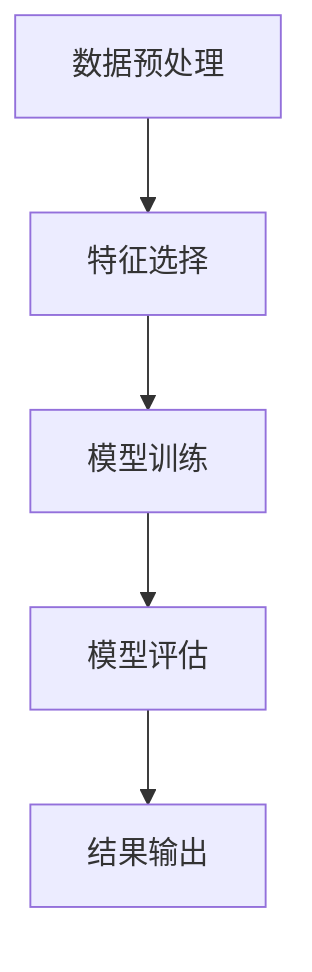
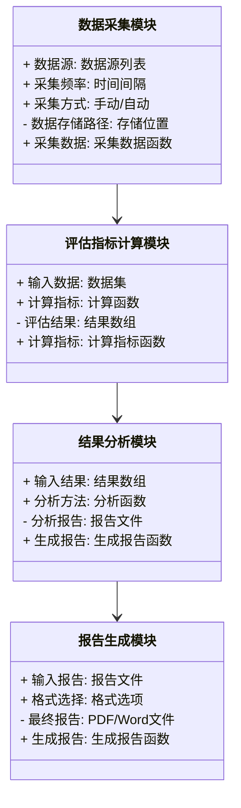
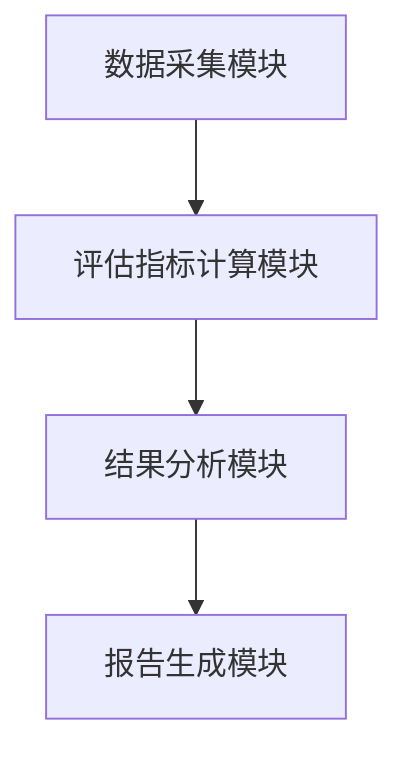
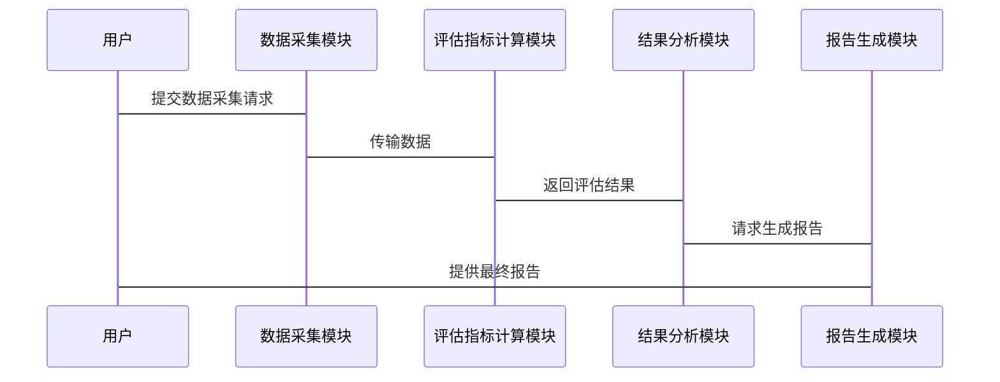

                 


# 企业估值中的数据安全能力评估

> **关键词**：企业估值，数据安全，能力评估，数据安全能力，企业价值

> **摘要**：随着数字化转型的深入，数据安全已成为影响企业价值的重要因素。本文从数据安全能力评估的核心概念出发，系统地分析了其算法原理、系统架构，并通过实战案例展示了其在企业估值中的应用。同时，本文还提出了数据安全能力评估的最佳实践，为企业提供可操作的指导。

---

## 第1章: 数据安全能力评估的背景与重要性

### 1.1 数据安全的重要性与现状

#### 1.1.1 数据在企业价值中的核心地位
数据已成为企业的核心资产，贯穿企业运营的方方面面。企业通过数据驱动决策、优化流程、提升客户体验，从而创造价值。数据的安全性直接影响企业的声誉、财务状况和市场竞争力。

#### 1.1.2 数据安全问题的现状与挑战
随着企业数字化转型的推进，数据泄露、网络攻击等问题频发。据统计，2022年全球因数据泄露造成的损失超过1万亿美元。数据安全问题不仅威胁企业的财务健康，还可能导致客户信任的丧失。

#### 1.1.3 数据安全能力对企业估值的影响
数据安全能力是企业估值的重要考量因素。具备较强数据安全能力的企业，能够更好地保护数据资产，降低法律风险，从而提升市场估值。

### 1.2 企业估值的基本概念与方法

#### 1.2.1 企业估值的定义与核心要素
企业估值是对企业整体价值的评估，通常包括资产价值、盈利能力、市场地位等要素。数据安全能力作为影响企业长期发展的关键因素，正在成为估值的重要组成部分。

#### 1.2.2 传统企业估值方法的局限性
传统估值方法如DCF模型、市盈率法等，往往忽视了数据安全对企业价值的影响。在数字化时代，数据安全能力已成为企业竞争力的重要组成部分，传统方法的局限性日益显现。

#### 1.2.3 数据安全能力在现代企业估值中的作用
数据安全能力通过降低风险、提升资产保护能力，直接影响企业的运营成本和市场地位。具备较强数据安全能力的企业，通常能获得更高的估值溢价。

### 1.3 数据安全能力评估的核心问题

#### 1.3.1 数据安全能力的定义与范围
数据安全能力是指企业保护数据资产、防止数据泄露、确保数据完整性和机密性的能力。它包括技术能力、管理能力和团队能力等多个方面。

#### 1.3.2 数据安全能力评估的必要性与目标
评估数据安全能力的目的是为了发现企业数据管理中的薄弱环节，优化安全策略，降低数据风险。通过评估，企业可以制定更有效的数据安全战略，提升整体估值。

#### 1.3.3 数据安全能力评估的边界与外延
数据安全能力评估的边界包括企业的数据资产、技术基础设施和安全政策。其外延则涉及企业内部管理、合作伙伴关系以及外部法规要求。

---

## 第2章: 数据安全能力评估的核心概念与联系

### 2.1 数据安全能力评估的核心要素

#### 2.1.1 数据完整性
数据完整性指数据在存储和传输过程中未被篡改的特性。它是数据安全的基础，确保数据的真实性和可靠性。

#### 2.1.2 数据机密性
数据机密性指数据仅限于授权人员访问的特性。保护数据机密性是防止数据泄露的核心措施。

#### 2.1.3 数据可用性
数据可用性指数据在需要时可被访问和使用的特性。确保数据可用性是企业正常运营的前提。

#### 2.1.4 数据安全性保障措施
数据安全性保障措施包括技术措施（如加密、访问控制）和管理措施（如安全策略、培训）。

### 2.2 数据安全能力评估的核心概念对比

#### 2.2.1 数据安全能力与数据管理能力的对比
数据安全能力侧重于保护数据，而数据管理能力侧重于数据的存储、处理和应用。两者相辅相成，共同保障数据的价值。

#### 2.2.2 数据安全能力与数据隐私保护的对比
数据安全能力更关注数据的保护，而数据隐私保护更关注个人隐私的保护。两者在目标上有重叠，但侧重点不同。

#### 2.2.3 数据安全能力与数据治理能力的对比
数据治理能力包括数据的分类、授权和监控，而数据安全能力更关注数据的保护和合规性。两者共同保障数据的合规性和安全性。

### 2.3 数据安全能力评估的概念模型

#### 2.3.1 数据安全能力评估的概念模型
数据安全能力评估的概念模型包括数据资产、安全措施、安全目标和评估指标四个核心要素。模型通过这些要素的相互作用，全面评估企业的数据安全能力。

#### 2.3.2 数据安全能力评估的概念模型ER图
以下是数据安全能力评估的概念模型ER图：

```mermaid
er
    title 数据安全能力评估的概念模型ER图
    DataAsset [属性：资产ID, 资产名称, 资产类型] 
    SafetyMeasure [属性：措施ID, 措施名称, 措施类型]
    SecurityObjective [属性：目标ID, 目标名称, 目标描述]
    link-从 DataAsset 到 SafetyMeasure：关联关系
    link-从 DataAsset 到 SecurityObjective：关联关系
    link-从 SafetyMeasure 到 SecurityObjective：关联关系
```

---

## 第3章: 数据安全能力评估的算法原理

### 3.1 数据安全能力评估的数学模型

#### 3.1.1 数据安全能力评估的线性回归模型
数据安全能力评估可以采用线性回归模型，将企业的数据安全能力作为因变量，企业的技术投入、管理能力等作为自变量。

数学公式如下：
$$
Y = \beta_0 + \beta_1X_1 + \beta_2X_2 + \dots + \beta_nX_n + \epsilon
$$
其中，$Y$是数据安全能力评估结果，$X_i$是各评估指标，$\beta_i$是回归系数，$\epsilon$是误差项。

#### 3.1.2 数据安全能力评估的机器学习模型
机器学习模型（如随机森林、支持向量机）可以用于数据安全能力评估。以下是机器学习模型的算法流程：



以下是Python代码实现：

```python
# 数据预处理
from sklearn.preprocessing import StandardScaler
scaler = StandardScaler()
X_scaled = scaler.fit_transform(X)

# 特征选择
from sklearn.feature_selection import SelectKBest, chi2
selector = SelectKBest(chi2, k=5)
X_selected = selector.fit_transform(X_scaled, y)

# 模型训练
from sklearn.ensemble import RandomForestRegressor
model = RandomForestRegressor(n_estimators=100, random_state=42)
model.fit(X_selected, y)

# 模型评估
from sklearn.metrics import mean_squared_error
y_pred = model.predict(X_selected)
print("均方误差:", mean_squared_error(y, y_pred))
```

---

## 第4章: 数据安全能力评估的系统架构设计方案

### 4.1 系统功能设计

#### 4.1.1 系统功能模块
数据安全能力评估系统包括数据采集模块、评估指标计算模块、结果分析模块和报告生成模块。

#### 4.1.2 系统功能模块的类图
以下是系统功能模块的类图：



### 4.2 系统架构设计

#### 4.2.1 系统架构图
以下是系统架构图：



#### 4.2.2 系统交互流程图
以下是系统交互流程图：



---

## 第5章: 数据安全能力评估的项目实战

### 5.1 环境安装

#### 5.1.1 系统环境要求
- 操作系统：Windows 10/11 或 Linux
- Python版本：3.6+

#### 5.1.2 依赖库安装
```bash
pip install numpy pandas scikit-learn mermaid4jupyter jupyter
```

### 5.2 核心代码实现

#### 5.2.1 数据采集模块实现
```python
import pandas as pd

def collect_data(source, frequency):
    # 从数据源采集数据
    data = pd.read_csv(source, header=0, index_col=0)
    # 按照采集频率筛选数据
    data = data.iloc[::frequency]
    return data
```

#### 5.2.2 评估指标计算模块实现
```python
from sklearn.metrics import mean_squared_error

def calculate_metrics(y_true, y_pred):
    # 计算均方误差
    mse = mean_squared_error(y_true, y_pred)
    return mse
```

#### 5.2.3 结果分析模块实现
```python
import matplotlib.pyplot as plt

def analyze_results(results):
    # 绘制结果图表
    plt.figure(figsize=(10, 6))
    plt.plot(results, label='评估结果')
    plt.xlabel('时间')
    plt.ylabel('评估值')
    plt.legend()
    plt.show()
```

### 5.3 案例分析

#### 5.3.1 实际案例分析
以某互联网企业为例，假设该企业需要评估其数据安全能力。首先，我们从该企业的日志数据中采集相关的安全事件数据，然后使用随机森林模型进行评估，最后生成评估报告。

#### 5.3.2 案例分析与解读
通过分析模型输出的结果，我们可以发现该企业在数据完整性方面的安全能力较为薄弱，需要进一步加强数据备份和恢复措施。

---

## 第6章: 数据安全能力评估的最佳实践

### 6.1 小结

- 数据安全能力评估是企业估值的重要组成部分。
- 通过评估数据安全能力，企业可以发现潜在风险，优化安全策略，提升整体估值。

### 6.2 注意事项

- 数据安全能力评估需要结合企业的实际情况，制定个性化的评估方案。
- 在实施过程中，应注重数据的实时性和动态性，及时调整评估策略。

### 6.3 拓展阅读

- 建议深入学习《数据安全治理》和《企业风险管理》的相关内容，以更好地理解数据安全能力评估的实践应用。

---

## 总结

企业估值中的数据安全能力评估是一项复杂而重要的任务。通过系统地分析数据安全能力的核心概念、算法原理和系统架构，并结合实际案例进行实战分析，我们可以更好地理解其在企业估值中的应用。同时，通过最佳实践的总结，企业可以更有效地提升数据安全能力，从而在数字化转型中获得更大的竞争优势。

