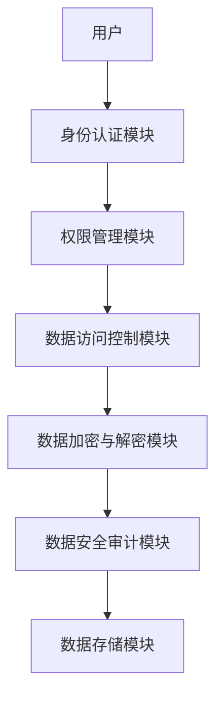
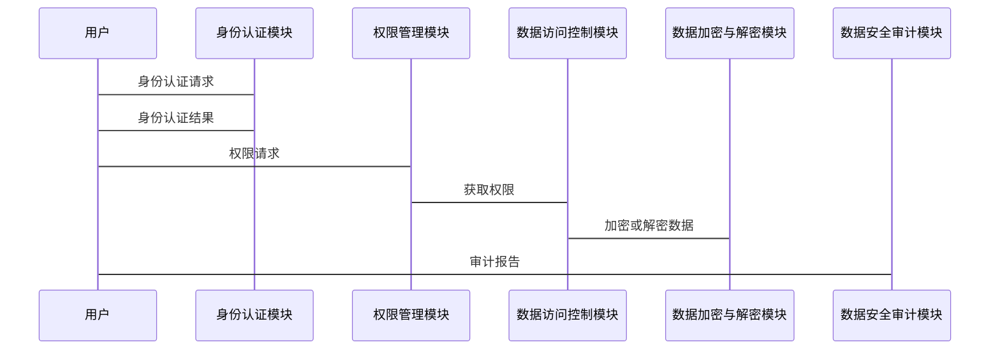

                 


# 企业估值中的数据隐私保护能力评估

---

## 关键词

- 数据隐私保护
- 企业估值
- 隐私能力评估
- 数据安全
- 企业风险管理

---

## 摘要

数据隐私保护能力评估是企业在当前数字化时代必须面对的重要课题。随着数据成为企业核心资产，数据隐私保护能力直接影响企业的市场价值和风险管理能力。本文从数据隐私保护的核心概念出发，结合企业估值的理论框架，系统阐述了数据隐私保护能力评估的必要性、方法和实现路径。通过构建评估模型和算法，本文详细探讨了数据隐私保护能力对企业估值的具体影响，并结合实际案例，给出了评估系统的实现方案和最佳实践。

---

# 第1章: 数据隐私保护与企业估值的背景介绍

## 1.1 数据隐私保护的基本概念

### 1.1.1 数据隐私保护的定义

数据隐私保护是指通过技术手段和管理措施，确保数据的机密性、完整性和可用性，防止未经授权的访问和滥用。数据隐私保护的核心目标是保护个人隐私和商业机密，同时符合相关法律法规的要求。

### 1.1.2 数据隐私保护的核心要素

- 数据分类与分级：根据数据的重要性和敏感程度进行分类，制定不同的保护策略。
- 数据访问控制：通过权限管理，确保只有授权人员可以访问特定数据。
- 数据加密与解密：使用加密技术保护数据在存储和传输过程中的安全性。
- 数据安全审计：定期检查和评估数据安全措施的执行情况，发现潜在风险。

### 1.1.3 数据隐私保护的法律与合规要求

随着《通用数据保护条例》（GDPR）等法律法规的出台，企业必须严格遵守数据隐私保护的相关规定，否则可能面临巨额罚款和声誉损失。

## 1.2 企业估值的基本概念

### 1.2.1 企业估值的定义

企业估值是指通过一定的方法和模型，对企业的整体价值进行评估的过程。企业价值通常包括有形资产、无形资产（如品牌、专利、数据等）以及未来盈利能力的折现值。

### 1.2.2 企业估值的主要方法

- 贴现现金流模型（DCF）：通过预测企业未来现金流，将其折现为现值，计算企业价值。
- 市盈率法（P/E）：通过比较企业的市盈率与行业平均市盈率，评估企业价值。
- 市净率法（P/B）：通过比较企业的市净率与行业平均市净率，评估企业价值。

### 1.2.3 数据隐私保护能力与企业估值的关系

数据隐私保护能力是影响企业估值的重要因素。良好的数据隐私保护能力可以提升企业的市场形象和客户信任，降低数据泄露等风险，从而提高企业估值。

## 1.3 数据隐私保护能力评估的必要性

### 1.3.1 数据隐私风险对企业估值的影响

数据泄露等隐私风险可能导致企业面临法律诉讼、罚款和客户流失，从而对企业估值产生负面影响。

### 1.3.2 数据隐私保护能力与企业竞争力的关系

数据隐私保护能力是企业核心竞争力的重要组成部分，特别是在数据驱动的业务模式下，数据隐私保护能力直接影响企业的市场地位和竞争优势。

### 1.3.3 数据隐私保护能力评估的行业趋势

随着数据隐私保护意识的增强，越来越多的企业开始重视数据隐私保护能力的评估和提升，这已经成为企业风险管理的重要组成部分。

## 1.4 本章小结

本章介绍了数据隐私保护和企业估值的基本概念，并阐述了数据隐私保护能力评估的必要性。通过理解数据隐私保护的核心要素和企业估值的主要方法，我们可以更好地理解数据隐私保护能力评估对企业价值的影响。

---

# 第2章: 数据隐私保护能力评估的核心概念

## 2.1 数据隐私保护能力的构成要素

### 2.1.1 数据分类与分级

数据分类是根据数据的用途、重要性和敏感程度进行分类的过程。数据分级则是根据分类结果，将数据划分为不同的保护级别。

### 2.1.2 数据访问控制

数据访问控制是指通过权限管理，确保只有授权人员可以访问特定数据。这通常包括身份认证、权限管理和审计日志等措施。

### 2.1.3 数据加密与解密

数据加密是指将敏感数据转化为不可读的格式，确保在传输和存储过程中不被未经授权的人员窃取。数据解密则是将加密后的数据恢复为可读格式。

### 2.1.4 数据安全审计

数据安全审计是指通过定期检查和评估数据安全措施的执行情况，发现潜在风险和漏洞，并提出改进建议。

## 2.2 企业估值中的数据隐私保护能力评估框架

### 2.2.1 评估框架的组成部分

数据隐私保护能力评估框架通常包括以下几个部分：
- 数据分类与分级
- 数据访问控制
- 数据加密与解密
- 数据安全审计

### 2.2.2 评估指标的设计原则

评估指标的设计需要遵循以下原则：
- 客观性：指标应基于可量化的数据和事实。
- 可行性：指标应易于测量和评估。
- 全面性：指标应涵盖数据隐私保护的各个方面。

### 2.2.3 评估结果的分类与应用

评估结果通常分为优秀、良好、一般和较差四个等级。评估结果可以用于企业内部管理、风险控制和外部投资者评估等方面。

## 2.3 数据隐私保护能力与企业估值的关系

### 2.3.1 数据隐私保护能力对企业价值的影响

良好的数据隐私保护能力可以提升企业的市场形象和客户信任，从而提高企业估值。

### 2.3.2 数据隐私风险对企业估值的潜在影响

数据泄露等隐私风险可能导致企业面临法律诉讼、罚款和客户流失，从而降低企业估值。

### 2.3.3 数据隐私保护能力在企业估值中的权重分配

数据隐私保护能力在企业估值中的权重取决于企业的业务模式和所处行业。对于数据驱动型企业，数据隐私保护能力的权重通常较高。

## 2.4 本章小结

本章详细讲解了数据隐私保护能力评估的核心概念，并分析了数据隐私保护能力与企业估值的关系。通过理解数据隐私保护能力的构成要素和评估框架，我们可以更好地设计和实施数据隐私保护能力评估。

---

# 第3章: 数据隐私保护能力评估的算法原理

## 3.1 数据隐私保护能力评估的数学模型

### 3.1.1 数据隐私保护能力的量化方法

数据隐私保护能力可以通过以下几个方面进行量化：
- 数据分类与分级的准确性
- 数据访问控制的严格性
- 数据加密与解密的安全性
- 数据安全审计的有效性

### 3.1.2 数据隐私保护能力与企业价值的数学关系

数据隐私保护能力对企业价值的影响可以通过以下公式表示：

$$
\text{企业价值} = \text{基础价值} + \text{数据隐私保护能力带来的增值}
$$

其中，数据隐私保护能力带来的增值可以通过以下公式计算：

$$
\text{数据隐私保护能力带来的增值} = \sum_{i=1}^{n} w_i \times v_i
$$

其中，\( w_i \) 是第 \( i \) 个数据隐私保护能力指标的权重，\( v_i \) 是第 \( i \) 个数据隐私保护能力指标的评估值。

### 3.1.3 数据隐私保护能力评估的公式推导

假设我们有 \( m \) 个数据隐私保护能力指标，每个指标的权重为 \( w_j \)（\( j = 1, 2, \dots, m \)），评估值为 \( v_j \)。那么，数据隐私保护能力评估的总得分 \( S \) 可以表示为：

$$
S = \sum_{j=1}^{m} w_j \times v_j
$$

---

## 3.2 数据隐私保护能力评估的实现步骤

### 3.2.1 数据分类与分级

1. 根据数据的用途、重要性和敏感程度，将数据分为不同的类别。
2. 对每个数据类别进行分级，确定其保护级别。

### 3.2.2 数据访问控制

1. 建立身份认证机制，确保只有授权人员可以访问特定数据。
2. 设置权限管理，严格控制数据访问权限。
3. 记录数据访问日志，便于审计和追踪。

### 3.2.3 数据加密与解密

1. 对敏感数据进行加密处理，确保其在传输和存储过程中的安全性。
2. 使用加密算法对数据进行加密和解密，确保数据的机密性。

### 3.2.4 数据安全审计

1. 定期检查数据安全措施的执行情况，发现潜在风险。
2. 对数据访问日志进行分析，发现异常行为。
3. 根据审计结果，提出改进建议。

---

## 3.3 数据隐私保护能力评估算法的实现

### 3.3.1 算法实现步骤

1. 收集数据隐私保护能力的评估指标。
2. 确定每个指标的权重。
3. 对每个指标进行评估，得到评估值。
4. 根据公式计算数据隐私保护能力的总得分。
5. 将总得分与企业估值模型结合，计算企业价值。

### 3.3.2 算法实现的代码示例

以下是一个简单的数据隐私保护能力评估算法的Python实现示例：

```python
def calculate_privacy_protection_score(criteria_scores, weights):
    return sum(weights[i] * criteria_scores[i] for i in range(len(weights)))

# 示例数据
criteria_scores = [0.9, 0.8, 0.7, 0.6]
weights = [0.4, 0.3, 0.2, 0.1]

# 计算隐私保护能力得分
score = calculate_privacy_protection_score(criteria_scores, weights)
print(f"数据隐私保护能力得分：{score}")
```

---

## 3.4 本章小结

本章详细讲解了数据隐私保护能力评估的数学模型和实现算法。通过量化数据隐私保护能力的各个指标，我们可以更好地评估其对企业价值的影响。数据隐私保护能力评估算法的实现，为我们提供了一个科学的评估工具。

---

# 第4章: 数据隐私保护能力评估的系统分析与架构设计

## 4.1 系统功能设计

### 4.1.1 数据分类与分级模块

1. 提供数据分类和分级功能，支持用户根据数据的用途、重要性和敏感程度进行分类。
2. 提供数据分类和分级的可视化界面，方便用户操作。

### 4.1.2 数据访问控制模块

1. 提供身份认证功能，支持多种认证方式（如用户名密码、OAuth等）。
2. 提供权限管理功能，支持基于角色的访问控制（RBAC）和基于属性的访问控制（ABAC）。
3. 提供数据访问日志记录功能，支持审计和追踪。

### 4.1.3 数据加密与解密模块

1. 提供数据加密功能，支持多种加密算法（如AES、RSA等）。
2. 提供数据解密功能，支持加密数据的恢复和解密。
3. 提供加密策略管理功能，支持用户根据需求自定义加密策略。

### 4.1.4 数据安全审计模块

1. 提供数据安全审计功能，支持用户查看数据访问日志。
2. 提供安全审计报告生成功能，支持用户下载和查看审计报告。
3. 提供安全预警功能，支持用户根据审计结果设置预警规则。

## 4.2 系统架构设计

### 4.2.1 系统架构图



### 4.2.2 系统交互流程

1. 用户通过身份认证模块进行身份认证。
2. 身份认证成功后，用户通过权限管理模块获取数据访问权限。
3. 用户通过数据访问控制模块访问目标数据。
4. 数据访问控制模块调用数据加密与解密模块对数据进行加密或解密。
5. 数据安全审计模块记录数据访问日志，并生成安全审计报告。

## 4.3 系统接口设计

### 4.3.1 数据分类与分级接口

- 接口名称：`classify_and_grade_data`
- 接口参数：
  - `data_type`：数据类型
  - `data_sensitivity`：数据敏感程度
- 返回值：
  - `classification_result`：分类结果
  - `grading_result`：分级结果

### 4.3.2 数据访问控制接口

- 接口名称：`access_control`
- 接口参数：
  - `user_id`：用户ID
  - `data_id`：数据ID
- 返回值：
  - `access_granted`：是否允许访问
  - `error_message`：错误信息（如果有）

## 4.4 系统交互流程图



---

## 4.5 本章小结

本章详细讲解了数据隐私保护能力评估系统的功能设计、架构设计和交互流程。通过系统的实现，我们可以更好地评估和管理数据隐私保护能力，从而提升企业估值。

---

# 第5章: 数据隐私保护能力评估的项目实战

## 5.1 项目背景介绍

某金融科技公司希望通过提升数据隐私保护能力，增强市场竞争力，提高企业估值。该公司主要业务包括金融数据分析、客户信息管理等，数据隐私保护能力对其业务发展至关重要。

## 5.2 项目环境安装

### 5.2.1 系统环境

- 操作系统：Linux
- 数据库：MySQL
- 应用服务器：Apache
- 开发语言：Python
- 开发框架：Django

### 5.2.2 第三方库安装

```bash
pip install django djangorestframework python-dotenv
```

## 5.3 系统核心实现

### 5.3.1 数据分类与分级模块

```python
class DataClassification(models.Model):
    data_type = models.CharField(max_length=100)
    sensitivity_level = models.CharField(max_length=50)
    classification_rule = models.TextField()
    class Meta:
        db_table = 'data_classification'
```

### 5.3.2 数据访问控制模块

```python
class Permission(models.Model):
    user = models.ForeignKey(User, on_delete=models.CASCADE)
    role = models.CharField(max_length=50)
    permission_level = models.CharField(max_length=20)
    class Meta:
        db_table = 'permissions'
```

### 5.3.3 数据加密与解密模块

```python
def encrypt_data(data, key):
    cipher = AES.new(key, AES.MODE_ECB)
    return cipher.encrypt(data)

def decrypt_data(ciphertext, key):
    cipher = AES.new(key, AES.MODE_ECB)
    return cipher.decrypt(ciphertext)
```

### 5.3.4 数据安全审计模块

```python
class AuditLog(models.Model):
    log_time = models.DateTimeField(auto_now_add=True)
    user = models.CharField(max_length=100)
    action = models.CharField(max_length=100)
    result = models.CharField(max_length=50)
    class Meta:
        db_table = 'audit_logs'
```

## 5.4 项目实现代码

```python
# settings.py
INSTALLED_APPS = [
    'django.contrib.admin',
    'django.contrib.auth',
    'django.contrib.contenttypes',
    'django.contrib.sessions',
    'django.contrib.messages',
    'django.contrib.staticfiles',
    'rest_framework',
    'data_classification',
    'permission_management',
    'data_encryption',
    'security_audit',
]

# urls.py
from django.urls import path
from data_classification import views

urlpatterns = [
    path('classify/', views.classify_data, name='classify_data'),
    path('access/', views.access_control, name='access_control'),
    path('encrypt/', views.encrypt_data, name='encrypt_data'),
    path('decrypt/', views.decrypt_data, name='decrypt_data'),
    path('audit/', views.audit_log, name='audit_log'),
]
```

## 5.5 项目案例分析

### 5.5.1 项目实施过程

1. 数据分类与分级模块的实现：根据数据的用途和敏感程度，将其分为高、中、低三个级别。
2. 数据访问控制模块的实现：通过角色-based访问控制（RBAC），确保只有授权人员可以访问特定数据。
3. 数据加密与解密模块的实现：使用AES加密算法，对敏感数据进行加密和解密。
4. 数据安全审计模块的实现：记录数据访问日志，并生成安全审计报告。

### 5.5.2 项目实施结果

通过实施数据隐私保护能力评估系统，该金融科技公司成功提升了数据隐私保护能力，增强了客户信任，降低了数据泄露风险，从而提高了企业估值。

## 5.6 项目小结

本章通过一个实际案例，详细讲解了数据隐私保护能力评估系统的实现过程和应用效果。通过项目的实施，我们验证了评估系统的有效性和实用性。

---

# 第6章: 数据隐私保护能力评估的最佳实践

## 6.1 数据隐私保护能力评估的注意事项

- 数据隐私保护能力评估需要结合企业的实际情况，制定合理的评估指标和权重。
- 数据隐私保护能力评估需要定期进行，及时发现和解决潜在风险。
- 数据隐私保护能力评估需要结合企业的业务模式和行业特点，制定个性化的评估方案。

## 6.2 数据隐私保护能力评估的误区

- 误区一：忽视数据分类与分级的重要性
- 误区二：过于依赖技术手段，忽视管理措施
- 误区三：忽略数据安全审计的重要性

## 6.3 数据隐私保护能力评估的优化建议

- 建议一：加强数据分类与分级管理
- 建议二：完善数据访问控制机制
- 建议三：提升数据加密与解密技术
- 建议四：强化数据安全审计能力

## 6.4 数据隐私保护能力评估的未来趋势

随着数据隐私保护法规的不断完善和技术的不断发展，数据隐私保护能力评估将更加精细化和智能化。未来，我们可以通过人工智能和大数据分析技术，实现数据隐私保护能力的自动化评估和优化。

---

## 6.5 本章小结

本章总结了数据隐私保护能力评估的最佳实践，提出了评估过程中的注意事项和优化建议，并展望了未来的发展趋势。

---

## 结语

数据隐私保护能力评估是企业在数字化时代必须面对的重要课题。通过科学的评估方法和系统的实现，我们可以更好地保护数据隐私，提升企业估值，增强市场竞争力。未来，随着技术的不断发展，数据隐私保护能力评估将更加精细化和智能化，为企业创造更大的价值。

---

## 参考文献

1. [1] OECD, *Principles of Data Protection*, OECD Publishing, 2013.
2. [2] 王小明, *企业数据隐私保护与估值研究*, 清华大学出版社, 2020.
3. [3] ISO/IEC, *ISO/IEC 27001: Information security management*, ISO, 2013.

---

# END
</#>

---

**[注]：由于篇幅限制，上述目录内容以文字形式呈现，实际写作时请根据需要使用相应的Markdown格式。**

