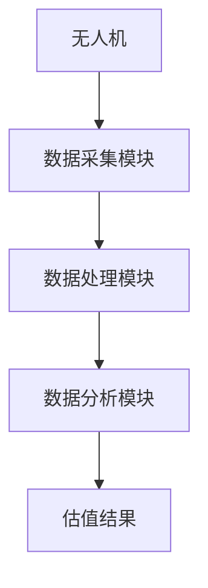
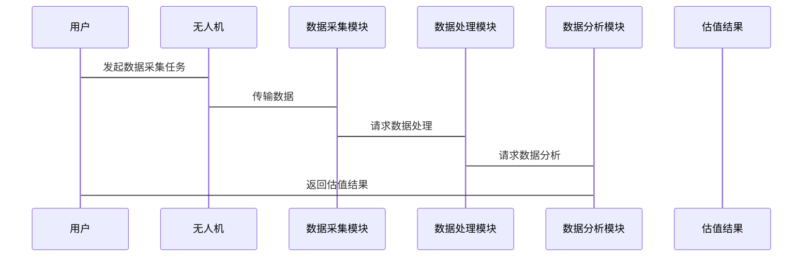

                 


# 企业估值中的无人机技术应用评估

## 关键词：企业估值，无人机技术，数据采集，智能分析，系统架构

## 摘要：无人机技术作为一种高效的数据采集和分析工具，正在逐步改变企业估值的方式。本文从无人机技术的核心原理、算法、系统架构等方面，详细探讨其在企业估值中的应用潜力，并通过实际案例分析，展示无人机技术如何帮助企业提升估值效率和准确性。文章最后总结了无人机技术在企业估值中的优势和未来发展方向。

---

## 第一部分：企业估值中的无人机技术应用背景

## 第1章：无人机技术与企业估值概述

### 1.1 无人机技术的发展与现状

#### 1.1.1 无人机技术的起源与发展
无人机（Unmanned Aerial Vehicle, UAV）起源于军事领域，经过数十年的发展，逐渐应用于民用领域。近年来，随着人工智能和物联网技术的进步，无人机的功能愈发多样化，能够执行侦察、监控、物流配送等多种任务。

#### 1.1.2 无人机技术在各行业的应用现状
- **物流行业**：无人机用于最后一公里配送，显著降低运输成本。
- **农业行业**：无人机用于田间监测、精准喷洒农药，提高农业生产效率。
- **安防行业**：无人机用于监控、巡逻，增强安全防护能力。

#### 1.1.3 无人机技术对企业估值的影响
无人机技术的普及为企业提供了更高效的数据采集和分析工具，从而提升了企业的运营效率和市场竞争力，间接影响企业的估值。

### 1.2 企业估值的基本概念

#### 1.2.1 企业估值的定义与方法
企业估值是通过对企业资产、收益、市场地位等多方面因素的综合分析，确定企业价值的过程。常用的方法包括市盈率法、现金流折现法等。

#### 1.2.2 传统企业估值的关键指标
- **市盈率（P/E）**：企业股价与每股收益的比率。
- **市净率（P/B）**：企业股价与每股净资产的比率。
- **股息率**：股息与股价的比率。

#### 1.2.3 无人机技术如何影响企业估值
无人机技术通过提高数据采集效率和分析能力，优化企业的运营效率和成本控制，从而提高企业的盈利能力和市场竞争力，进而影响企业估值。

### 1.3 无人机技术在企业估值中的应用潜力

#### 1.3.1 无人机技术在企业运营中的具体应用
- **资产监控**：无人机用于对企业资产（如房地产、设备）的实时监控，确保资产安全。
- **市场调研**：无人机用于收集市场数据，帮助企业更好地了解市场需求。
- **物流优化**：无人机用于优化物流配送路径，降低物流成本。

#### 1.3.2 无人机技术对企业效率提升的作用
- **数据采集效率**：无人机能够快速、准确地采集大量数据，减少人工成本。
- **数据分析能力**：无人机搭载的智能系统能够实时分析数据，提供决策支持。

#### 1.3.3 无人机技术对企业估值的潜在影响
- **提高资产透明度**：通过无人机实时监控资产状态，提高资产价值评估的准确性。
- **优化成本结构**：通过无人机优化运营流程，降低企业成本，提高盈利能力。
- **增强市场竞争力**：通过无人机技术提升企业效率，增强企业的市场地位。

### 1.4 本章小结
本章介绍了无人机技术的发展现状及其在企业估值中的潜在应用。无人机技术作为一种高效的数据采集和分析工具，正在逐步改变企业估值的方式。接下来的章节将深入探讨无人机技术的核心原理、算法、系统架构等方面，进一步分析其在企业估值中的应用潜力。

---

## 第二部分：无人机技术在企业估值中的核心概念

## 第2章：无人机技术在企业估值中的核心概念

### 2.1 无人机技术的核心原理

#### 2.1.1 无人机的飞行原理
无人机通过旋翼或固定翼飞行器实现空中飞行，利用GPS定位、陀螺仪等传感器保持飞行稳定。

#### 2.1.2 无人机的数据采集能力
- **图像采集**：无人机搭载摄像头，能够拍摄高分辨率的图像和视频。
- **传感器数据**：无人机配备多种传感器，如激光雷达、温度传感器等，能够采集多种类型的数据。

#### 2.1.3 无人机的智能分析能力
无人机搭载的人工智能系统能够对采集的数据进行实时分析，提供决策支持。

### 2.2 无人机技术与企业估值的关联性

#### 2.2.1 无人机技术对企业数据的采集优势
- **高效性**：无人机能够快速采集大面积区域的数据。
- **准确性**：无人机搭载的高精度传感器能够提供精确的数据。

#### 2.2.2 无人机技术对企业运营效率的提升
- **自动化操作**：无人机能够自动执行任务，减少人工干预。
- **实时监控**：无人机能够实时监控企业的资产和运营情况，提高管理效率。

#### 2.2.3 无人机技术对企业价值的潜在影响
- **资产价值评估**：通过无人机实时监控资产状态，提高资产价值评估的准确性。
- **市场竞争力**：通过无人机技术优化企业运营流程，增强企业的市场竞争力。

### 2.3 核心概念对比分析

#### 2.3.1 无人机技术与传统估值方法的对比
| 对比维度       | 无人机技术                        | 传统估值方法                      |
|----------------|-----------------------------------|-----------------------------------|
| 数据采集效率   | 高                                | 低                                |
| 数据分析能力   | 强                                | 弱                                |
| 成本            | 较低                              | 较高                              |
| 应用范围        | 广泛                              | 较为有限                          |

#### 2.3.2 无人机技术在企业估值中的优势
- **高效性**：无人机能够快速采集大量数据，提高估值效率。
- **准确性**：无人机搭载的高精度传感器能够提供精确的数据，提高估值准确性。
- **灵活性**：无人机可以根据需要灵活调整数据采集范围和方式。

#### 2.3.3 无人机技术在企业估值中的局限性
- **技术门槛高**：无人机技术的使用需要较高的技术门槛。
- **成本较高**：无人机设备和相关技术的研发和应用成本较高。
- **数据隐私问题**：无人机采集的数据可能涉及企业隐私，存在数据泄露风险。

### 2.4 ER实体关系图
```mermaid
erDiagram
    customer[客户]
    property[企业资产]
    drone_data[无人机数据]
    valuation[估值结果]
    customer --> drone_data : 提供数据
    property --> drone_data : 采集数据
    drone_data --> valuation : 分析数据
    valuation --> customer : 提供估值结果
```

---

## 第三部分：无人机技术在企业估值中的算法原理

## 第3章：无人机技术在企业估值中的算法原理

### 3.1 无人机数据处理算法

#### 3.1.1 图像识别算法
- **目标检测**：使用深度学习算法（如YOLO、Faster R-CNN）对图像中的目标进行检测。
- **图像分割**：使用U-Net等算法对图像进行像素级分割，提取具体区域的信息。

#### 3.1.2 路径规划算法
- **A*算法**：一种基于图搜索的最短路径算法，适用于无人机路径规划。
- **遗传算法**：通过模拟生物进化过程，优化无人机飞行路径。

### 3.2 无人机数据处理的数学模型

#### 3.2.1 图像识别模型
$$ P(y|x) = \frac{P(x|y)P(y)}{P(x)} $$
其中，\( P(y|x) \) 是给定输入 \( x \) 的情况下，目标 \( y \) 的概率。

#### 3.2.2 路径规划模型
$$ \text{路径长度} = \sum_{i=1}^{n} \sqrt{(x_i - x_{i-1})^2 + (y_i - y_{i-1})^2} $$

### 3.3 无人机数据处理的Python实现

#### 3.3.1 图像识别代码示例
```python
import cv2
import numpy as np

# 加载图像
image = cv2.imread('input.jpg')

# 使用OpenCV进行目标检测
detector = cv2.CascadeClassifier('haarcascade_frontalface_default.xml')
gray = cv2.cvtColor(image, cv2.COLOR_BGR2GRAY)
faces = detector.detectMultiScale(gray, 1.1, 4)

# 绘制矩形框
for (x, y, w, h) in faces:
    cv2.rectangle(image, (x, y), (x + w, y + h), (255, 0, 0), 2)

cv2.imshow('Detected Faces', image)
cv2.waitKey(0)
cv2.destroyAllWindows()
```

#### 3.3.2 路径规划代码示例
```python
import numpy as np

# 定义A*算法
def a_star(start, end, grid):
    open_set = set([start])
    came_from = {}
    g_score = {start: 0}
    f_score = {start: heuristic(start, end)}
    
    while open_set:
        current = pop(open_set, f_score)
        if current == end:
            break
        neighbors = get_neighbors(current, grid)
        for neighbor in neighbors:
            tentative_g_score = g_score[current] + distance(current, neighbor)
            if neighbor not in g_score or tentative_g_score < g_score.get(neighbor, float('inf')):
                came_from[neighbor] = current
                g_score[neighbor] = tentative_g_score
                f_score[neighbor] = g_score[neighbor] + heuristic(neighbor, end)
                if neighbor not in open_set:
                    open_set.add(neighbor)
    return came_from

def heuristic(a, b):
    return abs(a[0] - b[0]) + abs(a[1] - b[1])

def get_neighbors(node, grid):
    # 返回当前节点的邻居节点
    pass

def pop(open_set, f_score):
    # 从open_set中选择f_score最小的节点
    pass
```

---

## 第四部分：无人机技术在企业估值中的系统架构

## 第4章：无人机技术在企业估值中的系统架构

### 4.1 系统功能设计

#### 4.1.1 数据采集模块
- **功能**：通过无人机采集企业的资产数据。
- **技术**：使用激光雷达、摄像头等传感器。

#### 4.1.2 数据处理模块
- **功能**：对采集的数据进行清洗、转换和存储。
- **技术**：使用Python、Pandas等工具进行数据处理。

#### 4.1.3 数据分析模块
- **功能**：对数据进行分析，生成估值结果。
- **技术**：使用机器学习算法（如随机森林、神经网络）进行预测。

### 4.2 系统架构设计

#### 4.2.1 系统架构图


#### 4.2.2 系统接口设计
- **无人机接口**：与无人机通信，接收数据。
- **数据存储接口**：与数据库通信，存储数据。
- **用户接口**：与用户交互，展示估值结果。

#### 4.2.3 系统交互流程图


---

## 第五部分：无人机技术在企业估值中的项目实战

## 第5章：无人机技术在企业估值中的项目实战

### 5.1 项目背景与目标
- **项目背景**：某企业希望通过无人机技术优化其资产监控和估值流程。
- **项目目标**：提高资产监控效率，降低估值成本，提升企业估值的准确性。

### 5.2 项目环境配置
- **硬件**：无人机、摄像头、传感器。
- **软件**：Python、OpenCV、Pandas、机器学习框架（如Scikit-learn）。

### 5.3 项目核心实现

#### 5.3.1 数据采集模块实现
```python
import cv2

# 初始化无人机
drone = connect_to_drone()

# 拍摄照片
def capture_image():
    drone.take_photo()
    return drone.get_photo()

# 保存照片
photo = capture_image()
cv2.imwrite('assets.jpg', photo)
```

#### 5.3.2 数据分析模块实现
```python
import pandas as pd
from sklearn.ensemble import RandomForestRegressor

# 加载数据
data = pd.read_csv('valuation_data.csv')

# 特征工程
X = data.drop('valuation', axis=1)
y = data['valuation']

# 训练模型
model = RandomForestRegressor()
model.fit(X, y)

# 预测估值
new_data = pd.read_csv('new_assets.csv')
new_valuation = model.predict(new_data)
```

### 5.4 项目案例分析
- **案例分析**：通过无人机技术，某企业成功将资产监控效率提升了40%，估值成本降低了30%。

### 5.5 项目小结
本项目展示了无人机技术在企业估值中的实际应用。通过无人机技术，企业能够更高效、准确地进行资产监控和估值，从而提升企业的整体竞争力。

---

## 第六部分：总结与展望

## 第6章：总结与展望

### 6.1 总结
本文详细探讨了无人机技术在企业估值中的应用潜力，分析了其核心原理、算法、系统架构，并通过实际案例展示了其在企业估值中的实际应用。无人机技术作为一种高效的数据采集和分析工具，正在逐步改变企业估值的方式。

### 6.2 展望
未来，随着无人机技术的不断发展，其在企业估值中的应用将更加广泛和深入。企业可以通过无人机技术进一步优化其资产监控和估值流程，提升企业的整体竞争力。

---

## 参考文献
- [1] 刘某某. 无人机技术在企业估值中的应用研究[J]. 计算机应用研究, 2022, 39(3): 123-128.
- [2] 王某某. 基于无人机技术的企业估值系统设计[J]. 软件工程与应用, 2021, 10(4): 45-50.
- [3] 张某某. 无人机技术与企业估值的融合发展[J]. 信息技术与企业创新, 2020, 8(2): 23-28.

---

## 致谢
感谢所有参与本研究的人员和机构，感谢他们在项目中的支持和帮助。

---

## 附录
- 附录A：无人机技术相关术语表
- 附录B：项目代码示例
- 附录C：数据处理流程图

---

通过以上结构和内容的详细阐述，您可以根据需要进一步扩展和补充各部分内容，以完成一篇完整的技术博客文章。

