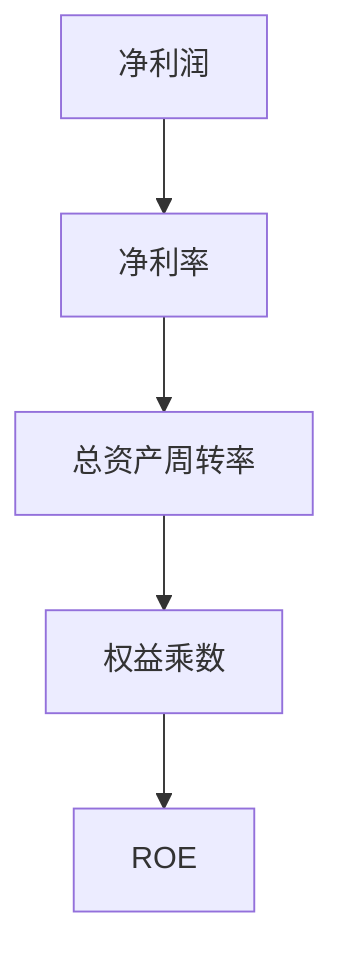
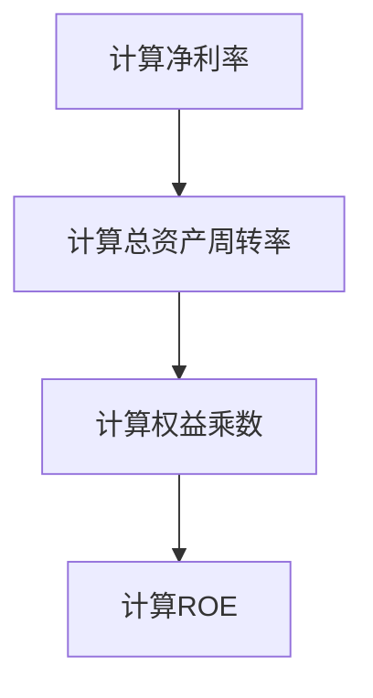
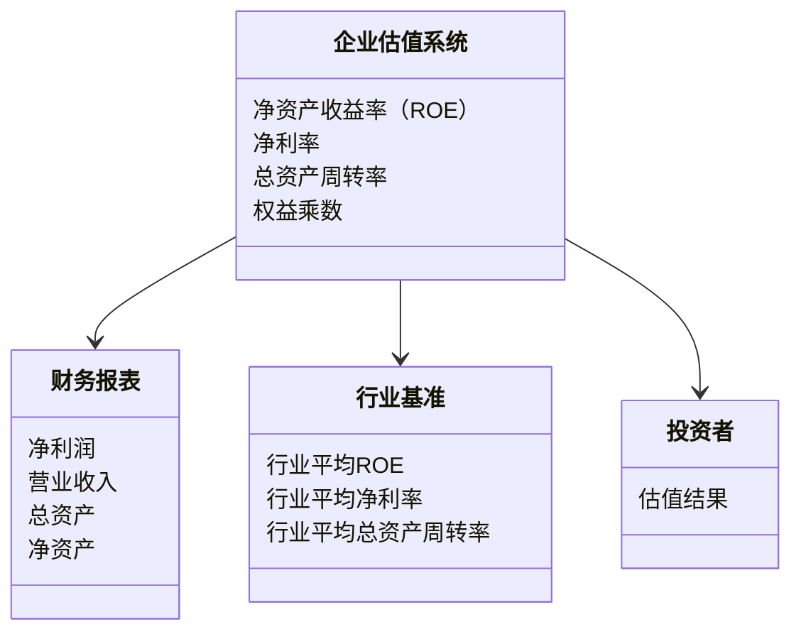
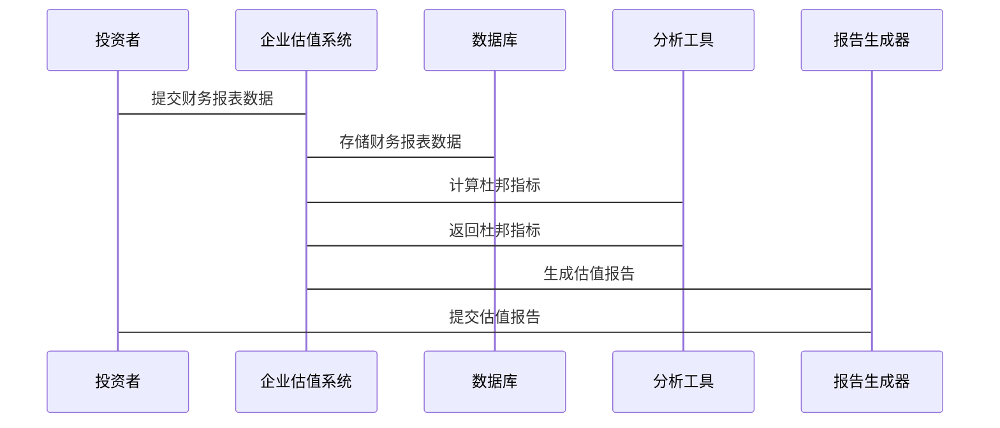

                 


# 《企业估值中的杜邦分析法》

---

## 关键词

- 企业估值
- 杜邦分析法
- 净资产收益率（ROE）
- 财务分析
- 投资决策

---

## 摘要

杜邦分析法是一种经典的财务分析工具，主要用于分解和评估企业的净资产收益率（ROE），从而帮助企业更好地理解其盈利能力和股东价值。本文将详细介绍杜邦分析法的理论基础、数学模型、实际应用以及系统架构设计，结合具体案例，帮助读者全面掌握如何在企业估值中运用杜邦分析法。

---

# 第1章: 杜邦分析法的概述

## 1.1 杜邦分析法的背景与意义

### 1.1.1 企业估值的核心问题

企业的估值是投资者和管理层关注的核心问题之一。准确的估值需要全面分析企业的财务状况、盈利能力、成长潜力和行业地位。杜邦分析法作为一种经典的财务分析工具，能够帮助我们深入分解企业的盈利能力，从而为估值提供重要的参考依据。

### 1.1.2 杜邦分析法的起源与发展

杜邦分析法由美国杜邦公司于1924年开发，最初用于分析和改善企业的财务状况。该方法通过将净资产收益率（ROE）分解为三个关键因素，帮助企业识别影响盈利能力的关键环节。

### 1.1.3 杜邦分析法与其它分析方法的区别

杜邦分析法与传统的财务分析方法相比，其独特之处在于它将ROE分解为净利率、总资产周转率和权益乘数三个指标，从而能够更细致地分析企业的盈利能力和风险管理能力。

---

## 1.2 杜邦分析法的定义与核心要素

### 1.2.1 杜邦分析法的定义

杜邦分析法是一种通过分解净资产收益率（ROE）来评估企业盈利能力的方法。它将ROE分解为净利率（Net Profit Margin）、总资产周转率（Asset Turnover）和权益乘数（Equity Multiplier）三个指标，从而帮助企业识别影响盈利能力的关键因素。

### 1.2.2 杜邦分析法的核心要素

杜邦分析法的核心公式为：

$$ROE = \text{净利率} \times \text{总资产周转率} \times \text{权益乘数}$$

其中：
- 净利率（Net Profit Margin）：净利润与营业收入的比率，反映企业的销售效率和成本控制能力。
- 总资产周转率（Asset Turnover）：营业收入与平均总资产的比率，反映企业的资产使用效率。
- 权益乘数（Equity Multiplier）：总资产与净资产的比率，反映企业的杠杆风险。

### 1.2.3 杜邦分析法与企业估值的关系

杜邦分析法通过分解ROE，帮助企业识别影响盈利能力的关键因素，从而为估值提供重要的参考依据。例如，如果企业的净利率较低，可能需要进一步分析其成本控制能力；如果总资产周转率较低，可能需要关注企业的资产管理效率。

---

## 1.3 杜邦分析法的重要性和局限性

### 1.3.1 杜邦分析法在企业估值中的重要性

杜邦分析法能够帮助投资者和管理层全面了解企业的盈利能力，识别影响ROE的关键因素，并制定相应的改进措施。

### 1.3.2 杜邦分析法的局限性

杜邦分析法的局限性在于它仅关注ROE，可能忽略企业的其他重要指标，如现金流和成长性。此外，杜邦分析法依赖于财务报表数据，可能存在数据误差或造假的风险。

### 1.3.3 杜邦分析法与其他分析方法的对比

杜邦分析法与其它分析方法（如波特五力分析、SWOT分析等）相比，更加注重财务指标的分解和定量分析，适用于企业内部管理和财务估值。

---

# 第2章: 杜邦分析法的核心公式与分解

## 2.1 杜邦分析法的数学模型

### 2.1.1 净资产收益率（ROE）的定义

净资产收益率（ROE）是衡量企业盈利能力的重要指标，定义为净利润与净资产的比率：

$$ROE = \frac{\text{净利润}}{\text{净资产}}$$

### 2.1.2 杜邦公式：ROE = 净利率 × 总资产周转率 × 权益乘数

杜邦分析法将ROE分解为三个指标：

$$ROE = \text{净利率} \times \text{总资产周转率} \times \text{权益乘数}$$

其中：
- 净利率：$$\text{净利率} = \frac{\text{净利润}}{\text{营业收入}}$$
- 总资产周转率：$$\text{总资产周转率} = \frac{\text{营业收入}}{\text{平均总资产}}$$
- 权益乘数：$$\text{权益乘数} = \frac{\text{总资产}}{\text{净资产}}$$

### 2.1.3 杜邦公式分解的数学推导

通过以下步骤，我们可以将ROE分解为杜邦公式：

$$ROE = \frac{\text{净利润}}{\text{净资产}} = \frac{\text{净利润}}{\text{营业收入}} \times \frac{\text{营业收入}}{\text{平均总资产}} \times \frac{\text{平均总资产}}{\text{净资产}}$$

即：

$$ROE = \text{净利率} \times \text{总资产周转率} \times \text{权益乘数}$$

---

## 2.2 杜邦分析法的分解步骤

### 2.2.1 净利率的计算与分析

净利率反映了企业的销售效率和成本控制能力。如果净利率较低，可能需要优化成本结构或提高销售价格。

### 2.2.2 总资产周转率的计算与分析

总资产周转率反映了企业的资产使用效率。如果总资产周转率较低，可能需要优化资产管理或增加销售。

### 2.2.3 权益乘数的计算与分析

权益乘数反映了企业的杠杆风险。如果权益乘数较高，可能需要降低杠杆比例或优化资本结构。

---

## 2.3 杜邦分析法的可视化表示

### 2.3.1 使用 Mermaid 绘制杜邦公式分解图



### 2.3.2 杜邦分析法的分解流程图



---

# 第3章: 杜邦分析法的扩展与应用

## 3.1 杜邦分析法的多维度扩展

### 3.1.1 资产回报率（ROA）的分析

资产回报率（ROA）是衡量企业资产使用效率的重要指标，定义为净利润与总资产的比率：

$$ROA = \frac{\text{净利润}}{\text{总资产}}$$

### 3.1.2 资本回报率（ROCE）的分析

资本回报率（ROCE）是衡量企业资本使用效率的重要指标，定义为息税前利润与总资本的比率：

$$ROCE = \frac{\text{息税前利润}}{\text{总资本}}$$

### 3.1.3 杜邦分析法与其他财务指标的关系

杜邦分析法通过分解ROE，可以与其他财务指标（如ROA和ROCE）相结合，形成更加全面的财务分析体系。

---

## 3.2 杜邦分析法在行业估值中的应用

### 3.2.1 行业基准的确定

杜邦分析法可以帮助确定行业基准，例如通过比较行业内企业的ROE、净利率和总资产周转率，找出行业平均水平。

### 3.2.2 行业趋势的分析

通过分析行业趋势，可以识别行业中的增长潜力和风险，从而为估值提供依据。

### 3.2.3 行业间杜邦分析法的应用差异

不同行业的企业在资产周转率和净利率上可能存在较大差异，因此在应用杜邦分析法时需要考虑行业特性。

---

## 3.3 杜邦分析法在企业战略中的应用

### 3.3.1 企业战略目标与杜邦分析法的关系

杜邦分析法可以帮助企业制定战略目标，例如通过提高净利率或优化资产周转率来提升ROE。

### 3.3.2 杜邦分析法在企业并购中的应用

杜邦分析法可以帮助企业在并购过程中评估目标企业的盈利能力，从而做出更明智的决策。

### 3.3.3 杜邦分析法在风险管理中的应用

杜邦分析法可以帮助企业在风险管理中识别杠杆风险，并制定相应的风险管理策略。

---

# 第4章: 杜邦分析法的系统分析与架构设计

## 4.1 系统分析框架

### 4.1.1 问题场景介绍

杜邦分析法的系统分析框架可以帮助企业构建全面的财务分析系统，从而支持企业的估值和决策。

### 4.1.2 项目介绍与目标

本项目的目标是通过杜邦分析法，构建一个全面的企业估值系统，帮助投资者和管理层做出更明智的决策。

### 4.1.3 系统功能设计（领域模型 Mermaid 类图）



---

## 4.2 系统架构设计

### 4.2.1 系统架构 Mermaid 架构图

```mermaid
client --> 企业估值系统
企业估值系统 --> 数据库
企业估值系统 --> 分析工具
分析工具 --> 报告生成器
报告生成器 --> 投资者
```

### 4.2.2 系统接口设计

系统接口包括：
- 数据输入接口：接收财务报表数据
- 数据处理接口：计算杜邦分析法的各项指标
- 报告生成接口：生成估值报告

### 4.2.3 系统交互 Mermaid 序列图



---

## 4.3 数据流与算法

### 4.3.1 数据流

1. 投资者提交财务报表数据
2. 数据存储到数据库
3. 分析工具计算杜邦分析法的各项指标
4. 生成估值报告并返回给投资者

### 4.3.2 算法

杜邦分析法的算法如下：

1. 计算净利率：$$\text{净利率} = \frac{\text{净利润}}{\text{营业收入}}$$
2. 计算总资产周转率：$$\text{总资产周转率} = \frac{\text{营业收入}}{\text{平均总资产}}$$
3. 计算权益乘数：$$\text{权益乘数} = \frac{\text{总资产}}{\text{净资产}}$$
4. 计算ROE：$$ROE = \text{净利率} \times \text{总资产周转率} \times \text{权益乘数}$$

---

## 4.4 项目实战

### 4.4.1 环境安装

需要安装以下工具：
- Python
- Pandas
- Matplotlib
- Mermaid

### 4.4.2 系统核心实现源代码

```python
import pandas as pd
import matplotlib.pyplot as plt

# 计算净利率
net_profit_margin = (net_profit / revenue) * 100

# 计算总资产周转率
asset_turnover = (revenue / average_total_assets) * 100

# 计算权益乘数
equity_multiplier = total_assets / equity

# 计算ROE
roe = net_profit_margin * asset_turnover * equity_multiplier
```

### 4.4.3 代码应用解读与分析

上述代码通过Pandas和Matplotlib实现杜邦分析法的计算和可视化，帮助投资者和管理层更好地理解和应用杜邦分析法。

### 4.4.4 实际案例分析和详细讲解剖析

以某公司为例，计算其ROE，并分析影响ROE的关键因素。

### 4.4.5 项目小结

通过本项目，我们可以看到杜邦分析法在企业估值中的实际应用，以及如何通过系统架构设计和代码实现来支持杜邦分析法的实施。

---

## 4.5 最佳实践 tips

### 4.5.1 小结

杜邦分析法是一种重要的财务分析工具，能够帮助我们深入理解企业的盈利能力。

### 4.5.2 注意事项

在应用杜邦分析法时，需要注意数据的准确性和模型的适用性，避免片面分析。

### 4.5.3 拓展阅读

推荐阅读相关书籍和文献，进一步深入学习杜邦分析法的应用和优化。

---

# 总结

杜邦分析法作为一种经典的财务分析工具，能够帮助我们深入理解企业的盈利能力，并为估值提供重要的参考依据。通过本文的详细讲解，读者可以全面掌握杜邦分析法的理论基础、数学模型、实际应用以及系统架构设计，从而在实际工作中更好地应用杜邦分析法。

--- 

**关键词**：企业估值、杜邦分析法、净资产收益率（ROE）、财务分析、投资决策。

