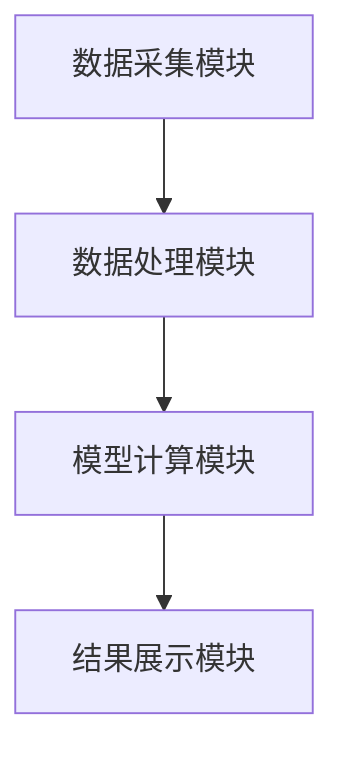

                 


# 《企业估值中的氢能源应用评估》

---

## 关键词：
- 氢能源、企业估值、技术原理、经济性分析、环境影响、评估模型、系统架构

---

## 摘要：
随着全球能源结构转型和绿色经济的发展，氢能源作为一种清洁、高效、可持续的能源形式，正在成为企业能源转型和价值提升的重要驱动力。本文系统地探讨了氢能源在企业估值中的应用评估，从氢能源的技术原理、经济性分析、环境影响等多个维度，结合实际案例和系统架构设计，提出了氢能源在企业估值中的综合评估模型和方法。通过分析氢能源产业链的核心环节、制氢技术的成本结构、氢能在不同行业的应用边界，以及氢能技术对企业竞争力和财务表现的影响，本文为企业的氢能应用提供了理论支持和实践指导。

---

# 第1章: 氢能源的基本概念与背景介绍

## 1.1 氢能的定义与分类

### 1.1.1 氢能的定义
氢能是指通过氢气（H₂）与氧气（O₂）反应释放能量的过程。氢气可以通过多种方式制备，包括电解水、化石燃料制氢和生物质制氢等。

### 1.1.2 氢能的分类
- **灰氢（Grey Hydrogen）**：通过化石燃料制氢，过程中会产生大量二氧化碳排放。
- **蓝氢（Blue Hydrogen）**：通过化石燃料制氢，但通过碳捕集与封存（CCS）技术减少碳排放。
- **绿氢（Green Hydrogen）**：通过可再生能源电解水制氢，完全零碳排放。

## 1.2 氢能发展的背景与现状

### 1.2.1 全球能源结构转型的背景
全球能源结构正从化石能源向可再生能源转型，氢能在这一过程中扮演着重要角色。

### 1.2.2 氢能在全球能源市场中的地位
氢能是未来能源体系中重要的清洁能源载体，尤其是在工业、交通和建筑领域具有广泛应用潜力。

## 1.3 氢能与企业估值的关系

### 1.3.1 氢能在企业能源结构中的作用
氢能可以替代传统化石能源，降低企业的碳排放和能源成本。

### 1.3.2 氢能技术对企业竞争力的影响
掌握氢能源技术的企业在市场竞争中具有更强的竞争力。

### 1.3.3 氢能经济性对估值的影响
氢能源的成本结构和经济性直接影响企业的盈利能力和估值。

## 1.4 氢能应用的边界与外延

### 1.4.1 氢能在不同行业的应用边界
氢能在工业、交通、建筑等领域的应用边界和技术可行性需要进一步研究。

### 1.4.2 氢能应用的区域差异
不同地区的资源禀赋、政策支持和市场需求会影响氢能在当地的推广应用。

### 1.4.3 氢能技术的未来发展外延
氢能在能源储存、分布式能源系统中的应用将是未来发展的重点。

---

# 第2章: 氢能源技术原理与企业应用

## 2.1 氢能的制备技术

### 2.1.1 制氢技术的分类与对比

| 制氢技术 | 优劣势 | 适用场景 |
|----------|--------|----------|
| 电解水制氢 | 绿色无碳，但成本高 | 可再生能源丰富的地区 |
| 石化制氢 | 成本低，但高碳排放 | 石油、天然气资源丰富的地区 |
| 生物质制氢 | 碳中和，但技术不成熟 | 农业资源丰富的地区 |

### 2.1.2 制氢成本的影响因素
- 能源价格
- 技术成熟度
- 规模效应

---

## 2.2 氢能的储存与运输技术

### 2.2.1 氢气的储存方式

| 储存方式 | 优劣势 | 适用场景 |
|----------|--------|----------|
| 储氢瓶 | 安全性高，但成本高 | 城市交通 |
| 储氢罐 | 储量大，但建设成本高 | 工业应用 |

### 2.2.2 氢气运输的经济性与技术挑战

| 运输方式 | 成本 | 技术挑战 |
|----------|------|----------|
| 管道运输 | 较低 | 建设周期长 |
| 液化运输 | 较高 | 技术复杂 |

---

## 2.3 氢能的应用场景

### 2.3.1 工业领域
- 石化行业
- 钢铁行业
- 电子行业

### 2.3.2 交通领域
- 汽车
- 公共交通

### 2.3.3 建筑领域
- 热电联供

---

# 第3章: 氢能源的经济性分析

## 3.1 氢能经济性分析的核心指标

### 3.1.1 制氢成本
$$\text{制氢成本} = \text{可变成本} + \text{固定成本}$$

### 3.1.2 投资回报周期
$$\text{ROI} = \frac{\text{净收益}}{\text{总投资}} \times 100\%$$

---

## 3.2 氢能经济性分析的步骤

### 3.2.1 数据收集
- 市场需求
- 技术参数
- 政策支持

### 3.2.2 指标体系设计
- 成本指标
- 收益指标
- 效益指标

### 3.2.3 综合评估
$$\text{综合得分} = \sum (\text{指标权重} \times \text{指标得分})$$

---

## 3.3 氢能经济性分析的案例

### 3.3.1 案例背景
某企业计划投资建设一个绿氢生产基地，年产量为1000吨。

### 3.3.2 数据分析
- 初始投资：5000万元
- 年运营成本：500万元
- 年销售收入：1000万元
- 投资回报周期：5年

### 3.3.3 结论
$$\text{净现值（NPV）} = \text{未来现金流现值} - \text{初始投资}$$

---

# 第4章: 氢能源的环境影响与社会因素

## 4.1 氢能在环境中的作用

### 4.1.1 碳排放分析
- 灰氢：高碳排放
- 蓝氢：低碳排放
- 绿氢：零碳排放

### 4.1.2 环境效益
- 减少空气污染
- 降低温室气体排放

## 4.2 氢能的社会因素

### 4.2.1 政策支持
- 各国政府对氢能的补贴政策
- 环保法规

### 4.2.2 社会接受度
- 氢能技术的认知度
- 公众对氢能的安全性认知

---

## 4.3 氢能环境影响的综合评估

### 4.3.1 环境影响指标
- 碳排放强度
- 环境污染指数

### 4.3.2 综合评估模型
$$\text{环境影响综合得分} = \sum (\text{环境指标权重} \times \text{指标得分})$$

---

# 第5章: 氢能源应用评估模型

## 5.1 模型构建

### 5.1.1 数据收集与处理
- 市场需求数据
- 技术参数数据
- 经济指标数据

### 5.1.2 指标体系设计
- 经济性指标
- 技术性指标
- 环境指标

### 5.1.3 模型验证
- 数据验证
- 模型灵敏度分析

---

## 5.2 模型应用

### 5.2.1 案例分析
- 某企业氢燃料电池汽车项目

### 5.2.2 模型输出
- 经济性评估结果
- 技术可行性评估结果
- 环境影响评估结果

---

## 5.3 模型优化

### 5.3.1 参数调整
- 调整制氢成本权重
- 调整环境影响权重

### 5.3.2 模型改进
- 引入机器学习算法
- 增加实时数据反馈

---

# 第6章: 氢能源应用评估方法

## 6.1 财务指标分析

### 6.1.1 净现值（NPV）
$$\text{NPV} = \sum_{t=0}^{n} \frac{\text{现金流}_t}{(1+r)^t} - \text{初始投资}$$

### 6.1.2 内部收益率（IRR）
$$\text{IRR} = r \text{ 使得 NPV = 0}$$

---

## 6.2 情景分析

### 6.2.1 不同政策下的情景分析
- 情景1：高补贴政策
- 情景2：低补贴政策

### 6.2.2 不同技术路线下的情景分析
- 情景1：电解水制氢
- 情景2：化石燃料制氢

---

## 6.3 综合评估方法

### 6.3.1 综合评估框架
- 经济性评估
- 技术性评估
- 环境影响评估

### 6.3.2 综合评估结果
- 优先选择高经济性、高技术可行性和低环境影响的方案

---

# 第7章: 项目实战——氢能源应用评估案例

## 7.1 案例背景

### 7.1.1 项目介绍
某企业计划投资氢燃料电池公交车项目，预计运营5年。

## 7.2 环境搭建

### 7.2.1 工具安装
- Python
- NumPy
- Pandas
- Matplotlib

### 7.2.2 数据准备
- 市场需求数据
- 技术参数数据
- 经济指标数据

---

## 7.3 核心代码实现

### 7.3.1 数据处理
```python
import pandas as pd
import numpy as np

# 数据处理
data = pd.read_csv('data.csv')
data['成本'] = data['固定成本'] + data['可变成本']
```

### 7.3.2 模型实现
```python
def calculate_npv(现金流, 初始投资, 折现率):
    npv = sum(现金流 / (1 + 折现率) ** t for t in range(len(现金流))) - 初始投资
    return npv

现金流 = [1000, 1200, 1500, 1800, 2000]
初始投资 = 5000
折现率 = 0.08

npv = calculate_npv(现金流, 初始投资, 折现率)
print(f"净现值为：{npv}")
```

---

## 7.4 案例分析与解读

### 7.4.1 案例分析
通过模型计算，该项目的净现值为正，具有较高的投资回报潜力。

### 7.4.2 案例小结
氢燃料电池公交车项目在经济性和环境影响方面均表现良好，值得进一步推广。

---

# 第8章: 系统架构与设计方案

## 8.1 系统功能设计

### 8.1.1 功能模块
- 数据采集
- 模型计算
- 结果展示

### 8.1.2 功能流程
1. 数据采集模块：获取市场、技术和经济指标数据。
2. 模型计算模块：运行氢能源应用评估模型。
3. 结果展示模块：以可视化方式呈现评估结果。

---

## 8.2 系统架构设计

### 8.2.1 系统架构图



---

## 8.3 接口设计

### 8.3.1 数据接口
- 输入接口：市场数据、技术参数
- 输出接口：评估结果

### 8.3.2 交互流程
1. 用户输入数据
2. 系统处理数据
3. 系统输出结果

---

# 第9章: 最佳实践与小结

## 9.1 最佳实践

### 9.1.1 数据准确性
确保数据来源可靠，避免偏差。

### 9.1.2 模型选择
根据实际情况选择合适的评估模型。

### 9.1.3 持续优化
定期更新模型参数和数据，提高评估精度。

---

## 9.2 小结

### 9.2.1 本章总结
氢能源在企业估值中的应用评估是一个复杂但重要的过程，需要结合技术、经济和环境多方面的因素。

### 9.2.2 未来展望
随着技术进步和政策支持，氢能源将在企业估值中发挥越来越重要的作用。

---

# 附录

## 附录A: 数据来源与工具推荐

## 附录B: 参考文献

---

通过以上目录大纲和内容，您可以根据需要进一步扩展每个章节的具体内容，添加更多的技术细节、实际案例和深入的分析。

