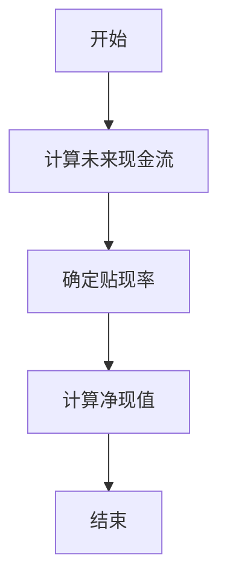
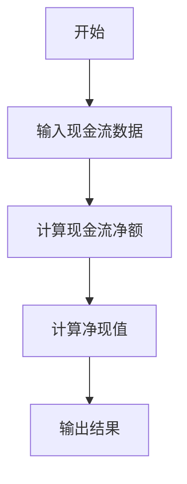
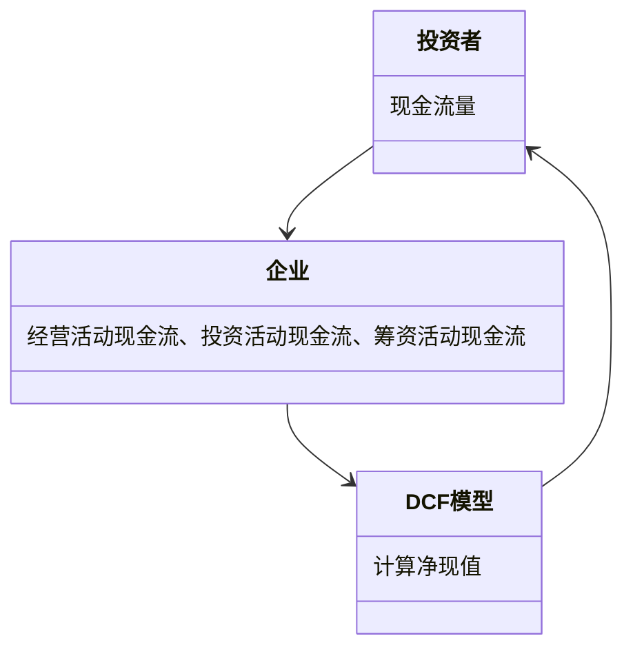

                 


# 企业估值中的现金流量分析

> 关键词：现金流量分析，企业估值，DCF模型，财务分析，投资决策

> 摘要：现金流量分析是企业估值的核心方法之一，通过对经营活动、投资活动和筹资活动的现金流量进行分析，可以帮助投资者评估企业的财务健康状况和未来盈利能力。本文将详细介绍现金流量分析的基本概念、算法原理、系统架构设计以及实际项目中的应用，帮助读者掌握如何利用现金流量分析进行企业估值。

---

## 引言

企业估值是投资决策中的核心问题，而现金流量分析是企业估值的重要工具。现金流量反映了企业在一定时期内的资金流动情况，能够直观地展示企业的盈利能力和财务健康状况。本文将从现金流量分析的基本概念出发，逐步深入探讨其在企业估值中的应用，包括DCF模型的数学原理、系统架构设计以及实际案例分析。

---

## 第1章: 现金流量分析概述

### 1.1 现金流量分析的基本概念

#### 1.1.1 现金流量的定义
现金流量是指企业在一定时期内现金的流入和流出。现金流入包括销售收入、投资收益等，现金流出包括采购成本、利息支出等。

#### 1.1.2 现金流量的分类
- **经营活动现金流量**：企业日常经营活动中产生的现金流，如销售商品、支付工资等。
- **投资活动现金流量**：企业投资于长期资产或处置长期资产时产生的现金流。
- **筹资活动现金流量**：企业通过发行股票、借款等筹集资金或偿还债务时产生的现金流。

#### 1.1.3 现金流量与企业估值的关系
现金流量是企业估值的核心数据，通过分析现金流量，可以评估企业的盈利能力、偿债能力和未来成长潜力。

### 1.2 企业估值的基本原理

#### 1.2.1 企业估值的定义
企业估值是通过对企业的财务状况、市场地位、盈利能力等多方面因素的综合分析，确定其市场价值的过程。

#### 1.2.2 企业估值的主要方法
- **相对估值法**：基于可比公司的市盈率、市净率等指标进行估值。
- **绝对估值法**：基于企业的未来现金流折现进行估值，如DCF模型。

#### 1.2.3 现金流量在企业估值中的重要性
现金流是DCF模型的核心输入，准确的现金流量预测是企业估值的关键。

### 1.3 本章小结

---

## 第2章: 现金流量分析的核心概念与联系

### 2.1 现金流量分析的核心概念

#### 2.1.1 现金流入与现金流出
- **现金流入**：经营活动、投资活动和筹资活动的现金收入。
- **现金流出**：经营活动、投资活动和筹资活动的现金支出。

#### 2.1.2 现金净流量与累计净流量
- **现金净流量**：现金流入减去现金流出的结果。
- **累计净流量**：一定时期内现金净流量的累计值。

#### 2.1.3 现金流量的时间价值
现金流的时间价值是指资金随着时间的推移而产生的价值变化，通常通过贴现率来衡量。

### 2.2 现金流量分析的实体关系图

#### 2.2.1 实体关系图的定义
实体关系图（ER图）用于展示系统中各个实体之间的关系。

#### 2.2.2 现金流量分析的ER实体关系图

```mermaid
er
  actor 投资者 {
    <属性>：现金流量
  }
  actor 企业 {
    <属性>：经营活动现金流、投资活动现金流、筹资活动现金流
  }
  actor 估值模型 {
    <属性>：DCF模型
  }
```

#### 2.2.3 实体关系图的流程图展示


### 2.3 现金流量分析的核心公式

#### 2.3.1 现金流量分析的基本公式
$$\text{净现值} = \sum_{t=1}^{n} \frac{\text{现金流}_t}{(1 + r)^t}$$

#### 2.3.2 现金流量分析的数学模型
$$\text{DCF模型} = \frac{\text{自由现金流}}{(1 + r)^n}$$

### 2.4 本章小结

---

## 第3章: 现金流量分析的算法原理

### 3.1 现金流量分析的算法原理

#### 3.1.1 现金流量分析的算法步骤



#### 3.1.2 现金流量分析的流程图展示



### 3.2 现金流量分析的数学模型

#### 3.2.1 现金流量分析的数学公式
$$\text{净现值} = \sum_{t=1}^{n} \frac{CF_t}{(1 + r)^t}$$

#### 3.2.2 现金流量分析的数学模型
$$\text{DCF模型} = \frac{\text{自由现金流}}{(1 + r)^n}$$

### 3.3 现金流量分析的Python实现

#### 3.3.1 现金流量分析的Python代码

```python
def calculate_npv(cash_flows, discount_rate):
    npv = 0
    for t, cf in enumerate(cash_flows, 1):
        npv += cf / (1 + discount_rate) ** t
    return npv
```

#### 3.3.2 代码解读
- `cash_flows`：输入的现金流列表。
- `discount_rate`：贴现率。
- `t`：时间步长。
- `cf`：每期的现金流。

### 3.4 本章小结

---

## 第4章: 现金流量分析的系统架构设计

### 4.1 现金流量分析的系统功能设计

#### 4.1.1 系统功能模块划分
- **输入模块**：输入现金流数据。
- **计算模块**：计算净现值和内部收益率。
- **输出模块**：输出估值结果。

#### 4.1.2 系统功能的领域模型



### 4.2 现金流量分析的系统架构设计

#### 4.2.1 系统架构图展示


#### 4.2.2 系统架构的设计原理
系统采用模块化设计，各模块之间通过接口进行通信。

### 4.3 现金流量分析的系统接口设计

#### 4.3.1 系统接口的设计
- `calculate_npv`：计算净现值。
- `calculate_irr`：计算内部收益率。

#### 4.3.2 系统接口的实现

```python
def calculate_irr(cash_flows):
    return np.irr(cash_flows)
```

### 4.4 本章小结

---

## 第5章: 现金流量分析的项目实战

### 5.1 项目环境安装

#### 5.1.1 环境搭建步骤
- 安装Python。
- 安装NumPy和Pandas库。

#### 5.1.2 环境搭建的注意事项
确保所有依赖库版本兼容。

### 5.2 现金流量分析的核心实现

#### 5.2.1 核心代码实现

```python
import numpy as np

def calculate_npv(cash_flows, discount_rate):
    npv = 0
    for t, cf in enumerate(cash_flows, 1):
        npv += cf / (1 + discount_rate) ** t
    return npv

def calculate_irr(cash_flows):
    return np.irr(cash_flows)
```

#### 5.2.2 代码解读
- `calculate_npv`：计算净现值。
- `calculate_irr`：计算内部收益率。

### 5.3 项目小结

---

## 结论

现金流量分析是企业估值的核心方法之一。通过本文的详细讲解，读者可以掌握现金流量分析的基本概念、算法原理、系统架构设计以及实际项目中的应用。未来，随着技术的进步和市场的变化，现金流量分析将更加智能化和精准化。

---

## 参考文献

- 《企业估值与金融建模》
- 《现金流分析与投资决策》
- Python官方文档

