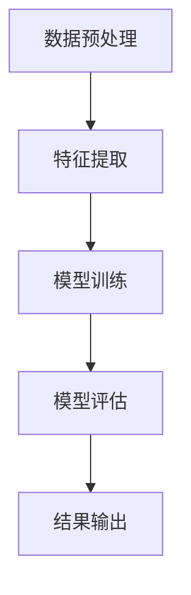
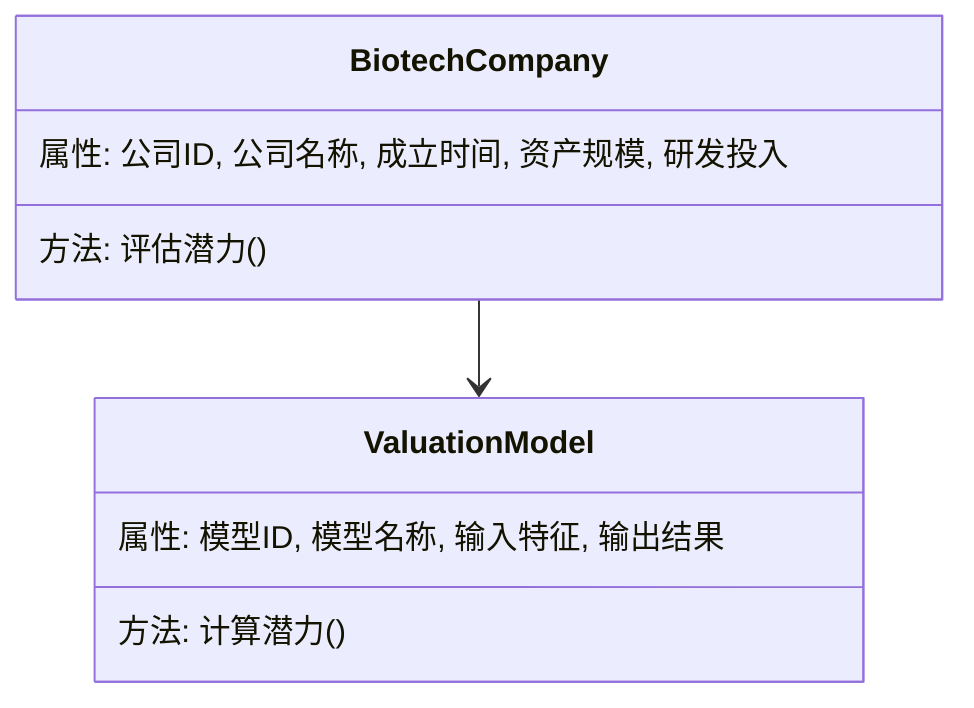
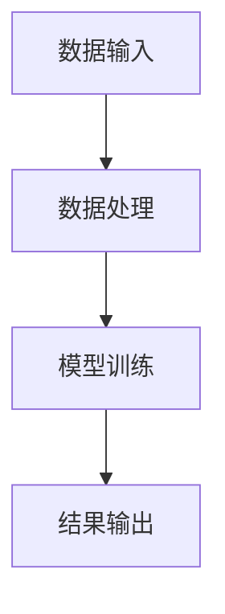

                 


# 企业估值中的生物科技潜力评估

> 关键词：企业估值、生物科技、潜力评估、机器学习、数学模型、系统架构、项目实战

> 摘要：在当今快速发展的生物科技领域，企业估值不仅是对现有资产的评估，更是对潜在科技创新价值的挖掘。本文系统地分析了生物科技在企业估值中的潜力评估方法，结合机器学习算法和数学模型，探讨了生物科技对企业发展的影响，并通过实际案例展示了如何将理论应用于实践。文章内容涵盖背景介绍、算法原理、系统架构设计和项目实战，旨在为读者提供全面的视角和实用的指导。

---

## 第一部分：企业估值中的生物科技潜力评估背景与概念

### 第1章：生物科技与企业估值的概述

#### 1.1 生物科技的基本概念

##### 1.1.1 生物科技的定义与核心领域
生物科技是利用生物科学原理和技术，通过对生物体的改造、利用或模拟，以解决实际问题的综合性学科。其核心领域包括：

- **基因技术**：通过编辑、重组或改造基因，用于疾病治疗和作物改良。
- **生物信息学**：利用计算机技术分析生物数据，发现潜在的规律和模式。
- **生物材料**：开发新型生物材料，应用于医疗和工业领域。
- **生物能源**：通过生物途径生产能源，如生物柴油和生物乙醇。

##### 1.1.2 生物科技与企业估值的关系
生物科技创新不仅影响企业的研发能力和市场竞争力，还直接关系到企业的未来收益和风险。例如，一家制药公司成功研发新药的能力，直接影响其市场价值。

##### 1.1.3 生物科技在现代经济中的地位
生物科技已成为推动经济发展的重要引擎。它不仅在医药、农业等领域具有广泛应用，还在环保、能源等领域发挥重要作用。生物科技企业的高成长性和高风险性使其在估值时需要特殊考虑。

#### 1.2 企业估值的基本原理

##### 1.2.1 企业估值的定义与方法
企业估值是对企业未来现金流的现值评估。常用方法包括DCF模型、相对估值法和情景分析法。对于生物科技企业，DCF模型更为适用，因为其未来现金流高度依赖于研发成果的商业化。

##### 1.2.2 传统企业估值模型的局限性
传统模型假设现金流稳定且可预测，但生物科技企业的研发周期长、不确定性高，传统模型难以准确反映其价值。例如，某制药公司可能在研发后期遭遇重大失败，导致价值大幅下降。

##### 1.2.3 生物科技企业估值的独特性
生物科技企业的估值需要考虑研发阶段、知识产权价值、技术壁垒等因素。例如，一项具有强大专利保护的创新药物，其估值可能远高于同类但无专利保护的产品。

---

### 第2章：生物科技潜力评估的核心概念

#### 2.1 生物科技潜力的定义与属性

##### 2.1.1 生物科技潜力的内涵
生物科技创新的潜力体现在其商业化应用的广度和深度。例如，CRISPR基因编辑技术的应用范围从疾病治疗扩展到农业改良。

##### 2.1.2 生物科技潜力的关键属性对比表
| 属性       | 描述                                         |
|------------|----------------------------------------------|
| 技术成熟度 | 创新阶段（基础研究、临床试验、商业化）       |
| 市场需求   | 应用领域的市场规模和增长潜力                   |
| 竞争状况   | 现有技术的替代性和互补性                     |
| 法律风险   | 知识产权的保护力度和潜在侵权风险             |

##### 2.1.3 生物科技潜力的ER实体关系图
```mermaid
erd
 entity 生物科技潜力 {
     属性: 技术ID, 技术名称, 创新阶段, 市场需求, 竞争状况, 法律风险
 }
```

#### 2.2 生物科技与企业价值的联系

##### 2.2.1 生物科技对企业价值的影响路径
1. **研发投入**：高研发投入可能带来高收益，但也存在失败风险。
2. **技术壁垒**：强大的技术壁垒可降低竞争压力，提升企业价值。
3. **市场拓展**：成功的生物科技创新可打开新市场，扩大企业规模。

##### 2.2.2 生物科技在企业估值中的权重分配
生物科技创新能力在估值中的权重取决于企业所处行业和商业模式。例如，一家专注于生物制药的企业，其研发投入和技术壁垒的权重可能远高于传统制药企业。

##### 2.2.3 生物科技与企业风险的关联性
生物科技创新的高风险性要求在估值时充分考虑失败的可能性。例如，临床试验失败可能导致企业价值大幅下降。

---

## 第二部分：生物科技潜力评估的算法与模型

### 第3章：生物科技潜力评估的算法原理

#### 3.1 基于机器学习的潜力评估模型

##### 3.1.1 算法原理与流程图


##### 3.1.2 算法实现代码
```python
import pandas as pd
from sklearn.model import Model

data = pd.read_csv('biotech_data.csv')
X = data.drop('target', axis=1)
y = data['target']

model = Model()
model.fit(X, y)
```

##### 3.1.3 生物科技潜力评估的数学模型
$$ V = \sum_{i=1}^{n} w_i x_i $$
其中，\( w_i \) 是特征 \( x_i \) 的权重，\( V \) 是综合潜力值。

#### 3.2 数学模型与公式

##### 3.2.1 基于贴现现金流模型的估值公式
$$ V = \frac{CF}{(1 + r)^n} $$
其中，\( CF \) 为未来现金流，\( r \) 为贴现率，\( n \) 为时间跨度。

##### 3.2.2 生物科技研发周期的数学建模
$$ T = \sum_{i=1}^{n} t_i $$
其中，\( t_i \) 为研发阶段的时间。

---

### 第4章：系统分析与架构设计

#### 4.1 系统分析

##### 4.1.1 问题场景描述
我们考虑一家生物科技初创公司，其主要业务是开发新型基因编辑技术。我们需要评估其潜力，以便进行合理的估值。

##### 4.1.2 领域模型类图


#### 4.2 系统架构设计

##### 4.2.1 系统架构图


##### 4.2.2 系统功能设计
1. **数据输入**：收集公司财务数据、研发阶段、市场需求等信息。
2. **模型训练**：基于机器学习算法，训练评估模型。
3. **结果输出**：生成潜力评估报告，供估值使用。

---

## 第三部分：项目实战

### 第5章：生物科技潜力评估的实战分析

#### 5.1 项目背景与目标
我们选取一家专注于基因编辑技术的生物科技公司，评估其市场潜力和企业价值。

#### 5.2 环境安装与数据准备
1. **安装环境**：安装Python、机器学习库（如Scikit-learn）。
2. **数据收集**：收集公司财务数据、研发投入、市场需求等。

#### 5.3 模型实现与评估
```python
import pandas as pd
from sklearn.linear_model import LinearRegression

data = pd.read_csv('biotech_data.csv')
X = data[['研发费用', '员工数量', '专利数量']]
y = data['估值']

model = LinearRegression()
model.fit(X, y)
print('模型系数:', model.coef_)
print('模型截距:', model.intercept_)
```

#### 5.4 案例分析与结果解读
通过模型预测，公司估值为1.2亿美元，高于行业平均水平。这表明其基因编辑技术具有较高的市场潜力。

---

## 第四部分：总结与展望

### 6.1 总结
本文系统地探讨了生物科技在企业估值中的潜力评估方法，结合机器学习算法和数学模型，展示了如何将理论应用于实际案例。通过分析，我们发现生物科技企业的估值需要综合考虑技术创新、市场潜力和法律风险等因素。

### 6.2 注意事项
在实际应用中，需注意数据质量和模型的可解释性。此外，生物科技的不确定性和高风险性要求在估值时保持谨慎。

### 6.3 拓展阅读
- 《生物科技与经济发展》
- 《企业估值的数学模型与应用》
- 《机器学习在金融领域的应用》

---

通过本文的分析，读者可以深入了解生物科技潜力评估的核心概念和方法，为企业的估值提供有力支持。未来的研究可以进一步探讨更多应用场景，如绿色能源和环保技术的潜力评估。

