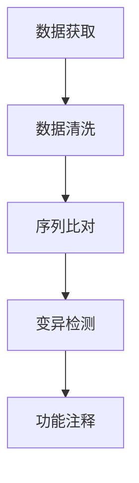
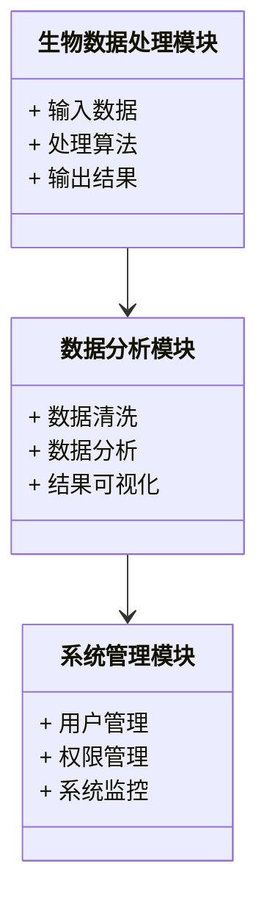
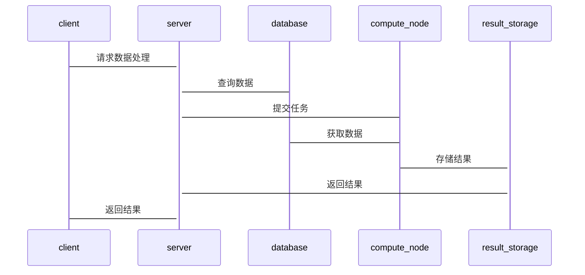

                 


# 企业估值中的生物计算技术潜力评估

## 关键词：生物计算、企业估值、潜力评估、基因组学、生物信息学、大数据分析

## 摘要：生物计算技术作为一种新兴的跨学科技术，正在逐步改变企业估值的传统方法。通过基因组学、生物信息学和大数据分析等手段，生物计算技术能够为企业提供更精准、更全面的估值模型。本文将详细探讨生物计算技术的核心概念、算法原理、系统设计以及在企业估值中的实际应用，为企业评估提供新的视角和方法。

---

## 第一部分: 生物计算技术的基本概念

### 第1章: 生物计算技术的定义与特点

#### 1.1 生物计算技术的定义与特点
生物计算技术（Bioinformatics Computing）是结合生物学、计算机科学和数据科学的交叉学科，旨在通过计算方法分析和解读生物数据，如基因组数据、蛋白质序列等。其核心特点包括：

- **数据驱动**：依赖于大规模生物数据的处理和分析。
- **跨学科性**：结合生物学、计算机科学、统计学等多学科知识。
- **精准性**：通过算法优化，能够提高生物数据的分析精度。

#### 1.2 生物计算技术的应用领域
生物计算技术广泛应用于基因组学研究、疾病预测、药物研发等领域。在企业估值中，生物计算技术可以用于评估企业的生物技术创新能力、市场潜力等。

#### 1.3 生物计算技术与企业估值的关系
生物计算技术通过分析企业的生物数据，能够揭示企业在技术研发、市场竞争力等方面的优势和劣势，从而为估值提供更全面的依据。

---

## 第二部分: 生物计算技术的核心概念与联系

### 第2章: 生物计算技术的核心原理

#### 2.1 基因组学分析的基本原理
基因组学分析是生物计算技术的重要组成部分，通过对基因序列的分析，可以揭示生物的遗传特征和功能。以下是基因组学分析的基本步骤：

1. **数据获取**：通过测序技术获取基因序列数据。
2. **数据处理**：对数据进行清洗、拼接和注释。
3. **数据分析**：利用生物信息学工具进行功能预测和差异分析。

#### 2.2 生物大数据处理的算法原理
生物大数据处理需要依赖高效的算法，如：

- **序列比对算法**：如BLAST算法，用于将未知序列与已知数据库进行比对。
- **聚类算法**：如K-means算法，用于将相似的数据点进行分组。

#### 2.3 生物计算技术的数学模型
生物计算技术中的数学模型通常用于预测生物特征与企业价值之间的关系。例如，可以使用线性回归模型来预测基因表达水平与企业收益的关系。

$$ \text{收益} = \beta_0 + \beta_1 \times \text{基因表达水平} + \epsilon $$

其中，$\beta_0$ 和 $\beta_1$ 是回归系数，$\epsilon$ 是误差项。

---

### 第3章: 生物计算技术的核心要素对比

#### 3.1 基因组数据与传统数据的对比
基因组数据与传统数据在以下方面存在差异：

| 特性             | 基因组数据         | 传统数据         |
|------------------|------------------|------------------|
| 数据类型         | 序列数据、表达数据 | 数值数据、文本数据 |
| 数据量           | 大规模           | 中等规模         |
| 分析难度         | 高               | 中               |

#### 3.2 生物计算技术与人工智能的对比
生物计算技术与人工智能在以下方面存在差异：

| 特性             | 生物计算技术       | 人工智能         |
|------------------|------------------|------------------|
| 数据来源         | 生物数据         | 多种数据来源     |
| 应用领域         | 基因组学、生物信息学 | 多领域           |
| 算法复杂度       | 较高             | 较高             |

#### 3.3 生物计算技术与大数据分析的对比
生物计算技术与大数据分析在以下方面存在差异：

| 特性             | 生物计算技术       | 大数据分析       |
|------------------|------------------|------------------|
| 数据类型         | 生物数据         | 结构化数据、非结构化数据 |
| 分析目标         | 揭示生物规律       | 揭示数据规律       |
| 技术要求         | 高               | 中               |

---

## 第三部分: 生物计算技术的算法原理

### 第4章: 生物计算技术的数学模型与算法

#### 4.1 基因组数据分析的流程
以下是基因组数据分析的基本流程：

1. **数据获取**：通过测序技术获取基因序列数据。
2. **数据清洗**：去除低质量数据。
3. **序列比对**：将测序数据与参考基因组进行比对。
4. **变异检测**：识别基因序列中的变异位点。
5. **功能注释**：对变异位点进行功能预测。

#### 4.2 基因组数据分析的流程图


#### 4.3 基因组数据分析的Python代码实现
以下是使用Python进行基因组数据分析的示例代码：

```python
import pandas as pd
import numpy as np

# 读取基因组数据
data = pd.read_csv('genomic_data.csv')

# 数据清洗
data.dropna(inplace=True)

# 序列比对
def sequence_alignment(sequence1, sequence2):
    # 简单的比对算法，仅用于示例
    alignment = []
    for i in range(min(len(sequence1), len(sequence2))):
        if sequence1[i] == sequence2[i]:
            alignment.append('M')
        else:
            alignment.append('X')
    return ''.join(alignment)

result = sequence_alignment(data['Sequence1'].iloc[0], data['Sequence2'].iloc[0])
print(result)
```

---

## 第四部分: 生物计算技术的系统分析

### 第5章: 生物计算技术的系统架构设计

#### 5.1 系统功能设计
以下是生物计算技术系统的功能模块：



#### 5.2 系统架构设计
以下是生物计算技术系统的架构设计：


#### 5.3 系统接口设计
以下是生物计算技术系统的接口设计：



---

## 第五部分: 生物计算技术的项目实战

### 第6章: 生物计算技术的实际应用

#### 6.1 项目环境安装
以下是安装生物计算技术环境的步骤：

1. 安装Python和相关库：
   ```bash
   pip install numpy pandas matplotlib
   ```

2. 安装生物信息学工具：
   ```bash
   conda install -n bioinformatics bioinformatics
   ```

#### 6.2 项目核心代码实现
以下是项目的核心代码实现：

```python
import pandas as pd
import numpy as np
from sklearn.linear_model import LinearRegression

# 读取数据
data = pd.read_csv('biotech_data.csv')

# 数据预处理
data = data.dropna()

# 建立线性回归模型
model = LinearRegression()
model.fit(data[['基因表达水平']], data['企业收益'])

# 预测结果
predictions = model.predict(data[['基因表达水平']])
print('预测收益:', predictions)
```

#### 6.3 案例分析
以某生物技术公司为例，分析其基因表达水平与企业收益之间的关系。通过线性回归模型，可以预测该公司的收益变化趋势。

---

## 第六部分: 生物计算技术的最佳实践

### 第7章: 最佳实践与注意事项

#### 7.1 小结
生物计算技术在企业估值中的应用潜力巨大。通过基因组学分析、生物大数据处理和数学建模，可以为企业提供更精准的估值模型。

#### 7.2 注意事项
在实际应用中，需要注意以下几点：

- 数据质量：确保数据的准确性和完整性。
- 模型选择：选择适合的算法和模型。
- 结果解读：结合业务背景解读分析结果。

#### 7.3 未来展望
未来，随着生物计算技术的不断发展，其在企业估值中的应用将更加广泛和深入。例如，可以通过整合多组学数据（如基因组学、转录组学、蛋白组学）进行更全面的分析。

---

## 结语

生物计算技术作为一种新兴的跨学科技术，正在逐步改变企业估值的传统方法。通过基因组学、生物信息学和大数据分析等手段，生物计算技术能够为企业提供更精准、更全面的估值模型。希望本文能够为企业估值领域的从业者提供新的视角和方法，助力企业在激烈的市场竞争中占据优势。

--- 

> **推荐阅读**：《生物计算技术入门》、《大数据分析与企业估值》、《机器学习在生物医学中的应用》。

